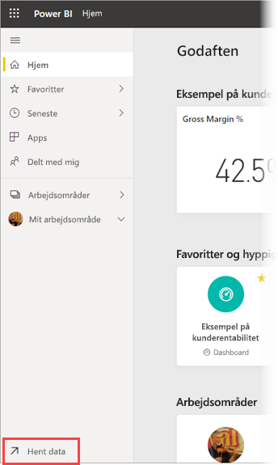
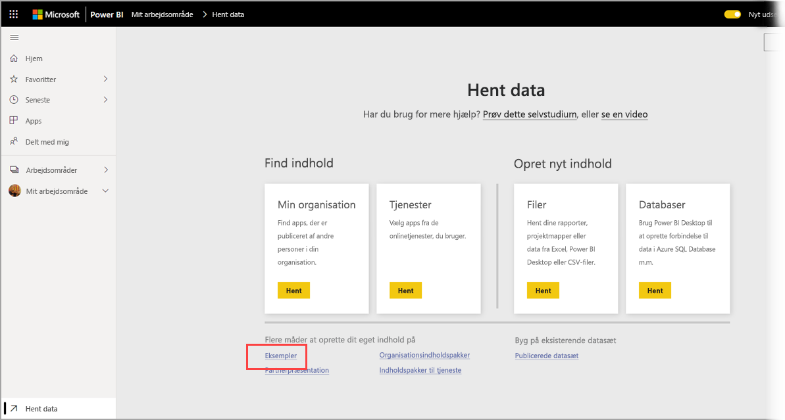
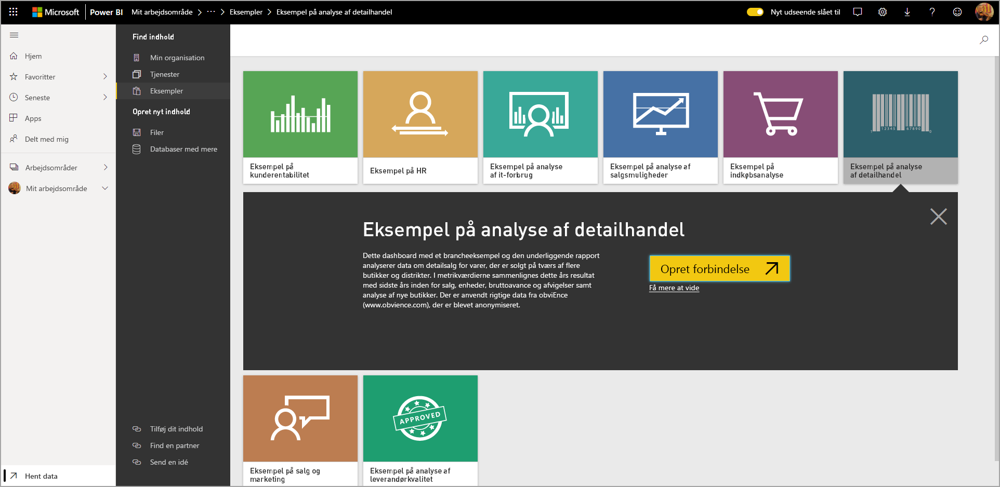
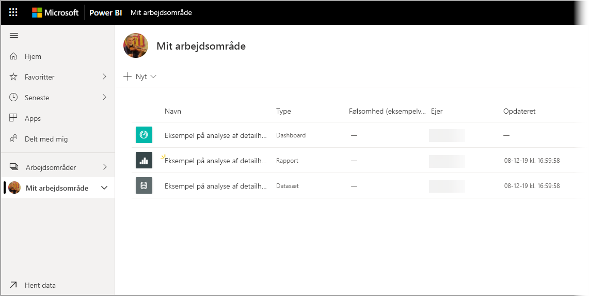

# Download af eksempler til Mit arbejdsområde i Power BI-tjenesten

I en del af dokumentationen til mobilapps, der er tilgængelig her, bruges eksempeldata med henblik på illustration. Hvis du vil følge med på din enhed, kan du downloade eksempeldataene til din konto i Power BI-tjenesten, hvorefter du kan få vist dem via appen Power BI – Mobil på din enhed. Denne artikel indeholder en beskrivelse af, hvordan du downloader eksempeldataene til din konto til Power BI-tjenesten. 

## Forudsætninger

Du skal have en konto i Power BI-tjenesten, før du kan downloade data. Hvis du endnu ikke er tilmeldt Power BI, kan du [tilmelde dig en gratis prøveversion](https://app.powerbi.com/signupredirect?pbi_source=web), før du begynder.

## Download et eksempel

1. Åbn [Power BI-tjenesten](https://app.powerbi.com) i din browser, og log på.

2. Vælg **Hent data** i nederste venstre hjørne i navigationsruden. Hvis navigationsruden er skjult, og du ikke kan se linket Hent data, kan du få vist ruden ved at klikke på ikonet Vis/skjul navigationsrude .  
   
    

3. Vælg linket **Eksempler** på siden Hent data.
   
   

4. Vælg et eksempel, der skal downloades. Sørg for at vælge det eksempel, som selvstudiet, Hurtig start eller artiklen kræver. Når du har valgt det, skal du klikke på **Opret forbindelse**.
  
   
   
5. Power BI importerer eksemplet og føjer et nyt dashboard, en ny rapport og et nyt datasæt til Mit arbejdsområde.
   
   
  
Du er nu klar til at få vist eksemplerne på din mobilenhed.

## De næste trin
* [Hurtig start](mobile-apps-quickstart-view-dashboard-report.md)
* Har du nogen spørgsmål? Tag et kig på [mobilappsektionen i Power BI-community'et](https://go.microsoft.com/fwlink/?linkid=839277)
