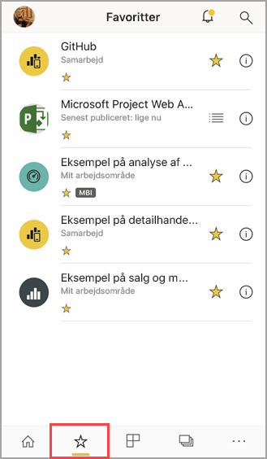
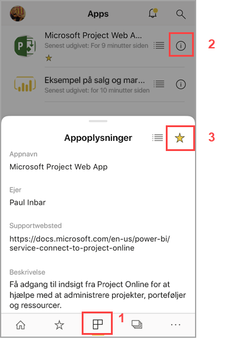
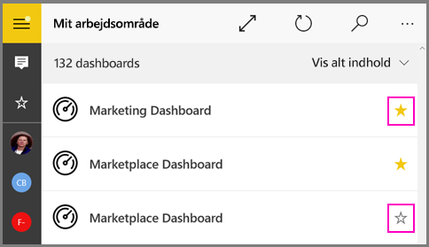
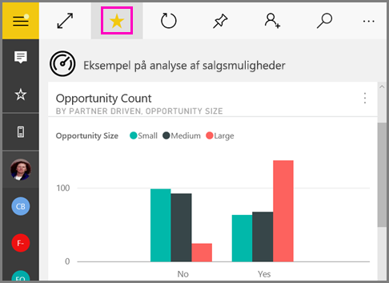
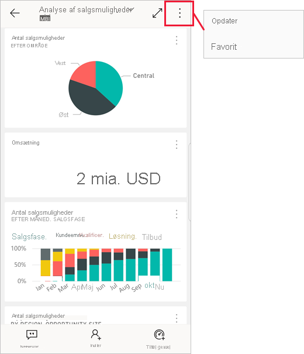

# Føj til Favoritter, og få dem vist i Power BI-mobilapps
Gælder for:

|  |  |  |  |  |
|:--- |:--- |:--- |:--- |:--- |
| iPhone-telefoner |iPad-tablets |Android-telefoner |Android-tablets |Windows 10-enheder |

>[!NOTE]
>Understøttelse af Power BI-mobilapp til **telefoner, der bruger Windows 10 mobile**, ophører den 16. marts 2021. [Få mere at vide](https://go.microsoft.com/fwlink/?linkid=2121400)

Læs, hvordan du føjer dine Power BI-dashboards, -rapporter og -apps samt dine rapporter og KPI'er i Power BI-rapportserver og Reporting Services i det lokale miljø til Favoritter og får dem vist i mobilapps.

Når du føjer noget til Favoritter i Power BI-mobilapps, kan du se det på siden Favoritter i [Power BI-tjenesten](https://powerbi.com) og på alle dine mobilenheder.

Hvis du vil se siden Favoritter, skal du trykke på ikonet Favoritter på navigationslinjen:

Du kan også [gøre Power BI-dashboards og -apps til favoritter i Power BI-tjenesten](../end-user-favorite.md). Derefter vises de på siden Favoritter i mobilappen.

Du kan markere KPI'er og rapporter som favoritter på en Power BI-rapportserver eller Reporting Services-webportal og derefter se dem i en praktisk mappe på din mobilenhed sammen med dine foretrukne Power BI-dashboards.

## Gør en app til favorit
1. Tryk på ikonet Apps på den nederste navigationslinje for at få vist siden med dine apps.

2. På en iOS-enhed skal du trykke på infoknappen til højre for navnet på den app, du vil gøre til favorit. På Android-enheder vises Flere indstillinger (...) i stedet for infoknappen. 

3. I afsnittet Appinfo, der åbnes, skal du trykke på stjernen.
   
    
   
    Appen vises nu på siden Favoritter sammen med dine andre dashboards, rapporter og apps, som er favoritter.
   
## Føj et dashboard eller en rapport til Favoritter i iOS- og Windows 10-mobilapps
Du kan føje et Power BI-dashboard eller en Power BI-rapport til Favoritter fra listen over dashboards eller rapporter eller fra selve dashboardet eller rapporten.

* På listen over dashboards eller rapporter skal du trykke på den tomme stjerne ud for navnet . Stjernen bliver derefter sort .
  
    
* Hvis du er i et dashboard eller en rapport, skal du trykke på **Flere indstillinger** (...) i overskriften og derefter trykke på den tomme stjerne  i den menu, der vises. Stjernen bliver sort .
  
    

## Føj et dashboard eller en rapport til Favoritter i Android-mobilapps
Du kan føje et dashboard eller en rapport til Favoritter fra listen over dashboards eller rapporter eller fra selve dashboardet eller rapporten.

* På listen over dashboards eller rapporter i mobilappen skal du trykke på stjernen ud for navnet på rapporten eller dashboardet for at markere elementet som Favorit eller fjerne det fra Favoritter.
  
    

* Tryk på **Flere indstillinger (...)** , mens du er i et dashboard, og vælg derefter **Favoritter**.
  
    

## Gør Power BI-rapportserver- og Reporting Services-rapporter og -KPI'er til favoritter
Du kan se dine foretrukne Power BI-rapportserver- og Reporting Services-rapporter og -KPI'er i Power BI-mobilapps, men du kan ikke gøre dem til favoritter i mobilapps. Du kan [angive dem som favoritter på webportalen](../../report-server/tutorial-explore-report-server-web-portal.md#tag-your-favorites). 

## Næste trin
* [Foretrukne dashboards i Power BI-tjenesten](../end-user-favorite.md) 
* Har du spørgsmål? [Prøv at spørge Power BI-community'et](https://community.powerbi.com/)

