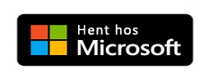
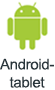

# Hvad er Power BI-mobilapps?
Power BI tilbyder en række mobilapps til iOS-, Android- og Windows 10-mobilenheder. I mobilappsene kan du oprette forbindelse til og interagere med dataene i clouden og i det lokale miljø. 

Du opretter rapporter i Power BI Desktop. Du kan oprette dashboards og få vist dashboards og rapporter i Power BI-rapporttjenesten ([https://powerbi.com](https://powerbi.com)). Du kan se Power BI-rapporter i det lokale miljø på [Power BI-rapportserveren](../../report-server/get-started.md). Alle disse rapporter og dashboards er tilgængelige i Power BI-mobilappsene, uanset om de er i det lokale miljø eller i clouden. Prøv at få vist og interagere med dem på din mobilenhed – det kan være iOS (iPad, iPhone, iPod Touch eller Apple Watch), en Android-telefon eller -tablet eller en Windows 10-enhed.

### Hent appen fra programbutikken 

  

## Mobilapps til forskellige enheder

| **Enhed** | **Nyheder** |
| --- | --- |
|  |**iPhones** er overalt, og det er [Power BI-mobilapp for iPhone](mobile-iphone-app-get-started.md) også. Udover at få vist dine [Power BI-rapporter i en særlig telefonlayoutvisning](mobile-apps-view-phone-report.md), kan du [føje Power BI til dit Apple Watch](mobile-apple-watch.md) og [stille spørgsmål med den virtuelle Q&A-analytiker](mobile-apps-ios-qna.md).  Kom i gang med [Power BI-mobilapp til iOS](mobile-iphone-app-get-started.md). |
|  |På **iPad** viser Power BI-mobilappen dashboards og rapporter, som de blev formateret til Power BI-tjenesten. Du kan også få vist din [Power BI-rapportserver og  Server og Reporting Services KPI'er og rapporter](mobile-app-ssrs-kpis-mobile-on-premises-reports.md) direkte på din iPad. Du kan [indstille databeskeder i Power BI-mobilappen](mobile-set-data-alerts-in-the-mobile-apps.md) til at notificere dig, når data på et dashboard ændres ud over de grænser, du har indstillet.  Kom i gang med [Power BI-mobilapp til iOS](mobile-iphone-app-get-started.md). |
|  |Med Power BI-mobilappen til **Android-telefoner** har du Power BI lige i lommen med opdateret, touchaktiveret mobiladgang til dine virksomhedsoplysninger. Du kan [filtrere en rapport efter din geografiske placering](mobile-apps-geographic-filtering.md). Du kan [scanne QR-koder med din Android-telefon](mobile-apps-qr-code.md) og gå direkte til et dashboard eller en rapport i Power BI.  Kom i gang med [Power BI-mobilapp til Android](mobile-android-app-get-started.md). |
|  |Mobilappen kører på mange forskellige **Android-tablets** og giver dig opdateret, touchaktiveret mobiladgang til dine virksomhedsoplysninger. På Android-tablets viser Power BI-mobilappen dashboards og rapporter, som de blev formateret til Power BI-tjenesten. Du kan [markere dine foretrukne dashboards og rapporter](mobile-apps-favorites.md), så du hurtigt kan gå til dem, samt dine foretrukne Power BI Report Server og Reporting Services KPI'er og rapporter.  Kom i gang med [Power BI-mobilapp til Android](mobile-android-app-get-started.md). |
|  |Power BI-mobilappen til Windows 10 kører på alle Windows 10-enheder, herunder Windows 10-telefoner. Sammen med mange af funktionerne fra de andre mobilapps indeholder Power BI-appen til Windows 10 særlige funktioner. Du kan f.eks. [fastgøre et Power BI-dashboard til startskærmen i Windows 10](mobile-pin-dashboard-start-screen-windows-10-phone-app.md) fra Power BI-mobilappen. Du kan også [køre Power BI i præsentationstilstand på Surface Hub](mobile-windows-10-app-presentation-mode.md) og i Power BI-mobilappen til Windows 10.  Kom i gang med [Power BI-mobilappen til Windows 10-enheder](mobile-windows-10-phone-app-get-started.md). ||| 

## Erhvervssupport til Power BI-mobilapperne
Organisationer kan bruge Microsoft Intune til at styre enheder og programmer, herunder Power BI-mobilapps til Android og iOS.

Microsoft Intune giver organisationerne mulighed for at kontrollere ting som at anmode om adgangskode, kontrollere, hvordan data skal håndteres af programmet, og kryptere programdata, selv når appen ikke er i brug.

Læs mere om [konfiguration af Power BI-mobilapps til Android og iOS med Microsoft Intune](../../service-admin-mobile-intune.md). 

## Næste trin
[Få vist et dashboard i mobilappsene](mobile-apps-quickstart-view-dashboard-report.md)

