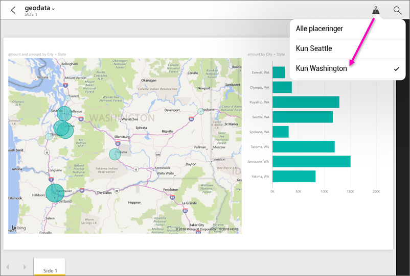

# Filtrer en rapport efter geografisk placering i Power BI-mobilapps
Gælder for:

|  |  |  |  |  |
|:--- |:--- |:--- |:--- |:--- |
| iPhone-telefoner |iPad-tablets |Android-telefoner |Android-tablets |Windows 10-telefoner |

Når du får vist en Power BI-rapport på din mobilenhed, vises der da et lille ikon med en tavlenål i øverste højre hjørne? Hvis der gør det, kan du filtrere rapporten baseret på din geografiske placering.

> [!NOTE]
> Du kan kun filtrere efter placering, hvis de geografiske navne i rapporten er på engelsk, f.eks. "New York City" eller "Germany". Windows 10-tablets og -pc'er understøtter ikke geografisk filtrering, men Windows 10-telefoner gør.

>[!NOTE]
>Understøttelse af Power BI-mobilapp til **telefoner, der bruger Windows 10 mobile**, ophører den 16. marts 2021. [Få mere at vide](https://go.microsoft.com/fwlink/?linkid=2121400)

## Filtrer din rapport efter din geografiske placering
1. Åbn en rapport i Power BI-mobilappen på din mobilenhed.
2. Hvis rapporten indeholder geografiske data, vises der en meddelelse, hvor du bliver bedt om at give Power BI adgang til din placering. Klik på **Tillad**, og tryk på **Tillad** igen.
3. Tryk på ikonet med tavlenålen . Du kan filtrere efter by, stat/provins eller land/område afhængigt af dataene i rapporten. I filteret kan du kun se de indstillinger, der matcher din aktuelle placering.
   
    

## Hvorfor kan jeg ikke se placeringskoder i en rapport?
Alle tre følgende betingelser skal være opfyldt, før du kan se placeringskoder. 

* Den person, der oprettede rapporten i Power BI Desktop, skal have [kategoriseret geografiske data](../../desktop-mobile-geofiltering.md) for mindst én kolonne, f.eks. By, Stat eller Land/Område.
* Du befinder dig på en af de placeringer, hvor der findes data i kolonnen.
* Du bruger en af disse mobilenheder:
  * iOS (iPad, iPhone, iPod).
  * Android (telefon og tablet).
  * Windows 10-telefon (andre typer Windows 10-enheder som pc'er og tablets understøtter ikke geografisk filtrering).

Læs mere om at [konfigurere geografisk filtrering](../../desktop-mobile-geofiltering.md) i Power BI Desktop.

### Næste trin
* [Opret forbindelse til Power BI-data fra den virkelige verden](mobile-apps-data-in-real-world-context.md) med mobilappen
* [Datakategorisering i Power BI Desktop](../../desktop-data-categorization.md) 
* Har du spørgsmål? [Prøv at spørge Power BI-community'et](https://community.powerbi.com/)

