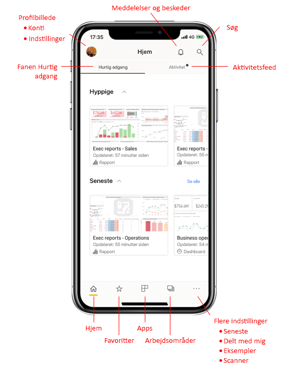
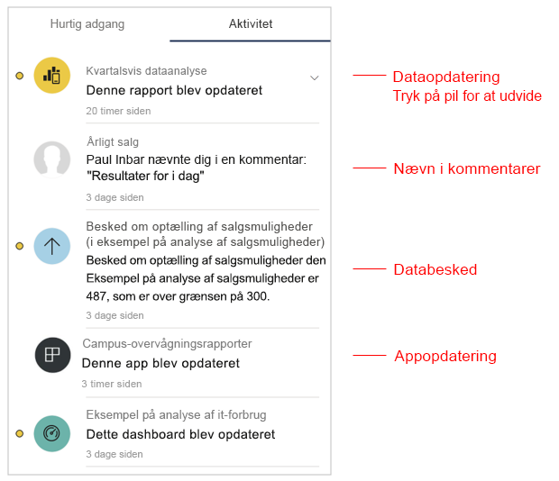
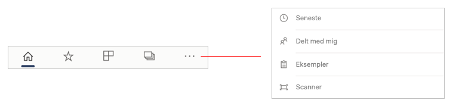
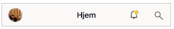
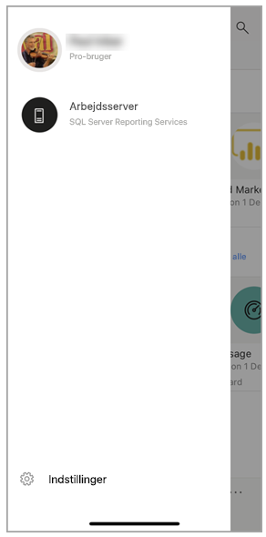
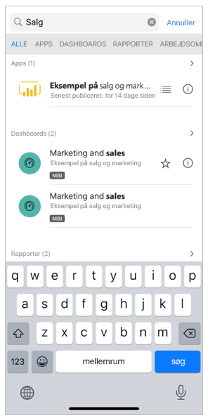

# En hurtig rundvisning af startsiden for mobilappen
I denne rundvisning bliver du bekendt med startsiden for Power BI-mobilappen og den navigationshjælp, du får, så du kan komme hurtigt til det, du har brug for.

Gælder for:

|  |  |  |
|:--- |:--- |:--- |
| iPhone | iPad | Android | 

Når du åbner Power BI-mobilappen, kommer du til startsiden, hvor du hurtigt kan få adgang til dine oftest anvendte eller senest viste rapporter, dashboards og apps. Derudover er der et aktivitetsfeed, der holder dig opdateret om, hvad der sker med dit Power BI-indhold, samt praktiske navigationsværktøjer, så du hurtigt kan få adgang til det indhold, du har brug for.

 
## Fanen Hurtig adgang

Under fanen Hurtig adgang kan du se oftest anvendte og senest viste rapporter, dashboards og apps, grupperet i to sektioner, der kan skjules. Hvis du vil se en længere liste over dine senest viste elementer, skal du trykke på **Se alle** til højre for Seneste. 

## Aktivitetsopdatering

Aktivitetsfeedet hjælper dig med at holde styr på, hvad der sker med dit Power BI-indhold. Du får vist alle dine seneste meddelelser, beskeder, kommentarer og @mentions.

Opdateringerne i feedet omfatter:
* **Opdaterede data**: Når de underliggende data i en af rapporterne eller på et af dashboardene i dine Favoritter eller Seneste opdateres.
* **Nye kommentarer**: Når personer opretter en kommentar i en rapport eller på et dashboard, der er i dine Favoritter eller Seneste, eller når nogen nævner dig i en kommentar.
* **Databeskeder**: Når data når en grænse, som du tidligere har angivet i en [databesked](../../mobile-set-data-alerts-in-the-mobile-apps.md).
* **Appopdateringer**: Når en appforfatter publicerer en opdatering til en app, du bruger.

 Tryk på et aktivitetselement for at hoppe til det relevante sted, så du kan få mere at vide.

Aktivitetselementer samles, så alle dataopdateringer, der kommer fra samme app eller arbejdsområde, grupperes. Brug  pilen for at udvide og se de samlede elementer. Det nyeste element vises altid øverst på listen.

## Navigationslinje

Nederst på siden finder du navigationslinjen.

Navigationslinjen giver hurtig adgang til:

*  **Start** – returnerer dig til startsiden.
*  **Favoritter** – de rapporter, dashboards og apps, du har markeret som [favoritter](../../mobile-apps-favorites.md).
*  **Apps** – de apps, du har installeret på din konto.
*  **Arbejdsområder** – de arbejdsmapper, der indeholder rapporter og dashboards, som indholdsforfattere skaber.
*  **Seneste** – de elementer, du senest har fået vist.
*  **Delt med mig** – de elementer, andre personer har delt med dig.
*  **Eksempler** – Power BI-eksempler, du kan bruge til at få mere at vide om Power BI-egenskaber.
*  **Scanner** – det enhedskamera, du kan bruge som scanner til at scanne [stregkoder](../../mobile-apps-scan-barcode-iphone.md) og [QR-koder](../../mobile-apps-qr-code.md).

## Sidehoved

Øverst på siden angiver overskriften navnet på Power BI-siden, -rapporten eller -dashboardet, du er på.

Overskriften indeholder følgende navigationselementer:
* **Profilbillede eller avatar** – åbner sidepanelet, hvor du kan [skifte mellem dine konti til Power BI-tjenesten og rapportserver](../../mobile-app-ssrs-kpis-mobile-on-premises-reports.md), samt adgang til indstillinger for Power BI-mobilappen.

    

* **Meddelelser** – åbner [meddelelsessiden](../../mobile-apps-notification-center.md), hvor du kan få vist og få adgang til dine meddelelser. En prik på meddelelsesklokken angiver, at du har nye meddelelser.

    

* **Søg** – søg efter Power BI-indhold i dit abonnement.

    

## De næste trin
I denne rundvisning har du udforsket startsiden for Power BI-mobilappen. Læs mere om brug af Power BI-mobilappen. 
* [Udforsk dashboards og rapporter](../../mobile-apps-quickstart-view-dashboard-report.md)
* [Udforsk rapporter i Power BI-mobilappsene](../../mobile-reports-in-the-mobile-apps.md)
