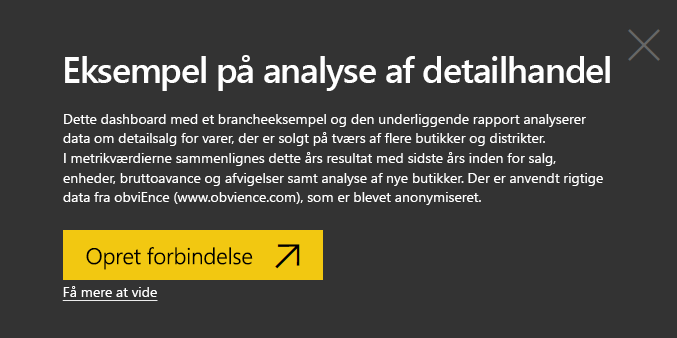
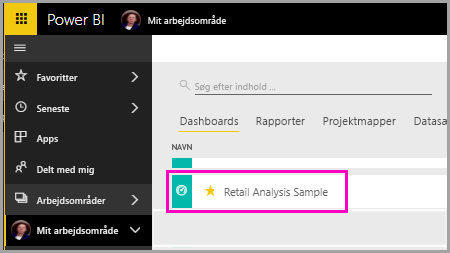

# Virtuel Spørgsmål og svar-analytiker i iOS-apps – Power BI

Den nemmeste måde at få mere at vide om dine data er at stille spørgsmål om dem med dine egne ord. I denne artikel kan du stille spørgsmål og få vist udvalgt indsigt i eksempeldata med den virtuelle Spørgsmål og svar-analytiker i Microsoft Power BI-mobilappen på iPad, iPhone og iPod Touch. 

Gælder for:

|  |  |
|:--- |:--- |
| iPhone-telefoner |iPad-tablets |

Den virtuelle Spørgsmål og svar-analytiker er en BI-samtaleoplevelse, der har adgang til underliggende Spørgsmål og svar-data i Power BI-tjenesten [(https://powerbi.com)](https://powerbi.com). Den foreslår indsigt i data, og du kan skrive eller indtale dine egne spørgsmål.

Hvis du ikke er tilmeldt Power BI, kan du [tilmelde dig en gratis prøveversion](https://app.powerbi.com/signupredirect?pbi_source=web), før du begynder.

## Forudsætninger

### Installér Power BI til iOS-apps
[Download iOS-appen](http://go.microsoft.com/fwlink/?LinkId=522062 "Download iPhone-appen") fra Apple App Store til din iPad, iPhone eller iPod Touch.

Disse versioner understøtter Power BI til iOS-app:
- iPad med iOS 10 eller nyere.
- iPhone 5 og nyere med iOS 10 eller nyere. 
- iPod Touch med iOS 10 eller nyere.

### Download eksempler
Det første skridt er at downloade eksemplerne på detailhandelsanalyse og analyse af salgsmuligheder i Power BI-tjenesten.

**Hent eksemplet på detailhandelsanalyse**

1. Åbn Power BI-tjenesten (app.powerbi.com), og log på.

2. Vælg **Arbejdsområder**, **Mit arbejdsområde** i navigationsruden til venstre.

3. Vælg **Hent data** i nederste venstre hjørne.
   
    

3. Vælg ikonet **Eksempler** på siden Hent data.
   
   

4. Vælg **Eksempel på detailhandelsanalyse**.
 
    
 
8. Vælg **Opret forbindelse**.  
  
   
   
5. Power BI importerer indholdspakken og føjer et nyt dashboard, en rapport og et datasæt til dit aktuelle arbejdsområde.
   
   

**Hent eksemplet på analyse af salgsmuligheder**

- Gennemgå de samme trin, som du har udført for eksemplet på detailhandelsanalyse, men i trin 4 skal du vælge **Eksempel på analyse af salgsmuligheder**.

    
  
OK, du er nu klar til at få vist eksemplerne på din iOS-enhed.

## Prøv at stille spørgsmål på din iPhone eller iPad
1. På din iPhone eller iPad skal du trykke på knappen til global navigation  > **Arbejdsområder** > **Mit arbejdsområde** og åbne dashboardet med eksemplet på analyse af salgsmulighed.

2. Tryk på  i handlingsmenuen i bunden af siden (øverst på siden på en iPad).
     Den virtuelle Spørgsmål og svar-analytiker indeholder nogle forslag til at komme i gang.
3. Skriv **vis**, tryk på **salg** på forslagslisten > **Send** .

    
4. Tryk på **efter** blandt nøgleordene, og tryk derefter på **vare** på forslagslisten > **Send** .

    
5. Tryk på **som** blandt nøgleordene, tryk på ikonet for søjlediagram , og tryk derefter på **Send** .
6. Tryk vedvarende på det resulterende diagram og derefter på **Udvid**.

    

    Diagrammet åbnes i fokuseringstilstand i appen.

    
7. Tryk på pilen i øverste venstre hjørne for at gå tilbage til den virtuelle Spørgsmål og svar-analytikers chatvindue.
8. Tryk på X til højre for tekstfeltet for at slette teksten og starte forfra.
9. Prøv et nyt spørgsmål: Tryk på **top** blandt nøgleordene, tryk på **sale by avg $/unit l** > **Send** .

    
10. Vælg **efter** blandt nøgleordene, tryk på **tid** på forslagslisten øverst > **Send** .

     
11. Skriv **som**, vælg kurvediagramikonet  på forslagslisten > **Send** .

    

## Prøv at sige dine spørgsmål
Nu kan du stille spørgsmål om dine data i Power BI-mobilappen ved at tale i stedet for at indtaste.

1. Tryk på ikonet for den virtuelle Spørgsmål og svar-analytiker  i handlingsmenuen i bunden af siden (øverst på siden på en iPad).
2. Tryk på mikrofonikonet .

    

1. Når mikrofonikonet er aktiveret, kan du begynde at tale. Sig for eksempel "gennemsnitlig enhedspris efter klokkeslæt", og vælg derefter **Send** .

    

### Har du spørgsmål vedrørende anonymitet, når der bruges tale til tekst?
Se afsnittet om talegenkendelse under [Nyheder i iOS](https://go.microsoft.com/fwlink/?linkid=845624) i Apple iOS Developer-vejledninger.

## Hjælp og feedback
* Har du brug for hjælp? Sig bare "Hej" eller "Hjælp", hvorefter du kan få hjælp til at starte et nyt spørgsmål.
* Vil du gerne give feedback om resultaterne? Tryk vedvarende på et diagram eller et andet resultat, og vælg derefter glad eller sur smiley.

    

    Din feedback er anonym og hjælper os med at forbedre vores svar på spørgsmål.

## Udvid dine resultater fra den virtuelle Spørgsmål og svar-analytiker
Du kan forbedre de resultater, du og dine kunder får, når de bruger den virtuelle Spørgsmål og svar-analytiker på et datasæt, enten ved at stille mere målrettede spørgsmål eller med et forbedret datasæt.

### Sådan spørger du
* Følg disse [tip til at stille spørgsmål i Spørgsmål og svar](../end-user-q-and-a-tips.md) i Power BI-tjenesten eller den virtuelle Spørgsmål og svar-analytiker i din mobilapp til iOS.

### Sådan forbedres datasættet
* Udvid datasættet i Power BI Desktop eller i Power BI-tjenesten for at [få dine data til at fungere godt sammen med den virtuelle Spørgsmål og svar-analytiker](../../service-prepare-data-for-q-and-a.md).

## Næste trin
* [Spørgsmål og svar i Power BI-tjenesten](../end-user-q-and-a.md)
* Har du spørgsmål? Tag et kig på [mobilappsektionen i Power BI-community'et](https://go.microsoft.com/fwlink/?linkid=839277)
