# Virtuel Spørgsmål og svar-analytiker i iOS-apps – Power BI

Den nemmeste måde at få mere at vide om dine data er at stille spørgsmål om dem med dine egne ord. I denne artikel kan du stille spørgsmål og få vist udvalgt indsigt i eksempeldata med den virtuelle Spørgsmål og svar-analytiker i Microsoft Power BI-mobilappen på iPad, iPhone og iPod Touch. 

Gælder for:

|  |  |
|:--- |:--- |
| iPhone-telefoner |iPad-tablets |

Den virtuelle Spørgsmål og svar-analytiker er en BI-samtaleoplevelse, der har adgang til underliggende Spørgsmål og svar-data i Power BI-tjenesten [(https://powerbi.com)](https://powerbi.com). Den foreslår indsigt i data, og du kan skrive eller indtale dine egne spørgsmål.

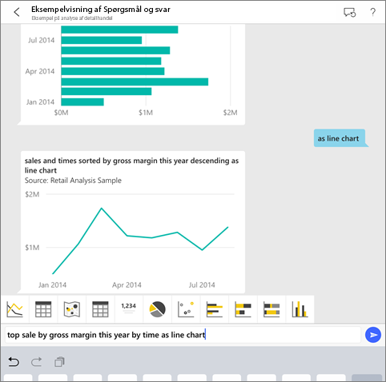

Hvis du ikke er tilmeldt Power BI, kan du [tilmelde dig en gratis prøveversion](https://app.powerbi.com/signupredirect?pbi_source=web), før du begynder.

## Forudsætninger

* **Installér Power BI til iOS-appen**: [Download iOS-appen](https://go.microsoft.com/fwlink/?LinkId=522062) på din iPhone eller iPad.
Disse versioner understøtter Power BI-app til iOS:
    * iPad med iOS 11 eller nyere.
    * iPhone 5 og nyere med iOS 11 eller nyere.
* **Download eksemplerne Analyse af detailhandel og Analyse af salgsmuligheder**: Det første skridt i denne Hurtig start er at downloade eksemplerne Analyse af detailhandel og Analyse af salgsmuligheder i Power BI-tjenesten. [Få mere at vide om, hvordan du downloader et eksempel](./mobile-apps-download-samples.md) til din Power BI-konto for at komme i gang. Sørg for at vælge eksemplerne Analyse af detailhandel og Analyse af salgsmuligheder.

Når du har fuldført forudsætningerne, er du klar til at prøve den virtuelle analytiker Spørgsmål og svar.

## Prøv at stille spørgsmål på din iPhone eller iPad
1. Tryk på knappen Arbejdsområder på den nederste navigationslinje på din iPhone eller iPad , gå til Mit arbejdsområde, og åbn dashboardet med eksemplet Analyse af detailhandel.

2. Tryk på  i handlingsmenuen i bunden af siden (øverst på siden på en iPad).
     Den virtuelle Spørgsmål og svar-analytiker indeholder nogle forslag til at komme i gang.
3. Skriv **vis**, tryk på **salg** på listen over forslag > **Send** .

    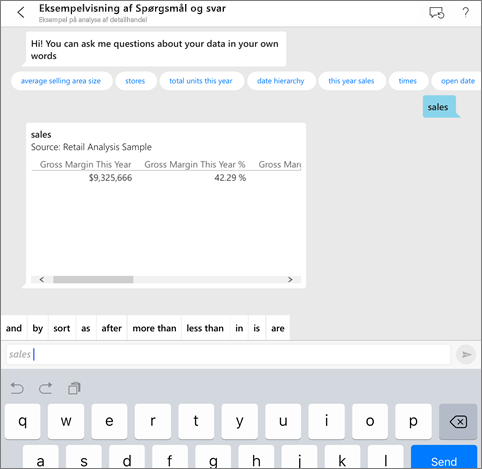
4. Tryk på **efter** blandt nøgleordene, og tryk derefter på **element** på listen over forslag > **Send** .

    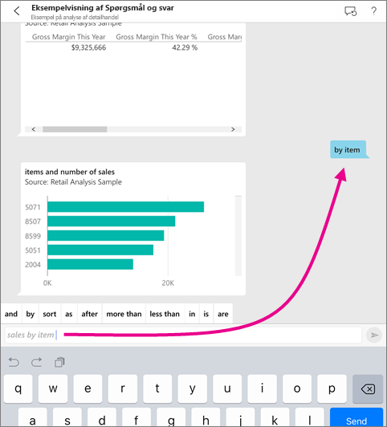
5. Tryk på **som** blandt nøgleordene, tryk på ikonet for søjlediagrammet , og tryk derefter på **Send** .
6. Tryk vedvarende på det resulterende diagram og derefter på **Udvid**.

    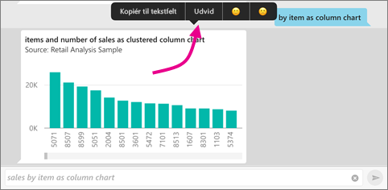

    Diagrammet åbnes i fokuseringstilstand i appen.

    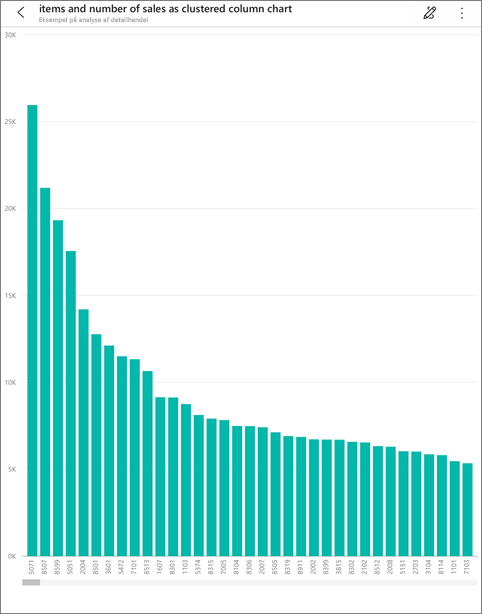
7. Tryk på pilen i øverste venstre hjørne for at gå tilbage til den virtuelle Spørgsmål og svar-analytikers chatvindue.
8. Tryk på X til højre for tekstfeltet for at slette teksten og starte forfra.
9. Prøv et nyt spørgsmål: Tryk på **bedste** blandt nøgleordene, tryk på **salg efter gennemsnit $/enhed l** > **Send** .

    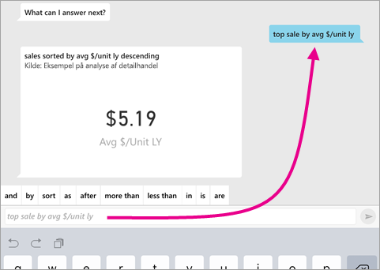
10. Vælg **efter** blandt nøgleordene, tryk på **klokkeslæt** på listen over forslag øverst > **Send** .

     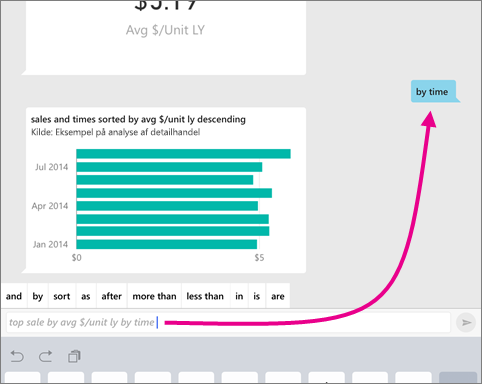
11. Skriv **som**, vælg ikonet for kurvediagrammet  på listen over forslag > **Send** .

    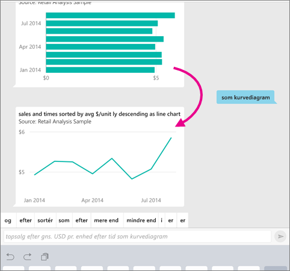

## Prøv at sige dine spørgsmål
Nu kan du stille spørgsmål om dine data i Power BI-mobilappen ved at tale i stedet for at indtaste.

1. Tryk på ikonet for den virtuelle Spørgsmål og svar-analytiker  i handlingsmenuen i bunden af siden (øverst på siden på en iPad).
2. Tryk på mikrofonikonet .

    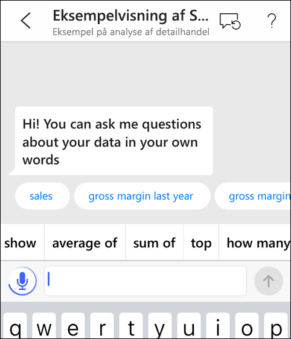

1. Når mikrofonikonet er aktiveret, kan du begynde at tale. Sig f.eks. "gennemsnitlig enhedspris efter klokkeslæt", og tryk derefter på **Send** .

    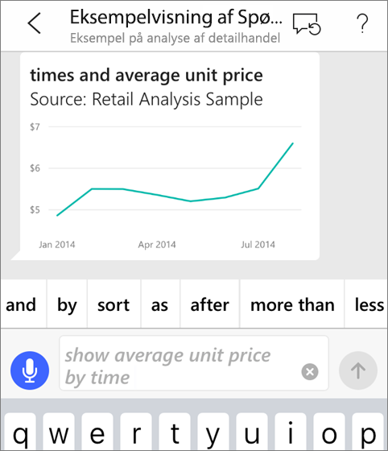

### Har du spørgsmål vedrørende anonymitet, når der bruges tale til tekst?
Se afsnittet om talegenkendelse under [Nyheder i iOS](https://go.microsoft.com/fwlink/?linkid=845624) i Apple iOS Developer-vejledninger.

## Hjælp og feedback
* Har du brug for hjælp? Sig bare "Hej" eller "Hjælp", hvorefter du kan få hjælp til at starte et nyt spørgsmål.
* Vil du gerne give feedback om resultaterne? Tryk vedvarende på et diagram eller et andet resultat, og vælg derefter glad eller sur smiley.

    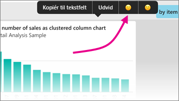

    Din feedback er anonym og hjælper os med at forbedre vores svar på spørgsmål.

## Udvid dine resultater fra den virtuelle Spørgsmål og svar-analytiker
Du kan forbedre de resultater, du og dine kunder får, når de bruger den virtuelle Spørgsmål og svar-analytiker på et datasæt, enten ved at stille mere målrettede spørgsmål eller med et forbedret datasæt.

### Sådan spørger du
* Følg disse [tip til at stille spørgsmål i Spørgsmål og svar](../end-user-q-and-a-tips.md) i Power BI-tjenesten eller den virtuelle Spørgsmål og svar-analytiker i din mobilapp til iOS.

### Sådan forbedres datasættet
* Udvid datasættet i Power BI Desktop eller i Power BI-tjenesten for at [få dine data til at fungere godt sammen med den virtuelle Spørgsmål og svar-analytiker](../../service-prepare-data-for-q-and-a.md).

## Næste trin
* [Spørgsmål og svar i Power BI-tjenesten](../end-user-q-and-a.md)
* Har du spørgsmål? Tag et kig på [mobilappsektionen i Power BI-community'et](https://go.microsoft.com/fwlink/?linkid=839277)
