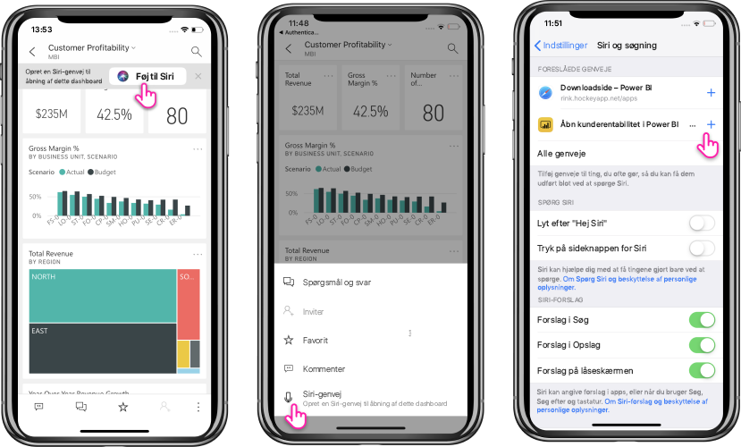

# Brug af Siri-genveje i Power BI-mobilappen til iOS

Brug Siri genveje til at oprette direkte adgang til det Power BI-indhold, du har brug for.

Brug integrationen af Siri-genveje for at få nem og hurtig adgang til dine ofte benyttede rapporter eller dashboards. Opret en genvej til dit element, og bed derefter Siri om at starte det, når du har brug for at kigge på dataene.

## Opret en Siri-genvejen til en rapport eller dashboard

Der er tre måder at oprette Siri-genveje til dine rapporter og dashboards:

- Et banner med indstillingen **Føj til Siri** føjes til dine ofte benyttede rapporter og dashboards. Tryk på handlingen for at åbne siden **Føj til Siri**.
    
- Brug handlingen **Siri-genvej** i handlingsmenuen (...) **Rapport** eller **Dashboard**.
    
- Brug **Foreslåede genveje** i enhedsindstillingerne (**Enhedsindstilling** > **Siri og søgning**). Du kan føje en genvej til elementet i forslaget ved hjælp af knappen med plustegnet (+).
     
     

For en Power BI-rapport registrerer genvejen den aktuelle side, som du får vist, når du opretter genvejen. 

Alle indstillinger åbner siden **Føj til Siri**. På denne side skal du optage en sætning, som du skal bruge senere med Siri for at åbne rapporten eller dashboardet. 
   

    

## Brug Siri genveje til at få vist rapporten eller dashboardet

Når du har oprettet en genvej, skal du blot spørge Siri, hver gang du vil have adgang til det dashboard eller den rapport, du har oprettet en genvej til.
Aktivér Siri, og angiv den sætning, som du har optaget for genvejen. Siri starter Power BI og viser den ønskede rapport eller det ønskede dashboard. 

For en Power BI-rapport får du vist den side, der blev registreret, da du oprettede genvejen.

  
  

## Rediger sætningen for Siri-genvejen 
Du kan redigere genvejsætningen ved hjælp af knappen **Siri-genvej** i handlingsmenuen (...) **Rapport** eller **Dashboard**. Siden med Siri-genvejen åbnes med mulighed for at **optage sætningen igen**. 

## Slet Siri-genven 
Hvis du vil slette en genvej, skal du gå til elementet og trykke på den **Siri-genvej** i handlingsmenuen (...). Siden **Siri genvej** åbnes. Vælg **Slet genvej**.

> [!NOTE]
> Integrationen af Siri-genveje med Power BI-appen er tilgængelig til iPhone og iPad, der kører på iOS12 og nyere.
> 

## Næste trin
Få mere at vide om Power BI-mobilappen ved at gøre følgende: 

* Downloade [Power BI-mobilappen til iPhone](https://go.microsoft.com/fwlink/?LinkId=522062)
* Følge [@MSPowerBI på Twitter](https://twitter.com/MSPowerBI)
* Deltage i samtalen i [Power BI-communityet](https://community.powerbi.com/)

