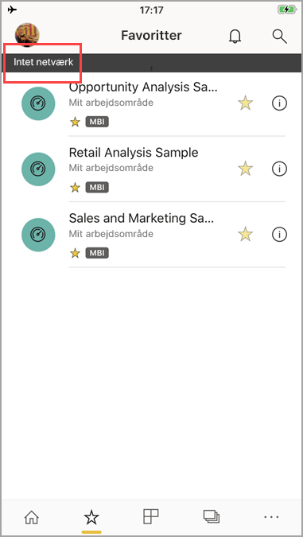

# Få vist dine data offline i Power BI-mobilapps
Gælder for:

|  |  |  |  |  |
|:--- |:--- |:--- |:--- |:--- |
| iPhones |iPad-tablets |Android-telefoner |Android-tablets |Windows 10-enheder |

>[!NOTE]
>Understøttelse af Power BI-mobilapp til **telefoner, der bruger Windows 10 mobile**, ophører den 16. marts 2021. [Få mere at vide](https://go.microsoft.com/fwlink/?linkid=2121400)

En fordel ved at få vist Power BI i en mobilapp i stedet for i en mobilbrowser er, at du kan se dine data, selvom du ikke har oprettet forbindelse til et netværk. 

Som standard opdateres dataene i Power BI ofte, så du får opdaterede svar på dine forretningsmæssige spørgsmål, også når du er på farten.

## Dataadgang, mens du er offline
Selvom du er offline, kan du få adgang til at interagere med de dashboards, du tidligere har brugt i mobilappen.

Du har også skrivebeskyttet adgang til alle de Power BI-rapporter, du tidligere har brugt i mobilappen. Du kan se hele rapporten, men du kan ikke filtrere, krydsfiltrere, sortere eller bruge afsnit i den.

>[!NOTE]
> Rapporter, der er baseret på DirectQuery, cachelagres ikke og er ikke tilgængelige offline.

## Opdatering af data i baggrunden
Dine favoritdashboards og de dashboards og rapporter, du har brugt inden for de seneste to uger, opdateres i baggrunden med dataene i Power BI-tjenesten (ikke datakilden). Hvis du har oprettet forbindelse til Wi-Fi, sker opdateringen i baggrunden hver anden time. Hvis du er på et 3G-netværk, opdateres indholdet i Power BI en gang for hver 24 timer.

Du kan slå opdatering i baggrunden fra, f.eks. hvis du vil undgå netværksbrug. Kontrollér indstillingerne på din enhed.

> [!NOTE]
> Hvis du bruger Power BI-mobilappen på en iOS-enhed, og din organisation har konfigureret Microsoft Intune MAM, er opdateringen af data i baggrunden slået fra. Næste gang du bruger appen, vil Power BI opdatere dataene fra Power BI-tjenesten på internettet.
> 
> Læs mere om at [konfigurere Power BI-mobilapps med Microsoft Intune](../../admin/service-admin-mobile-intune.md). 
> 
> 

## Offlineindikatorer
I Power BI vises der tydelige indikatorer for, når du skifter til og fra offlinetilstand, og der vises indikatorer for manglende dashboards, rapporter og felter, som ikke er tilgængelige, når du er offline.

## Begrænsninger
Når du er offline med Power BI på din mobilenhed, kan du komme ud for følgende begrænsninger:

* Power BI kan cachelagre op til 250 MB data offline.
* Nogle felttyper kræver en aktiv serverforbindelse, så de er ikke tilgængelige offline, f.eks. Bing-kortfelter og nogle typer brugerdefinerede felter.
* Hele Excel-projektmapper i Power BI er ikke tilgængelige offline.
* Du kan se Reporting Services-mobilrapporter og KPI'er offline, hvis du har set dem, mens du havde forbindelse. De opdateres ikke i baggrunden. De opdateres, hver gang du åbner dem.
* I Power BI-mobilapps kan du ikke kan se Power BI Desktop (.pbix)-filer, der er gemt i Power BI Report Server. 
* Sideinddelte rapporter (RDL) er ikke tilgængelige, når netværket er offline.

## Næste trin
Din feedback hjælper os med at afgøre, hvad der skal implementeres fremover, så husk at stemme på andre funktioner, du gerne vil se i Power BI-mobilapps. 

* [Power BI-apps til mobilenheder](mobile-apps-for-mobile-devices.md)
* Følg @MSPowerBI på Twitter
* Deltag i samtalen i [Power BI-communityet](https://community.powerbi.com/)
* [Hvad er Power BI?](../../fundamentals/power-bi-overview.md)