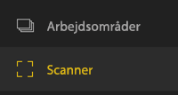
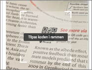
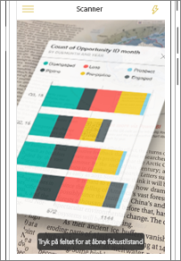
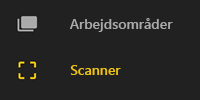
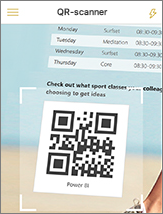
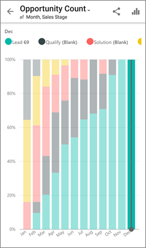

# Scan en Power BI QR-kode fra din mobilenhed
Gælder for:

|  |  |  |
|:--- |:--- |:--- |:--- |
| iPhone-telefoner |Android-telefoner |Android-tablets |

QR-koder i Power BI kan forbinde noget i den virkelige verden direkte med relaterede BI-oplysninger &#150; du behøver ikke at navigere eller søge.

Et eksempel kan være, at en kollega har [oprettet en QR-kode i Power BI-tjenesten](../../service-create-qr-code-for-tile.md) for en rapport eller et felt i et dashboard og har delt dashboardet eller rapporten med dig. Samtidig placerer vedkommende QR-koden på et sted, hvor du har adgang til den, for eksempel i en mail eller på en vare. 

Du kan scanne QR-koden for at få direkte adgang til feltet eller rapporten direkte fra din telefon. Det gør du ved hjælp af scanneren i Power BI-appen eller en anden scannerapp, du har installeret på din telefon. 

Hvis din kollega ikke har delt dashboardet eller rapporten med dig, kan du anmode om adgang direkte fra mobilappen. 

> [!NOTE]
> Du kan også [scanne en QR-kode for en rapport med Power BI til Mixed Reality-appen](mobile-mixed-reality-app.md#scan-a-report-qr-code-in-holographic-view).

## Scan en Power BI QR-kode på din iPhone med Power BI-scanneren
1. Åbn den globale navigationsmenu  øverst til venstre i Power BI-mobilappen. 
2. Rul ned, og vælg **Scanner**. 
   
    
3. Hvis kameraet ikke er aktiveret, skal du godkende Power BI-appen for at bruge kameraet. Dette er en engangsgodkendelse. 
4. Peg på Power BI QR-koden med scanneren. 
   
    
5. Feltet eller rapporten vises oven på baggrunden i augmented reality.
   
    
6. Tryk på rapporten eller feltet for at åbne den/det i Fokustilstand, eller gå tilbage til scanneren.

### Scan en QR-kode fra en ekstern scanner på din iPhone
1. Brug den scanner, du har installeret på din telefon, og peg på den relevante Power BI QR-kode for at få direkte adgang til feltet eller rapporten. 
2. Hvis du ikke har installeret Power BI-appen, omdirigeres du til [Apple App Store](http://go.microsoft.com/fwlink/?LinkId=522062), hvor du kan downloade appen til din iPhone.

## Scan en Power BI QR-kode på din Android-enhed med Power BI-scanneren
1. Åbn den globale navigationsknap  øverst til venstre i Power BI-mobilappen. 
2. Rul ned, og vælg **QR-scanner**.
   
    
3. Hvis kameraet ikke er aktiveret, skal du godkende Power BI-appen for at bruge kameraet. Dette er en engangsgodkendelse. 
4. Peg på Power BI QR-koden med scanneren. 
   
    
5. Feltet eller rapporten åbnes automatisk i Power BI.
   
    

### Scan en QR-kode fra en ekstern scanner på din Android-enhed
1. Brug den scanner, du har installeret på din Android-enhed, og peg på den relevante Power BI QR-kode for at få direkte adgang til feltet eller rapporten. 
2. Hvis du ikke har installeret Power BI-appen, omdirigeres du til [Google Play Butik](http://go.microsoft.com/fwlink/?LinkID=544867), hvor du kan downloade appen. 

## Næste trin
* [Opret forbindelse til Power BI-data fra den virkelige verden](mobile-apps-data-in-real-world-context.md) med mobilappen
* [Opret en QR-kode for et felt i Power BI-tjenesten](../../service-create-qr-code-for-tile.md)
* [Opret en QR-kode for en rapport i Power BI-tjenesten](../../service-create-qr-code-for-report.md)
* Du kan også [scanne en QR-kode med Power BI til Mixed Reality-appen](mobile-mixed-reality-app.md).
* Har du spørgsmål? [Prøv at spørge Power BI-community'et](http://community.powerbi.com/)

