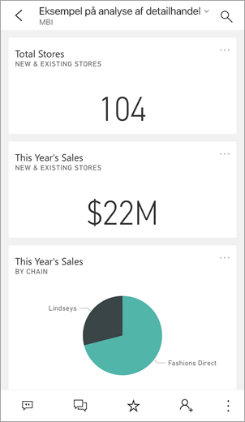
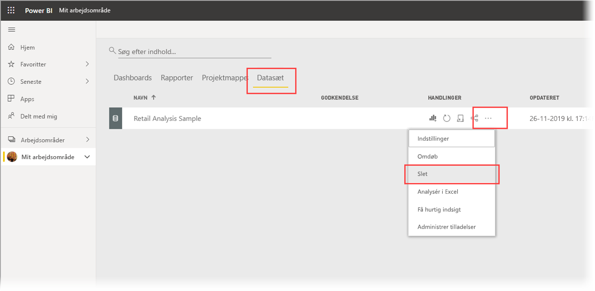

# Hurtig start: Vis dashboards og rapporter i Power BI-mobilappene
I denne hurtige introduktion får du en hurtig rundvisning i Power BI – Mobil-appen og udforsker et eksempeldashboard og en eksempelrapport. Power BI-appen til iOS vises, men du kan nemt følge med på andre enheder.

Gælder for:

|  |  |  |  |
|:--- |:--- |:--- |:--- |
| iPhone | iPad | Android | Windows 10 |

>[!NOTE]
>Understøttelse af Power BI-mobilapp til **telefoner, der bruger Windows 10 mobile**, ophører den 16. marts 2021. [Få mere at vide](https://go.microsoft.com/fwlink/?linkid=2121400)

Dashboards er en portal til din virksomheds livscyklus og processer. Det er en oversigt – et samlet sted, hvor du kan se virksomhedens aktuelle resultater. Rapporter er interaktive visninger af dine data, hvor visualiseringer repræsenterer forskellige resultater og indsigter fra disse data. 

## Forudsætninger

* **Tilmeld dig Power BI**: Hvis du ikke er tilmeldt Power BI, kan du [tilmelde dig en gratis prøveversion](https://app.powerbi.com/signupredirect?pbi_source=web), før du begynder.
* **Installér Power BI-appen til din enhed**: Hent Power BI-mobilappen** i [App Store](https://apps.apple.com/app/microsoft-power-bi/id929738808) (iOS) og [Google Play](https://play.google.com/store/apps/details?id=com.microsoft.powerbim&amp;amp;clcid=0x409) (Android).
* **Download Eksempel på detailhandelsanalyse**: Det første skridt i denne hurtige introduktion er at downloade Eksempel på detailhandelsanalyse i Power BI-tjenesten. [Få mere at vide om, hvordan du downloader et eksempel](./mobile-apps-download-samples.md) til din Power BI-konto for at komme i gang. Brug Eksempel på detailhandelsanalyse.

Når du har gennemført forudsætningerne og downloadet Eksempel på detailhandelsanalyse til din Power BI-konto, er du klar til at begynde denne hurtige rundvisning.

## Få vist et dashboard på din mobilenhed
1. Åbn Power BI-appen på din enhed, og log på med dine Power BI-kontooplysninger, dvs. dem, som du brugte i Power BI-tjenesten i browseren.
 
1. Tryk nu på ikonet **Arbejdsområder** , vælg **Mine arbejdsområder**, og tryk derefter på Eksempel på detailhandelsanalyse for at åbne det.

    
   
    Power BI-dashboards ser lidt anderledes ud på din mobilenhed, end de gør i Power BI-tjenesten. Alle felterne vises med samme bredde, og de er arrangeret fra top til bund.

5. Tryk på stjerneikonet  på titellinjen for at gøre dette til et favoritdashboard. Når du angiver noget som favorit i mobilappen, bliver det også en favorit i Power BI-tjenesten og omvendt.

6. Rul ned, og tryk på det udfyldte kurvediagram "This Year's Sales, Last Year's Sales".

    

    Det åbnes i fokustilstand.

7. I fokustilstand skal du trykke på **Apr** i diagrammet. Værdierne for april vises øverst i diagrammet.

    

8. Tryk på ikonet Rapport  nederst på skærmen (på Android-enheder kan dette være øverst på skærmen). Den rapport, der er relateret til dette felt, åbnes i liggende tilstand.

    

9. Tryk på den gule boble "040 - Juniors" i boblediagrammet. Bemærk, hvordan det fremhæver relaterede værdier i de andre diagrammer. 

    

10. Stryg opad for se værktøjslinjen langs den nederste kant, og tryk på **Flere indstillinger (...)** .

    

11. Rul ned på listen, og vælg **Anmærk**.

    

12. Tryk på ikonet med en smiley på værktøjslinjen Anmærk, og tryk derefter på den rapportside, hvor du vil tilføje smileys.
 
    

13. Tryk derefter på **Del** i øverste højre hjørne.

14. Vælg, hvordan du vil dele rapporten.  

    

    Du kan dele dette snapshot med andre enten i eller uden for din organisation. Hvis de er i din organisation og har deres egen Power BI-konto, kan de også åbne rapporten Eksempel på detailhandelsanalyse.

## Fjern ressourcer

Når du er færdig med denne hurtige introduktion, kan du slette dashboardet Eksempel på detailhandelsanalyse samt den tilhørende rapport og datasættet.

1. Åbn Power BI-tjenesten ([Power BI-tjeneste](https://app.powerbi.com)), og log på.

2. Vælg **Mit arbejdsområde** i navigationsruden.

3. Vælg fanen Dashboards, og klik derefter på papirkurven.

    

    Klik derefter på fanen Rapporter, og gør det samme.

4. Vælg fanen Datasæt, klik på **Flere indstillinger** (...), og vælg **Slet**. 

    

## Næste trin

I denne hurtige introduktion har du udforsket et eksempeldashboard og en eksempelrapport på din mobilenhed. Læs mere om, hvordan du arbejder i Power BI-tjenesten. 

> [!div class="nextstepaction"]
> [Hurtig introduktion: Navigation i Power BI-tjenesten](../end-user-experience.md)

