# Hurtig introduktion: Vis dashboards og rapporter i Power BI-mobilappene
I denne hurtige introduktion udforsker du et eksempeldashboard og en eksempelrapport i Power BI-mobilappen på en Android-telefon. Du kan også følge med i de andre mobilapps. 

Gælder for:

|  |  |  |  |
|:--- |:--- |:--- |:--- |
| iPhone | iPad | Android | Windows 10 |

Dashboards er en portal til din virksomhed og jeres processer. Et dashboard er en oversigt – et samlet sted, hvor du kan se de aktuelle resultater for virksomheden. Rapporter er en interaktiv visning af dine data, hvor visualiseringer repræsenterer forskellige resultater og indsigter fra disse data. 

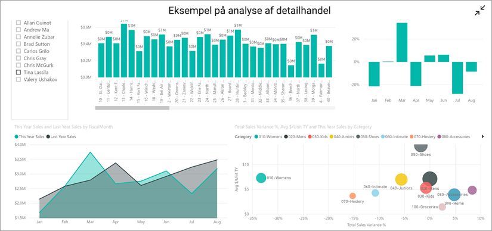

## Forudsætninger

### Tilmeld dig Power BI
Hvis du ikke er tilmeldt Power BI, kan du [tilmelde dig en gratis prøveversion](https://app.powerbi.com/signupredirect?pbi_source=web), før du begynder.

### Installér Power BI til Android-appen
[Download Power BI til Android-appen](https://go.microsoft.com/fwlink/?LinkID=544867) fra Google Play.

Power BI fungerer på Android-enheder, der kører operativsystemet Android 5.0 eller nyere. Hvis du vil kontrollere det på din enhed, skal du gå til **Indstillinger** > **Om enheden** > **Android-version**.

### Download eksemplet på detailhandelsanalyse
Det første skridt i den hurtige introduktion er at downloade eksemplet på detailhandelsanalysen i Power BI-tjenesten.

1. Åbn Power BI-tjenesten i din browser (app.powerbi.com), og log på.

1. Vælg ikonet for global navigation for at åbne navigationsruden.

    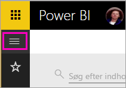

2. Vælg **Arbejdsområder** > **Mit arbejdsområde** i navigationsruden.

    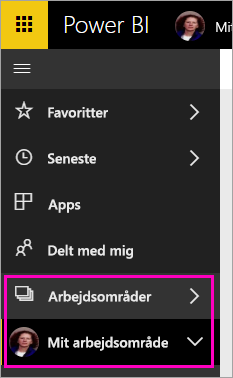

3. Vælg **Hent data** i nederste venstre hjørne.
   
    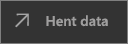

3. Vælg ikonet **Eksempler** på siden Hent data.
   
   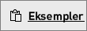

4. Vælg **Eksempel på detailhandelsanalyse**.
 
    
 
8. Vælg **Opret forbindelse**.  
  
   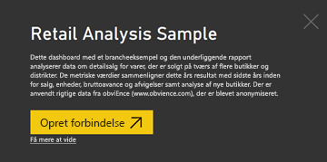
   
5. Power BI importerer eksemplet og føjer et nyt dashboard, en ny rapport og et nyt datasæt til Mit arbejdsområde.
   
   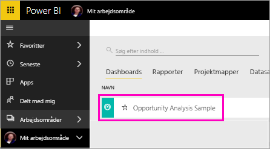

OK, du er nu klar til at få vist eksemplet på din Android-enhed.

## Få vist et dashboard på din Android-enhed
1. Åbn Power BI-appen på din Android-enhed, og log på med dine Power BI-kontooplysninger, dvs. dem, som du brugte i Power BI-tjenesten i browseren.

1.  Tryk på knappen til global navigation .

2.  Tryk på **Arbejdsområder** > **Mit arbejdsområde**

    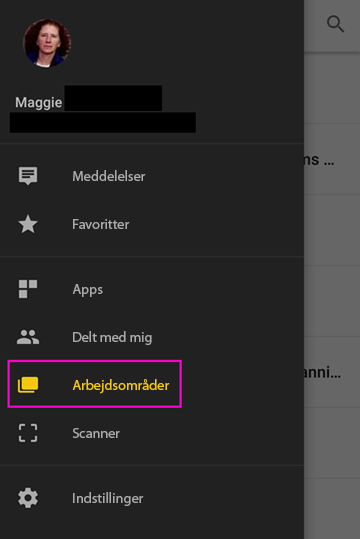

3. Tryk på dashboardet med eksemplet på detailhandelsanalysen for at åbne det.
 
    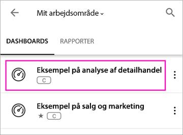
   
    En notation under dashboardnavnet (i dette tilfælde bogstavet "C") viser, hvordan dataene i de enkelte dashboards klassificeres. Læs mere om [dataklassifikation i Power BI](../../service-data-classification.md).

    Power BI-dashboards ser en smule anderledes ud på din Android-telefon. Alle felterne vises med samme bredde, og de er arrangeret fra top til bund.

4. Tryk på stjerneikonet  på titellinjen for at gøre dette til et favoritdashboard.

    Når du angiver noget som favorit i mobilappen, bliver det også en favorit i Power BI-tjenesten og omvendt.

4. Rul ned, og tryk på det udfyldte kurvediagram "This Year's Sales, Last Year's Sales".

    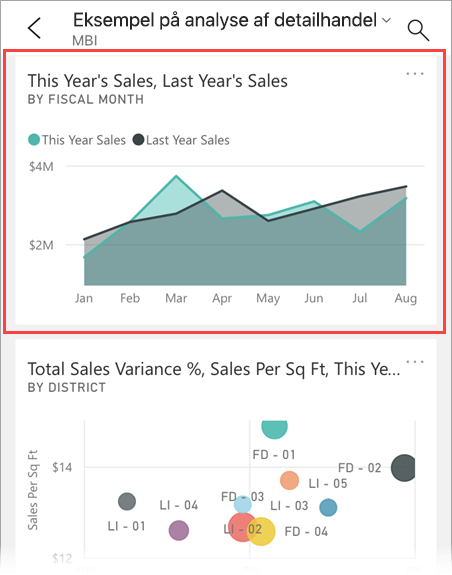

    Det åbnes i fokustilstand.

7. I fokustilstand skal du trykke på Apr i diagrammet. Du kan se, at værdierne for april vises øverst i diagrammet.

    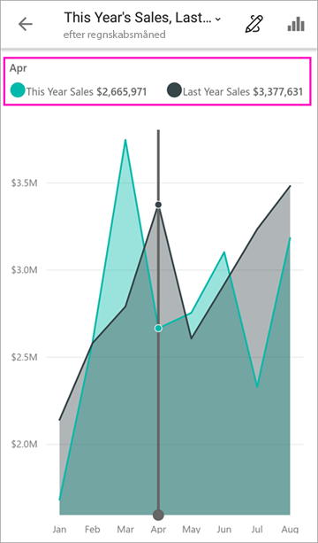

8. Tryk på ikonet Rapport  i øverste højre hjørne. Den rapport, der er relateret til dette felt, åbnes i liggende tilstand.

    

9. Tryk på den gule boble "040 - Juniors" i boblediagrammet. Kan du se, hvordan det fremhæver relaterede værdier i de andre diagrammer? 

    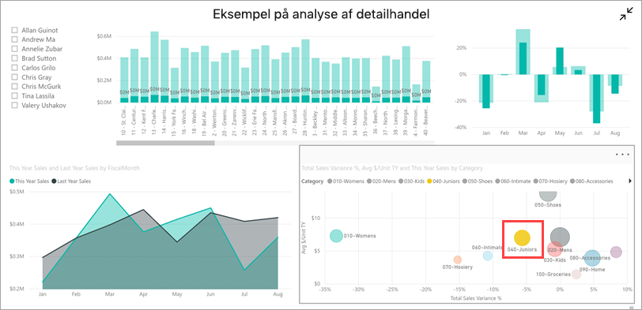

10. Stryg op for se værktøjslinjen langs nederste kant, og tryk på blyantsikonet.

    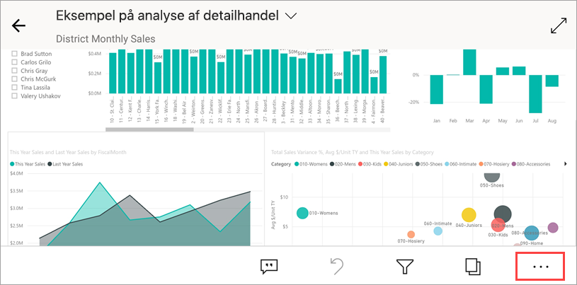

11. Tryk på ikonet med en smiley på værktøjslinjen Anmærk, og tilføj nogle smileys på rapportsiden.
 
    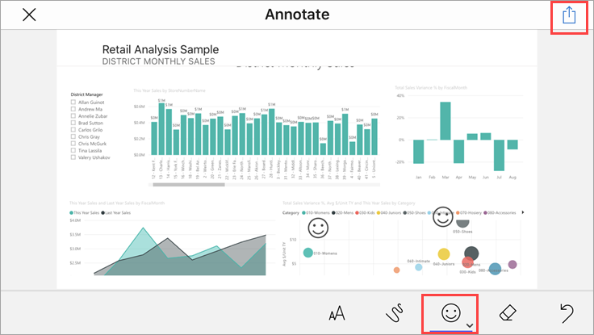

12. Tryk på **Del** i øverste højre hjørne.

1. Udfyld deres mailadresser, og tilføj eventuelt en meddelelse.  

    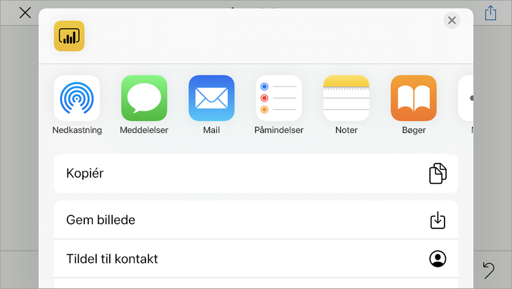

    Du kan dele dette snapshot med andre enten i eller uden for din organisation. Hvis de er i din organisation og har deres egen Power BI-konto, kan de også åbne rapporten Eksempel på detailhandelsanalyse.

## Fjern ressourcer

Når du er færdig med denne hurtige introduktion, kan du slette dashboardet med eksemplet på detailhandelsanalysen samt tilhørende rapport og datasæt, hvis du vil.

1. Åbn Power BI-tjenesten (app.powerbi.com), og log på.

2. Vælg **Arbejdsområder** > **Mit arbejdsområde** i navigationsruden.

    Har du bemærket, at den gule stjerne angiver, at der er tale om en favorit?

3. Under fanen **Dashboards** skal du vælge skraldespandsikonet **Slet** ud for dashboardet Detailhandelsanalyse.

    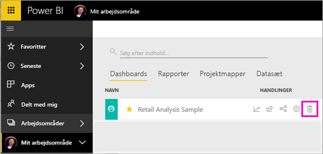

4. Vælg fanen **Rapporter**, og gør det samme for rapporten Detailhandelsanalyse.

5. Vælg fanen **Datasæt**, og gør det samme for datasættet Detailhandelsanalyse.

## Næste trin

I denne hurtige introduktion udforsker du et eksempeldashboard og en eksempelrapport på din Android-enhed. Læs mere om, hvordan du arbejder i Power BI-tjenesten. 

> [!div class="nextstepaction"]
> [Hurtig introduktion: Navigation i Power BI-tjenesten](../end-user-experience.md)

