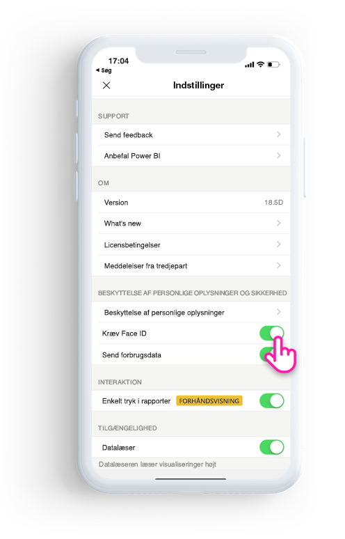
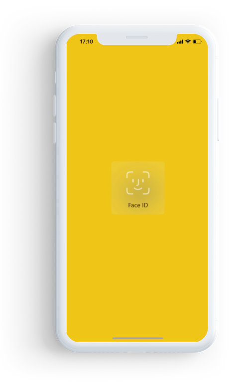

# Beskyt Power BI-app med Face ID, Touch ID eller adgangskode 

I mange tilfælde er de data, der administreres i Power BI fortrolige og skal beskyttes, så kun godkendte brugere har adgang til dem. 

Med Power BI-appen til iOS kan du beskytte dine data ved at konfigurere yderligere identifikation. Du skal angive Face ID, Touch ID eller en adgangskode, hver gang du starter appen, eller når du flytter appen fra baggrunden til forgrunden.

|  |  |
|:--- |:--- |
| iPhone-telefoner |iPad-tablets |

## Slå Face ID, Touch ID eller adgangskoden til i appindstillingerne

Hvis du vil bruge yderligere identifikation i Power BI, skal du gå til appindstillingen under **Beskyttelse af personlige oplysninger og sikkerhed**. Du kan se indstillingen til aktivering af Face ID, Touch ID eller adgangskode, afhængigt af din enheds egenskaber.

Når denne indstilling er aktiveret, bliver du bedt om at angive dit id, før du kan få adgang til appen, hver gang du starter Power BI eller flytter appen fra baggrunden. 

En eventuel anmodning om Face ID, Touch ID eller adgangskode kommer fra iOS, afhængigt af enhedens egenskab. Hvis din enhed understøtter Face ID, skal du bruge Face ID. Hvis den enhed understøtter Touch ID, skal du bruge Touch ID. Hvis ingen af delene understøttes, skal du angive en adgangskode.

## Brug MDM til at gennemtvinge Face ID, Touch ID eller adgangskode

Nogle organisationer har politikker for sikkerhed og krav til overholdelse af angivne standarder, der gennemtvinger yderligere identifikation, før du kan få adgang til følsomme virksomhedsdata. 

Power BI-appen til iOS gør det muligt for administratorer at styre denne indstilling ved at pushe konfigurationsindstillingerne for appen fra Microsoft Intune og andre MDM-løsninger (Mobile Device Management). Administratorer kan bruge appbeskyttelsespolitikken til at aktivere denne indstilling for alle brugere eller en gruppe af brugere.

|Nøgle  |Type  |Beskrivelse  |
|---------|---------|---------|
| com.microsoft.powerbi.mobile.ForceDeviceAuthentication | Boolesk | Standardværdien er False.  Når den er angivet til True, gennemtvinger appen, at brugerne skal identificere sig selv med Face ID, Touch ID eller adgangskode, før de er i stand til at få vist alle Power BI-data i appen. Brugere, der ikke har Face ID, Touch ID eller en adgangskode konfigureret på deres enhed, skal konfigurere dette, før de kan få adgang til Power BI.  |

## Næste trin

[Brug MDM til at fjernkonfigurere Power BI-appen til iOS](mobile-app-configuration.md)
