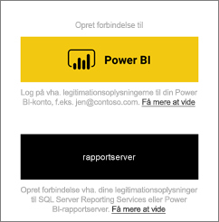
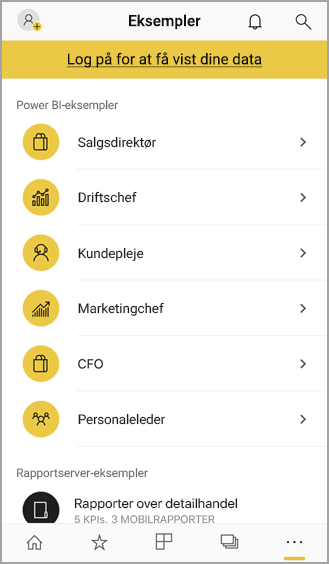

# Introduktion til Power BI-mobilappen på iOS-enheder
Microsoft Power BI til iOS-appen på iPhone eller iPad leverer BI-mobiloplevelsen til Power BI, Power BI-rapportserver og Reporting Services. Få vist og interager med dit firmas dashboards lokalt og i skyen overalt – med direkte, berøringsfølsom mobiladgang. Udforsk data i dashboards, og del dem med dine kollegaer i mails eller sms-beskeder. Og hold dig ajour med dine mest tidsfølsomme data på dit [Apple Watch](mobile-apple-watch.md).  

Du kan oprette Power BI-rapporter i Power BI Desktop og publicere dem:

* [Publicer dem til Power BI-tjenesten](../../fundamentals/service-get-started.md), og opret dashboards.
* [Publicer dem i det lokale miljø på Power BI rapportserver](../../report-server/quickstart-create-powerbi-report.md).

Derefter interagerer du i Power BI-mobilappen til iOS med dine dashboards og rapporter, både lokalt og i clouden.

Find ud af, [hvad der er nyt i Power BI-mobilappene](mobile-whats-new-in-the-mobile-apps.md).

## Download appen
[Download iOS-appen](https://go.microsoft.com/fwlink/?LinkId=522062 "Download iOS-appen") fra Apple App Store på din iPhone eller iPad.

Du kan køre Power BI-mobilappen til iOS på alle enheder, der kører iOS 11 eller nyere. 

## Tilmeld dig Power BI-tjenesten
Hvis du ikke allerede har tilmeldt dig, kan du gå til [powerbi.com](https://powerbi.microsoft.com/get-started/). Under **Power BI – Cloudsamarbejde og -deling** skal du vælge **Prøv gratis**.

## Kom i gang med Power BI-appen
1. Åbn Power BI-appen på din iOS-enhed.
2. Hvis du vil logge på Power BI, skal du trykke på fanen **Power BI** og udfylde dine logonoplysninger.  
   Hvis du vil logge på dine Reporting Services-mobilrapporter og -KPI'er, skal du trykke på fanen **Rapportserver** og udfylde dine logonoplysninger.
   
   
   
   Når du er i appen, skal du blot trykke på billedet af kontoprofilen i øverste venstre hjørne af skærmen for at skifte mellem Power BI og rapportserveren. 

## Prøv eksemplerne til Power BI og Reporting Services
Selv uden at tilmelde dig kan du få vist og interagere med Power BI- og Reporting Services-eksemplerne.

Hvis du vil have adgang til eksemplerne, skal du trykke på **Flere indstillinger** (...) på navigationslinjen og vælge **Eksempler**.

Nogle Power BI-eksempler efterfølges af flere eksempler til rapportserver.

   
   
   > [!NOTE]
   > Ikke alle funktioner er tilgængelige i eksemplerne. Du kan f.eks. ikke se eksempler på rapporter, der ligger til grund for de pågældende dashboards, du kan ikke dele eksemplerne med andre, og du kan ikke gøre dem til dine favoritter. 
   > 
   >

## Find dit indhold i Power BI-mobilapperne

Tryk på forstørrelsesglasset i overskriften for at begynde at søge efter dit Power BI-indhold.

## Få vist de dashboards og rapporter, du har gjort til favoritter
Tryk på **Favoritter** () på navigationslinjen for at få vist siden Favoritter. 

Læs mere om [favoritter i Power BI-mobilapperne](mobile-apps-favorites.md).

## Erhvervssupport til Power BI-mobilappsene
Virksomheder kan bruge Microsoft Intune til at styre enheder og apps, herunder Power BI-mobilapperne til Android og iOS.

Microsoft Intune giver virksomhederne mulighed for at kontrollere ting som anmode om adgangspinkode, kontrollere, hvordan data skal håndteres af programmet, og kryptere programdata, selv når appen ikke er i brug.

> [!NOTE]
> Hvis du bruger Power BI-mobilappen på din iOS-enhed, og din organisation har konfigureret Microsoft Intune MAM, er opdateringen af data i baggrunden slået fra. Næste gang du bruger appen, vil Power BI opdatere dataene fra Power BI-tjenesten på internettet.
> 

Læs mere om at [konfigurere Power BI-mobilapps med Microsoft Intune](../../admin/service-admin-mobile-intune.md). 

## Næste trin

* [Hvad er Power BI?](../../fundamentals/power-bi-overview.md)
* Har du spørgsmål? [Prøv at spørge Power BI-community'et](https://community.powerbi.com/)
