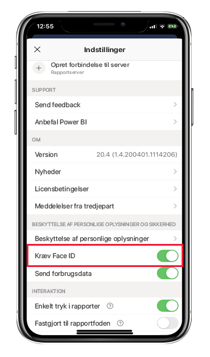
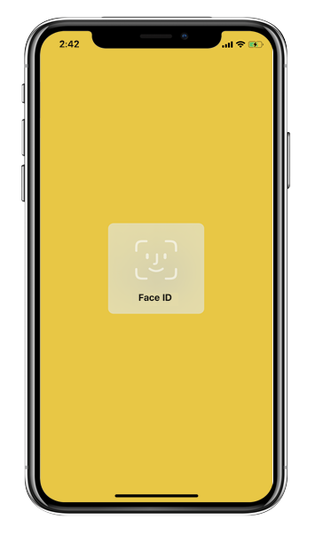
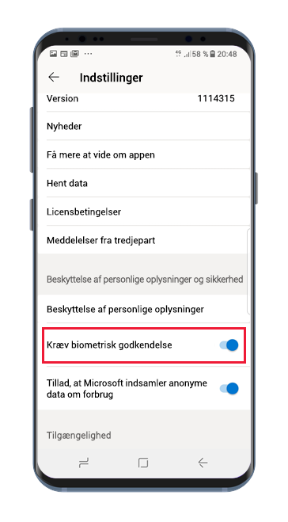
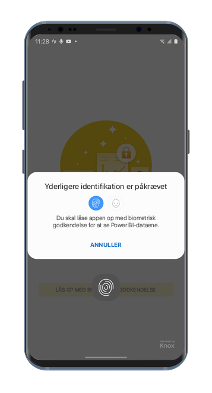

# Beskyt Power BI-app med Face ID, Touch ID, adgangskode eller biometriske data 

I mange tilfælde er de data, der administreres i Power BI fortrolige og skal beskyttes, så kun godkendte brugere har adgang til dem. 

Med Power BI-appsene til iOS og Android kan du beskytte dine data ved at konfigurere yderligere identifikation. Hver gang appen startes eller vises, er identifikation i så fald påkrævet. I iOS betyder det, at der skal angives Face ID, Touch ID eller en adgangskode. I Android betyder det, at der skal angives biometriske data (fingeraftryks-ID).

Gælder for:

|  |  |  |  |
|:--- |:--- |:--- |:--- |
|iPhone-telefoner |iPad-tablets |Android-telefoner |Android-tablets |

## Aktivér Face ID, Touch ID eller adgangskode i iOS

Hvis du vil bruge yderligere identifikation i Power BI-mobilappen til iOS, skal du gå til appindstillingen under **Beskyttelse af personlige oplysninger og sikkerhed**. Du kan se indstillingen til aktivering af Face ID, Touch ID eller adgangskode. De indstillinger, du får vist, afhænger af enhedens funktioner.

Når denne indstilling er aktiveret, bliver du bedt om at angive dit id, før du kan få adgang til appen, hver gang du starter Power BI eller flytter appen fra baggrunden.

Den type id, du bliver bedt om at angive, afhænger af enhedens funktioner. Hvis din enhed understøtter Face ID, skal du bruge Face ID. Hvis den enhed understøtter Touch ID, skal du bruge Touch ID. Hvis ingen af delene understøttes, skal du angive en adgangskode. På billedet nedenfor vises skærmbilledet for Face ID.

## Aktivér biometriske data (fingeraftryks-id) i Android

Hvis du vil bruge yderligere identifikation i Power BI-mobilappen til Android, skal du gå til appindstillingen under **Beskyttelse af personlige oplysninger og sikkerhed**. Du kan se muligheden for at aktivere biometriske data.

Når denne indstilling er aktiveret, bliver du bedt om at angive biometriske data (fingeraftryks-id), før du kan få adgang til appen, hver gang du starter Power BI eller flytter appen fra baggrunden.

På billedet nedenfor vises skærmbilledet for godkendelse med fingeraftryk.

>[!NOTE]
>Hvis du vil bruge indstillingen Kræv biometrisk godkendelse i mobilappen, skal du først konfigurere biometriske data på din Android-enhed. Hvis din enhed ikke understøtter biometriske data, kan du ikke sikre adgangen til dine Power BI-data ved hjælp af denne mobilappindstilling.
>
>Hvis din administrator har [fjernaktiveret sikker adgang](#mdm-enforcement-of-secure-access-to-your-power-bi-mobile-app) for mobilappen, skal du konfigurere biometriske data på enheden for at få adgang til appen, hvis du ikke allerede har gjort det. Hvis din enhed ikke understøtter biometriske data, vil fjernindstillingen ikke påvirke dig. Adgangen til din mobilapp vil fortsat ikke være sikret.

## MDM-håndhævelse af sikker adgang til din Power BI-mobilapp.

Nogle organisationer har politikker for sikkerhed og krav til overholdelse af angivne standarder, der gennemtvinger yderligere identifikation, før du kan få adgang til følsomme virksomhedsdata.

Power BI-appen til iOS gør det muligt for administratorer at styre sikker adgang til mobilappen ved at pushe konfigurationsindstillingerne for appen fra Microsoft Intune og andre MDM-løsninger (Mobile Device Management). Administratorer kan bruge appbeskyttelsespolitikken til at aktivere denne indstilling for alle brugere eller en gruppe af brugere. Se [Brug af MDM til at fjernkonfigurere Power BI-mobilappen](mobile-app-configuration.md#data-protection-settings-ios-and-android) for at få flere oplysninger.

## Næste trin
* [Brug af MDM til at fjernkonfigurere Power BI-mobilappen](mobile-app-configuration.md)
