# <a name="using-oauth-to-connect-to-power-bi-report-server-and-ssrs"></a>Brug OAuth til at oprette forbindelse til Power BI-rapportserver og SSRS

Du kan bruge OAuth til at oprette forbindelse til Power BI-rapportserver og Reporting Services for at få vist mobilrapporter eller KPI'er. Få mere at vide om, hvordan du konfigurerer dit miljø til at understøtte OAuth-godkendelse med Power BI-mobilappen for at oprette forbindelse til Power BI-rapportserver og SQL Server Reporting Services 2016 eller nyere.

Se, hvordan Adam opretter forbindelse fra Power BI Mobile til SSRS ved hjælp af OAuth:


<iframe width="560" height="350" src="https://www.youtube.com/embed/okzPAI2uUek" frameborder="0" allowfullscreen></iframe>


> [!NOTE]
> Visning af Power BI-rapporter, der hostes på Power BI-rapportserver ved hjælp af WAP-godkendelse, understøttes nu til iOS- og Android-apps.

## <a name="requirements"></a>Krav

Windows Server 2016 er påkrævet til WAP- (Web Application Proxy) og ADFS-serverne (Active Directory Federation Services). Du behøver ikke at have et Windows 2016-domæne på funktionsniveau.

## <a name="domain-name-services-dns-configuration"></a>Konfiguration af DNS (Domain Name Services)

Den offentlige URL-adresse er den adresse, som Power BI-mobilappen opretter forbindelse til. Den kan f.eks. se ud som følger.

```https
https://reports.contoso.com
```

Din DNS-post for **rapporter** peger på den offentlige IP-adresse for WAP-serveren (Web Application Proxy). Du skal også konfigurere en offentlig DNS-post for din ADFS-server. Du kan f.eks. konfigurere ADFS-serveren med følgende URL-adresse.

```https
https://fs.contoso.com
```

Din DNS-post for **fs** peger på den offentlige IP-adresse for WAP-serveren (Web Application Proxy), da den udgives som en del af WAP-programmet.

## <a name="certificates"></a>Certifikater

Du skal konfigurere certifikater for både WAP-programmet og ADFS-serveren. Begge disse certifikater skal være en del af et gyldigt nøglecenter, som kan genkendes af dine mobilenheder.

## <a name="reporting-services-configuration"></a>Konfiguration af Reporting Services

Der er ikke meget, der skal konfigureres på Reporting Services-siden. Vi skal bare sikre os, at vi har et gyldigt navn på tjenestens hovednavn for at kunne aktivere den korrekte Kerberos-godkendelse, og at Reporting Services-serveren er aktiveret til forhandling af godkendelse.

### <a name="service-principal-name-spn"></a>Tjenestens hovednavn

Tjenestens hovednavn er et entydigt id for en tjeneste, der bruger Kerberos-godkendelse. Du skal sikre, at du har et korrekt HTTP-hovednavn for tjenesten for rapportserveren.

Du kan finde oplysninger om, hvordan du konfigurerer det korrekte hovednavn for tjenesten for rapportserveren, under [Registrer et hovednavn for tjenesten for en rapportserver](/sql/reporting-services/report-server/register-a-service-principal-name-spn-for-a-report-server).

### <a name="enabling-negotiate-authentication"></a>Aktivering af forhandling af godkendelse

Hvis du vil gøre det muligt, at en rapportserver kan bruge Kerberos-godkendelse, skal du konfigurere, at godkendelsestypen for rapportserveren er RSWindowsNegotiate. Du gør dette i filen rsreportserver.config.

```xml
<AuthenticationTypes>  
    <RSWindowsNegotiate />  
    <RSWindowsKerberos />  
    <RSWindowsNTLM />  
</AuthenticationTypes>
```

Du kan finde flere oplysninger under [Rediger en Reporting Services-konfigurationsfil](/sql/reporting-services/report-server/modify-a-reporting-services-configuration-file-rsreportserver-config) og [Konfigurer Windows-godkendelse på en rapportserver](/sql/reporting-services/security/configure-windows-authentication-on-the-report-server).

## <a name="active-directory-federation-services-adfs-configuration"></a>Konfigurationen af ADFS (Active Directory Federation Services)

Du skal konfigurere ADFS på en Windows 2016-server i dit miljø. Konfigurationen kan udføres via Server Manager og ved at vælge Tilføj roller og funktioner under Administrer. Du kan finde flere oplysninger under [Active Directory Federation Services](https://technet.microsoft.com/windows-server-docs/identity/active-directory-federation-services).

### <a name="create-an-application-group"></a>Opret en programgruppe

På ADFS Management-skærmen skal du oprette en programgruppe til Reporting Services, som indeholder oplysninger til appsene til Power BI – Mobil.

Du kan oprette programgruppen vha. følgende trin.

1. I ADFS Management-appen skal du højreklikke på **Programgrupper** og vælge **Tilføj programgruppe…**

   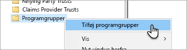

2. I guiden Tilføj programgruppe skal du angive et **navn** for programgruppen og vælge **Oprindeligt program, der har adgang til en web-API**.

   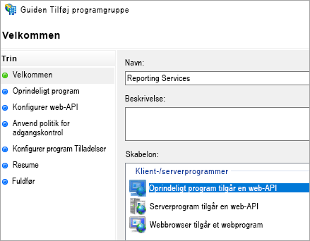

3. Vælg **Næste**.

4. Angiv et **navn** for det program, du tilføjer. 

5. Mens **klient-id'et** oprettes automatisk, skal du angive *484d54fc-b481-4eee-9505-0258a1913020* for både iOS og Android.

6. Du skal tilføje følgende **URL-adresser til omdirigering**:

   **Poster til Power BI – Mobil – iOS:**  
   msauth://code/mspbi-adal://com.microsoft.powerbimobile  
   msauth://code/mspbi-adalms://com.microsoft.powerbimobilems  
   mspbi-adal://com.microsoft.powerbimobile  
   mspbi-adalms://com.microsoft.powerbimobilems

   **Der skal kun bruges følgende trin til Android-apps:**  
   urn:ietf:wg:oauth:2.0:oob

   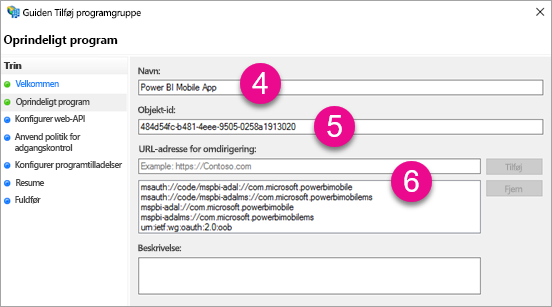
7. Vælg **Næste**.

8. Angiv URL-adressen til rapportserveren. Dette er den eksterne URL-adresse, der bruges af din Web Application Proxy. Den skal være i følgende format.

   > [!NOTE]
   > I denne URL-adresse er der forskel på store og små bogstaver!

   *https://< URL-adresse til rapportserver >/*

   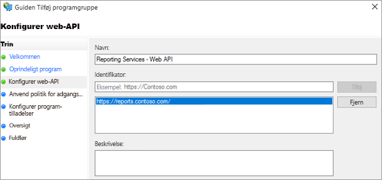
9. Vælg **Næste**.

10. Vælg den **adgangskontrolpolitik**, der passer til organisationens behov.

    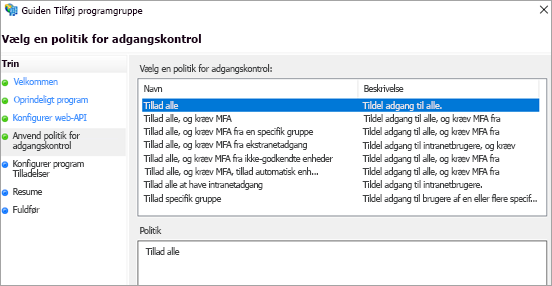

11. Vælg **Næste**.

12. Vælg **Næste**.

13. Vælg **Næste**.

14. Vælg **Luk**.

Når du er færdig, kan du se, at egenskaberne for programgruppen ligner følgende.

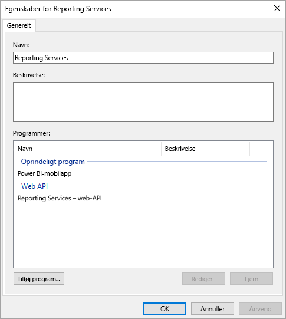

## <a name="web-application-proxy-wap-configuration"></a>Konfiguration af WAP (Web Application Proxy)

Du skal aktivere Windows-rollen Web Application Proxy (rolle) på en server i dit miljø. Det skal ske på en Windows 2016-server. Du kan finde flere oplysninger under [Web Application Proxy i Windows Server 2016](https://technet.microsoft.com/windows-server-docs/identity/web-application-proxy/web-application-proxy-windows-server) og [Publicering af programmer vha. ADFS-forhåndsgodkendelse](https://technet.microsoft.com/windows-server-docs/identity/web-application-proxy/publishing-applications-using-ad-fs-preauthentication#a-namebkmk14apublish-an-application-that-uses-oauth2-such-as-a-windows-store-app).

### <a name="constrained-delegation-configuration"></a>Konfiguration af begrænset delegering

Hvis du vil skifte fra OAuth-godkendelse til Windows-godkendelse, skal du bruge begrænset delegering med protokolovergang. Dette er en del af Kerberos-konfigurationen. Vi har allerede defineret tjenestens hovednavn for Reporting Services i Reporting Services-konfigurationen.

Vi skal konfigurere begrænset delegering på WAP-serverens maskinkonti i Active Directory. Du skal muligvis samarbejde med en domæneadministrator, hvis du ikke har adgang til Active Directory.

Du skal udføre følgende trin for at konfigurere begrænset delegering.

1. Start **Active Directory-brugere og -computere** på en computer, hvor Active Directory-værktøjerne er installeret.

2. Find maskinkontoen for WAP-serveren. Den findes som standard i computerens objektbeholder.

3. Højreklik på WAP-serveren, og gå til **Egenskaber**.

4. Vælg fanen **Delegering**.

5. Vælg **Hav kun tillid til denne computer i forbindelse med delegering til de angivne tjenester**, og vælg derefter **Brug en vilkårlig godkendelsesprotokol**.

   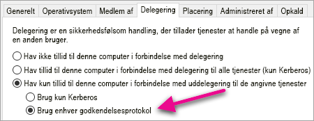

   Dermed konfigureres begrænset delegering for computerkontoen for denne WAP-server. Derefter skal vi angive de tjenester, som denne maskine har tilladelse til at delegere til.

6. Vælg **Tilføj...** under feltet med tjenestser.

   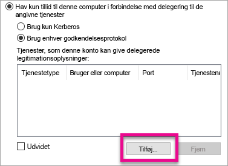

7. Vælg **Brugere eller computere...**

8. Angiv den tjenestekonto, du bruger til Reporting Services. Denne konto er den konto, du føjede tjenestens hovednavn til under konfigurationen af Reporting Services.

9. Vælg tjenestens hovednavn for Reporting Services, og vælg derefter **OK**.

   > [!NOTE]
   > Du får muligvis kun vist NetBIOS SPN. Tjenestens hovednavn for både NetBIOS og FQDN vælges faktisk, hvis de begge findes.

   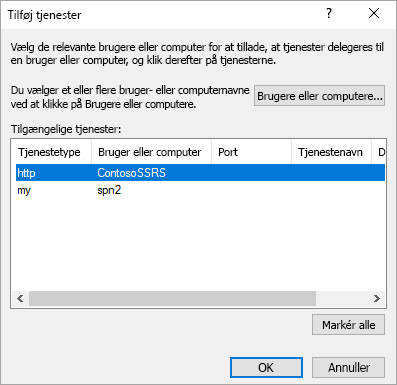

10. Resultatet ser ud som følger, når afkrydsningsfeltet **Udvidet** er markeret.

    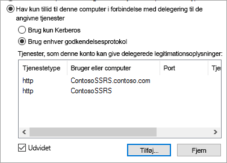

11. Vælg **OK**.

### <a name="add-wap-application"></a>Tilføj WAP-program

Mens du kan udgive programmer i administrationskonsollen for rapportadgang, opretter vi programmet via PowerShell. Her er kommandoen, der skal bruges i forbindelse med tilføjelse af programmet.

```powershell
Add-WebApplicationProxyApplication -Name "Contoso Reports" -ExternalPreauthentication ADFS -ExternalUrl https://reports.contoso.com/ -ExternalCertificateThumbprint "0ff79c75a725e6f67e3e2db55bdb103efc9acb12" -BackendServerUrl https://ContosoSSRS/ -ADFSRelyingPartyName "Reporting Services - Web API" -BackendServerAuthenticationSPN "http/ContosoSSRS.contoso.com" -UseOAuthAuthentication
```

| Parameter | Kommentarer |
| --- | --- |
| **ADFSRelyingPartyName** |Det Web API-navn, du oprettede som en del af Programgruppen i ADFS. |
| **ExternalCertificateThumbprint** |Det certifikat, der skal bruges til eksterne brugere. Det er vigtigt, at certifikatet er gyldigt på mobilenheder og stammer fra et nøglecenter, der er tillid til. |
| **BackendServerUrl** |URL-adressen til rapportserveren fra WAP-serveren. Hvis WAP-serveren er på et perimeternetværk, skal du bruge et fuldt domænenavn. Kontrollér, at du kan få forbindelse til denne URL-adresse via webbrowseren på WAP-serveren. |
| **BackendServerAuthenticationSPN** |Det hovednavn for tjenesten, du oprettede som en del af konfigurationen af Reporting Services. |

### <a name="setting-integrated-authentication-for-the-wap-application"></a>Angivelse af integreret godkendelse for WAP-programmet

Når du har tilføjet WAP-programmet, skal du angive, at BackendServerAuthenticationMode skal bruge IntegratedWindowsAuthentication. Du skal bruge id'et fra WAP-programmet for at angive det.

```powershell
Get-WebApplicationProxyApplication "Contoso Reports" | fl
```


Kør følgende kommando for at angive BackendServerAuthenticationMode vha. id'et for WAP-programmet.

```powershell
Set-WebApplicationProxyApplication -id 30198C7F-DDE4-0D82-E654-D369A47B1EE5 -BackendServerAuthenticationMode IntegratedWindowsAuthentication
```


## <a name="connecting-with-the-power-bi-mobile-app"></a>Oprettelse af forbindelse vha. Power BI-mobilappen

I Power BI-mobilappen skal du oprette forbindelse til forekomsten af Reporting Services. Det gør du ved at angive den **eksterne URL-adresse** for WAP-programmet.

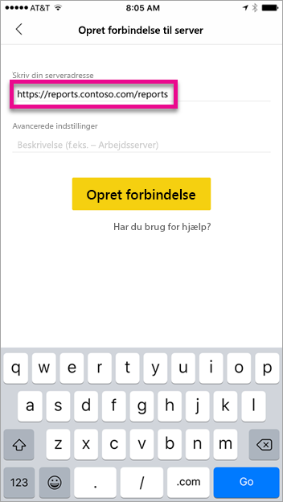

Når du vælger **Opret forbindelse**, bliver du dirigeret til ADFS-logonsiden. Angiv de gyldige legitimationsoplysninger for dit domæne.

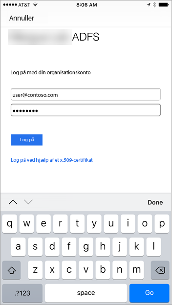

Når du har valgt **Log på**, kan du se elementerne fra Reporting Services-serveren.

## <a name="multi-factor-authentication"></a>Multifaktorgodkendelse

Du kan aktivere multifaktorgodkendelse for at aktivere yderligere sikkerhed for dit miljø. Du kan få mere at vide under [Konfigurer ADFS 2016 og Azure MFA](https://technet.microsoft.com/windows-server-docs/identity/ad-fs/operations/configure-ad-fs-2016-and-azure-mfa).

## <a name="troubleshooting"></a>Fejlfinding

### <a name="you-receive-the-error-failed-to-login-to-ssrs-server"></a>Du får vist fejlen "Der kunne ikke logges på SSRS-serveren"

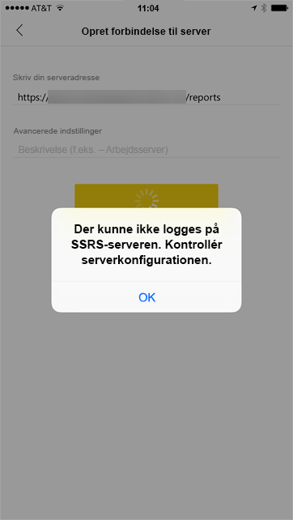

Du kan konfigurere, at [Fiddler](https://www.telerik.com/fiddler) skal fungere som en proxy for dine mobilenheder, for at se, hvor langt anmodningen er kommet. Hvis du vil aktivere en Fiddler-proxy for din telefon, skal du konfigurere [CertMaker til iOS og Android](https://www.telerik.com/fiddler/add-ons) på den computer, der kører Fiddler. Tilføjelsesprogrammet er fra Telerik til Fiddler.

Hvis det lykkes at logge på ved hjælp af Fiddler, oplever du måske et certifikatproblem med enten WAP-programmet eller ADFS-serveren. 

## <a name="next-steps"></a>De næste trin

[Registrer en hovednavn for tjenesten for en rapportserver](/sql/reporting-services/report-server/register-a-service-principal-name-spn-for-a-report-server)  
[Rediger en Reporting Services-konfigurationsfil](/sql/reporting-services/report-server/modify-a-reporting-services-configuration-file-rsreportserver-config)  
[Konfigurer Windows-godkendelse på en rapportserver](/sql/reporting-services/security/configure-windows-authentication-on-the-report-server)  
[Active Directory Federation Services](https://technet.microsoft.com/windows-server-docs/identity/active-directory-federation-services)  
[Web Application Proxy i Windows Server 2016](https://technet.microsoft.com/windows-server-docs/identity/web-application-proxy/web-application-proxy-windows-server)  
[Udgivelse af programmer vha. ADFS-forhåndsgodkendelse](https://technet.microsoft.com/windows-server-docs/identity/web-application-proxy/publishing-applications-using-ad-fs-preauthentication#a-namebkmk14apublish-an-application-that-uses-oauth2-such-as-a-windows-store-app)  
[Konfigurer ADFS 2016 og Azure MFA](https://technet.microsoft.com/windows-server-docs/identity/ad-fs/operations/configure-ad-fs-2016-and-azure-mfa)  
Har du flere spørgsmål? [Prøv at spørge Power BI-community'et](https://community.powerbi.com/)
