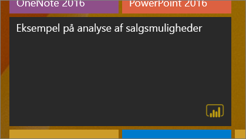
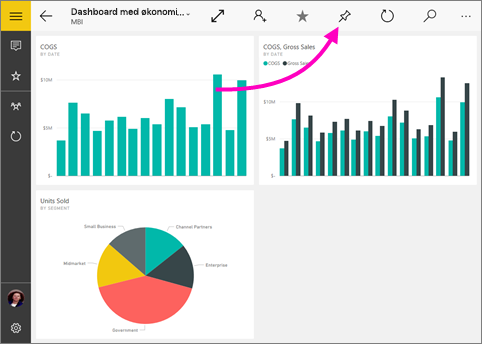
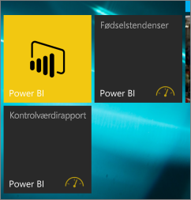

# Fastgør dashboard til din startskærm i Windows 10 fra Power BI-mobilappen
Du kan fastgøre Power BI-dashboards til startskærmen i Windows fra Power BI-mobilappen til Windows 10. Når du trykker på feltet på startskærmen, åbner dashboardet i Power BI-mobilappen til Windows 10.

>[!NOTE]
>Understøttelse af Power BI-mobilapp til **telefoner, der bruger Windows 10 mobile**, ophører den 16. marts 2021. [Få mere at vide](https://go.microsoft.com/fwlink/?linkid=2121400)

## Fastgør et dashboard til startskærmen som et felt
1. Åbn et dashboard.
2. Tryk på **Fastgør til start** .
   
   
   
   Gå til din enheds startskærm for at se feltet.
   
   

## Næste trin
* [Download Power BI-mobilappen til Windows 10](https://go.microsoft.com/fwlink/?LinkID=526478) fra Windows Store  
* [Kom i gang med Power BI-mobilappen til Windows 10](mobile-windows-10-phone-app-get-started.md)  
* [Hvad er Power BI?](../../fundamentals/power-bi-overview.md)
* Har du spørgsmål? [Prøv at spørge Power BI-community'et](https://community.powerbi.com/)
