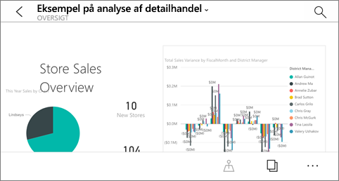
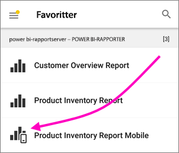
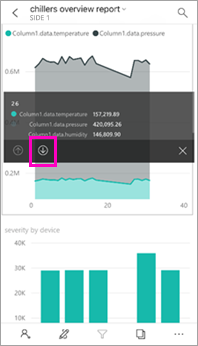
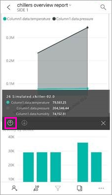
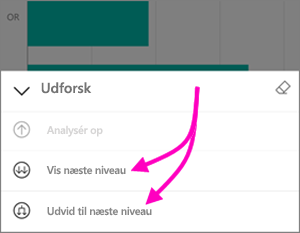
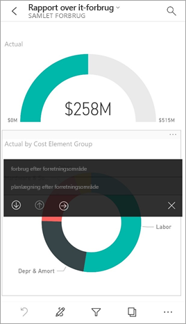
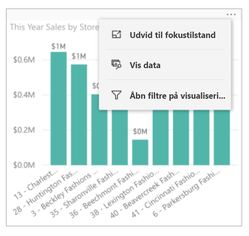
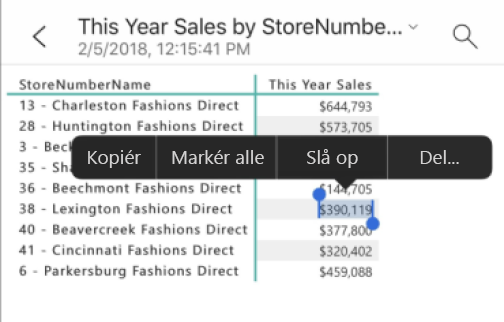

# Udforsk rapporter i Power BI-mobilappsene
Gælder for:

|  |  |  |  |  |
|:--- |:--- |:--- |:--- |:--- |
| iPhone-telefoner |iPad-tablets |Android-telefoner |Android-tablets |Windows 10-enheder |

En Power BI-rapport er en interaktiv visning af dine data, hvor visualiseringer repræsenterer forskellige resultater og indsigter fra disse data. At få vist rapporter i Power BI-mobilapps er det sidste trin i en proces med tre trin.

1. [Opret rapporter i Power BI Desktop](../../desktop-report-view.md). Du kan endda [optimere en rapport til telefoner](mobile-apps-view-phone-report.md) i Power BI Desktop. 
2. Publicer disse rapporter i Power BI-tjenesten [(https://powerbi.com)](https://powerbi.com) eller [Power BI-rapportserver](../../report-server/get-started.md).  
3. Derefter kan du interagere med rapporterne i Power BI-mobilappsene.

## Åbn en Power BI-rapport i mobilappen
Power BI-rapporter er gemt på forskellige steder i mobilappen, afhængigt af hvor du har fået dem. De kan være placeret under Apps, Delt med mig, Arbejdsområder(herunder Mit arbejdsområde) eller på en rapportserver. Nogle gange skal du gennem et relateret dashboard for at komme til en rapport. Andre gange vises de på en liste.

* Tryk på de tre prikker (...) i øverste højre hjørne af et felt på et dashboard, og vælg **Åbn rapport**.
  
  
  
  Det er ikke alle felter, der kan åbnes i en rapport. De felter, der er oprettet ved at stille spørgsmål i feltet Spørgsmål og svar, kan for eksempel ikke åbnes i en rapport, når du trykker på dem. 
  
  På en telefon åbnes rapporten i liggende format, medmindre den er [optimeret til visning på en telefon](mobile-reports-in-the-mobile-apps.md#view-reports-optimized-for-phones).
  
  

## Vis rapporter, der er optimeret til telefoner
Den, der opretter en rapport i Power BI, kan oprette et rapportlayout, som er specifikt optimeret til telefoner. Rapportsider optimeret til telefoner har supplerende funktionalitet: Du kan f.eks. analysere og sortere i visuals, og du kan få adgang til de [filtre, som rapportens forfatter har føjet til rapportsiden](mobile-apps-view-phone-report.md#filter-the-report-page-on-a-phone). Rapporten åbnes på din telefon filtreret efter de værdier, der filtreres efter i rapporten på internettet, sammen med en meddelelse om, at der er aktive filtre på siden. Du kan ændre filtrene på telefonen.

Hvis en rapport er optimeret til telefoner, vises den med et særligt ikon på listen over rapporter :

Når du får vist rapporten på en telefon, åbnes den i stående format.

 En rapport kan have flere sider, hvor nogle er optimeret til telefoner, mens andre sider ikke er. Hvis det er tilfældet, skifter visningen fra stående til liggende format på de enkelte sider, når du bladrer i rapporten.

Læs mere om [rapporter, der er optimeret til visning på telefoner](mobile-apps-view-phone-report.md).

## Brug udsnit til at filtrere en rapport
Når du opretter en rapport i Power BI Desktop eller Power BI-tjenesten, bør du overveje at [føje udsnit til en rapportside](../../visuals/power-bi-visualization-slicers.md). Du og dine kolleger kan bruge udsnittene til at filtrere siden i en browser og i mobilapps. Når du får vist rapporten på en telefon, kan du se og interagere med udsnittene i liggende tilstand og på en side, der er optimeret til telefonens lodrette tilstand. Hvis du vælger en værdi i et udsnitsværktøj eller et filter i browseren, vælges værdien også, når du får vist siden i mobilappen. Du får vist en meddelelse om, at der er aktive filtre på siden.  

* Når du vælger en værdi i et udsnit på rapportsiden, filtreres de andre visualiseringer på siden.
  
  
  
  I denne illustration filtrerer udsnittet søjlediagrammet, så der kun vises værdier for juli måned.

## Krydsfiltrer og fremhæv en rapport
Når du vælger en værdi i en visualisering, filtreres de øvrige visualiseringer ikke. I stedet fremhæves de relaterede værdier i de andre visualiseringer.

* Tryk på en værdi i en visualisering.
  
  
  
  Hvis du trykker på kolonnen Stor i en visualisering, fremhæves de relaterede værdier i andre visualiseringer. 

## Sortér en visualisering på en iPad eller en tablet
* Tryk på diagrammet, tryk på de tre prikker (**...**), og tryk på feltnavnet.
  
   
* Hvis du vil vende sorteringsrækkefølgen, skal du trykke på de tre prikker (**...**) igen og derefter trykke på det samme feltnavn igen.

## Analysér ned og op i en visualisering
Hvis forfatteren til en rapport har gjort det muligt at analysere ned i en visualisering, kan du gør det for at se de værdier, som er brugt til en del af den. Du kan [tilføje detailudledning i en visualisering](../end-user-drill.md) i Power BI Desktop eller Power BI-tjenesten. 

* Tryk på og hold ned på et datapunkt i en visualisering for at få vist værktøjstippet. Hvis du kan analysere ned, findes der pile nederst i værktøjstippet, som du kan trykke på. 
  
  

* Hvis du vil have vist færre detaljer igen, skal du trykke på pil op i værktøjstippet.
  
  

* Du kan også analysere ned i alle datapunkterne i visualiseringen. Åbn den i fokustilstand, tryk på ikonet Udforsk, og vælg derefter Vis alle næste niveauer. Du kan også udvide, så du får vist det nuværende og næste niveau.

   

## Analysér ned fra én side til en anden

Når der er mulighed for *detaljeadgang*, og du trykker på en bestemt del af en visualisering, føres du til en anden side i rapporten, der er filtreret, så den værdi, du har klikket på, vises. En forfatter af en rapport kan angive en eller flere muligheder for detaljeadgang, som hver især fører dig til en anden side. Hvis det er tilfældet, kan du vælge, hvilken mulighed du vil. I eksemplet nedenfor kan du vælge mellem at analysere ned til **forbrug pr. forretningsområde** eller **planlægning pr. forretningsområde**, når du trykker på værdien i måleren.

Når du analyserer ned, kan du bruge knappen Tilbage til at komme tilbage til den forrige rapportside.

Læs om, hvordan du [tilføjer detaljeadgang i Power BI Desktop](../../desktop-drillthrough.md).

## Vis data, og kopiér værdier

Du kan få vist de underliggende data for en visualisering ved at vælge menuen Indstillinger vha. ellipsen (**...** ) i øverste højre hjørne af en visualisering i en telefonrapport og derefter vælge **Vis data**.

Hvis du trykker længe på en celle i tabellen, vises den oprindelige menu for markering og kopiering, så du kan vælge at kopiere dataene i tabellen (eller hele tabellen).

## Næste trin
* [Få vist og interager med Power BI-rapporter, der er optimeret til din telefon](mobile-apps-view-phone-report.md)
* [Opret en version af en rapport, der er optimeret til telefoner](../../desktop-create-phone-report.md)
* Har du spørgsmål? [Prøv at spørge Power BI-community'et](http://community.powerbi.com/)

