# Indstil databeskeder i Power BI-mobilapps
Gælder for:

|  |  |  |  |  |
|:--- |:--- |:--- |:--- |:--- |
| iPhones |iPad-tablets |Android-telefoner |Android-tablets |Windows 10-enheder |

Du kan indstille beskeder på dashboards i Power BI-mobilapps og i Power BI-tjenesten. Beskeder informerer dig, når dataene på dine dashboards ændres ud over de grænser, du har angivet. Du kan bruge beskeder med de felter, der indeholder et enkelt tal, for eksempel kort og målere, men ikke med data, der streames. Du kan indstille databeskeder på din mobilenhed og få dem vist i Power BI-tjenesten og omvendt. Du kan kun se de databeskeder, du indstiller, også selvom du deler et dashboard eller et øjebliksbillede af et felt.

Du kan angive beskeder på felter, hvis du har en licens til Power BI Pro, eller hvis det delte dashboard er i en Premium-kapacitet. 

> [!WARNING]
> Datadrevne beskeder indeholder oplysninger om dine data. Hvis din enhed bliver stjålet, anbefaler vi, at du går til Power BI-tjenesten og slår alle regler for datadrevne beskeder fra. 
> 
> Få mere at vide om at [administrere databeskeder i Power BI-tjenesten](../../service-set-data-alerts.md).
> 
> 

## Databeskeder på en iPhone eller iPad
### Indstil en besked på en iPhone eller iPad
1. Tryk på et tal- eller et målerfelt på et dashboard for at åbne det i Fokustilstand.  
   
   
2. Tryk på klokkeikonet  for at tilføje en besked.  
3. Tryk på **Tilføj regel for vigtig besked**.
   
   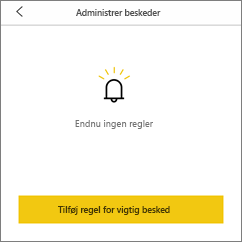
4. Du kan vælge at modtage beskeder over eller under en værdi og angive værdien.
   
   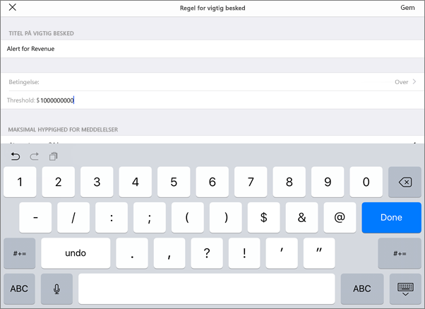
5. Beslut, om du vil modtage besked for hver time eller hver dag, og angiv, om du også vil have tilsendt en mail, når du får en besked.
   
   > [!NOTE]
   > Du modtager ikke beskeder hver time eller hver dag, medmindre dataene rent faktisk opdateres inden for det tidsrum.
   > 
   > 
6. Du kan også ændrer titlen for beskeden.
7. Tryk på **Gem**.
8. En enkelt flise kan have beskeder for værdier både over og under tærskelværdier. Tryk på **Tilføj regel for vigtig besked** i **Administrer beskeder**.
   
   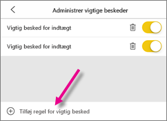

### Administrer beskeder på din iPhone eller iPad
Du kan administrere individuelle beskeder på din mobilenhed eller [administrere alle dine beskeder i Power BI-tjenesten](../../service-set-data-alerts.md).

1. Tryk på et tal- eller målerfelt på et dashboard, som der er oprettet en besked for.  
   
   
2. Tryk på klokkeikonet .  
3. Tryk på navnet på beskeden for at redigere den, tryk på skyderen for at slå mailbeskeder fra, eller tryk på skraldespanden for at slette beskeden.
   
    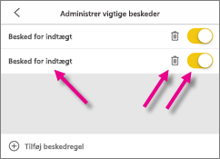

## Databeskeder på en Android-enhed
### Indstil en besked på en Android-enhed
1. Tryk på et tal- eller målerfelt på et Power BI-dashboard for at åbne det.  
2. Tryk på klokkeikonet  for at tilføje en besked.  
   
   
3. Tryk på plusikonet (+).
   
   
4. Du kan vælge at modtage beskeder over og under en værdi, og du kan skrive værdien.
   
   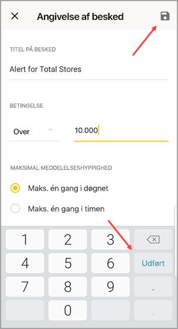
5. Tryk på **Udført**.
6. Beslut, om du vil modtage besked for hver time eller hver dag, og angiv, om du også vil have tilsendt en mail, når du får en besked.
   
   > [!NOTE]
   > Du modtager ikke beskeder hver time eller hver dag, medmindre dataene rent faktisk opdateres inden for det tidsrum.
   > 
   > 
7. Du kan også ændrer titlen for beskeden.
8. Tryk på **Gem**.

### Administrer beskeder på en Android-enhed
Du kan administrere individuelle beskeder i din Power BI-mobilapp, eller du kan [administrere alle dine beskeder i Power BI-tjenesten](../../service-set-data-alerts.md).

1. Tryk på et kort- eller målerfelt på et dashboard, som der er oprettet en besked for.  
2. Tryk på det udfyldte klokkeikon .  
3. Tryk på beskeden for at ændre en værdi, eller slå den fra.
   
    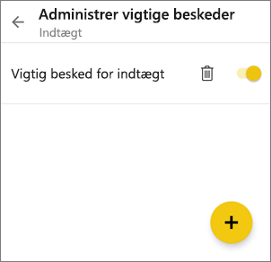
4. Tryk på plusikonet (+) for at tilføje en ekstra besked til samme felt.
5. Hvis du vil slette beskeden, skal du trykke på skraldespandsikonet .

## Databeskeder på en Windows-enhed
### Indstil databeskeder på en Windows-enhed
1. Tryk på et tal- eller målerfelt på et dashboard for at åbne det.  
2. Tryk på klokkeikonet  for at tilføje en besked.  
   
   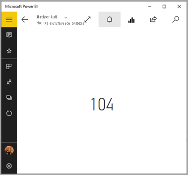
3. Tryk på plusikonet (+).
   
   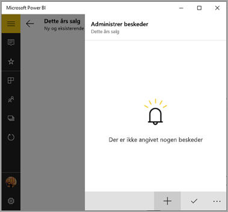
4. Du kan vælge at modtage beskeder over og under en værdi, og du kan skrive værdien.
   
   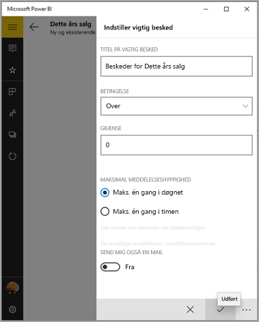
5. Beslut, om du vil modtage besked for hver time eller hver dag, og angiv, om du også vil have tilsendt en mail, når du får en besked.
   
   > [!NOTE]
   > Du modtager ikke beskeder hver time eller hver dag, medmindre dataene rent faktisk opdateres inden for det tidsrum.
   > 
   > 
6. Du kan også ændrer titlen for beskeden.
7. Tryk på fluebenet.
8. En enkelt flise kan have beskeder for værdier både over og under tærskelværdier. Tryk på plustegnet (+) i **Administrer beskeder**.
   
   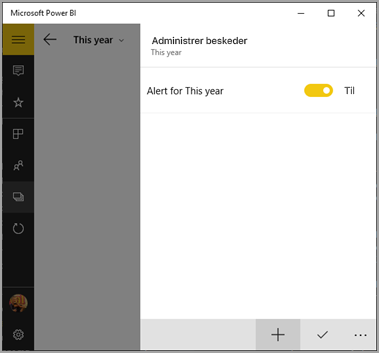

### Administrer beskeder på en Windows-enhed
Du kan administrere individuelle beskeder i din Power BI-mobilapp, eller du kan [administrere alle dine beskeder i Power BI-tjenesten](../../service-set-data-alerts.md).

1. Tryk på et kort- eller målerfelt på et dashboard, som der er oprettet en besked for.  
2. Tryk på klokkeikonet .  
   
   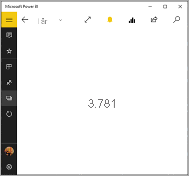
3. Tryk på beskeden for at ændre en værdi, eller slå den fra.
   
    
4. Hvis du vil slette beskeden, skal du højreklikke eller trykke og holde ned på > **Slet**.

## Modtag beskeder
Du modtager beskeder i Power BI [Meddelelsescenter](mobile-apps-notification-center.md) på din mobilenhed eller i Power BI-tjenesten. Det er samme sted, hvor du modtager beskeder om nye dashboards, som en anden har delt med dig.

Datakilder er ofte indstillet til at blive opdateret dagligt, selvom nogle opdateres oftere. Når dataene i dashboardet opdateres, vil der ske flere ting, hvis de sporede data når en af de tærskler, du har angivet.

1. Power BI kontrollerer, om der er gået mere end 1 eller 24 timer (afhænger af den indstilling, du valgte), siden den sidste besked blev sendt.
   
   Hvis dataene overskrider den angivne tærskel, modtager du en besked for hver time eller for hver 24 timer.
2. Hvis du har indstillet beskeden til at sende en mail til dig, modtager du mail i din indbakke.
   
   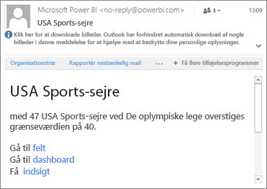
3. Power BI tilføjer en meddelelse i **Meddelelsescenter** og tilføjer et nyt beskedikon på det relevante felt .
4. Tryk på den globale navigationsknap  for at [åbne dit **meddelelsescenter**](mobile-apps-notification-center.md) og se oplysningerne i beskeden.
   
     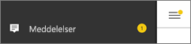 

> [!NOTE]
> Beskeder fungerer kun i forbindelse med opdaterede data. Når data opdateres, kontrolleres det via Power BI, om der er angivet en besked for disse data. Hvis dataene har nået grænsen for en besked, udløses der en besked.
> 
> 

## Tip og fejlfinding
* Beskeder understøttes ikke i øjeblikket for Bing-felter eller kortfelter med målinger for dato/klokkeslæt.
* Beskeder fungerer kun med numeriske data.
* Beskeder fungerer kun i forbindelse med opdaterede data. De fungerer ikke med statiske data.
* Beskeder fungerer ikke med felter, der indeholder data, som streames.

## Næste trin
* [Administrer dine beskeder i Power BI-tjenesten](../../service-set-data-alerts.md)
* [Power BI Mobile Meddelelsescenter](mobile-apps-notification-center.md)
* Har du spørgsmål? [Prøv at spørge Power BI-community'et](https://community.powerbi.com/)

