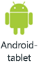
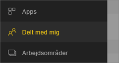
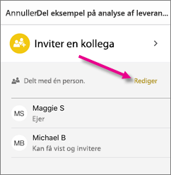
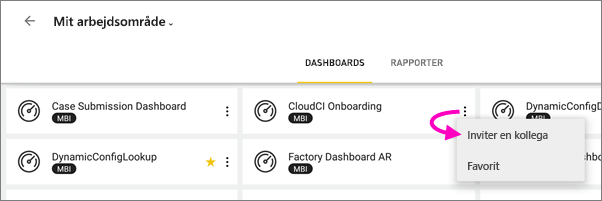
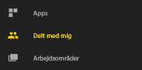
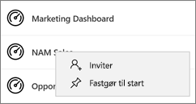
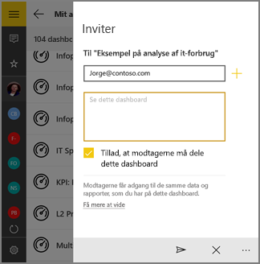

# Del et dashboard eller en rapport fra Power BI-mobilappsene
Gælder for:

|  |  |  |  |  |
|:--- |:--- |:--- |:--- |:--- |
| iPhones |iPad-tablets |Android-telefoner |Android-tablets |Windows 10-enheder |

Med en [Power BI Pro-licens](../../service-features-license-type.md) kan du invitere andre til at få vist dine dashboards og rapporter ved at dele links fra Power BI-mobilappsene. Du kan dele med hvem som helst i eller uden for organisationen, uanset om de har en mailkonto i organisationen eller ej. De skal dog have en Power BI Pro-licens, ellers skal indholdet være i en [Premium-kapacitet](../../service-premium-what-is.md).

Ved hjælp af Power BI-mobilapps til iOS og Android kan du også [anmærke og dele et snapshot af et felt, en rapport eller en visualisering](mobile-annotate-and-share-a-tile-from-the-mobile-apps.md) med andre. 

## Del fra din iPhone
1. Tryk på ikonet **Del**  på handlingslinjen nederst på dashboardet eller rapporten.
   
   
2. Angiv navne, adskilt af kommaer, og en meddelelse, der skal ledsage invitationen.
3. Hvis du vil tillade videredeling, skal indstillingen **Tillad, at modtagerne må videredele** være markeret.
   
   Videredeling gør det muligt for dine kollegaer at sende invitationen via mail til andre i organisationen, enten via internettet eller mobilapps.
5. Tryk på **Send** i øverste højre hjørne.
   
   Modtagerne får en invitation via mail med et direkte link til dashboardet eller rapporten. Invitationen udløber efter én måned. Når de åbner invitationen i en browser eller i Power BI-mobilappen, føjes den til sektionen **Delt med mig** under deres Power BI-konto.
   
   
   
   Læs flere [noter om deling med kolleger](../../service-share-dashboards.md).

### Stop deling fra din iPhone
Du kan kun stoppe med at dele, hvis du er ejer.

1. Tryk på ikonet **Del**  på handlingslinjen nederst på dashboardet eller rapporten.
2. Tryk på **Inviter en kollega**.
   
   Du kan se en liste over kolleger, som du har delt dette dashboard eller denne rapport med, vha. disse udtryk:
   
   * **Kan få vist**: De kan få vist, men kan ikke dele.
   * **Kan få vist og invitere**: De kan få vist og dele med andre kolleger.
1. Tryk på **Rediger**.
   
    
4. Hvis du vil annullere deling, skal du trykke på den røde cirkel ud for et navn og trykke på **Slet**.

## Del fra din iPad
1. Tryk på ikonet **Del**  i øverste højre hjørne af dashboardet eller rapporten.
2. Skriv mailadresser og en meddelelse, der skal ledsage invitationen.
3. Hvis du vil tillade videredeling, skal indstillingen **Tillad, at modtagerne må videredele** være markeret.
   
   Videredeling gør det muligt for dine kollegaer at sende invitationen via mail til andre i organisationen, enten via internettet eller mobilapps. 

4. Tryk på **Send** i øverste højre hjørne.
   
   Modtagerne får en invitation via mail med et direkte link til dashboardet eller rapporten. Invitationen udløber efter én måned. Når de åbner invitationen i en browser eller i Power BI-mobilappen, føjes den til sektionen **Delt med mig** under deres Power BI-konto
   
   
   
   Læs flere [noter om deling med kolleger](../../service-share-dashboards.md).

### Stop deling fra din iPad
Du kan kun stoppe med at dele, hvis du er ejer.

1. Tryk på ikonet **Del**  i øverste højre hjørne af dashboardet eller rapporten.
   
   Du kan se en liste over kolleger, som du har delt dette dashboard eller denne rapport med, vha. disse udtryk:
   
   * **Kan få vist**: De kan få vist, men kan ikke dele.
   * **Kan få vist og invitere**: De kan få vist og dele med andre kolleger.
2. Tryk på **Rediger**.
3. Hvis du vil annullere deling, skal du trykke på den røde cirkel ud for et navn og trykke på **Slet**.

## Del fra din Android-enhed
1. Tryk på ellipsen (...) på startsiden for dashboardet eller rapporten, og tryk på **Inviter en kollega**.
   
   
2. Eller tryk på invitationsikonet på et dashboard eller i en rapport .

    Hvis du ejer dashboardet, kan du se en liste over kolleger, som du har delt dette dashboard eller denne rapport med, vha. disse noter:

    -   **Kan få vist**: De kan få vist, men kan ikke dele.
    -   **Kan få vist og dele igen**: De kan få vist og dele med andre kolleger.

1. Skriv mailadresser og en meddelelse, der skal ledsage dashboardinvitationen. Ellers sendes en standardmeddelelse i Power BI.
2. Hvis du vil tillade videredeling, skal indstillingen **Tillad, at modtagerne må dele dette dashboard** være markeret.
   
   Videredeling gør det muligt for dine kollegaer at sende invitationen via mail til andre i organisationen, enten via browseren eller mobilappsene.
   
1. Tryk på ikonet **Send**  i øverste højre hjørne for at sende mailen.
   
   Modtagerne får en invitation via mail med et direkte link til dashboardet. Invitationen udløber efter én måned. Når de åbner invitationen i en browser eller i Power BI-mobilappen, føjes den til sektionen **Delt med mig** under deres Power BI-konto
   
   
   
   Læs flere [noter om deling af dashboards med kollegaer](../../service-share-dashboards.md).

### Stop deling fra din Android-enhed
Du kan kun stoppe med at dele, hvis du er ejer.

1. Tryk på invitationsikonet i øverste højre hjørne af dashboardet eller rapporten . 
   
   Du kan se en liste over kolleger, som du har delt dette dashboard eller denne rapport med.
2. Hvis du vil stoppe med at dele med en kollega, skal du trykke på **X** ud for et navn \> **Fjern**.

## Del vha. din Windows 10-enhed
1. Tryk på invitationsikonet på et dashboard eller en rapport .
   
   Du kan også højreklikke eller trykke og holde nede, mens du trykker på **Inviter** på startsiden for dashboardet eller rapporten.
   
   
   
   Hvis du ejer dashboardet, kan du se en liste over kollegaer, som du har delt dette dashboard med, vha. disse noter:
   
   **Kan få vist**: De kan få vist, men kan ikke dele.
   
   **Kan få vist og dele igen**: De kan få vist og dele med andre kolleger.
2. Skriv mailadresser og en meddelelse, der skal ledsage invitationen. Ellers sendes en standardmeddelelse i Power BI.
   
   
3. Hvis du vil tillade videredeling, skal indstillingen **Tillad, at modtagerne må videredele** være markeret.
   
   Videredeling gør det muligt for dine kolleger at dele med andre i organisationen, enten via browseren eller mobilappsene.
   
1. Tryk på ikonet **Send** .
   
   Modtagerne får en invitation via mail med et direkte link til dashboardet eller rapporten. Invitationen udløber efter én måned. Når de åbner invitationen i en browser eller i Power BI-mobilappen, føjes den til sektionen **Delt med mig** under deres Power BI-konto
   
   
   
   Læs flere [noter om deling med kolleger](../../service-share-dashboards.md).

## Næste trin
* [Anmærk og del et snapshot af et felt, en rapport eller en visualisering i mobilapps](mobile-annotate-and-share-a-tile-from-the-mobile-apps.md)
* [Del et dashboard eller en rapport i Power BI](../../service-share-dashboards.md)
* Har du spørgsmål? [Prøv at spørge Power BI-community'et](http://community.powerbi.com/)

