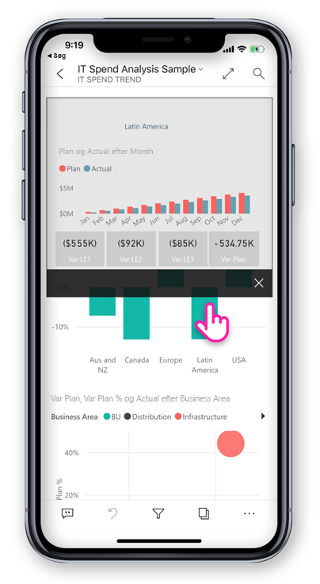
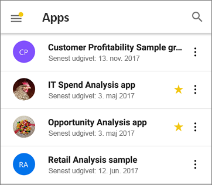
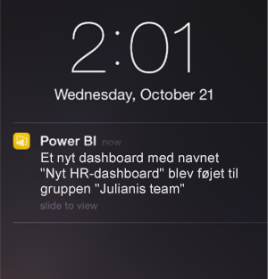

# Hvad er nyt i mobilapps til Power BI
Du kan finde relaterede oplysninger om nyheder under:

* [Power BI-teamets blog til mobilapps](https://powerbi.microsoft.com/blog/tag/mobile/)
* [Nyheder i Power BI Desktop](../../desktop-latest-update.md)  
* [Nyheder i Power BI-tjenesten](../../service-whats-new.md)  

## December 2019

### Fastgjort til rapportfoden og en opdateringsknap – nye oplevelser, der interagerer med rapporter (Android)

Vi har hørt fra vores Android-brugere, at deres oplevelser med rapporter ikke er optimal – at det er svært at bruge rapportfoden, og at træk for at opdatere er for følsom i nogle enheder. Vi har derfor ændret disse funktioner i denne version:
* **Fastgjort rapportfod** – når du åbner en rapport på din telefon, kan du se, at rapportfoden er fastgjort nederst på rapportsiden, hvor den altid er synlig og tilgængelig, uanset hvilke handlinger der er på siden. Det gør det nemt at bruge alle de indstillinger, den indeholder.
* **Knappen Opdater i rapportens sidehoved** – du finder også en opdateringsknap i rapportens sidehoved, så det er nemt at opdatere rapporten nøjagtigt, når du vil.

De brugere, der foretrækker den forrige funktion, kan gendanne disse funktionsmåder med mobilappens nye, udvidede [interaktionsindstillinger](./mobile-app-interaction-settings.md).

IT-administratorer kan desuden [eksternt tilsidesætte de nye standardindstillinger](./mobile-app-configuration.md#interaction-settings-android) på vegne af deres brugere ved hjælp af deres MDM-værktøj med en konfigurationsfil til appen. På denne måde kan alle brugere i en organisation have samme funktionsmåde konfigureret for dem.

> [!NOTE]
> Interaktionsindstillinger for opdateringsknappen og for fastgøring af rapportfoden har i øjeblikket ingen effekt på Rapportserver-rapporter. Dette ændres med udgivelsen af Rapportserver i januar 2020.

### Angiv standardbogmærker fra din mobilapp
Nu kan du angive standardbogmærker for dine rapporter direkte fra din Power BI-mobilapp. Hver gang du åbner en rapport, vil standardbogmærket blive anvendt automatisk. [Få mere at vide!](./mobile-reports-in-the-mobile-apps.md#bookmarks)

### Filtrering efter placering på Android-tablets
Med geo-filtrering kan du filtrere dine rapporter baseret på din aktuelle placering. Denne funktion er nu også tilgængelig i Power BI-appen til Android-tablets. [Få mere at vide!](./mobile-apps-geographic-filtering.md)

## November 2019

### Det nye udseende af Power BI-appen er nu aktiveret som standard
 
Når du åbner appen, aktiveres det nye udseende og navigationslinjerne automatisk, hvilket forenkler den måde, du finder og åbner indhold på. Brug appens [hjemmeside](mobile-apps-home-page.md) som dit udgangspunkt – du får hurtig adgang til dit vigtigste indhold samt et [aktivitetsfeed](mobile-apps-home-page.md#activity-feed), der holder dig ajour med alle dine seneste beskeder, meddelelser og meget mere.

### Se alle dine seneste Power BI-aktiviteter
 
Aktivitetsfeedet hjælper dig med at holde styr på, hvad der sker med dit Power BI-indhold i realtid. Du skal bare gå til appens startside og åbne fanen Aktivitet for at få vist alle dine seneste meddelelser, beskeder, kommentarer, @mentions og meget mere. [Få mere at vide](mobile-apps-home-page.md#activity-feed).

### Brug bogmærker i dine rapporter

Power BI-mobilappen understøtter nu bogmærker, der er oprettet i Power BI. Når du åbner appen, kan du drage fordel af de bogmærker, der er oprettet af rapportforfatteren og eventuelle personlige bogmærker, som du selv har oprettet. [Få mere at vide](mobile-reports-in-the-mobile-apps.md#bookmarks).

## Oktober 2019

### Understøttelse af fjernkonfiguration af rapportserver-adgangsindstillinger i Android

Vi har tilføjet understøttelse af fjernkonfiguration af Power BI-mobilappens rapportserver-adgangsindstillinger i Android. IT-administratorer kan nu bruge deres organisations MDM-værktøj til at fjernkonfigurere disse indstillinger på både iOS- og Android-enheder. Se [Fjernkonfigurer Power BI-mobilappadgang til rapportserveren](https://docs.microsoft.com/power-bi/report-server/configure-powerbi-mobile-apps-remote) for at få flere oplysninger.

### Tværgående detaljeadgang i rapport

Denne måned har vi tilføjet understøttelse af detaljeadgang på tværs af rapporter. Du kan nu trykke på et datapunkt for at få detaljeadgang til andre rapporter og rapportsider. Når du analyserer ned til en destinationsside, filtreres indholdet på den pågældende side på baggrund af indstillingerne for detaljeadgang.

> [!NOTE]
> Detaljeadgang på tværs af rapporter er kun tilgængelig, hvis den blev aktiveret under oprettelse af en rapport. [Få mere at vide om detaljeadgang på tværs af rapporter](https://docs.microsoft.com/power-bi/desktop-cross-report-drill-through).

### Etiketter for datafølsomhed

Nu kan du se følsomhedsetiketter, som indholdsejere har angivet på rapporter, dashboards, datasæt og dataflow for at klassificere dataenes følsomhed. Følsomhedsetiketter bestemmer, hvordan indhold kan deles med andre brugere. [Få mere at vide om etiketter for datafølsomhed i Power BI](https://docs.microsoft.com/power-bi/admin/service-security-data-protection-overview).

### Understøttelse af brugerdefineret appnavigation (Windows)

Understøttelse af brugerdefineret appnavigation er nu blevet tilføjet til Windows-enheder ud over iOS og Android (se [septembers nyheder](#september-2019)).

## September 2019

### Understøttelse af navigation i en brugerdefineret app (iOS og Android)

Vi har tilføjet understøttelse af navigation i en brugerdefineret app. Når du åbner en app i Power BI – Mobil nu, er den brugerdefinerede navigationsoplevelse, der er skabt af appens forfatter, tilgængelig. Navigation i en app kan organiseres efter indhold og kan indeholde nye elementer, f.eks. links og afsnit, der kan skjules.
Få mere at vide om [brugerdefineret navigation](https://powerbi.microsoft.com/blog/designing-custom-navigation-for-power-bi-apps-is-now-available/).

## August 2019

### Introduktion af det nye udseende af Power BI – Mobil (prøveversion) (iOS og Android)

Vi har opdateret vores app og introduceret nye oplevelser, hvor vi har tilføjet en hjemmeside, der giver hurtig adgang til dit mest brugte indhold, samt nye navigationsruder, der giver dig en nem måde at navigere i appen på. Med de nye og opdaterede oplevelser er det nu hurtigere og nemmere at finde det, du har brug for, når du har brug for det.
Da det nye udseende er en prøveversion, skal du slå det til for at nyde godt af det.
Læs mere om [det nye udseende af Power BI – Mobil](https://powerbi.microsoft.com/blog/introducing-power-bi-mobile-apps-new-look-preview/).

### Sikker adgang med Azure Active Directory-proxyprogram (AD) (iOS og Android)

Vi har indgået partnerskab med Azure Active Directory-teamet om at integrere Power BI-mobilapps med en AAD-programproxy (Azure Active Directory). Med denne konfiguration kan du oprette forbindelse til rapportserveren, der er hostet inden for virksomhedsgrænserne, fra appen Power BI – Mobil, uden at det er nødvendigt at konfigurere kompleks konfiguration i det lokale miljø. Læs mere om [Power BI-mobil og Azure AD Application Proxy-integration](https://powerbi.microsoft.com/blog/access-on-prem-report-server-from-your-power-bi-mobile-app-with-azure-active-directory-application-proxy/). Få mere at vide om, [hvordan du konfigurerer Azure AD Application Proxy og Power BI](https://docs.microsoft.com/azure/active-directory/manage-apps/application-proxy-integrate-with-power-bi).

## Juli 2019

### Værktøjstip for rapportside

Værktøjstip til rapportsider understøttes nu, når du får vist rapporter i mobilapps. Du skal bare trykke på en visualisering, der har et værktøjstip til rapporten tilknyttet, og holde den nede, så bliver det vist.  

 
> [!NOTE]
> Værktøjstip til rapporter understøttes for enheder, der har en størrelse på mere end 640 pixels og et billede på 320. Mindre enheder bruger standardværktøjstip.

## Juni 2019

### Stregkodescanning er nu tilgængelig på Android
Nu kan du bruge din Power BI-app på Android (telefon og tablet) til at scanne stregkoder, der er trykt på produkterne eller findes på hylderne på dit lager, for at vise relaterede Power BI-rapporter, der er filtreret efter den scannede værdi. Mere om [filtrering af dine data med stregkoder](mobile-apps-scan-barcode-iphone.md).

### Understøttende PBIX-rapporter, der hostes i PBI-RS via ADFS-konfiguration (iOS, Android)

Power BI-rapporter (PBIX), der hostes i PBI-RS via ADFS-konfiguration, kan nu også tilgås fra Power BI-mobilapps.

## Maj 2019

### Understøttelse af Siri-tastaturgenveje (iOS)
Brugerne kan oprette Siri-genveje til deres Power BI-rapporter og -dashboards og derefter åbne dem direkte via den stemmestyrede grænseflade i Siri. [Læs, hvordan du bruger Siri-genveje i Power BI iOS-appen](https://powerbi.microsoft.com/blog/introducing-siri-integration-with-power-bi-mobile-ios-app-preview/).

### Enhedssøgning (iOS)
Integrering af Power BI med iOS-enhedssøgning (Spotlight). Søgning efter indhold i en iPhone eller på en iPad omfatter nu også Power BI-elementer. Når brugere anvender oprindelig søgning på enheden, vises de Power BI-rapporter, dashboards, apps, arbejdsområder og personer, der svarer til søgekriterierne, også i resultaterne. [Se blogindlægget for at få mere at vide](https://powerbi.microsoft.com/blog/introducing-siri-integration-with-power-bi-mobile-ios-app-preview/).

### Rapportinteraktion med enkelt tryk – generelt tilgængelig

Enkelt tryk er nu generelt tilgængelig og bliver standardmåden for interaktion via touch for nye brugere. Brugerne kan stadig slå det fra og bruge dobbelttryk under appindstillingerne.

### Forbedret beskyttelse af betinget adgang (iOS, Android)

I AAD har vi integreret [en ny egenskab for beskyttelse af appen via betinget adgang](https://docs.microsoft.com/azure/active-directory/conditional-access/app-protection-based-conditional-access) for at øge sikkerheden ved at begrænse adgang til Power BI, før politikken for appen er anvendt.

### Enhedsbeskyttelse (iOS)

Brugere kan anvende indbygget beskyttelse af enhed til at sikre Power BI ved at bede om Face ID, Touch ID eller en adgangskode for at få adgang til Power BI. Dette kan styres af brugeren ved hjælp af appindstillingerne, men også af administratorer ved hjælp af Intune og andre MDM-værktøjer. [Få mere at vide](https://docs.microsoft.com/power-bi/consumer/mobile/mobile-ios-native-secure-access).

### Slideshow med en rapport med én side (Windows)

Understøttelse af automatisk opdatering også for rapporter med én side i slideshows. Hvis rapportens underliggende datakilde opdateres, så registreres det, og dataene på siden opdateres også.

## April 2019

### Visualisering af vigtige influencere 

Visualisering af vigtige influencere er nu tilgængelig til din mobilapp. Med denne visualisering kan du analysere vigtige drivere for dine data med blot nogle få tryk.

### Føj kommentarer til rapportens indhold (Android og iOS)

Du kan nu bruge kommentarer til at samarbejde og dele din feedback om rapportsider og visualiseringer. Læs mere om kommentering i rapporter i Power BI-tjenesten og Mobil [i denne blog](https://powerbi.microsoft.com/blog/announcing-report-commenting-for-power-bi-service-and-mobile/). 

### Maksimer visningen med fuldskærmsvisning (Android og iOS)

Vi har tilføjet en ny knap, der giver dig mulighed for at styre, hvornår du skal fokusere på dine data ved at fjerne sidehoveder og sidefødder i rapporter og give dig maksimal plads til at få vist dine rapporter.

## Marts 2019

### Understøttelse af eksterne gæstebrugere i Power BI-apps (iOS, Android)

Du kan få adgang til Power BI-indhold, der er delt med dig fra andre organisationer, direkte fra appen (også kendt som B2B). Læs mere om B2B i forbindelse med Power BI-mobilapps [her](https://powerbi.microsoft.com/blog/power-bi-mobile-apps-now-support-azure-ad-b2b-guest-users/).

### Forbedring af Windows-præsentationstilstand med slideshow (Windows)

Med [slideshow](https://powerbi.microsoft.com/blog/enhancing-presentation-mode-with-slideshow-in-windows-power-bi-app/) kan du bruge udstyr på dit kontor til at køre Power BI-rapporter i fuld skærm, som roterer automatisk mellem rapportsider.  

### Understøttelse af PBI-RS-rapporter via ADFS- og WAP-konfiguration (kun iOS)

Power BI-rapporter (PBIX), der hostes i PBI-RS via ADFS-konfiguration, kan nu også tilgås fra Power BI iOS-appen.

### Aktivering af interaktion med et enkelt tryk i forbindelse med visualiseringer i rapporter

Vi har ændret interaktionen med rapporten, så der kun kræves ét tryk på en visualisering, en knap eller et udsnit for at interagere med dataene øjeblikkeligt. Brugerne behøver ikke længere at trykke på en visualisering for at vælge den og trykke igen for at interagere med den – begge dele gøres nu med et enkelt tryk.

> [!NOTE]
> Eksisterende brugere skal slå denne funktionsmåde til under appindstillingerne. Du kan finde flere oplysninger i artiklen [Sådan konfigurerer du interaktion i en rapport med et enkelt tryk](https://docs.microsoft.com/power-bi/consumer/mobile/mobile-app-single-tap).

## Januar-februar 2019
 
### Visio-visualiseringer

Aktivér enkeltlogon (SSO) for Visio-visualiseringer, så yderligere trin til logon ikke er nødvendige, når en rapport vises ved hjælp af en Visio-visualisering i appen. 

### Dashboard-kommentarer kommer til Windows-appen til Power BI – Mobil

Du kan tilføje kommentarer direkte på dashboards og specifikke felter for at diskutere dine data, og alle, der ser dashboardet, får vist dine kommentarer. 

## December 2018

### Et filter er nu tilgængeligt til rapporter i liggende retning 

Rapportens filterrude er nu tilgængelig til rapporter i liggende retning (ud over telefonrapporten).

## November 2018

### Moderne visuel overskrift 

Rapporter med den nye "moderne visuelle overskrift" skal ikke længere bruge plads til overskrifter, hvilket giver mindre tom plads og mere plads til dine visualiseringer.

### Få bedre præsentationstilstand (Windows)

Forbedret præsentationstilstand til Surface Hub- og Windows 10-enheder.  Få glæde af en forbedret oplevelse med mødelokaler i Surface Hub med forbedrede præsentations- og samarbejdsværktøjer samt en optimeret Chromeless-visning på en stor skærm, så du kan fokusere på dine data. Præsentationstilstand indeholder også værktøjer som håndskrift, der på en effektiv måde hjælper dig med at præsentere og drøfte dine data. Læs mere om præsentationstilstand [her](https://powerbi.microsoft.com/blog/presentation-mode-in-power-bi-windows-app/).

### Stående layout af rapporter på tablets (iOS og Android)

Vi bruger nu telefonlayout for rapporter, når dette findes, så du kan se rapporter på din tablet i stående layout. Læs mere om, [hvordan du opretter telefonlayout i Power BI-tjenesten eller Power BI Desktop](https://docs.microsoft.com/power-bi/desktop-create-phone-report/).

### Understøttelse af forespørgselsstrenge i rapporten 

Hvis du åbner et rapportlink, der indeholder en forespørgselsstreng, åbnes det nu i mobilappen og bliver filtreret på forhånd på baggrund af de betingelser, der er defineret i forespørgselsstrengen. Få mere at vide om, [hvordan du opretter en URL-adresse for en rapport med en forespørgselsstreng](https://docs.microsoft.com/power-bi/service-url-filters/).  

### Delte legitimationsoplysninger (nu i Android)

Aldrig har det været nemmere at logge på Power BI fra din mobilapp. Med delte legitimationsoplysninger har vi gjort logonprocessen nemmere ved at bruge legitimationsoplysningerne til andre Office 365-apps på enheden til at godkende dig i Power BI-tjenesten.

### URL-adresser i appen (nu i Android) 

Links i rapporter, der peger på andre Power BI-artefakter, åbnes nu direkte i appen. Dermed kan du oprette brugerdefinerede navigationsflow, f.eks. et link fra en rapport til et dashboard.

### Vis data, og kopiér værdier

Handlingsmenuen for visualiseringer i rapporten (...) indeholder nu muligheden for at vise de underliggende data i tabelformat. Når du har tabellen, kan du trykke og holde nede for at vælge og kopiere værdier fra tabellen (såfremt der ikke er nogen Intune-politik, der begrænser kopiering).

## Oktober 2018

### Prøveversion af sideinddelte rapporter (alle enheder)

Sideinddelte rapporter er nu tilgængelige i Power BI-tjenesten. Brugere med adgang til sideinddelte rapporter i Power BI-tjenesten kan også få adgang til disse rapporter fra deres mobilapp. 

Læs Power BI-[blogindlægget om sideinddelte rapporter på mobilenheder](https://powerbi.microsoft.com/blog/power-bi-paginated-reports-also-available-in-power-bi-mobile-apps-preview/).

### Delte legitimationsoplysninger (iOS)

Aldrig har det været nemmere at logge på Power BI fra din mobilapp. Med delte legitimationsoplysninger har vi gjort logonprocessen nemmere ved at bruge legitimationsoplysningerne til andre Office 365-apps på enheden til at godkende dig i Power BI-tjenesten.

### URL-adresser i apps (iOS) 

Links i rapporter, der peger på andre Power BI-artefakter, åbnes nu direkte i appen. Dermed kan du oprette brugerdefinerede navigationsflow, f.eks. et link fra en rapport til et dashboard.

### Understøttelse af iOS12 og watchOS 5 

Vi har opdateret Power BI-appen til iOS, så den nu fungerer problemfrit sammen med det nye OS på mobilenheder og Watch.

## September 2018

### Redigering af telefonrapport i browseren (alle enheder)

Nu kan du oprette en rapport med telefonlayout for en rapport, der allerede er publiceret i Power BI-tjenesten og ikke kun i Power BI Desktop. Du opretter den i redigeringstilstand i din browser.

### Dashboard-kommentarer (iOS og Android) 

Du kan tilføje kommentarer direkte på dashboards og specifikke felter for at diskutere dine data, og alle, der ser dashboardet, får vist dine kommentarer. Du kan også hente andre i din organisation ind i samtalen ved at @mentioning dem. Dem, du har @mentioned, modtager en pushmeddelelse med din meddelelse på deres mobiltelefon.

I øjeblikket tilgængelig til iOS- og Android-enheder. Windows-understøttelse kommer snart.

Læs [Power BI-blogindlæg om dashboard-kommentarer](https://powerbi.microsoft.com/blog/announcing-dashboard-comments-in-power-bi/).

### Enkeltlogon (Windows)

Enkeltlogon (SSO) er en af de mest populære funktioner til Power BI – Mobil til Windows. Du kan nu bruge din primære organisationskonto til både at logge på dine domænetilsluttede Windows-mobilenheder og også på Power BI-tjenesten uden problemer. Læs mere om [SSO og Windows-mobilapps](mobile-windows-10-app-single-sign-on-sso.md).

## Forrige måneder

### Juli 2018

#### Kun iOS og Android

**Delte filtre**

Du kan nu modtage rapporter med delte filtre og udsnit.

**Understøttelse af baggrundsbilleder**

Når du får vist en rapport i liggende tilstand på din mobilenhed, kan du se de samme baggrundsbilleder som i Power BI til web.

### Juni 2018

#### Rapporter i fuld lærredstilstand

De øverste og nederste værktøjslinjer forsvinder nu kort efter, at du indlæser en rapport, så du kan se mere af rapporten på én gang.

#### Større lærredsstørrelse for telefonrapporter

Vi har øge telefonrapporternes lærredsstørrelse for at få plads til flere visualiseringer end før.

### Maj 2018

#### Detaljeret mobilgennemgang: alle mobilapps

Du kan gennemgå den fra et udvalgt datapunkt til en anden rapportside i mobilappsene, hvis rapportens forfatter har defineret denne handling. 

#### Knappen Tilbage: alle mobilapps

Når du nu navigerer gennem en rapport vha. en strygebevægelse, ved at vælge en rapportside på proceslinjen eller vha. en detaljeret gennemgang, kan du vha. knappen Tilbage komme tilbage til den forrige side, du kiggede på. 

#### Dashboardtemaer: alle mobilapps

Når rapportens forfatter tilpasser dashboardtemaer i Power BI-tjenesten, ændres udseendet af dashboardet også i mobilappen. Du kan dog ikke se baggrundsbillederne.

#### iOS: Konfigurer Power BI iOS-mobilapps til at få ekstern adgang til en rapportserver

Din it-administrator kan nu bruge et MDM-værktøj til at konfigurere adgang til en rapportserver for Power BI iOS-mobilappen. Se [Konfigurer Power BI iOS-mobilapps eksternt for rapportservere](../../report-server/configure-powerbi-mobile-apps-remote.md) for at få flere oplysninger.

#### Power BI til Mixed Reality-app (Eksempel)

Appen Power BI for Mixed Reality er nu tilgængelig i Microsoft Store. Se dine dashboards og rapporter i en virtuel verden, eller placer dem, så du kan se dem på særlige steder i dine omgivelser. Se den nye video [Introduktion til Power BI på Hololens](https://www.youtube.com/watch?v=J_X_nOFUBss) for at se konteksten, eller læst artiklen om den nye [Power BI for Mixed Reality-app](mobile-mixed-reality-app.md).

### April 2018

#### Detailudledning og færre detaljer på mobilenheder

Nu kan du foretage detailudledning og få vist færre detaljer i visuals i rapporter på din mobilenhed. Du får adgang til denne nye funktion ved at trykke og holde nede på en visual i en rapport for at åbne værktøjstippet og derefter trykke på detaljeknapperne for at udforske dataene i dybden. Flere oplysninger om, hvordan du [analyserer op og ned i mobilapps](https://powerbi.microsoft.com/blog/drill-down-up-in-power-bi-mobile-apps/).

#### Faste filtre

Vi har for nylig opdateret rapportfiltrene og -udsnittene, så de gemmes automatisk fra Power BI på webserveren til Power BI-mobilappen. Nu gemmes de filtre og udsnit, du har angivet i mobilappen, automatisk i Power BI på internettet.

### Marts 2018

#### Power BI til Mixed Reality-app (Eksempel)

Vi har udviklet Power BI til Mixed Reality-appen for at give dig nemmere adgang til dine data overalt. Se dine dashboards og rapporter i en virtuel verden, eller placer dem, så du kan se dem på særlige steder i dine omgivelser. Læs mere om den nye [Power BI til Mixed Reality-app](mobile-mixed-reality-app.md).

#### Del rapporter og dashboards eksternt

Del dashboards og rapporter med brugere uden for din organisation direkte fra appen. Ekstern deling er aktiveret for både organisationskonti og sociale konti. 

#### Faste filtre

Når du angiver filtre og udsnitsværktøj i Power BI på internettet, gemmes dit valg af filtre også i mobilappen, så du kan hurtigt fortsætte dit arbejde, hvor du slap.

#### Opdater rapporter på iPad

Der er nu en opdateringsknap i Power BI-rapporter i iPad-appen.

### Februar 2018

#### Del rapporter

Nu kan du dele en rapport direkte fra mobilapps. Få mere at vide om [deling af dashboards og rapporter fra mobilapps](mobile-share-dashboard-from-the-mobile-apps.md)

#### Forbedrede værktøjstip

Når du trykker på visualiseringen af en rapport og holder den inde for at få vist værktøjstip, kan du nu trække fingeren hen over visualiseringen for at få vist oplysninger om de enkelte datapunkter.

### Januar 2018

#### Favoritrapporter

Markér rapporter som favoritter, så de vises på siden **Favoritter**. Læs mere om [favoritter i Power BI-mobilapperne](mobile-apps-favorites.md).

#### Få vist delte rapporter

Når nogen deler en rapport med dig nu, vises den på siden **Delt med mig** sammen med dashboards.

#### Forbedret linkunderstøttelse

Du kan nu trykke på links i brugerdefinerede visualiseringer for at åbne dem i din mobilbrowser.

#### Intune-integration (Android)

Understøttelse af betinget adgang ved hjælp af administration af mobilenheder i Intune.

### December 2017

#### Forbedret sikkerhedsstyring 

Vi understøtter nu betinget adgang (CA) og mobil enhedshåndtering (MDM) til Microsoft Intune på Android-enheder, så dine organisations data er bedre sikret. Den er allerede tilgængelig på iOS.

#### Forbedret administration af rettigheder

Vi har foretaget nogle ændringer, der giver mulighed for mere præcis administration af brugertilladelser for datasæt, dashboards og rapporter.

#### Automatisk installerede apps

Du behøver slet ikke at installere nogle af appsene i Power BI. Oprettere af Power BI-appen i din organisation kan oprette *apps*, der indeholder en samling af dashboards og rapporter. De kan derefter publicere appen og sætte den til at installere automatisk i Power BI-tjenesten og Power BI-mobilapps. Når en app er sat til at installere for dig, vises den automatisk i din **Apps**-menu:

### November 2017
#### iPhone X-optimering

Vi har optimeret applayoutet for iPhone X, så du kan udforske dine data med stil på hver enhed.

### Oktober 2017
#### Filtre til telefonrapporter på Android

Hvis du opretter en rapport med telefonoptimerede sider i Power BI Desktop, og rapporten har filtre, kan du nu anvende disse filtre i telefonrapporten på din Android. Læs mere om filtre til Power BI-rapporter på Android.

#### Vis data i rapporter

Du kan nu udskifte visuelle elementer i dine rapporter med en tabel for at få vist tallene bag dataene. For at få adgang til denne funktion, skal du trykke på "Vis data" fra den visuelle menu på rapporten eller det nye ikon på det udvidede visuelle element i menuen handling.

### September 2017
#### Filtre til telefonrapporter på iPhones
Hvis du opretter en rapport med telefonoptimerede sider i Power BI Desktop, og rapporten har filtre, kan du nu anvende disse filtre i telefonrapporten på din iPhone. Læs mere om [filtre til Power BI-rapporter på iPhones](https://powerbi.microsoft.com/blog/filters-coming-for-phone-reports-on-ios/).

### August 2017
#### Understøttelse af iOS-proxyindstillinger
Nu kan du angive proxyindstillingerne i Power BI iOS-mobilappen. Det betyder, at Power BI nu fungerer sammen med VPN-forbindelser på din mobilenhed, så flere brugere og organisationen kan udnytte funktionerne i Power BI på sikker vis, når de er på farten.

### Juli 2017
Læs [oversigten over funktioner i mobilapps for juli 2017](https://powerbi.microsoft.com/blog/power-bi-service-and-mobile-july-feature-summary/#ios-preview)

#### iOS-enheder
**Ny oplevelse med spørgsmål og svar på iOS (prøveversion)** I stedet for blot at få svar på dit spørgsmål kan du nu bruge naturligt sprog for at få afgrænset indsigt. Også selvom du ikke helt ved, hvad du søger efter, vises indsigt, der er relevant for dine data, i Q&A. Den nye oplevelse på mobiltelefonen med spørgsmål og svar, der er udviklet i samarbejde med Microsoft Research-teamet, viser de effektive teknologier i vores produkt. Prøv selvstudiet [Stil spørgsmål om dine data i iOS-mobilapps](mobile-apps-ios-qna.md).

### Dynamiske visuelle elementer
**Dynamiske visuelle elementer til telefonrapporter og dashboards** Du kan angive, at de visuelle elementer i dit dashboard eller en rapport skal være *dynamiske*, så de ændres dynamisk for at vise det maksimale antal data og indsigt uanset skærmstørrelse. Læs [bloggen om dynamiske visuelle elementer](https://powerbi.microsoft.com/blog/power-bi-desktop-july-feature-summary-2/#responsiveVisuals).

### Juni 2017
#### Alle enheder
**Opret appfavoritter** Du kan allerede gøre et dashboard til en favorit. For nylig [tilføjede Power BI apps](../../service-create-distribute-apps.md), og du kan nu også gøre apps til favoritter. 

### Maj 2017
#### Alle enheder
**Ny menu: Delt med mig** Gå til Delt med mig i mobilappmenuen for at få vist alt det indhold, der er blevet delt med dig.

**Ny menu: Apps** En app er en samling dashboards og rapporter, som er bygget specifikt til din organisation for at give adgang til vigtige målinger, der kan hjælpe med hurtigere og nemmere at træffe beslutninger på baggrund af data.

Læs mere om [hvordan dit Power BI-indhold er organiseret](mobile-apps-quickstart-view-dashboard-report.md).

#### iOS- og Android-enheder
**Prøveversion af Power BI Report Server** Opret og publicer Power BI-rapporter i det lokale miljø. Du kan derefter [få vist og interagere med dem på din iOS- eller Android-mobilenhed](mobile-app-ssrs-kpis-mobile-on-premises-reports.md). 

### April 2017
Læs [oversigten over funktioner i mobilapps for april 2017](https://powerbi.microsoft.com/blog/power-bi-mobile-apps-feature-summary-march-april-2017/)

#### Alle enheder
**Baggrundsfarve for telefonrapporter** Når du definerer en baggrundsfarve for en rapport i Power BI Desktop, får telefonrapporten den samme baggrundsfarve. Mere om [optimering af rapportsider for telefoner](../../desktop-create-phone-report.md).

**Udarbejd mobilvenlige brugerdefinerede visuelle elementer** Læs denne [Udviklerguide](https://github.com/Microsoft/PowerBI-visuals/blob/master/Tutorial/MobileGuideline.md) med tip til oprettelse af brugerdefinerede visuelle elementer, der ser godt ud og fungerer godt på mobilenheder.

#### iOS-enheder
**Tal med dataene: Stil spørgsmål ved at tale** Nu kan du [stille spørgsmål til dine data med Q&A](mobile-apps-ios-qna.md) ved at tale i stedet for at skrive. 

### Marts 2017
Læs [oversigten over funktioner i mobilapps for marts 2017](https://powerbi.microsoft.com/blog/power-bi-mobile-apps-feature-summary-march-2017/).

#### Alle enheder
**Interaktion med udsnitsværktøj**

Vi har forbedret touchinteraktion med tidsudsnitsværktøjer.

#### iOS-enheder
**Stil spørgsmål til dine data med Q&A – og giv os feedback** Prøv at stille spørgsmål til dine data med spørgsmål og svar, og giv os en smiley eller panderynken for at fortælle os, hvad du synes.

**Brug 3D touch til almindelige handlinger** Tryk længe på ikonet for Power BI-appen på startskærmen på din iPhone 6s eller nyere for at få adgang til beskeder, søgning og de senest anvendte dashboards.

**Understøttelse af højre mod venstre-sprog** Power BI-mobilapps understøtter nu højre mod venstre-sprog. I denne kontekst refererer "højre mod venstre-sprog« til hebraiske og arabiske skriftsystemer, der skrives fra højre mod venstre og kræver kontekstafhængig udformning. Se listen over [understøttede sprog i Power BI-mobilapps](mobile-apps-supported-languages.md).

#### Android-enheder
**Opret forbindelse til mere end én SSRS-server** 

Du kan du have forbindelser til op til fem SSRS-servere (SQL Server Reporting Services) på samme tid.

**Anmod om adgang til dashboards** 

Hvis du scanner en QR-kode for et dashboard, som du ikke har adgang til, kan du nu sende en anmodning om adgang direkte fra mobilappen.

### Februar 2017
#### Alle enheder
**Rulning gjort nemmere** 

Nu kan du rulle i søjlediagrammer i en rapport ved at berøre selve diagrammet i stedet for at berøre rullepanelet på siden.

#### iOS-enheder
**Stil spørgsmål om dine data med en prøveversion af Q&A** 

Med Q&A kan du stille spørgsmål om dataene med dine egne ord, hvorefter Power BI giver svarene. Q&A er allerede tilgængelig i Power BI-tjenesten på https://powerbi.com. Nu er den også [tilgængelig i mobilappen på din iPhone eller iPad](mobile-apps-ios-qna.md).

**Opret forbindelse til mere end én SSRS-server** 

Du kan du have forbindelser til op til fem SSRS-servere (SQL Server Reporting Services) på samme tid.

#### Android-tablets
**Power BI-mobilappen** til Android-tablets er nu tilgængelig globalt. Kom i gang med [Power BI til Android-tablet](mobile-android-app-get-started.md).

#### iOS- og Android-enheder
**Ny menu til dashboard-felter** Naviger til den underliggende rapport, udvid feltet eller administrer en advarsel, alt sammen direkte i menuen på et felt på et dashboard. 

Denne menu er ny for iOS, for Android-telefoner i liggende tilstand og for Android-tablets. Den var allerede tilgængelig i Windows- og Android-telefoner i stående tilstand.

### Januar 2017
Læs [oversigten over funktioner i mobilapps for januar 2017](https://powerbi.microsoft.com/blog/power-bi-mobile-apps-feature-summary-january-2017).

#### Alle enheder
**Indlæs mere end 100 rækker i tabeller og matrixer** Hvis du har en stor tabel eller matrix på dit dashboard eller i en rapport, vises der nu så mange data som muligt i feltet. I fokuseringstilstand kan du rulle ned for at indlæse ekstra rækker.

**Telefonrapport – offentlig tilgængelighed** Power BI-telefonrapporter er nu offentligt tilgængelige. Du kan tilpasse en stående visning af en eksisterende rapport for mobilbrugere i Power BI Desktop. Få mere at vide om [oprettelse af telefonrapporter i Power BI Desktop](../../desktop-create-phone-report.md) og [rapportoplevelsen på telefoner](mobile-apps-view-phone-report.md).

#### iOS
**Eksempel på SSRS-godkendelse ved hjælp af ADFS (Active Directory Federation Services)** Nu kan du logge på lokale SQL Server Reporting Services-servere fra din mobilenhed med din organisationskonto. Læs mere om [brug af OAuth til at oprette forbindelse til SSRS-servere](mobile-oauth-ssrs.md).

#### Android
**Eksempel på SSRS-godkendelse ved hjælp af ADFS (Active Directory Federation Services)** Nu kan du logge på lokale SQL Server Reporting Services-servere fra din mobilenhed med din organisationskonto. Læs mere om [brug af OAuth til at oprette forbindelse til SSRS-servere](mobile-oauth-ssrs.md).

**Ny og forbedret: Anmærk og del indsigt hurtigt** Deling og anmærkning er nu fuldt funktionsdygtigt på Android-enheder. Den forbedrede menu gør det nemmere og hurtigere at foretage anmærkninger og dele indsigt, og du kan også dele an anmærket rapport direkte fra Power BI-appen.

### December 2016
Læs [oversigten over funktioner i mobilapps for december 2016](https://powerbi.microsoft.com/blog/power-bi-mobile-apps-feature-summary-december-2016).

#### Alle enheder
**Offline baggrundsopdatering**

Vi udfører en opdatering i baggrunden af appen for at sikre, at du har adgang til de nyeste data, når du er offline, så dine firmaoplysninger er opdaterede, også selvom du ikke har fået adgang til dem i et stykke tid. Du kan sikre, at visse dashboards altid er opdaterede ved at markere dem som favoritter. Få mere at vide om [offline funktioner i Power BI-mobilappene](mobile-apps-offline-data.md).

#### iOS-enheder
**Anmærk og del**

Du kan anmærke og dele et felt, en rapport eller en visualisering fra Power BI-mobilappen til iOS. 

* [På iPhone](mobile-annotate-and-share-a-tile-from-the-mobile-apps.md)
* [På iPad](mobile-annotate-and-share-a-tile-from-the-mobile-apps.md)

**Anmod om adgang til dashboards**

Hvis du scanner en QR-kode for et dashboard, som du ikke har adgang til, kan du nu sende en anmodning om adgang direkte fra mobilappen.

**Brugerdefineret webadresse på billedfelt**

Hvis et billedfelt har en brugerdefineret webadresse, der er defineret af ejeren af dashboardet, går du direkte til den pågældende webadresse uden at åbne feltet i fokuseringstilstand, når du trykker på feltet. 

#### iPhone
**Apple Watch-forbedringer**

Nu kan du opdatere Apple Watch-data direkte fra Watch-appen. Tryk længe på indekssiden på dashboardet for at opdatere dataene. (Power BI-mobilappen skal køre i baggrunden på din iPhone, hvis det skal fungere).

#### Android
**Brugerdefineret webadresse på billedfelt**

Hvis et billedfelt har en brugerdefineret webadresse, der er defineret af ejeren af dashboardet, går du direkte til den pågældende webadresse uden at åbne feltet i fokuseringstilstand, når du trykker på feltet. Dashboardfelter, der indeholder foruddefinerede brugerdefinerede URL-adresser, kan desuden nu omdirigere læsere til rapporter i appen.

### November 2016
Læs [Oversigt over funktioner i Power BI-mobilapps i november 2016](https://powerbi.microsoft.com/blog/power-bi-mobile-apps-feature-summary-november-2016/).

#### Android-tablets
**Power BI-mobilappen til Android-tablets** Ja, prøveversionen er kommet.

* Oplev [Power BI til Android-tablet](mobile-android-app-get-started.md)
* Udforsk [mobile Reporting Services-rapporter og KPI'er på din Android-tablet](mobile-app-ssrs-kpis-mobile-on-premises-reports.md)

#### Android-enheder
**Prøveversion: Intune Mobile Application Management** Power BI-understøttelse af Microsoft Intune Mobile Application Manager (MAM) fås nu i betaversion for Power BI Pro-brugere på Android-enheder. 

**Favoritter** Tag dine foretrukne dashboards på din Android-enhed, og få vist alle dine [foretrukne Power BI-dashboards og Reporting Services-mobilrapporter og KPI'er](mobile-android-app-get-started.md#view-your-favorite-dashboards-and-reports) på ét sted. 

#### iOS-enheder
**Links** Der kan nu klikkes på webadresser i felter og visualiseringer, som efterfølgende åbnes i en browser.

#### Windows-enheder
**Centrer et kort** for at fokusere på data i nærheden af dig på din placering

### September/oktober 2016
Læs [Oversigt over funktioner i Power BI-mobilapps i oktober 2016](https://powerbi.microsoft.com/blog/power-bi-mobile-apps-feature-summary-october-2016/).

#### Alle enheder
**Favoritter som landingsside** Hvis du har markeret nogen af dine dashboards som favoritter, vil landingssiden være en favorit. 

**Forbedret navigation** Den primære navigation har fået et nyt udseende og gruppenavigationen er flyttet til gruppekataloget. 

**Forbedret rapport- dashboardydeevne** Oplevelsen med at indlæse rapporter og dashboards i Power BI-mobilapps er blevet forbedret.

**Udvidede meddelelser om vigtige beskeder** Meddelelser for vigtige datadrevne beskeder indeholder nu yderligere oplysninger om, hvad der udløste den vigtige besked og hvorfor.

#### iOS på iPhones
**Forbedringer af Apple Watch-opdatering** Apple Watch-mobilappen er blevet forbedret til Watch OS3.

#### Android-telefoner
**Manuel opdatering af felter er blevet tilføjet** Du kan nu manuelt opdatere dashboardfelterne. I forbindelse med felter, der er baseret på DirectQuery, hentes de nyeste data fra datasættet.

#### Windows 10-telefoner
**Geografisk filtrering** På din Windows 10-telefon kan du nu filtrere din rapport på baggrund af din aktuelle placering og nøjes med at få vist de data, som du har brug for.

**SandDance-visualisering** Denne brugerdefinerede visualisering er nu tilgængelig på Surface Hub.

### August 2016
#### Alle telefoner
**Favoritter** Få vist din foretrukne dashboards fra alle Power BI-mobilapps og administrer listen over favoritter fra Power BI-mobilapps til iOS- og Windows 10-enheder. Læs mere om [favoritter i Power BI-mobilappene](mobile-apps-favorites.md).

**Klassificering af dashboarddata** Få vist de data, som dashboardejere har tildelt til deres dashboards. Læs mere om [klassificering af dashboards](../../service-data-classification.md).

**Datadrevne vigtige beskeder** Få meddelelse om en vigtig besked, når dataene ændres på forudangivne måder for KPI'er, målinger og kortfelter. Få mere at vide om:

* [Vigtige beskeder i Power BI-appen til Android-telefoner](mobile-set-data-alerts-in-the-mobile-apps.md). 
* [Vigtige beskeder i Power BI-appen til iOS](mobile-set-data-alerts-in-the-mobile-apps.md). 
* [Vigtige beskeder i Power BI-appen til Windows 10-enheder](mobile-set-data-alerts-in-the-mobile-apps.md).

#### iOS på iPhones og iPads
**Felter i fuld skærm i fokuseringstilstand på iPad** Når du trykker på et felt på din iPad, åbnes feltet nu i fuld skærm i fokuseringstilstand og udnytter hele størrelsen på iPad-skærmen.

**Opdater felter manuelt** Nu kan du manuelt opdatere felter ved at åbne dashboardet i Power BI-mobilappen til iOS og trække fra toppen af skærmen. 

**Understøttelse af Intune MAM** Øget understøttelse af Microsoft Intune MAM-funktioner (Mobile Application Management).

Læs mere om [Microsoft Intune i Power BI-mobilapps](../../service-admin-mobile-intune.md).

#### Windows 10-enheder
**Fuldskærms- og præsentationstilstande** Du kan få vist rapporter i præsentationstilstand på Surface Hub, og du kan få vist dashboards, rapporter og felter i fuldskærmsvisning på Windows 10-enheder.

### Juli 2016
#### Alle telefoner
I Power BI-tjenesten kan du nu [oprette en visning af et dashboard specielt til telefoner](../../service-create-dashboard-mobile-phone-view.md) i stående tilstand. 

#### Android-telefoner
**Fanen Foretrukne** Få adgang til dine foretrukne dashboards fra en enkelt placering.

**Forbedret sikkerhedsadministration** Vælg en risikoklassifikation for de forretningsdata, der præsenteres i et bestemt dashboard.

**Forbedret advarsel og bannere** Vi har forbedret advarsler og bannere for mobilappen.

**QR-koder for rapportsider** En QR-kode, der er oprettet i tjenesten, knyttes til en bestemt side i stedet for hele rapporten.

**Forbedrede vigtige beskeder** Vigtige datadrevne beskeder er nu formateret på baggrund af din enheds landestandard.

#### iOS på iPhones og iPads
**Forbedret sikkerhedsadministration** Vælg en risikoklassifikation for de forretningsdata, der præsenteres i et bestemt dashboard.

**Mobile Insights** Få vist oversigt over data (maks., min. og alle) på felter med grupperede søjlediagrammer.

**Forbedret manuel opdatering** Du kan nu manuelt opdatere dashboardfelterne. I forbindelse med felter, der er baseret på DirectQuery, hentes de nyeste data fra datamodellen.

**Forbedret advarsel og bannere** Vi har forbedret advarsler og bannere for mobilappen.

**QR-koder for rapportsider** En QR-kode, der er oprettet i tjenesten, knyttes til en bestemt side i stedet for hele rapporten.

**Generelle forbedringer** Vi har forbedret fejlmeddelelser for felter i mobilappen.

#### Windows 10-enheder
**Forbedret sikkerhedsadministration** Vælg en risikoklassifikation for de forretningsdata, der præsenteres i et bestemt dashboard.

**Forbedret advarsel og bannere** Vi har forbedret advarsler og bannere for mobilappen.

### Juni 2016
Se [blogindlæg om Power BI-mobilapps fra juni](https://powerbi.microsoft.com/blog/power-bi-mobile-apps-update-june-2016/) for at få flere oplysninger.

#### QR-koder vises nu i forstærket virkelighed (iOS)
Når du scanner en QR-kode, der er genereret af Power BI-tjenesten, vises feltet nu i forstærket virkelighed. 

Læs mere om at [oprette forbindelse til data i den virkelige verden](mobile-apps-data-in-real-world-context.md).

#### Filtrer data med stregkoder (iPhone)
Nu kan du scanne stregkoder, der er trykt på produkter eller sted på dit lager for at vise relaterede Power BI-rapporter, der er filtreret af scannede værdien. 

Mere om [filtrering af dine data med stregkoder](mobile-apps-scan-barcode-iphone.md).

#### SQL Server 2016 Reporting Services-mobilrapporter i iOS
Nu kan du gå fra en Reporting Services-KPI eller mobilrapport til en anden mobilrapport eller til en brugerdefineret webadresse.

#### Meddelelsescenter
Meddelelsescenteret i din Power BI-mobilapp viser de nye data eller dashboards, der deles med dig, eller ændringer i de grupper, du tilhører.

### Maj 2016
#### iOS-enheder og Android-telefoner
* **QR-koder** er nu også tilgængelige **for rapporter**. Scan koden med Power BI-appen for at gå direkte til en relateret rapport uden behov for navigation eller søgning.
* **Forbedret dataadministration** til SQL Server 2016 Reporting Services: Reducerede indlæsningstider og reduceret dataforbrug på din enhed.
* **Mobilrapporter i SQL Server 2016-tema**: Se temaer til mobilrapporter på din enhed.
* **Geo-filtrering**: Filtrer rapporter efter din aktuelle placering.

### April 2016
Se [blogindlæg om Power BI-mobilapps fra april](https://powerbi.microsoft.com/blog/power-bi-mobile-apps-update-april-2016/) for at få flere oplysninger.

#### Alle apps
* Vælg mere end én indstilling i et udsnitsværktøj til rapporter.

#### Android-mobilapp
* **SQL Server 2016 [Reporting Services-mobilrapporter](mobile-app-ssrs-kpis-mobile-on-premises-reports.md)** nu på Android-telefoner.
* **Rapportgalleri** Åbn dine rapporter direkte i rapportgalleriet.
* Understøttelse af **NTLM-godkendelse** for mobilrapporter i SQL Server 2016 Reporting Services.

#### Power BI-app til Windows 10-enheder
* **Præsentationstilstand** Få vist Power BI-dashboards og -rapporter i præsentationstilstand fra Power BI-appen.
* **SQL Server 2016 [Reporting Services-mobilrapporter](mobile-app-windows-10-ssrs-kpis-mobile-reports.md)** nu på Windows 10-telefoner.
* Få vist **værktøjstip til data**, når du holder musen over et felt på dashboardet.

### Marts 2016
Læs [blog om Power BI-mobilapps fra marts 2016](https://powerbi.microsoft.com/blog/power-bi-mobile-apps-update-march-2016/).

#### iPhone-mobilapp
**Apple Watch** Få vist dine Power BI-felter og KPI'er på dit [Apple Watch](mobile-apple-watch.md).

**iOS 9.0 og nyere** Nu er det kun de enheder, der kører iOS 9.0, der understøttes, for at kunne levere den bedste oplevelse og køre de nye funktioner i Power BI.

**Global søgning** En ny liste med de "senest viste data" og global søgning er blevet tilføjet, så du hurtigt kan finde de data, du har brug for.

**Rapportgalleri** Åbn dine rapporter direkte i rapportgalleriet.

**Nye data offline** Ny opdatering, der kører i baggrunden, opdaterer automatisk de cachelagrede data, når du er online, så du har de nyeste data, [selv når du er offline](mobile-apps-offline-data.md). 

**Bing- og R-felter** Åbn Bing- og R-felter i fokuseringstilstand.

#### Android-mobilapp
**Mobilrapporter og KPI'er for SQL Server 2016** [Få vist mobilrapporter og KPI'er for SQL Server 2016](mobile-app-ssrs-kpis-mobile-on-premises-reports.md), og naviger mellem SSRS-mapper.

**Få vist rapporter** Åbn rapporter fra felter på dine dashboards.

**Nye data offline** Ny opdatering, der kører i baggrunden, opdaterer automatisk de cachelagrede data, når du er online, så du har de nyeste data, [selv når du er offline](mobile-apps-offline-data.md). 

#### Power BI-app til Windows 10-enheder
**Hurtig adgang** Få hurtig adgang til dine dashboards, rapporter og grupper med en ny liste over "senest besøgte" elementer og global søgning, så du kan finde de data, du har brug for.

**Bing- og R-felter** Åbn Bing- og R-felter i fokuseringstilstand.

**Flere dynamiske felter på startskærmen** [Fastgør KPI'er og rækkekort til startskærmen](mobile-pin-dashboard-start-screen-windows-10-phone-app.md) som dynamiske felter, så du hurtigt kan se alle dine kritiske metrikværdier.

**Knib fingrene sammen for at zoome** Knib fingrene sammen for at zoome på din tablet, så du kan undersøge dashboards mere udførligt.

**Meddelelser** Få besked, når datasæt, rapporter og dashboards opdateres med nye data.

**Rapportgalleri** Åbn dine rapporter direkte i rapportgalleriet.

### Februar 2016
#### Android
Få vist dashboards i [liggende tilstand på Android-telefoner](mobile-apps-view-dashboard.md#view-dashboards-on-your-android-phone). 

#### Power BI-app til Windows 10-enheder
Få vist [rapporter på din Windows 10-telefon](mobile-reports-in-the-mobile-apps.md).

Hurtigere [indsigt i dine Windows 10-mobildashboards](mobile-tiles-in-the-mobile-apps.md): Del et snapshot af et felt, eller åbn en rapport direkte fra dashboardet.

### Januar 2016
Alle forbedringerne i januar er allerede i den nye [Power BI-app til Windows 10-telefoner](mobile-windows-10-phone-app-get-started.md), der blev frigivet i December 2015. Nu rulles de ud til andre Power BI-apps til mobilenheder. Læs blogindlægget om disse forbedringer.

**Understøttelse af data i realtid** Dashboards opdateres i realtid, så du ikke behøver at opdatere dem manuelt.

**Offlineindikatorer** Når du ikke har nogen forbindelse, får du vist en offlineindikator øverst i dit dashboard.

**Få adgang til cachelagrede data** Cachelagrede data udløber ikke længere, så du kan få adgang til dine data, der er cachelagret permanent, når du er offline.

**R-felter og webwidgets** Få vist disse nye felttyper på dashboards på din mobilenhed.

**Bing-dashboards** I Power BI-tjenesten kan du nu oprette [dashboards med Bing-søgeresultater](../../service-connect-to-services.md) og få dem vist på din mobilenhed.

**Rapportsider fastgjort som felter til dashboards** Nu hvor du kan fastgøre en hel rapportside til et dashboard i Power BI-tjenesten, kan du få vist rapportsider i Power BI-appen på din iPhone eller på din Android-telefon.

### December 2015
Power BI-teamet afsluttede 2015 på fornem vis med flere overordnede tilføjelser og opdateringer.

#### SQL Server 2016 Reporting Services-mobilrapporter i iOS
Nu kan du få vist dine SQL Server-mobilrapporter i Power BI-appen på din iOS-enhed, uanset om det er en iPad eller iPhone. Læs mere:

* Blogindlæg om [SQL 16 SSRS på Power BI-app til iOS](https://blogs.msdn.com/b/powerbi/archive/2015/12/30/sql-16-ssrs-on-power-bi-app-for-ios.aspx)
* Få vist dokumentation til [SQL Server-mobilrapporter og KPI'er i apps til iPhone og iPad](mobile-app-ssrs-kpis-mobile-on-premises-reports.md)

#### Power BI-app til Windows 10-enheder
Den nye Power BI-app til Windows 10-telefoner er optimeret til touch og mobil produktivitet. Udforsk dashboards og rapporter, inviter kollegaer til at få vist data, og del indsigt via mail for at få engageret dit team. Du kan også [fastgøre Power BI-dashboards til startskærmen på din Windows-telefon](mobile-pin-dashboard-start-screen-windows-10-phone-app.md).

* Læs [blogindlæg om Power BI-app til Windows 10-telefoner](https://blogs.msdn.com/b/powerbi/archive/2015/12/30/announcing-the-power-bi-app-for-windows-10-mobile.aspx).
* [Kom i gang med Power BI-mobilappen til Windows 10-telefoner](mobile-windows-10-phone-app-get-started.md).

#### Andre tilføjelser
Læs [blogindlæg om Power BI-mobilapps fra december](https://blogs.msdn.com/b/powerbi/archive/2015/12/30/power-bi-mobile-apps-update-_2d00_-december-2015.aspx) for at få flere oplysninger.

* Du kan modtage meddelelser, når en kollega deler et dashboard med dig. (iOS)
* Få vist hele fastgjorte rapportsider på dine dashboards. (iOS og Android)
* [Scan en QR-kode](https://blogs.msdn.com/b/powerbi/archive/2015/12/08/bridge-the-gap-between-your-physical-world-and-your-bi-using-qr-codes.aspx), og gå direkte til et relevant felt på din Android-telefon.

### November 2015
Læs [blogindlæg om Power BI – Mobil fra november 2015](https://blogs.msdn.com/b/powerbi/archive/2015/11/24/power-bi-mobile-apps-update-_2d00_-november-2015.aspx).

#### Alle Power BI-mobilapps
* En ny velkomstoplevelse.
* Forbedret datakapacitet i diagrammer.

#### iOS- og Android-mobilapps
* Virksomheder kan nu [konfigurere Power BI-mobilapps til iOS og Android med Microsoft Intune](../../service-admin-mobile-intune.md) for at administrere enheder og apps.

#### iPhone-mobilapp
* [Føj et billedfelt til et dashboard](mobile-iphone-app-get-started.md) direkte fra din iPhone.
* [Opret QR-koder i Power BI-tjenesten](../../service-create-qr-code-for-tile.md), og scan dem derefter fra din iPhone for at åbne Power BI-appen til et bestemt felt.

#### Power BI-appen til Windows-enheder
* [Link direkte fra et felt til en bestemt webadresse](../../service-dashboard-edit-tile.md#hyperlink).

### Oktober 2015
Læs [blogindlæg om Power BI – Mobil fra midt i oktober](https://blogs.msdn.com/b/powerbi/archive/2015/10/21/power-bi-mobile-mid-october-updates-are-here.aspx).

#### Alle Power BI-mobilapps
* Kurvediagrammer med en procentdel-baseret y-akse beregner nu det visuelle område i overensstemmelse med de faktiske data. Grafen starter nu fra det laveste datapunkt i diagrammet i stedet for fra en standardværdi.
* Kurvediagrammer, søjlediagrammer og liggende søjlediagrammer kan nu have datamærkater. 
  
    

#### iPhone
* Hold dig ajour med dine gruppers nyeste dashboards ved at modtage meddelelser på din iPhone, hver gang et gruppemedlem føjer et dashboard til en af dine grupper.
  
    
* Du kan nu få vist dashboards vandret blot ved at dreje telefonen. Læs mere om [liggende tilstand i iPhone-appen](https://blogs.msdn.com/b/powerbi/archive/2015/11/02/enjoy-the-landscape-with-the-power-bi-iphone-app.aspx).
  
    

### September 2015
Forbedringer i Power BI-mobilapps – Android, iOS (iPhone og iPad) og Windows. Læs [blogindlæg om Power BI – Mobil fra midt i september](https://blogs.msdn.com/b/powerbi/archive/2015/09/23/power-bi-mobile-mid-september-updates-are-here.aspx).

#### Android
* Understøttelse af gruppearbejdsområder: Samarbejd med kolleger i gruppearbejdsområder. 
* Understøttelse af ikke-godkendte brugere:  I de få scenarier, hvor brugere ikke kan logge på appen, har vi tilføjet en hurtig og nem måde at kontakte support på og sende feedback.
* Forbedret brugeroplevelse ved adgang til dashboards ved hjælp af rollebaseret sikkerhed.          
* Forbedret dataformatering af diagrammer og justering af alle felter i dashboardet. 

#### iOS (iPhone og iPad)
* Ny og forbedret navigation: Ny skuffenavigation optimerer skærmpladsen og forbedrer navigation i hele appen. 
* Gruppearbejdsområder: Samarbejd med kolleger i gruppearbejdsområder. 
* Opgradering af godkendelsesproces – forbedringer af kvalitet, ydeevne og funktionalitet forbedrer appgodkendelsesprocessen, herunder understøttelse af SSO (Single Sign-On). 
* Forbedret datarepræsentation af kurvediagramfelter for bedre at komprimere x-aksen.
* Forbedret brugeroplevelse, når du bruger rollebaseret sikkerhed.
* Touchoptimerede forbedringer af matrixdiagramfelter: Nu kan du nemt rulle gennem matrixdataene og få vist alle dataene let og intuitivt.
* Forbedret dataformatering af diagrammer og justering af felter i dashboardet. 
* Fjernelse af iOS 7-understøttelse: Da vi vil bevare de højeste sikkerhedsstandarder for Power BI, understøttes enheder med iOS 7 ikke længere. iOS 8 og nyere er påkrævet. 
* Mulighed for indsendelse af feedback og bedømmelse er blevet tilføjet i appen: Det er nu muligt at sende feedback og afgive en bedømmelse direkte i appen, så vi kan øge community'ets indflydelse på vores roadmap og nemt få påpeget problemer direkte fra appen.

#### Windows
* Forbedret gengivelse af kortdele i fokuseringstilstand for at maksimere skærmpladsen.
* Forbedret brugeroplevelse ved adgang til dashboards ved hjælp af rollebaseret sikkerhed. 
* En ny egenskab giver dig mulighed for at gå frem og tilbage mellem dashboardfelter, så de kan udforskes direkte i fokuseringstilstand uden at skulle vende tilbage til dashboardet for at vælge det næste felt.
* Yderligere forbedringer af stabilitet og ydeevne. 

