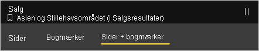
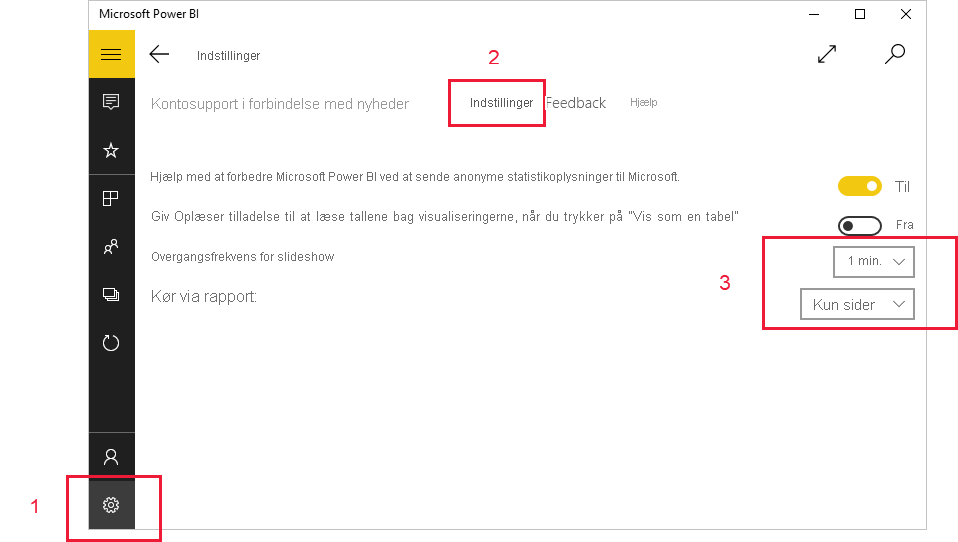

# Få vist rapporter og dashboards i præsentationstilstand på Surface Hub og Windows 10-enheder
Du kan bruge præsentationstilstand til at vise rapporter og dashboards i fuld skærm på Windows 10-enheder og Surface Hub. Præsentationstilstand er praktisk til at vise Power BI på møder eller konferencer eller på en dedikeret projektor på kontoret. Du kan også bruge det for at se mest muligt på en lille skærm.

I præsentationstilstand:
* Alle forstyrrende elementer (f. eks. navigation og menulinjer) forsvinder, hvilket gør det lettere at fokusere på dataene i din rapport.
* En handlingsværktøjslinje bliver tilgængelig, så du kan interagere med dine data og styre præsentationen.
* Du kan afspille et slideshow, der automatisk skifter mellem sider, bogmærker eller både sider og bogmærker.

>[!NOTE]
>Understøttelse af Power BI-mobilapp til **telefoner, der bruger Windows 10 mobile**, ophører den 16. marts 2021. [Få mere at vide](https://go.microsoft.com/fwlink/?linkid=2121400)

## Brug præsentationstilstand
Tryk på ikonet **Fuld skærm** i Power BI-mobilappen for at gå til fuldskærmsvisning.
 Overflødige elementer i appens forsvinder, og der vises en værktøjslinje nederst på skærmen eller i højre og venstre side (afhænger af skærmstørrelsen).

Fra værktøjslinjen kan du udføre følgende handlinger:

|||
|-|-|
||**Gå tilbage** til forrige side. Hvis du trykker på ikonet, og holder det nede, åbnes brødkrummevinduerne, hvilket giver dig mulighed for at navigere til mappen med din rapport eller til dit dashboard.|
||**Skift sider**, og få vist en anden side af rapporten i din præsentation.|
||**Anvend et bogmærke** for at præsentere den specifikke visning af dine data, som bogmærket henter. Du kan anvende både personlige bogmærker og rapportbogmærker.|
||**Vælg en farve til håndskrift**, når du bruger Surface-pennen til at tegne på og anmærke din rapportside.|
||**Slet håndskriftsmærker**, du eventuelt har angivet med Surface-pennen for at tegne på og anmærke din rapportside.          |
||**Nulstil til standardvisning** og ryd eventuelle filtre, udsnitsværktøjer eller andre ændringer af datavisning, som du eventuelt har foretaget under præsentationen.|
||**Del** et billede af præsentationsvisningen med dine kolleger. Billedet indeholder alle annotationer, du har angivet med Surface-pennen under præsentationen.|
||**Opdater** rapporten.|
||**Afspil slideshowet** – skjul handlingslinjen, og start slideshowet. Med en vælger kan du vælge rotere automatisk mellem sider, bogmærker eller både sider og bogmærker. Slideshowet roterer som standard mellem sider én gang hvert 30. sekund. Du kan ændre disse indstillinger i [**Indstillinger > Indstillinger**](#slideshow-settings). Se [flere detaljer](#slideshows) om slideshow|
||**Afslut** præsentationstilstand.|
||**Søg** for at søge efter andre artefakter i Power BI.|

Du kan fradocke værktøjslinjen og trække den til en hvilken som helst placering på skærmen. Dette er nyttigt i forbindelse med store skærme, når du vil fokusere på et bestemt område i din rapport og gerne vil have de tilgængelige værktøjer ved siden af det. Du skal blot placere fingeren på værktøjslinjen og stryge det ind på rapportlærredet.

## Slideshow

Du kan afspille et slideshow for automatisk at gennemgå din præsentation. Du kan indstille slideshowet til at gennemgå sider, bogmærker eller både sider og bogmærker.

Når du vælger knappen **Afspil** på handlingsværktøjslinjen, begynder slideshowet. Der vises en controller, som giver dig mulighed for at afbryde slideshowet midlertidigt eller ændre det, der afspilles: sider, bogmærker eller både sider og bogmærker.

 Navnet på den aktuelt viste visning (side eller bogmærke og side) vises i controlleren. På billedet ovenfor kan du se, at bogmærket **Asien og Stillehavsområdet** aktuelt vises på siden **Sales Performance** i rapporten **Sales**.

### Indstillinger for slideshow

Et slideshow gennemgår som standard sider med et sideskift for hver 30. sekund. Du kan ændre disse standardindstillinger ved at gå til **Indstillinger > Indstillinger** som vist nedenfor.

## Næste trin
* [Få vist dashboards og rapporter i fuldskærmsvisning fra Power BI-tjenesten](../end-user-focus.md)
* Har du spørgsmål? [Prøv at spørge Power BI-community'et](https://community.powerbi.com/)

