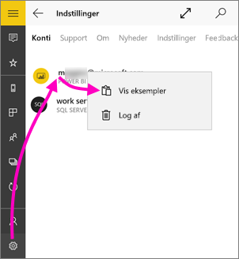
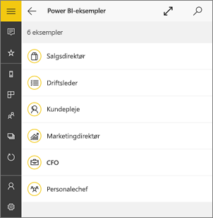
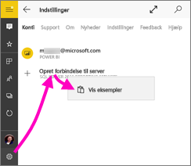
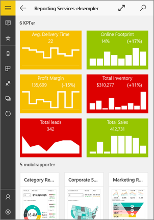
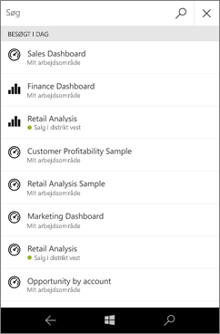
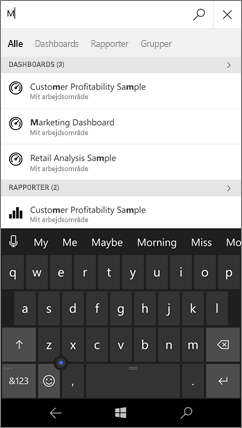
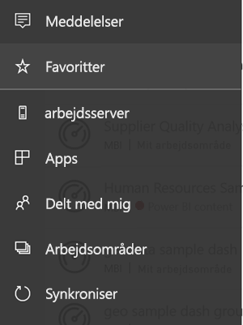
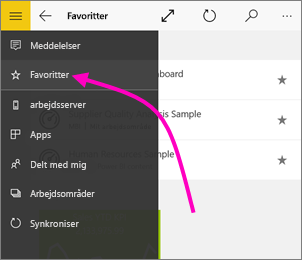
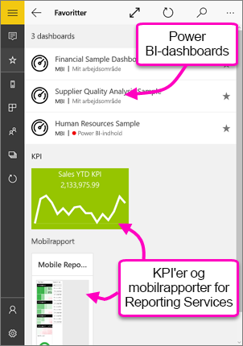

# Kom i gang med Power BI-mobilapp til Windows 10
Power BI-mobilappen til Windows 10 gør det muligt at bruge Power BI på din tablet eller telefon. Du får opdateret, berøringsfølsom mobiladgang til dine virksomhedsoplysninger. Få vist og interager med virksomhedens dashboards, uanset hvor du er, direkte fra [Start i Windows](mobile-pin-dashboard-start-screen-windows-10-phone-app.md).

Du kan [oprette dashboards og rapporter i Power BI-tjenesten](../../fundamentals/service-get-started.md) med dine data. 

Derefter kan du interagere med dine dashboards og rapporter, udforske dataene og dele dem. Alt sammen fra Power BI-mobilappen til Windows 10.

## Det vigtigste først
* [**Hent Power BI-mobilappen til Windows 10**](https://go.microsoft.com/fwlink/?LinkID=526478) fra Windows Store.
  
  Din enhed skal køre Windows 10. Appen fungerer på enheder med mindst 3 GB RAM og 8 GB internt lager.

  >[!NOTE]
  >Understøttelse af Power BI-mobilapp til **telefoner, der bruger Windows 10 mobile**, ophører den 16. marts 2021. [Få mere at vide](https://go.microsoft.com/fwlink/?linkid=2121400)
   
* Find ud af, [hvad der er nyt i Power BI-mobilappsene](mobile-whats-new-in-the-mobile-apps.md).

## Tilmeld dig Power BI-tjenesten på internettet
Hvis du endnu ikke har tilmeldt dig, kan du gå til [Power BI-tjenesten](https://powerbi.com/). Tilmeld dig din egen konto for at oprette og lagre dashboards og rapporter samt samle dine data. Log derefter på Power BI fra din Windows 10-enhed for at få vist dine egne dashboards overalt.

1. I Power BI-tjenesten skal du trykke på [Tilmeld](https://go.microsoft.com/fwlink/?LinkID=513879) for at oprette en Power BI-konto.
2. Gå i gang med at [oprette dine egne dashboards og rapporter](../../fundamentals/service-get-started.md).

## Introduktion til Power BI-appen
1. Åbn Power BI-appen på startskærmen på din Windows 10-enhed.
   
   
2. Tryk på **Power BI** for at få vist dine Power BI-dashboards og -rapporter. Log på med de samme legitimationsoplysninger som din Power BI-konto på internettet. 
   
   Tryk på **SQL Server 2016 Reporting Services** for at se dine Reporting Services-mobilrapporter og -KPI'er. Log på med dine legitimationsoplysninger til SQL Server Reporting Services.
   
   
3. Tryk på **Kom i gang med at udforske** for at se dine egne dashboards.

## Prøv eksemplerne til Power BI og Reporting Services
Selv uden at tilmelde dig kan du lege med Power BI- og Reporting Services-eksemplerne. Når du har downloadet appen, kan du få vist eksemplerne eller gennemgå introduktionen. Du kan når som helst gå tilbage til eksemplerne fra startsiden for dine dashboards.

### Power BI-eksempler
Du kan få vist og interagere med eksempler på Power BI-dashboards. Men der er et par ting, du ikke kan gøre med dem. Du kan ikke åbne rapporterne bag dashboardene, dele eksemplerne med andre eller gøre dem til dine favoritter.

1. Tryk på knappen til global navigation  i øverste venstre hjørne.
2. Tryk på ikonet **Indstillinger**, tryk på dit navn, og tryk derefter på **Vis eksempler**.
   
   
3. Vælg en rolle, og udforsk eksemplet på et dashboard i denne rolle.  
   
   

### Reporting Services-mobilrapporteksempler
1. Tryk på knappen til global navigation  i øverste venstre hjørne.
2. Tryk på ikonet **Indstillinger**, højreklik eller tryk på **Opret forbindelse til serveren**, og tryk derefter på **Få vist eksempler**.
   
   
3. Åbn mappen Retail Reports eller Sales Reports for at se deres KPI'er og mobilrapporter.
   
   

## Søg efter dashboards, rapporter og apps
Find hurtigt dine dashboards, rapporter og apps ved at skrive i søgefeltet, som du finder øverst i appen.

1. Tryk på søgeikonet i øverste højre hjørne.
   
   
   
   I Power BI vises dine seneste dashboards, rapporter og apps.
   
   
2. Når du begynder at skrive, vises alle relevante resultater i Power BI.
   
   

## Find dit indhold i Power BI-mobilappsene
Dine dashboards og rapporter gemmes forskellige steder i Power BI-mobilapperne, alt efter hvor de kom fra. Læs [Sådan finder du dit indhold i mobilapperne](mobile-apps-quickstart-view-dashboard-report.md). Desuden kan du altid søge efter noget, du har i Power BI-mobilapperne. 

## Få vist de dashboards, KPI'er og rapporter, du har gjort til dine favoritter
Få vist alle dine foretrukne Power BI-dashboards sammen med Reporting Services-KPI'er og -mobilrapporter på siden Favoritter i mobilappene. Når du gør et dashboard til en *favorit* i Power BI-mobilappen, får du adgang til den fra alle dine enheder, herunder Power BI-tjenesten i din browser. 

* Tryk på **Favoritter**.
  
   
  
   Alle dine Power BI-favoritter og dine favoritter fra Reporting Services-webportalen vises på denne side.
  
   

Læs mere om [favoritter i Power BI-mobilappsene](mobile-apps-favorites.md).

## Næste trin
Her er nogle andre ting, du kan foretage dig i Power BI-appen til Windows 10-enheder med dashboards og rapporter i Power BI samt Reporting Services-mobilrapporter og -KPI'er på Reporting Services-webportalen.

### Power BI-dashboards og -rapporter
* Få vist [dine apps](../../collaborate-share/service-create-distribute-apps.md).
* Se dine [dashboards](mobile-apps-view-dashboard.md).
* [Fastgør Power BI-felter og -dashboards](mobile-pin-dashboard-start-screen-windows-10-phone-app.md) som dynamiske felter på startskærmen på din enhed.
* [Del felter](mobile-windows-10-phone-app-get-started.md).
* Del [dashboards](mobile-share-dashboard-from-the-mobile-apps.md).

### Reporting Services-mobilrapporter og -KPI'er
* [Få vist Reporting Services mobilrapporter og -KPI'er](mobile-app-windows-10-ssrs-kpis-mobile-reports.md) i Power BI-mobilapp til Windows 10-enheder.
* Opret [KPI'er på Reporting Services-webportalen](/sql/reporting-services/working-with-kpis-in-reporting-services).
* [Opret dine egne mobilrapporter med SQL Server Mobile Report Publisher](/sql/reporting-services/mobile-reports/create-mobile-reports-with-sql-server-mobile-report-publisher), og publicer dem på Reporting Services-webportalen.

## Næste trin
* [Download Power BI-appen](https://go.microsoft.com/fwlink/?LinkID=526478) fra Windows Store  
* [Hvad er Power BI?](../../fundamentals/power-bi-overview.md)
* Har du spørgsmål? [Prøv at spørge Power BI-community'et](https://community.powerbi.com/)
