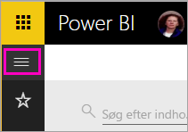
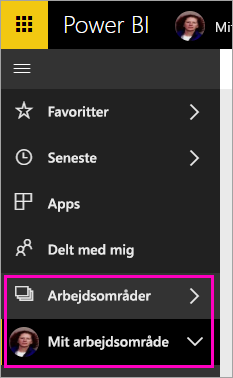
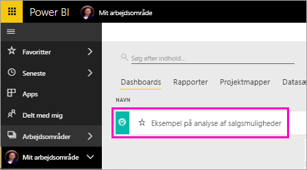
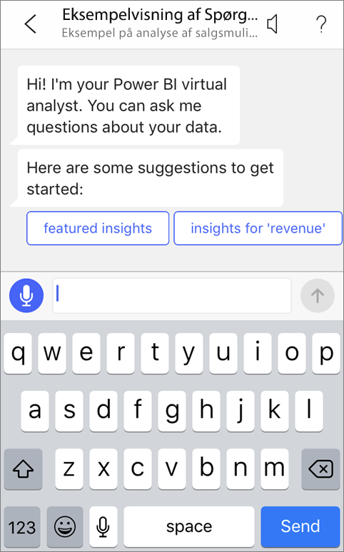
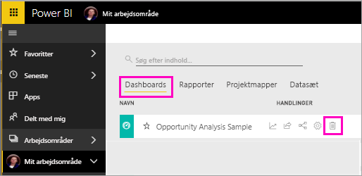

# Selvstudium: Stil spørgsmål om dine data ved hjælp af den virtuelle Spørgsmål og svar-analytiker i iOS-apps med Power BI

Den nemmeste måde at få mere at vide om dine data er at stille spørgsmål om dem med dine egne ord. I dette selvstudium kan du stille spørgsmål og få vist udvalgt indsigt i eksempeldata med den virtuelle Spørgsmål og svar-analytiker i Microsoft Power BI-mobilappen på iPad, iPhone og iPod Touch. 

Gælder for:

|  |  |
|:--- |:--- |
| iPhone-telefoner |iPad-tablets |

Den virtuelle Spørgsmål og svar-analytiker er en BI-samtaleoplevelse, der har adgang til underliggende Spørgsmål og svar-data i Power BI-tjenesten [(https://powerbi.com)](https://powerbi.com). Den foreslår indsigt i data, og du kan skrive eller indtale dine egne spørgsmål.

I dette selvstudium skal du:

> [!div class="checklist"]
> * Installere Power BI-mobilapp til iOS
> * Downloade et eksempeldashboard og en eksempelrapport til Power BI
> * Se, hvilken udvalgt indsigt mobilappen foreslår

Hvis du ikke er tilmeldt Power BI, kan du [tilmelde dig en gratis prøveversion](https://app.powerbi.com/signupredirect?pbi_source=web), før du begynder.

## Forudsætninger

### Installér Power BI til iOS-apps
[Download iOS-appen](http://go.microsoft.com/fwlink/?LinkId=522062 "Download iPhone-appen") fra Apple App Store til din iPad, iPhone eller iPod Touch.

Disse versioner understøtter Power BI til iOS-app:
- iPad med iOS 10 eller nyere.
- iPhone 5 og nyere med iOS 10 eller nyere. 
- iPod Touch med iOS 10 eller nyere.

### Download eksemplet på analyse af salgsmuligheder
Det første skridt i vejledningen er at downloade eksemplet på analyse af salgsmuligheder i Power BI-tjenesten.

1. Åbn Power BI-tjenesten i din browser (app.powerbi.com), og log på.

1. Vælg ikonet for global navigation for at åbne venstre navigationsrude.

    

2. Vælg **Arbejdsområder** > **Mit arbejdsområde** i navigationsruden til venstre.

    

3. Vælg **Hent data** i nederste venstre hjørne.
   
    

3. Vælg ikonet **Eksempler** på siden Hent data.
   
   

4. Vælg **Eksempel på analyse af salgsmuligheder**.
 
    
 
8. Vælg **Opret forbindelse**.  
  
   
   
5. Power BI importerer eksemplet og føjer et nyt dashboard, en ny rapport og et nyt datasæt til Mit arbejdsområde.
   
   

OK, du er nu klar til at få vist eksemplet på din iOS-enhed.

## Prøv udvalgt indsigt
1. Åbn Power BI-appen på din iPhone eller iPad, og log på med dine Power BI-kontooplysninger, dvs. dem, som du brugte i Power BI-tjenesten i browseren.

1.  Tryk på knappen til global navigation  > **Arbejdsområder** > **Mit arbejdsområde**, og åbn dashboardet med eksemplet på analyse af salgsmulighed.

2. Tryk på ikonet for den virtuelle Spørgsmål og svar-analytiker  i handlingsmenuen i bunden af siden (øverst på siden på en iPad).

     

     Den virtuelle Spørgsmål og svar-analytiker i Power BI indeholder nogle forslag til at komme i gang.

     
3. Tryk på **udvalgt indsigt**.

     Den virtuelle Spørgsmål og svar-analytiker foreslår nogle indsigtsmuligheder.
4. Rul til højre, og tryk på **Indsigt 2**.

    

     Den virtuelle Spørgsmål og svar-analytiker viser Indsigt 2.

    
5. Tryk på diagrammet for at åbne den i fokuseringstilstand.

    
6. Tryk på pilen i øverste venstre hjørne for at gå tilbage til den virtuelle Spørgsmål og svar-analytikeroplevelse.

## Fjern ressourcer

Når du er færdig med selvstudiet, kan du slette dashboardet med eksemplet på analyse af salgsmuligheder og tilhørende rapport og datasæt.

1. Åbn Power BI-tjenesten (app.powerbi.com), og log på.

2. Vælg **Arbejdsområder** > **Mit arbejdsområde** i navigationsruden til venstre.

3. Under fanen **Dashboards** skal du vælge skraldespandsikonet **Slet** ud for dashboardet Analyse af salgsmuligheder.

    

4. Vælg fanen **Rapporter**, og gør det samme for rapporten Analyse af salgsmuligheder.

5. Vælg fanen **Datasæt**, og gør det samme for datasættet Analyse af salgsmuligheder.

## Næste trin

Du har prøvet den virtuelle Spørgsmål og svar-assistent i Power BI-mobilapps til iOS. Få mere at vide om Spørgsmål og svar i Power BI-tjenesten.
> [!div class="nextstepaction"]
> [Spørgsmål og svar i Power BI-tjenesten](../end-user-q-and-a.md)

