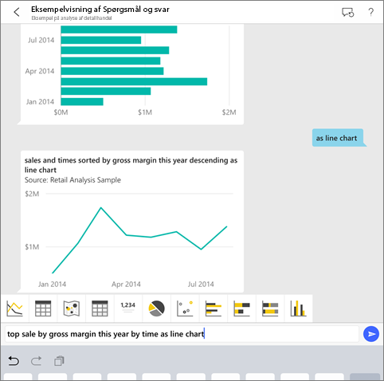
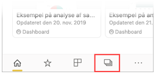
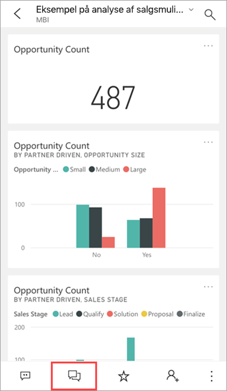
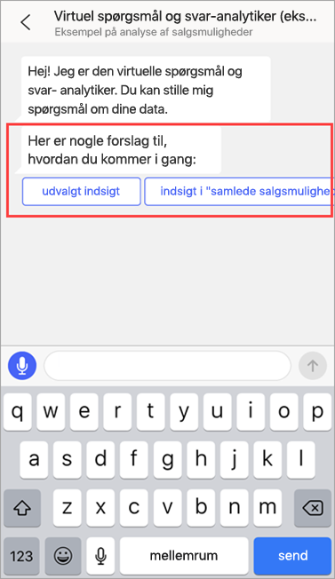
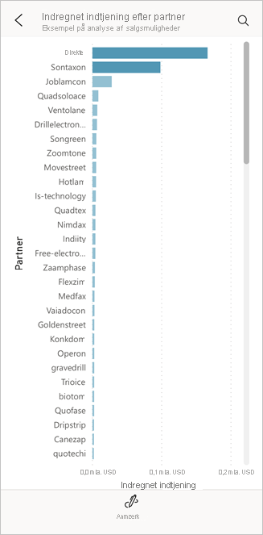
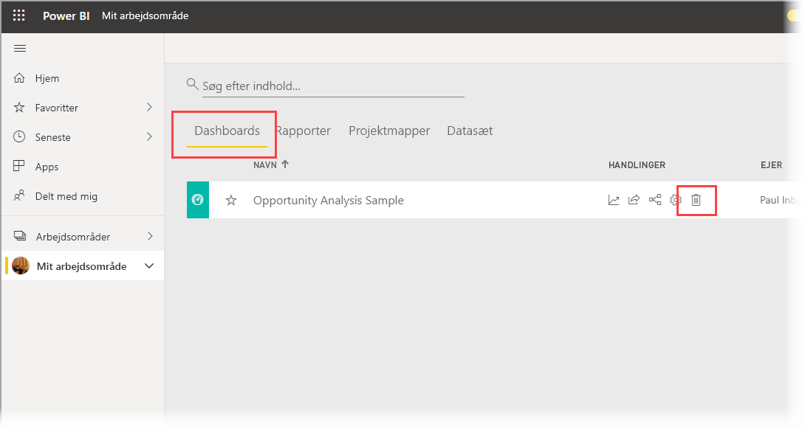
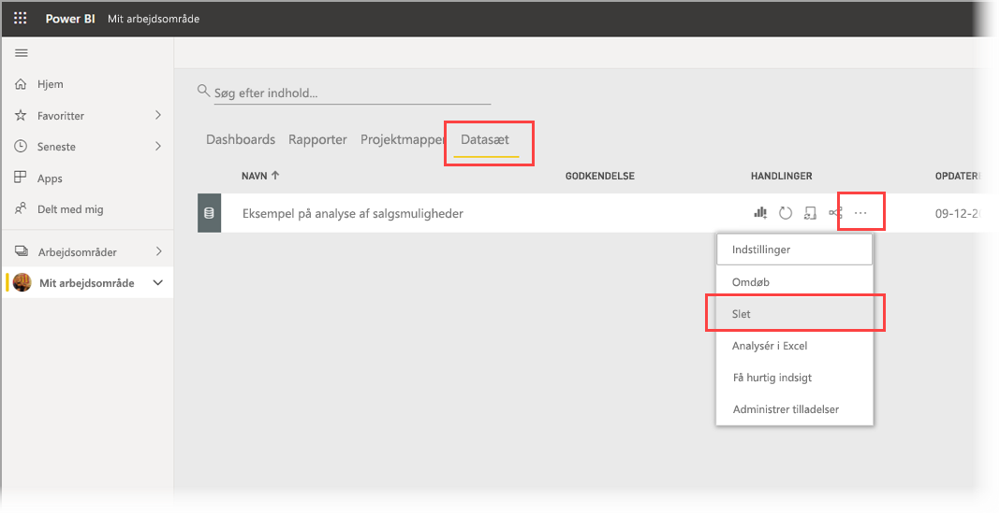

# Selvstudium: Stil spørgsmål om dine data ved hjælp af den virtuelle analytiker Spørgsmål og svar i iOS-apps med Power BI

Den nemmeste måde at få mere at vide om dine data er at stille spørgsmål om dem med dine egne ord. I dette selvstudium kan du stille spørgsmål og få vist udvalgt indsigt om eksempeldata med den virtuelle analytiker Spørgsmål og svar i Microsoft Power BI-mobilappen på iPad eller iPhone. 

Gælder for:

|  |  |
|:--- |:--- |
| iPhone-telefoner |iPad-tablets |

Den virtuelle analytiker Spørgsmål og svar er en BI-samtaleoplevelse, der har adgang til underliggende data i Spørgsmål og svar i [Power BI-tjenesten](https://powerbi.com). Den foreslår indsigt i data, og du kan skrive eller indtale dine egne spørgsmål.

I dette selvstudium skal du:

> [!div class="checklist"]
> * Installere Power BI-mobilapp til iOS
> * Downloade et eksempeldashboard og en eksempelrapport til Power BI
> * Se, hvilken udvalgt indsigt mobilappen foreslår

## Forudsætninger

* **Tilmeld dig Power BI**: Hvis du ikke er tilmeldt Power BI, kan du [tilmelde dig en gratis prøveversion](https://app.powerbi.com/signupredirect?pbi_source=web), før du begynder.
* **Installér Power BI til iOS-appen**: [Download iOS-appen](https://apps.apple.com/app/microsoft-power-bi/id929738808) fra Apple App Store til din iPad, iPhone eller iPod Touch. Følgende versioner understøtter Power BI til iOS-appen:
  * iPad med iOS 11 eller nyere.
  * iPhone 5 og nyere med iOS 11 eller nyere. 
  * iPod Touch med iOS 11 eller nyere.
* **Download eksempeldata**: Det første trin er at downloade **eksemplet på analyse af salgsmuligheder** til Power BI-tjenesten. Se [Download eksempler til Mit arbejdsområde i Power BI-tjenesten](./mobile-apps-download-samples.md) for at få en vejledning i, hvordan du gør det.

Når du har fuldført forudsætningerne og downloadet eksempeldataene, er du klar til at få vist eksemplerne på din iOS-enhed.

## Prøv udvalgt indsigt
1. Åbn Power BI-appen på din iPhone eller iPad, og log på med dine Power BI-kontooplysninger, dvs. dem, som du brugte i Power BI-tjenesten i browseren.

2. Tryk på ikonet **Arbejdsområder** på startsidens navigationslinje.

    

3. Når siden Arbejdsområder åbnes, skal du trykke på **Mine arbejdsområder** og derefter dashboardet **Eksempel på analyse af salgsmuligheder** for at åbne det.

3. Tryk på ikonet for den virtuelle analytiker Spørgsmål og svar i handlingsmenuen på dashboardet Eksempel på analyse af salgsmuligheder.

    

    Den virtuelle analytiker Spørgsmål og svar indeholder nogle forslag til at komme i gang.

    

3. Tryk på **udvalgt indsigt**.

4. Den virtuelle analytiker Spørgsmål og svar foreslår nogle indsigtsmuligheder. Rul til højre, og tryk på **Indsigt 2**.

    

   Den virtuelle analytiker Spørgsmål og svar viser Indsigt 2.

    

5. Tryk på diagrammet for at åbne den i fokuseringstilstand.

    

6. Tryk på pilen i øverste venstre hjørne for at gå tilbage til oplevelsen med den virtuelle analytiker Spørgsmål og svar.

## Fjern ressourcer

Når du er færdig med selvstudiet, kan du slette dashboardet med eksemplet på analyse af salgsmuligheder og tilhørende rapport og datasæt.

1. Åbn Power BI-tjenesten ([Power BI-tjenesten](https://app.powerbi.com)), og log på.

2. Vælg **Mit arbejdsområde** i navigationsruden.

3. Klik på fanen Dashboards, og klik derefter på papirkurven på linjen med eksemplet på analyse af salgsmuligheder.

    

    Klik nu på fanen Rapporter, og gør det samme.

4. Vælg nu fanen Datasæt, klik på **Flere indstillinger** (...), og vælg derefter **Slet**.

    

## Næste trin

Du har prøvet den virtuelle Spørgsmål og svar-assistent i Power BI-mobilapps til iOS. Få mere at vide om Spørgsmål og svar i Power BI-tjenesten.
> [!div class="nextstepaction"]
> [Spørgsmål og svar i Power BI-tjenesten](../end-user-q-and-a.md)