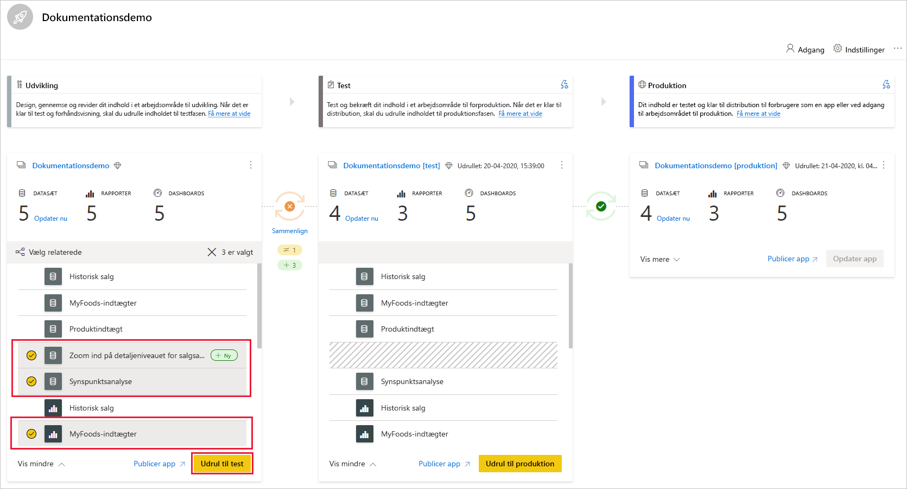
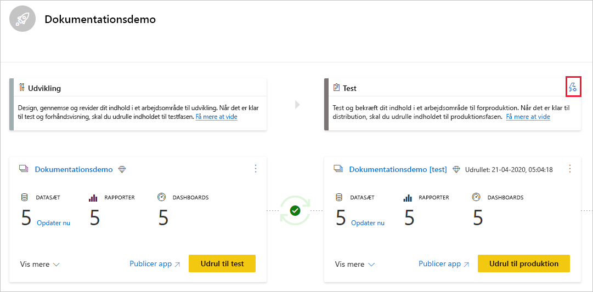
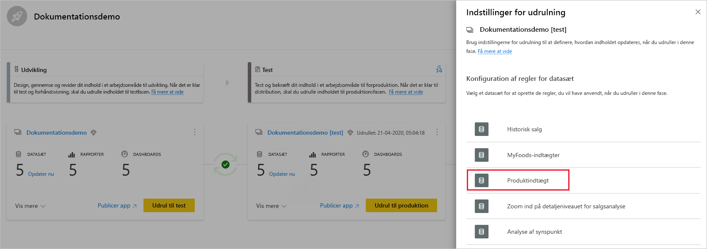
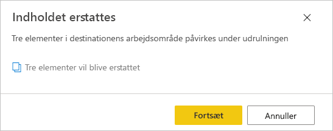

# Kom i gang med udrulningspipelines (prøveversion)

I denne artikel gennemgås de grundlæggende indstillinger, der kræves for at bruge udrulningspipelines.

## Adgang til udrulningspipelines

Hvis følgende betingelser er opfyldt, kan du få adgang til udrulningspipelines:

* Du er en [Pro-bruger](../admin/service-admin-purchasing-power-bi-pro.md) i Power BI

* Du er medlem af en organisation, der har en Premium-kapacitet

* Du er administrator af [en ny arbejdsområdeoplevelse](../collaborate-share/service-create-the-new-workspaces.md)

>[!NOTE]
> Du kan også se knappen til udrulningspipelines, hvis du tidligere har oprettet en pipeline, eller hvis en pipeline er blevet delt med dig.

## 1\. trin – opret en udrulningspipeline

Benyt følgende fremgangsmåde for at oprette en udrulningspipeline:

1. I navigationsruden i Power BI-tjenesten skal du vælge **Udrulningspipelines** og klikke på **Opret pipeline**.

2. I dialogboksen *Opret en udrulningspipeline* skal du angive et navn og en beskrivelse for pipelinen og klikke på **Opret**.

Når pipelinen er oprettet, kan du dele den med andre brugere eller slette den. Når du deler en pipeline med andre, får de brugere, du deler pipelinen med, [adgang til pipelinen](deployment-pipelines-process.md#user-with-pipeline-access). Pipelineadgang giver brugerne mulighed for at se, dele, redigere og slette pipelinen.

## 2\. trin – tildel et arbejdsområde til en udrulningspipeline

Når du har oprettet en pipeline, skal du tilføje det indhold, du vil administrere, i pipelinen. Du føjer indhold til pipelinen ved at tildele et arbejdsområde til pipelinefasen. Du kan tildele et arbejdsområde til en hvilken som helst fase. 

Du kan tildele ét arbejdsområde til en udrulningspipeline. Udrulningspipelines opretter kloner af arbejdsområdeindholdet, så det kan bruges i forskellige faser i pipelinen.

Følg disse trin for at tildele et arbejdsområde i en udrulningspipeline:

1. I den udrulningspipeline, du lige har oprettet, skal du klikke på **Tildel et arbejdsområde**.

2. Vælg det arbejdsområde, du vil tildele til pipelinen, i rullemenuen *Vælg arbejdsområde*.

3. Vælg den fase, du vil tildele arbejdsområdet til.

### Begrænsninger for arbejdsområdetildeling

* Arbejdsområdet er en [ny arbejdsområdeoplevelse](../collaborate-share/service-create-the-new-workspaces.md).

* Du skal være administrator af arbejdsområdet.

* Arbejdsområdet må ikke være tildelt til nogen anden pipeline.

* Arbejdsområdet skal være placeret i en [Premium-kapacitet](../admin/service-premium-what-is.md).

* Du kan ikke tildele et arbejdsområde med [Power BI-eksempler](../create-reports/sample-datasets.md) til en pipelinefase.

>[!NOTE]
>Det er kun de arbejdsområder, der kan bruges sammen med udrulningspipelines, der vises på listen over arbejdsområder, som du kan vælge imellem.

## 3\. trin – udrul til en tom fase

Alle [Pro-brugere](../admin/service-admin-purchasing-power-bi-pro.md), der er medlem af eller administrator i kildearbejdsområdet, kan udrulle indhold til en tom fase (en fase, der ikke indeholder indhold). Arbejdsområdet skal være placeret i en kapacitet, hvis udrulningen skal kunne fuldføres.

Når du udruller indhold til en tom fase, bevares relationerne mellem elementerne. En rapport, der er bundet til et datasæt i kildefasen, klones f.eks. sammen med datasættet, og klonerne er ligeledes bundet til destinationsarbejdsområdet.

Når udrulningen er fuldført, skal du opdatere datasættet. Du kan finde flere oplysninger under [udrulning af indhold til en tom fase](deployment-pipelines-process.md#deploying-content-to-an-empty-stage).

### Udrulning af alt indhold

Vælg den fase, der skal udrulles fra, og klik på udrulningsknappen. Installationsprocessen opretter et duplikeret arbejdsområde i destinationsfasen. Dette arbejdsområde indeholder alt det indhold, der findes i den aktuelle fase.

### Selektiv udrulning

Hvis du kun vil udrulle bestemte elementer, skal du klikke på linket **Vis mere** og vælge de elementer, du vil udrulle. Når du klikker på udrulningsknappen, er det kun de valgte elementer, der udrulles til den næste fase.

Da dashboards, rapporter og datasæt er relateret og har afhængigheder, kan du bruge knappen Vælg relateret til at kontrollere alle de elementer, som disse elementer er afhængige af. Hvis du f.eks. vil udrulle en rapport til næste fase, markeres det datasæt, som rapporten er forbundet til, når du klikker på knappen Vælg relateret, så de begge vil blive udrullet på én gang, og rapporten ikke bliver brudt.

>[!NOTE]
> * Du kan ikke udrulle en rapport eller et dashboard til næste fase, hvis de elementer, rapporten eller dashboardet er afhængig af, ikke findes i den fase, du udruller til.
> * Du får muligvis et uventet resultat, hvis du vælger at installere en rapport eller et dashboard uden de tilhørende datasæt. Dette kan ske, når datasættet i destinationsfasen er blevet ændret og ikke længere er det samme som det i den fase, du installerer fra.

### Udrulning bagud

Du kan vælge at udrulle til en tidligere fase, f.eks. i et scenarie, hvor du tildeler et eksisterende arbejdsområde til en produktionsfase og derefter udruller det bagud, først til testfasen og derefter til udviklingsfasen.

Udrulning til en tidligere fase fungerer kun, hvis den forrige fase er tom. Når du udruller til en tidligere fase, kan du ikke vælge bestemte elementer. Alt indhold i fasen vil blive udrullet.

## 4\. trin – opret regler for datasæt

Når du arbejder i en udrulningspipeline, kan forskellige faser have forskellige konfigurationer. Hver fase kan f.eks. have forskellige databaser eller forskellige forespørgselsparametre. Udviklingsfasen kan forespørge på eksempeldata fra databasen, mens test- og produktionsfaserne forespørger hele databasen.

Når du udruller indhold mellem pipelinefaser, kan du konfigurere regler for datasæt, så du kan tillade ændringer af indhold, mens nogle indstillinger forbliver intakte.

Regler for datasæt er defineret for datakilder og parametre i hvert datasæt. De bestemmer værdierne for datakilderne eller parametrene for et bestemt datasæt. Hvis du f.eks. vil have et datasæt i en produktionsfase til at pege på en produktionsdatabase, kan du definere en regel for dette. Reglen defineres i produktionsfasen under det relevante datasæt. Når reglen er defineret, arver indhold, der er udrullet fra test til produktion, den værdi, der er defineret i datasætreglerne, og den vil altid blive anvendt, så længe reglen ikke ændres og er gyldig.

>[!NOTE]
> Regler for datasæt fungerer kun, når kilde- og destinationsdatakilden er af samme type.

### Opret en datasætregel

1. I den pipelinefase, du vil oprette en datasætregel for, skal du klikke på **Udrulningsindstillinger**.

    

2. Vælg det datasæt, du vil oprette en regel for, i ruden Udrulningsindstillinger.

    

3. Vælg den type regel, du vil oprette, udvid listen, og klik på **Tilføj regel**.

     

### Typer af datasætregler

Der er to typer regler, som du kan oprette:

* **Datakilderegler** – datakildelisten hentes fra datasættet i kildepipelinefasen. Vælg en datakilde, der skal erstattes, på listen over datakilder. Brug en af følgende metoder til at vælge den værdi, der skal fungere som erstatning, fra kildefasen:

    1. Vælg på en liste.

    2. Klik på **Andet**, og tilføj den nye datakilde manuelt. Du kan kun skifte til en datakilde fra den samme type.

* **Parameterregler** – vælg en parameter på listen over parametre. Den aktuelle værdi vises. Rediger værdien til den værdi, der skal træde i kraft efter hver udrulning.

### Begrænsninger for datasætregler

* Du skal være ejeren af datasættet for at oprette en datasætregel.

* Regler for datasæt kan ikke oprettes i udviklingsfasen.

* Når et element fjernes eller slettes, slettes de tilhørende regler også. Disse regler kan ikke gendannes.

* Hvis den datakilde eller de parametre, der er defineret i en regel, ændres eller fjernes fra kildedatasættet, er reglen ikke gyldig, og udrulningen vil mislykkes.

* Datakilderegler kan kun defineres for følgende datakilder:
    * Azure Analysis Services
    * SSAS (SQL Server Analysis Services)
    * Azure SQL Server
    * SQL Server
    * OData-feed
    * Oracle
    * SapHana (understøttes kun i importtilstand, ikke direkte forespørgselstilstand)
    * SharePoint
    * Teradata

    I forbindelse med andre datakilder anbefaler vi [at bruge parametre til at konfigurere din datakilde](deployment-pipelines-best-practices.md#use-parameters-in-your-model).

## 5\. trin – udrul indhold fra én fase til en anden

Når du har indhold i en pipelinefase, kan du udrulle det til næste fase. Udrulning af indhold til en anden fase finder som regel sted, når du har udført nogle handlinger i pipelinen. Hvis du f.eks. har foretaget udviklingsændringer af dit indhold i udviklingsfasen eller testet dit indhold i testfasen. En typisk arbejdsproces for flytning af indhold fra fase til fase er fra udvikling til test og derefter fra test til produktion. Du kan få mere at vide om denne proces i afsnittet om [udrulning af indhold til et eksisterende arbejdsområde](deployment-pipelines-process.md#deploy-content-to-an-existing-workspace).

Hvis du vil udrulle indhold til næste trin i udrulningspipelinen, skal du klikke på knappen Udrul nederst i fasen.

Når du gennemgår kortene for test- og produktionsfasen, kan du se det seneste udrulningstidspunkt. Dette angiver, hvornår indholdet senest blev udrullet i fasen.

Udrulningstidspunktet er nyttigt til at fastslå, hvornår en fase senest blev opdateret. Det kan også være praktisk, hvis du vil spore tiden mellem test- og produktionsudrulninger.

## Sammenligning af faser

Når to sekventielle faser har indhold, sammenlignes indholdet på baggrund af metadata for indholdselementerne. Denne sammenligning omfatter ikke sammenligning af data eller opdateringstiden mellem faser.

 

Der vises et sammenligningsikon mellem to sekventielle faser, så det er muligt at få en hurtig visuel oversigt over forskellene. Sammenligningsindikatoren har to tilstande:

* **Grøn indikator** – der er identiske metadata for hvert indholdselement i begge faser.

* **Orange indikator** – vises, hvis en af disse betingelser er opfyldt:
    * Nogle af indholdselementerne i hvert enkelt trin blev ændret eller opdateret (har forskellige metadata).
    * Der er en forskel i antallet af elementer mellem faserne.

Når to sekventielle faser ikke er ens, vises der et link til **sammenligningen** under det orange sammenligningsikon. Hvis du klikker på dette link, åbnes listen over indholdselementer i begge faser i sammenligningsvisning. Sammenligningsvisningen hjælper dig med at spore ændringer eller forskelle mellem elementer i hver pipelinefase. Ændrede elementer får et af følgende mærkater:

* **Nyt** – et nyt element i kildefasen. Dette er et element, der ikke findes i destinationsfasen. Efter udrulningen klones dette element til destinationsfasen.

* **Forskelligt** – et element, der findes både i kilde- og i destinationsfasen, hvor en af versionerne blev ændret efter den seneste udrulning. Efter udrulningen overskriver elementet i kildefasen elementet i destinationsfasen, uanset hvor ændringen blev udført.

* **Mangler i** – dette mærkat angiver, at et element vises i destinationsfasen, men ikke i kildefasen.

    >[!NOTE]
    >Udrulningen påvirker ikke elementer med mærkatet *Mangler i*.

 

## Tilsidesættelse af indhold

Når du udruller, efter at du har foretaget ændringer af indholdet i kildefasen, overskrives det indhold, du ændrede i destinationsfasen. Når du har klikket på *Udrul*, får du vist en advarsel med en oversigt over antallet af elementer, der vil blive overskrevet.

Du kan få mere at vide om, [hvilke elementer der kopieres til næste fase](deployment-pipelines-process.md#deployed-items)og [de elementer, der ikke kopieres](deployment-pipelines-process.md#unsupported-items), i [Om udrulningsprocessen](deployment-pipelines-process.md).

## Næste trin

>[!div class="nextstepaction"]
>[Introduktion til udrulningspipelines](deployment-pipelines-overview.md)

>[!div class="nextstepaction"]
>[Om processen for udrulningspipelines](deployment-pipelines-process.md)

>[!div class="nextstepaction"]
>[Fejlfinding af udrulningspipelines](deployment-pipelines-troubleshooting.md)

>[!div class="nextstepaction"]
>[Bedste fremgangsmåder for udrulningspipelines](deployment-pipelines-best-practices.md)
