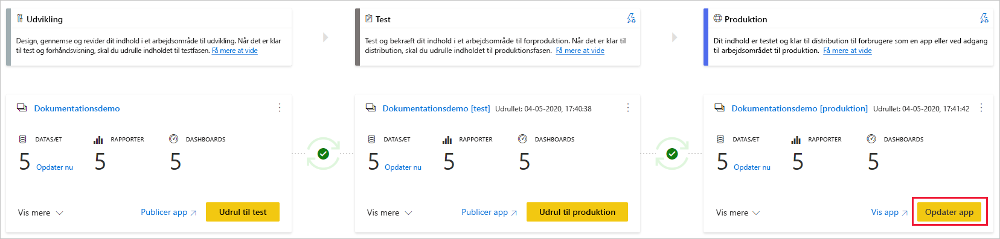

# Om udrulningsprocessen (prøveversion)

Udrulningsprocessen gør det muligt for dig at klone indhold fra én fase i pipelinen til en anden, typisk fra udvikling til test og fra test til produktion.

Under udrulningen kopierer Power BI indholdet fra den aktuelle fase til målfasen. Forbindelserne mellem de kopierede elementer bevares under kopieringsprocessen. Power BI anvender også de konfigurerede regler for datasæt på det opdaterede indhold i destinationsfasen. Det kan tage et stykke tid at udrulle indholdet, afhængigt af det antal elementer der udrulles. I dette tidsrum kan du navigere til andre sider i Power BI-portalen, men du kan ikke bruge indholdet i destinationsfasen.

## Udrulning af indhold til en tom fase

Når du udruller indhold til en tom fase, kopieres metadataene for rapporter, dashboards og datasæt i det arbejdsområde, du udruller fra, til den fase, du udruller til. Der oprettes et nyt arbejdsområde for den fase, du udrullede til, i en Premium-kapacitet.

Der er to måder, hvorpå du kan udrulle indhold fra én fase til den næste. Du kan udrulle alt indholdet, eller du kan [vælge, hvilke indholdselementer der skal udrulles](deployment-pipelines-get-started.md#selective-deployment).

Du kan også udrulle indhold bagud fra en senere fase i udrulningspipelinen til en tidligere fase.

Når udrulningen er fuldført, skal du opdatere datasættene, så du kan bruge det nyligt kopierede indhold. Opdateringen af datasæt er påkrævet, fordi dataene ikke kopieres fra én fase til en anden. Hvis du vil vide, hvilke elementegenskaber der kopieres under udrulningsprocessen, og hvilke elementegenskaber der ikke kopieres, skal du gennemse afsnittet om [elementegenskaber, der kopieres under udrulningen](#item-properties-copied-during-deployment).

### Oprettelse af et arbejdsområde i en Premium-kapacitet

Under udrulningen den første gang kontrollerer udrulningspipelinene, om du har Premium-kapacitetstilladelser.  

Hvis du har kapacitetstilladelser, kopieres indholdet af arbejdsområdet til den fase, du udruller til, og der oprettes et nyt arbejdsområde for den pågældende fase i Premium-kapaciteten.

Hvis du ikke har kapacitetstilladelser, oprettes arbejdsområdet, men indholdet kopieres ikke. Du kan bede en kapacitetsadministrator om at føje dit arbejdsområde til en kapacitet eller bede om tildelingstilladelser til kapaciteten. Når arbejdsområdet tildeles en kapacitet på et senere tidspunkt, kan du udrulle indhold til det pågældende arbejdsområde.

### Ejerskab for arbejdsområde og indhold

Den bruger, der udruller, bliver automatisk datasætejer af de klonede datasæt og den eneste administrator af det nye arbejdsområde.

## Udrul indhold til et eksisterende arbejdsområde

Hvis du udruller indhold i en aktuel produktionspipeline til en fase, der har et eksisterende arbejdsområde, medtages følgende:

* Udruller nyt indhold som en tilføjelse til en fase, der allerede indeholder indhold.

* Det nye indhold, der udrulles, erstatter gammelt indhold i en aktuel fase.

### Udrulningsproces

Indhold fra den aktuelle fase kopieres til destinationsfasen. Power BI identificerer eksisterende indhold i destinationsfasen og overskriver det. Pipelinen bruger forbindelsen mellem det overordnede element og de tilhørende kloner til at identificere, hvilket indholdselement der skal overskrives. Denne forbindelse bevares, når der oprettes nyt indhold. Overskrivningshandlingen overskriver kun indholdet af elementet. Elementets id, URL-adresse og tilladelser forbliver uændrede.

I destinationsfasen forbliver [elementegenskaber, der ikke kopieres](deployment-pipelines-process.md#item-properties-that-are-not-copied), som de var før udrulningen. Nyt indhold og nye elementer kopieres fra den aktuelle fase til destinationsfasen.

### Opdatering af datasættet

Data i destinationsdatasættet bevares, når det er muligt. Hvis der ikke er nogen ændringer af et datasæt, bevares dataene, som de var før udrulningen.

Power BI bevarer de oprindelige data med små ændringer, f.eks. tilføjelse af en tabel eller målinger, og opdateringen er optimeret til kun at opdatere det, der er nødvendigt. En fuld opdatering er påkrævet for at ændre skemaændringer eller ændre datakildeforbindelsen.

### Krav til at udrulle til en fase med et eksisterende arbejdsområde

Så længe det udrullede indhold er placeret i en [Premium-kapacitet](../admin/service-premium-what-is.md), kan en bruger, der opfylder følgende betingelser, udrulle det til en fase med et eksisterende arbejdsområde:

* En [Pro-bruger](../admin/service-admin-purchasing-power-bi-pro.md), der er medlem af begge arbejdsområder i kilde- og destinationsudrulningsfaserne.

* En ejer af alle datasæt i det destinationsarbejdsområde, der er ved at blive udrullet.

Du kan finde flere oplysninger i afsnittet om [tilladelser](#permissions).

## Udrullede elementer

Når du udruller indhold fra én pipelinefase til en anden, indeholder det kopierede indhold følgende Power BI-elementer:

* Datasæt

* Rapporter

* Dashboards

### Elementer, der ikke understøttes

Udrulningspipelines understøtter ikke følgende elementer:

* Datasæt, der ikke stammer fra en PBIX

* Rapporter, der er baseret på datasæt, der ikke understøttes

* Arbejdsområdet kan ikke bruge en skabelonapp

* Sideinddelte rapporter

* Dataflow

* Send datasæt via push

* Projektmapper

## Elementegenskaber, der kopieres under udrulningen

Under udrulningen kopieres følgende elementegenskaber, og elementegenskaberne overskrives i destinationsfasen:

* Datakilder ([regler for datasæt](deployment-pipelines-get-started.md#step-4---create-dataset-rules) understøttes)

* Parametre ([regler for datasæt](deployment-pipelines-get-started.md#step-4---create-dataset-rules) understøttes)

* Visualiseringer i rapporter

* Rapportsider

* Dashboardfelter

* Modelmetadata

* Elementrelationer

### Egenskaber for elementer, der ikke kopieres

Følgende elementegenskaber kopieres ikke under udrulningen:

* Data – data kopieres ikke. Det er kun metadata, der kopieres.

* URL-adresse

* Id

* Tilladelser – for et arbejdsområde eller et bestemt element.

* Indstillinger for arbejdsområde – hver enkel fase har sit eget arbejdsområde.

* App-indhold og-indstillinger – hvis du vil udrulle dine apps, skal du se [Udrulning af Power BI-apps](#deploying-power-bi-apps)

Følgende datasætegenskaber kopieres ikke under udrulningen:

* Rolletildelinger
    
* Tidsplan for opdatering
    
* Legitimationsoplysninger for datakilde
    
* Indstillinger for cachelagring af forespørgsler (kan nedarves fra kapaciteten)
    
* Indstillinger for godkendelser

## Installation af Power BI-apps

[Power BI-apps](../consumer/end-user-apps.md) er den anbefalede metode til at distribuere indhold til gratis Power BI-forbrugere. Du kan ved at bruge udrulningspipelines administrere Power BI-apps i en udrulningspipeline, så du får større kontrol og fleksibilitet i forbindelse med din apps livscyklus.

Opret en app for hver enkel fase i udrulningspipelinen, så du kan teste hver appopdatering fra slutbrugerens synspunkt. Med en udrulningspipeline kan du nemt administrere denne proces. Brug knappen Publicer eller Vis på arbejdsområdekortet til at publicere eller få vist appen i en bestemt pipelinefase.

I produktionsfasen åbner den primære handlingsknap nederst til højre siden til opdatering af appen i Power BI, så alle indholdsopdateringer bliver tilgængelige for brugerne af appen.

>[!IMPORTANT]
>Udrulningsprocessen omfatter ikke opdatering af appindholdet eller -indstillingerne. Hvis du vil anvende ændringer på indhold eller indstillinger, skal du manuelt opdatere appen i den påkrævede pipelinefase.

## Tilladelser

Pipelinetilladelser og arbejdsområdetilladelser gives og administreres separat. En bruger, der har adgang til en pipeline, som ikke har tilladelser til arbejdsområdet, kan f.eks. få vist pipelinen og dele den med andre. Denne bruger kan dog ikke få vist indholdet af arbejdsområdet i pipelinen eller på arbejdsområdesiden og kan ikke udføre udrulninger.

### Bruger med pipelineadgang

Brugere med pipelineadgang har følgende tilladelser:

* Få vist pipelinen
    
* Dele pipelinen med andre
    
* Redigere og slette pipelinen

>[!NOTE]
>Pipelineadgang giver ikke tilladelser til at få vist eller udføre handlinger på indholdet i arbejdsområdet.

### Arbejdsområdelæsere

Arbejdsområdelæsere, der har *pipelineadgang*, kan også gøre følgende:

* Forbruge indhold

>[!NOTE]
>Arbejdsområdelæsere kan ikke få adgang til datasættet eller redigere indholdet i arbejdsområdet.

### Bidragyder til arbejdsområde

Bidragydere til arbejdsområder, der har *pipelineadgang*, kan også gøre følgende:

* Forbruge indhold

* Sammenligne faser

* Få vist datasæt

### Arbejdsområdemedlem

Arbejdsområdemedlemmer, der har *pipelineadgang*, kan også gøre følgende:

* Få vist arbejdsområdeindhold
    
* Sammenligne faser
    
* Udrulle rapporter og dashboards

* Fjerne arbejdsområder

### Arbejdsområdeadministrator

Arbejdsområdeadministratorer, der har *pipelineadgang*, kan udføre de samme handlinger som *medlemmer af arbejdsområdet* og også gøre følgende:

* Tildel arbejdsområder

* Fjerne arbejdsområder

### Ejer af datasæt

Ejere af datasæt, der enten er arbejdsområdemedlemmer eller administratorer, kan også gøre følgende:

* Opdatere datasæt
    
* Konfigurere regler

>[!NOTE]
>I dette afsnit beskrives brugertilladelser i udrulningspipelines. De tilladelser, der er angivet i dette afsnit, kan have anden anvendelse i andre Power BI-funktioner.

## Begrænsninger

I dette afsnit vises de fleste af begrænsningerne i udrulningspipelines.

* Arbejdsområdet skal være placeret i en [Premium-kapacitet](../admin/service-premium-what-is.md).

* Power BI-elementer som f.eks. rapporter og dashboards, der har Power BI-[følsomhedsmærkater](../admin/service-security-sensitivity-label-overview.md), kan ikke udrulles.

* Det maksimale antal Power BI-elementer, der kan udrulles i en enkelt installation, er 300.

* Du kan finde en liste over begrænsninger for arbejdsområdet under [begrænsninger for tildeling af arbejdsområder](deployment-pipelines-get-started.md#workspace-assignment-limitations).

* Du kan finde en liste over elementer, der ikke understøttes, under [elementer, der ikke understøttes](#unsupported-items).

### Begrænsninger for datasæt

* Datasæt, der er konfigureret med [trinvis opdatering](../admin/service-premium-incremental-refresh.md), kan ikke udrulles.

* Datasæt, der bruger dataforbindelser i realtid, kan ikke udrulles.

* Hvis måldatasættet bruger en [direkte forbindelse](../connect-data/desktop-report-lifecycle-datasets.md) under udrulningen, skal kildedatasættet også bruge denne forbindelsestilstand.

* Efter udrulningen understøttes hentning af et datasæt (fra den fase, det er udrullet til) ikke.

* Du kan se en liste over begrænsninger for datasætregler i [begrænsninger for datasætregler](deployment-pipelines-get-started.md#dataset-rule-limitations).

## Næste trin

>[!div class="nextstepaction"]
>[Introduktion til udrulningspipelines](deployment-pipelines-overview.md)

>[!div class="nextstepaction"]
>[Bedste fremgangsmåder for udrulningspipelines](deployment-pipelines-best-practices.md)

>[!div class="nextstepaction"]
>[Kom i gang med udrulningspipelines](deployment-pipelines-get-started.md)

>[!div class="nextstepaction"]
>[Fejlfinding af udrulningspipelines](deployment-pipelines-troubleshooting.md)
