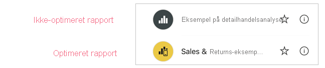
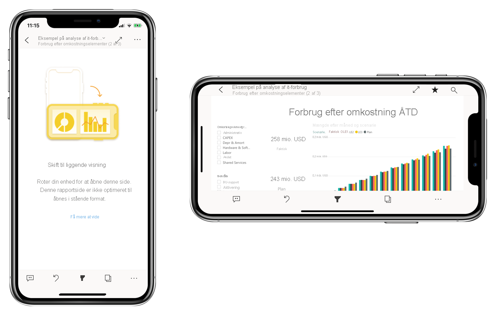

# Optimer Power BI-rapporter til mobilappen
Mobilbrugere kan få vist en Power BI-rapportside i liggende retning. Rapportforfattere kan dog oprette en yderligere visning, der er optimeret til mobilenheder og vises i stående retning. Denne designindstilling, der er tilgængelig i både Power BI Desktop og Power BI-tjenesten, gør det muligt for forfattere at vælge og omarrangere netop de visuals, der giver mening for mobilbrugere, når de er på farten.

.

Power BI indeholder en række funktioner, der kan hjælpe dig med at oprette mobiloptimerede versioner af dine rapporter:
* En mobillayoutvisning, hvor du kan oprette din mobiloptimerede rapport ved at trække og slippe visuals på et lærred, der emulerer en telefon.
* Visuals og udsnitsværktøjer, der kan optimeres til brug på små, mobilskærme.

Disse funktioner gør det muligt at designe og oprette flotte, interaktive, mobiloptimerede rapporter.

## Opret en mobiloptimeret version af en rapportside i stående retning

Det første trin er at designe og oprette rapporten i den almindelige webvisning. Når du har oprettet rapporten, kan du optimere den til telefoner og tablets.

Åbn mobillayoutvisningen for at oprette den mobiloptimerede visning:
   * Vælg båndet **Vis** i Power BI Desktop, og vælg derefter **Mobillayout**.
   * Vælg **Flere indstillinger (...) > Rediger rapport > Mobillayout** i Power BI-tjenesten.

   Du kan se et lærred, der kan rulles i, og som er udformet som en telefon, og ruden **Visualiseringer**, hvor alle de visuals, der findes på den oprindelige rapportside, vises.

   .

* De enkelte visuals i ruden **Visualiseringer** vises med deres navn, så du nemt kan identificere dem.
* Hvert enkelt visual har også en synlighedsindikator. Synlighedsindikatoren for et visual ændres afhængigt af visual'ets synlighedsstatus i webrapportvisningens aktuelle tilstand. Synlighedsindikatoren er nyttig, når du arbejder med bogmærker.

## Føj visuals til mobillayoutlærredet
Du føjer et visual til mobillayoutet ved at trække det fra ruden **Visualiseringer** til telefonlærredet. Når du trækker visual'et til lærredet, fastgøres det til gitteret. Du kan også dobbeltklikke på visual'et i ruden Visualiseringer, hvorefter visual'et føjes til lærredet.

Du kan føje nogle eller alle visuals på webrapportsiden til den mobiloptimerede rapportside. Du kan kun tilføje de enkelte visuals én gang, og du behøver ikke at medtage alle visuals.

>[!NOTE]
> Du kan trække skjulte visuals og slippe dem på lærredet. De placeres der, men de vises ikke, medmindre deres synlighedsstatus ændres i den aktuelle webrapportvisning.

Visuals kan lægges oven på hinanden, så du kan oprette interaktive rapporter ved hjælp af bogmærker, eller du kan oprette flotte rapporter ved at lægge visuals oven på billeder.

Når du har placeret et visual på lærredet, kan du tilpasse dets størrelse ved at trække i de håndtag, der vises omkring visual'ets kant, når du markerer det. Hvis du vil bevare højde-bredde-forholdet for visuals, mens du tilpasser størrelsen, skal du trykke på tasten **Skift**, mens du trækker i størrelseshåndtagene.

På billedet nedenfor vises det, hvordan du trækker og slipper visuals fra ruden **Visualiseringer** til lærredet, samt hvordan du tilpasser størrelsen på dem og overlejrer dem.

   

Telefonrapportgitteret tilpasses telefoner af forskellig størrelse, så din rapport ser lige så flot ud på telefoner med små som store skærme.

## Fjern visuals fra mobillayoutlærredet
Fjern en visualisering fra mobillayoutet ved at klikke på **X** øverst til højre i visual'et på telefonlærredet, eller markér visual'et, og tryk på **Slet**.

Du kan fjerne alle visuals fra lærredet ved at klikke på viskelæderet i ruden **Visualiseringer**.

Fjernelse af visuals fra mobillayoutlærredet fjerner dem kun fra lærredet. De vises stadig i ruden Visualiseringer, og den oprindelige rapport påvirkes ikke.

## Konfigurer visuals og udsnitsværktøjer til brug i mobiloptimerede rapporter

### Visualiseringer

Som standard er mange visuals, især visuals af typen diagram, dynamiske.  Det betyder, at de ændres dynamisk, så den maksimale mængde data og indsigt vises uanset skærmstørrelse.

Når størrelsen af visualiseringen ændres, prioriteres datavisningen i Power BI. Udfyldning fjernes f.eks., og forklaringen kan automatisk flyttes til toppen af visualiseringen, så visualiseringen fortsat er informativ, selvom den bliver mindre.

 
Hvis du af en eller anden grund vil slå den dynamiske funktionsmåde fra, kan du gøre det i afsnittet **Generelt** i visual'ets formatindstillinger.

### Udsnit

Udsnit muliggør filtrering af rapportdata på lærredet. Når du designer udsnit i den almindelige tilstand til rapportoprettelse, kan du modificere nogle udsnitsindstillinger for at gøre dem mere anvendelige i mobiloptimerede rapporter:
* Du kan vælge, om du vil tillade, at rapportlæsere kun vælger ét element eller flere elementer.
* Du kan gøre udsnitsværktøjet lodret, vandret eller dynamisk (dynamiske udsnitsværktøjer skal være vandrette).

Hvis du gør udsnitsværktøjet dynamisk, når du ændrer dets størrelse og form, vises flere eller færre indstillinger. Det kan være højt, kort, bredt eller smalt. Du kan gøre det så lille, at det blot bliver et filterikon på rapportsiden.

 
Læs mere om [oprettelse af dynamiske udsnit](power-bi-slicer-filter-responsive.md).

## Publicer en mobiloptimeret rapport
Hvis du vil publicere en mobiloptimeret version af en rapport, skal du [publicere den primære rapport fra Power BI Desktop til Power BI-tjenesten](desktop-upload-desktop-files.md). Derved publiceres den mobiloptimerede version på samme tid.

## Visning af optimerede og ikke-optimerede rapporter på en telefon eller tablet

I Power BI-mobilapps er mobiloptimerede rapporter angivet med et særligt ikon.

På telefoner registrerer appen automatisk, om rapporten er mobiloptimeret eller ej.
* Hvis der findes en mobiloptimeret rapport, åbnes rapporten automatisk i mobiloptimeret tilstand i appen.
* Hvis der ikke findes en mobiloptimeret rapport, vises rapporten i ikke-optimeret liggende retning.

Hvis du holder en telefon i liggende retning, åbnes rapporten i den ikke-optimerede visning med det oprindelige rapportlayout, uanset om rapporten er optimeret eller ej.

Hvis du kun optimerer nogle sider, bliver læserne bedt om at skifte til liggende retning, når læserne de kommer til en ikke-optimeret side. Hvis de vender telefonen eller tabletten på siden, kan de se rapportsiden i liggende retning. [Læs mere om interaktion med Power BI-rapporter, der er optimeret til visning i stående retning](../consumer/mobile/mobile-apps-view-phone-report.md).

## Overvejelser i forbindelse med oprettelse af mobiloptimerede layout
* I rapporter med flere sider, kan du optimere alle siderne eller kun nogle få.
* Hvis du har defineret en baggrundsfarve for en rapportside, får den mobiloptimerede rapport den samme baggrundsfarve.
* Du kan ikke ændre formatindstillinger kun for den mobiloptimerede rapport. Formateringen er konsistent mellem master- og mobillayout. Skriftstørrelserne er f.eks. de samme.
* Du kan ændre et visual, f.eks. formateringen, datasættet, filtrene eller andre egenskaber, ved at vende tilbage til den almindelige tilstand for oprettelse af webrapporter.

## Næste trin
* [Opret en telefonvisning af et dashboard i Power BI](service-create-dashboard-mobile-phone-view.md).
* [Få vist Power BI-rapporter, der er optimeret til din telefon](../consumer/mobile/mobile-apps-view-phone-report.md).
* [Power BI-dokumentation om oprettelse af rapporter og dashboards](https://docs.microsoft.com/power-bi/create-reports/).
* Har du flere spørgsmål? [Prøv at spørge Power BI-community'et](https://community.powerbi.com/).