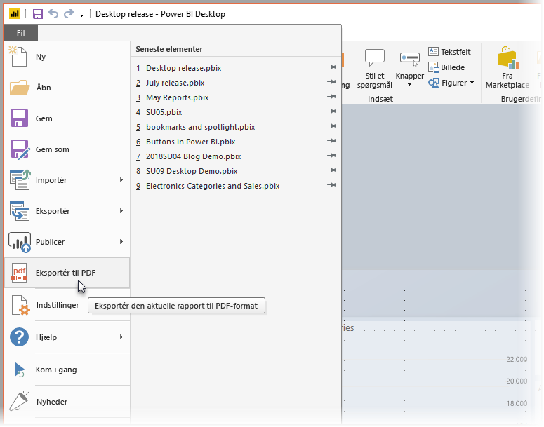
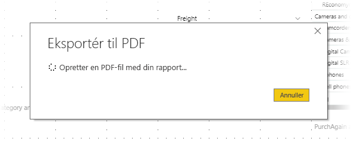

# Eksportér rapporter til PDF-format fra Power BI Desktop
I **Power BI Desktop** eller Power BI-tjenesten kan du eksportere rapporter til en PDF-fil, så det er nemt at dele eller udskrive dine rapporter fra PDF.

Processen med at eksportere din rapport fra **Power BI Desktop** til en PDF-fil, så du kan udskrive PDF-filen eller dele PDF-dokumentet med andre, er helt enkel. Du skal blot vælge **Fil > Eksportér til PDF** fra Power BI Desktop.

Processen **Eksportér til PDF** vil eksportere alle *synlige* sider i rapporten, hvor hver rapportside eksporteres til en enkelt side i PDF-filen. De rapportsider, der ikke er synlige, f.eks. værktøjstip eller skjulte sider, eksporteres ikke til PDF-filen. 

Når du vælger **Fil > Eksportér til PDF**, bliver eksporten igangsat, og der vises en dialogboks med en meddelelse om, at eksporten er i gang. Dialogboksen forbliver på skærmen, indtil eksporten er fuldført. Under eksporten vil al interaktion med rapporten være deaktiveret. Den eneste måde at interagere med rapporten på, er at vente, indtil eksporten er fuldført, eller du kan annullere eksporten. 

Når eksporten er fuldført, indlæses PDF-filen i PDF-fremviseren på computeren. 

## Overvejelser og begrænsninger
Der er et par ting, du skal være opmærksom på i forbindelse med funktionen **Eksportér til PDF**:

* Funktionen eksporterer Power BI-visuals, men den eksporterer *ikke* en eventuel baggrund, du har anvendt i rapporten.

Da baggrunden ikke eksporteres til PDF-filen, skal du være ekstra opmærksom på de rapporter, hvor der bruges en mørk baggrund. Hvis teksten i din rapport er lys eller hvid, så den kan læses på den mørke baggrund, vil det være svært at læse den i den eksporterede PDF-fil, da baggrunden ikke eksporteres sammen med resten af rapporten. 

## De næste trin
Der findes alle mulige interessante visualiseringer og funktioner i **Power BI Desktop**. Du kan finde flere oplysninger i følgende ressourcer:

* [Brug visualiseringer til at forbedre Power BI-rapporter](desktop-visual-elements-for-reports.md)
* [Hvad er Power BI Desktop?](../fundamentals/desktop-what-is-desktop.md)
