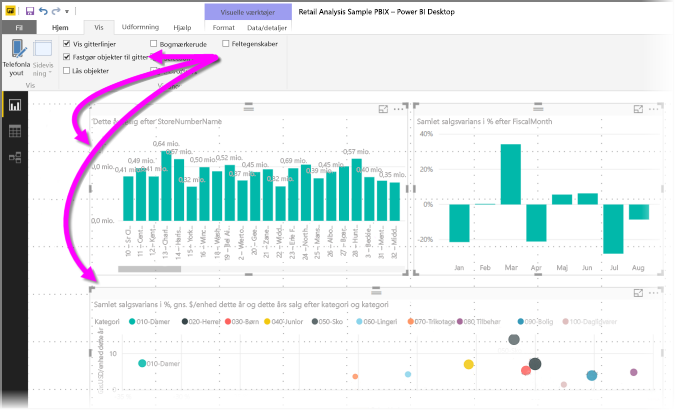
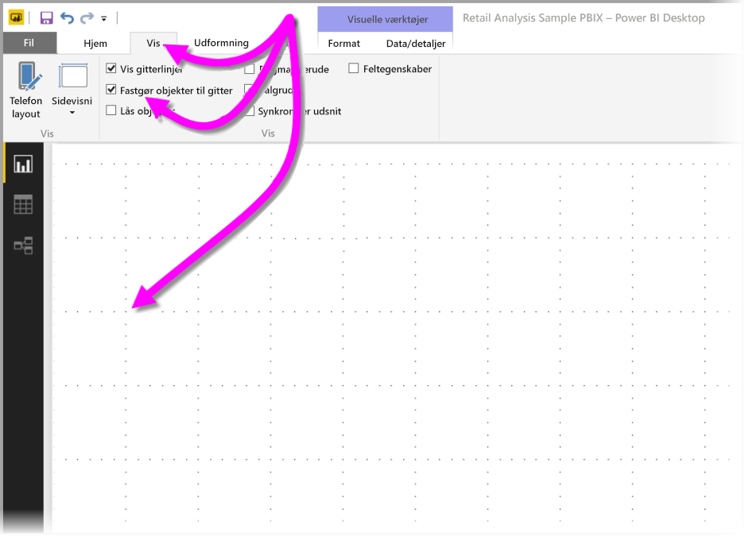
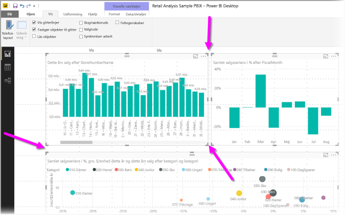
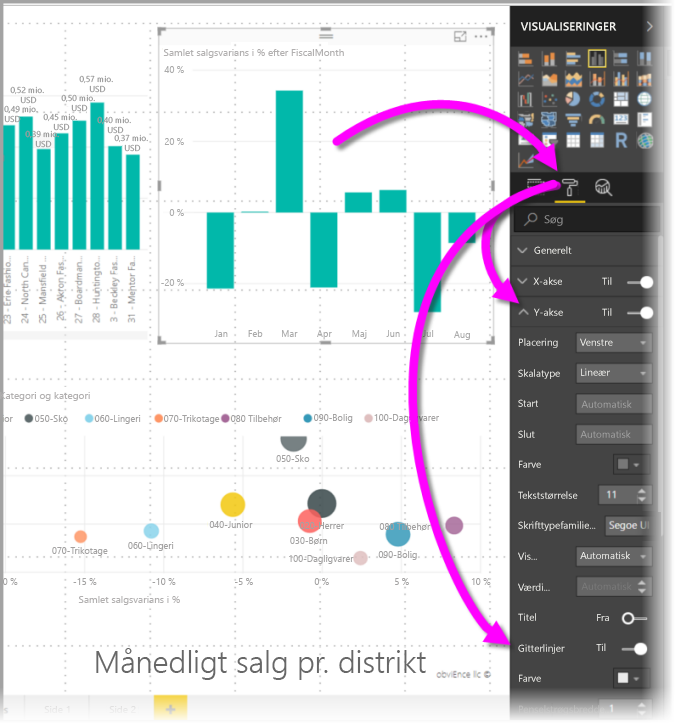
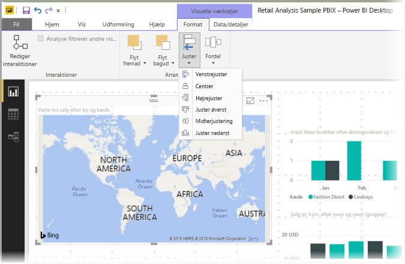
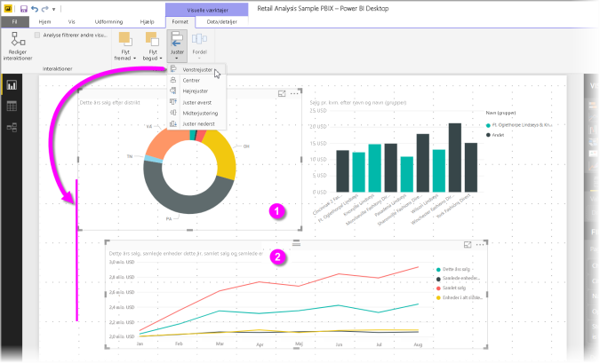

# Brug gitterlinjer og fastgørelse til gitter i Power BI Desktop-rapporter
**Power BI Desktop**-rapportlærredet indeholder gitterlinjer, som du kan bruge til at justere visuelle elementer på en rapportside, så det ser pænt ud, og bruge funktionen for fastgørelse til gitter, så de visuelle elementer i dine rapporter ser jævne ud, er justeret og har lige stor afstand.

I **Power BI Desktop** kan du også tilpasse z-rækkefølgen for objekter i en rapport (flytte dem fremad eller bagud) og justere eller fordele de markerede visuelle elementer jævnt på lærredet.

## Aktivér gitterlinjer og fastgørelse til gitter
Hvis du vil aktivere gitterlinjer og fastgørelse til gitter, skal du vælge båndet **Vis** og derefter markere afkrydsningsfeltet for **Vis gitterlinjer** og **Fastgør objekter til gitter**. Du kan vælge begge indstillinger. De fungerer uafhængigt af hinanden.

> [!NOTE]
> Hvis **Vis gitterlinjer** og **Fastgør objekter til gitter** er deaktiveret, kan du oprette forbindelse til en datakilde for at aktivere dem.

## Brug af gitterlinjer
Gitterlinjer er synlige vejledninger, der hjælper dig med at justere dine visuelle elementer. Når du forsøger at se, om to (eller flere) visuelle elementer står korrekt vandret eller lodret, kan du bruge gitterlinjerne til at se, om kanterne flugter med hinanden.

Brug Ctrl + klik til at markere mere end ét visuelt element ad gangen. Herved vises kanterne for alle de markerede visuelle elementer, så du kan se, om de flugter med hinanden.

### Brug af gitterlinjer i visuelle elementer
I Power BI er der også gitterlinjer inden i de visuelle elementer. De fungerer som synlige hjælpelinjer ved sammenligning af datapunkter og værdier. Fra og med versionen af **Power BI Desktop** fra september 2017 kan du nu administrere gitterlinjerne i visuelle elementer ved hjælp af kortet **X-akse** eller **Y-akse** (afhængigt af typen af visuelt element), der findes i sektionen **Format** i ruden **Visualiseringer**. Du kan administrere følgende gitterlinjeelementer i et visuelt element:

* Slå gitterlinjer til eller fra
* Skift farve på gitterlinjer
* Juster stregen (tykkelsen) i gitterlinjer
* Vælg stregtypen for gitterlinjerne i det visuelle element, f.eks. udfyldt, stiplet eller prikket

Det kan især være en god ide at ændre bestemte elementer i gitterlinjer i rapporter, hvor der bruges en mørk baggrund til visuelle elementer. På følgende billede vises sektionen **Gitterlinjer** på kortet **Y-akse**.

## Brug fastgørelse til gitter
Når du aktiverer **Fastgør objekter til gitter**, justeres alle visuelle elementer på lærredet i **Power BI Desktop**, som du flytter (eller ændrer størrelsen på), automatisk i forhold til den nærmeste akse i gitteret for at sikre, at to eller flere visuelle elementer justeres i forhold til den samme vandrette eller lodrette placering eller størrelse.

Og det er det eneste, du skal vide om at bruge **gitterlinjer** og **fastgørelse til gitter** for at sikre, at de visuelle elementer i dine rapporter er justeret, som de skal.

## Brug z-rækkefølge, justering og fordeling
Du kan styre, hvilken rækkefølge de visuelle elementer i en rapport skal vises i fra forrest til bagest. Det kaldes ofte elementernes *z-rækkefølge*. Med denne funktion kan du overlappe visuelle elementer, som du ønsker det, og derefter justere rækkefølgen fra forreste til bageste element. Du kan angive rækkefølgen for de visuelle elementer med knapperne **Flyt fremad** og **Flyt bagud** i afsnittet **Arranger** af båndet **Formater**. Båndet **Formater** vises, når du har markeret et eller flere visuelle elementer på siden.

Med båndet **Formater** kan du justere dine visuelle elementer på mange forskellige måder, så de vises på siden på den måde, der ser bedst ud og fungerer bedst.

Med knappen **Juster** justeres det markerede visuelle element til kanten (eller midten) af rapportlærredet som vist på følgende billede.

Når to eller flere visuelle elementer er markeret, justeres de sammen og bruger den eksisterende justerede grænse for de visuelle elementer til justering. Hvis du for eksempel markerer to visuelle elementer og klikker på knappen **Venstrejuster**, justeres de visuelle elementer ud fra den grænse, der er længst til venstre for de valgte visuelle elementer.

Du kan også fordele dine visuelle elementer jævnt over hele rapportlærredet lodret eller vandret. Du skal bare bruge knappen **Fordel** på båndet **Format**.

Med bare et par indstillinger i disse værktøjer til gitterlinjer, justering og fordeling kommer dine rapporter til at se ud, som du ønsker det.

