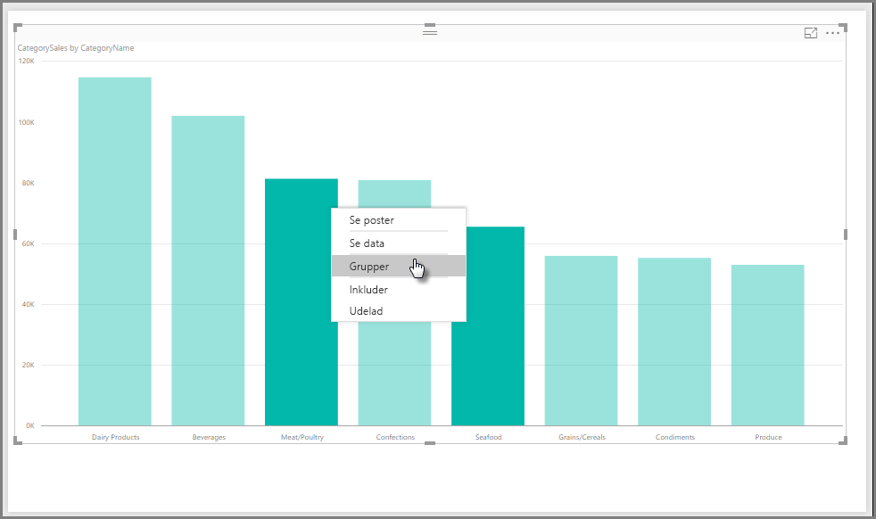
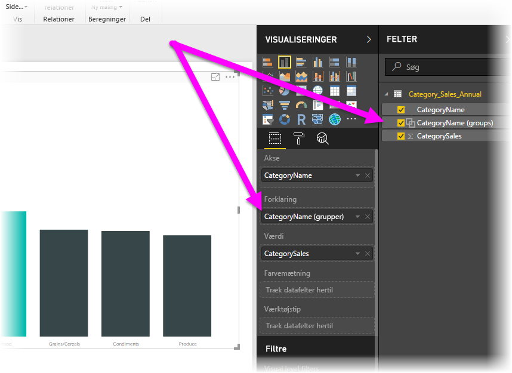
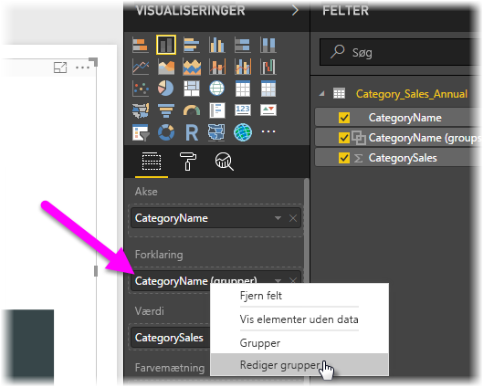
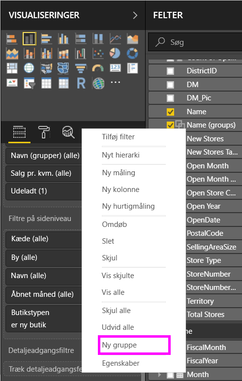
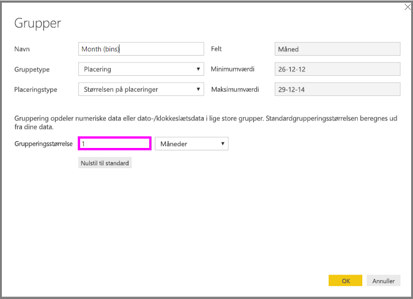
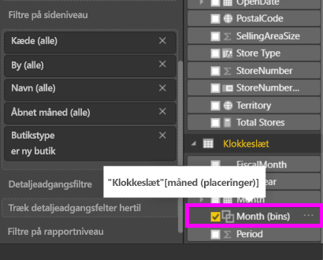

# Brug gruppering og gruppering i beholder i Power BI Desktop
Når der oprettes visualiseringer i Power BI Desktop, samles dine data i dele (eller grupper) baseret på de værdier, der bliver fundet i de underliggende data. Det er ofte fint, men der kan være tilfælde, hvor du gerne vil justere, hvordan disse dele vises. Eksempel: Du vil måske placere tre produktkategorier i én større kategori (én *gruppe*). Det kan også være, at du vil se salgstal, der er placeret i beholderstørrelser på USD 1.000.000 i stedet for i dele på USD 923.983.

I Power BI Desktop kan du *gruppere* datapunkter, så du kan få vist, analysere og udforske data og tendenser i dine visualiseringer på en mere klar måde. Du kan også definere *beholderstørrelsen* for at sortere værdierne i lige store grupper, så du bedre kan visualisere data på en meningsfuld måde. Denne handling kaldes ofte *gruppering*.

## Brug af gruppering
Hvis du vil bruge gruppering, skal du vælge to eller flere elementer på en visualisering ved at bruge Ctrl + klik for at vælge flere elementer. Højreklik derefter på et af de flere valgte elementer, og vælg **Gruppér** i genvejsmenuen.

Når du har oprettet gruppen, føjes den til området **Forklaring** for visualiseringen. Gruppen vises også på listen **Felter**.

Når du har en gruppe, kan du nemt redigere medlemmerne i den pågældende gruppe. Højreklik på feltet i området **Forklaring** eller fra listen **Felter**, og vælg derefter **Rediger grupper**.

I dialogboksen **Grupper** kan du oprette nye grupper eller redigere eksisterende grupper. Du kan også *omdøbe* en gruppe. Du skal blot dobbeltklikke på gruppetitlen i feltet **Grupper og medlemmer** og derefter skrive et nyt navn.

Du kan gøre forskellige ting med grupper. Du kan føje elementer fra listen **Ikke-grupperede værdier** til en ny gruppe eller til en af de eksisterende grupper. Hvis du vil oprette en ny gruppe, skal du vælge to eller flere elementer (ved hjælp af Ctrl + klik) fra feltet **Ikke-grupperede værdier** og derefter vælge knappen **Gruppér** under dette felt.

Du kan føje en ikke-grupperet værdi til en eksisterende gruppe: Du skal blot vælge en af de **Ikke-grupperede værdier**, derefter vælge den eksisterende gruppe, som du vil føje værdien til, og vælge knappen **Gruppér**. Hvis du vil fjerne et element fra en gruppe, skal du vælge det i feltet **Grupper og medlemmer** og derefter vælge **Opdel gruppe**. Du kan også flytte ikke-grupperede kategorier til gruppen **Andet** eller lade dem være ikke-grupperet.

> [!NOTE]
> Du kan oprette grupper for et hvilket som helst felt i feltet **Felter** uden at skulle vælge flere elementer i en eksisterende visualisering. Du skal blot højreklikke på feltet og vælge **Ny gruppe** i den menu, der vises.

## Brug af gruppering i beholder
Du kan angive beholderstørrelsen for numeriske felter og klokkeslætsfelter i **Power BI Desktop.** Du kan bruge gruppering i beholder til at tilpasse de data, der vises i Power BI Desktop, til den korrekte størrelse.

Du anvender en beholderstørrelse ved at højreklikke på et **Felt** og vælge **Ny gruppe**.

Fra dialogboksen **Grupper** skal du angive den **Beholderstørrelse**, du vil have for beholderen.

Når du vælger **OK**, kan du se, at der vises et nyt felt i ruden **Felter**, hvor **(grupperinger)** er tilføjet. Du kan derefter trække dette felt til canvasset, så du kan bruge beholderstørrelsen i en visualisering.

Du kan se, hvordan *gruppering i beholdere* fungerer i denne [video](https://www.youtube.com/watch?v=BRvdZSfO0DY).

Så nemt er det at bruge *gruppering* og *gruppering i beholder* til at sikre, at dine data vises lige præcis på den måde, du gerne vil, i dine visualiseringer.
