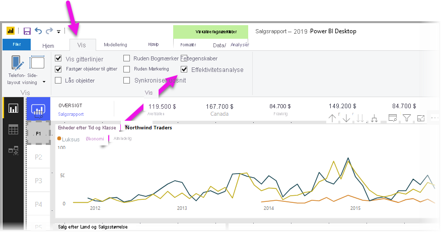
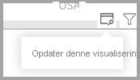
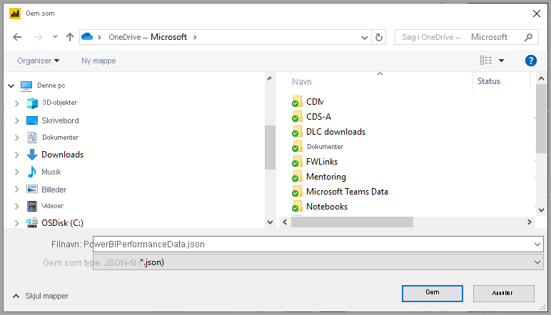

# Brug Effektivitetsanalyse til at undersøge ydeevnen for rapportelementer

I **Power BI Desktop** kan du se, hvordan ydeevnen er for alle dine rapportelementer, f. eks. visuals og DAX-formler. Ved hjælp af **Effektivitetsanalyse**kan du se og registrere logfiler, der måler, hvordan ydeevnen skal være for hvert af dine rapportelementer, når brugerne interagerer med dem, og hvilke aspekter af deres ydeevne der er mest (eller mindst) ressourcekrævende.

Effektivitetsanalyse undersøger og viser den varighed, der er nødvendig til opdatering af alle visuals, som brugerinteraktioner starter, og præsenterer oplysningerne, så du kan få vist, foretage detailudledning eller eksportere resultaterne. Effektivitetsanalyse kan hjælpe dig med at identificere visuals, der påvirker dine rapporters ydeevne, og identificere årsagen til virkningen.

## Visning af ruden for Effektivitetsanalyse

I **Power BI Desktop** skal du vælge båndet **Vis**. I området **Vis** på båndet **Vis** kan du markere afkrydsningsfeltet ud for **Effektivitetsanalyse** for at få vist ruden Effektivitetsanalyse.

Når Effektivitetsanalyse er valgt, vises den i sin egen rude til højre for rapportlærredet.

## Brug af Effektivitetsanalyse

Effektivitetsanalyse måler den behandlingstid (herunder tidspunktet for oprettelse eller opdatering af en visualisering), der er nødvendig for at opdatere rapportelementer, der er startet som følge af enhver brugerinteraktion, der medfører kørsel af en forespørgsel. Hvis du f. eks. justerer et udsnit, kræver det, at udsnits-visual'et ændres, at en forespørgsel sendes til datamodellen, og at berørte visuals opdateres som resultat af de nye indstillinger. 

Hvis du vil have Effektivitetsanalyse til at begynde at optage, skal du blot vælge **Start optagelse**

Alle handlinger, du foretager i rapporten, vises og logføres i ruden Effektivitetsanalyse i den rækkefølge, som visual'et indlæses i fra Power BI. Det kan f. eks. være, at du har en rapport, som brugerne har sagt, tager lang tid at opdatere. Det tager imidlertid lang tid at få vist visse visuals, når en skyder justeres. Med Effektivitetsanalyse kan du se, hvilket visual der er årsag til problemet, og identificere, hvilke aspekter af visual'et der tager længst tid at behandle. 

Når du begynder at optage, er knappen **Start optagelse** nedtonet (inaktiv, da du allerede er begyndt at optage), og knappen **Stop** er aktiv. 

Effektivitetsanalyse indsamler og viser oplysninger om ydeevnemåling i realtid. Så hver gang du klikker på et visuelt element, flytter et udsnit eller interagerer på andre måder, viser Effektivitetsanalyse øjeblikkeligt resultaterne i ruden.

Hvis ruden indeholder flere oplysninger, end der kan vises, vises der et rullepanel, der gør det muligt at navigere til flere oplysninger.

Hver interaktion har et sektions-id i ruden, der beskriver den handling, som startede posterne i loggen. På følgende billede var interaktionen, at brugerne har ændret et udsnit.

Hvert enkelt visuals logoplysninger omfatter den tid, der er brugt (varighed) til at udføre følgende opgavekategorier:

* **DAX-forespørgsel** – hvis en DAX-forespørgsel var påkrævet, er dette den tid, der går mellem visual'ets afsendelse af forespørgslen og Analysis Services' returnering af resultaterne.
* **Visuel visning** – den tid, det tager for visual'et at tegne på skærmen, herunder den tid, der kræves for at hente eventuelle webbilleder eller geokodning. 
* **Andet** – den tid, det tager for visual'et at forberede forespørgsler, vente på, at andre visuals fuldføres, eller udføre anden baggrundsbehandling.

Værdierne for **Varighed (ms)** angiver forskellen mellem et *start-* og *slut-* tidsstempel for hver handling. De fleste lærredshandlinger og visuahandlinger udføres sekventielt på en enkelt brugergrænsefladetråd, som deles af flere handlinger. De rapporterede varigheder omfatter den tid, der er brugt i kø, mens andre handlinger udføres. [Effektivitetsanalyse-eksemplet](https://github.com/microsoft/powerbi-desktop-samples/tree/master/Performance%20Analyzer) på GitHub og den tilknyttede [dokumentation](https://github.com/microsoft/powerbi-desktop-samples/blob/master/Performance%20Analyzer/Power%20BI%20Performance%20Analyzer%20Export%20File%20Format.docx) indeholder oplysninger om, hvordan visuals forespørger data, og hvordan de gengiver.

Når du har interageret med elementer i den rapport, du vil måle med Effektivitetsanalyse, kan du vælge knappen **Stop**. Oplysningerne om ydeevne forbliver i ruden, når du har valgt **Stop**, så du kan analysere dem.

Hvis du vil rydde oplysningerne i ruden Effektivitetsanalyse, skal du vælge **Ryd**. Alle oplysninger slettes, og de gemmes ikke, når du vælger **Ryd**. Se det næste afsnit for at få mere at vide om, hvordan du gemmer oplysninger i logge. 

## Opdatering af visuals

Du kan vælge **Opdater visuals** i ruden Effektivitetsanalyse for at opdatere alle visuals på den aktuelle side i rapporten og dermed få Effektivitetsanalyse til at indsamle oplysninger om alle sådanne visuals.

Du kan også opdatere enkelte visuals. Når Effektivitetsanalyse optager, kan du vælge **Opdater dette visual**, der findes i øverste højre hjørne af de enkelte visuals, for at opdatere det pågældende visual og registrere dets ydeevneoplysninger.

## Lagring af oplysninger om ydeevne

Du kan gemme de oplysninger, som Effektivitetsanalyse opretter om en rapport, ved at vælge knappen **Eksporter**. Når du vælger **Eksporter**, oprettes der en .json-fil med oplysninger fra ruden Effektivitetsanalyse. 

## De næste trin
Du kan finde flere oplysninger om **Power BI Desktop**, og hvordan du kommer i gang, i følgende artikler.

* [Hvad er Power BI Desktop?](../fundamentals/desktop-what-is-desktop.md)
* [Oversigt over forespørgsler i Power BI Desktop](../transform-model/desktop-query-overview.md)
* [Datakilder i Power BI Desktop](../connect-data/desktop-data-sources.md)
* [Opret forbindelse til data i Power BI Desktop](../connect-data/desktop-connect-to-data.md)
* [Udform og kombiner data med Power BI Desktop](../connect-data/desktop-shape-and-combine-data.md)
* [Almindelige forespørgselsopgaver i Power BI Desktop](../transform-model/desktop-common-query-tasks.md)   

Du kan finde oplysninger om Effektivitetsanalyse-eksemplet i følgende ressourcer.

* [Effektivitetsanalyse-eksempel](https://github.com/microsoft/powerbi-desktop-samples/tree/master/Performance%20Analyzer)
* [Dokumentation til Effektivitetsanalyse-eksempel](https://github.com/microsoft/powerbi-desktop-samples/blob/master/Performance%20Analyzer/Power%20BI%20Performance%20Analyzer%20Export%20File%20Format.docx)
