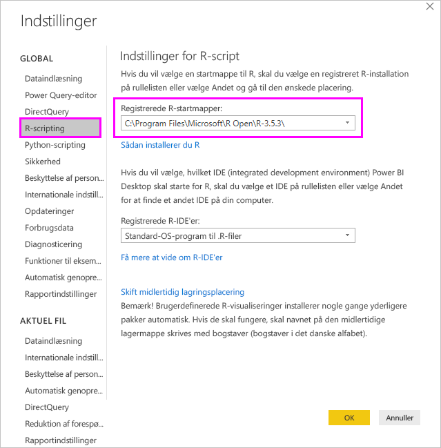
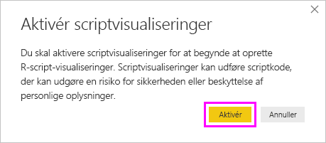
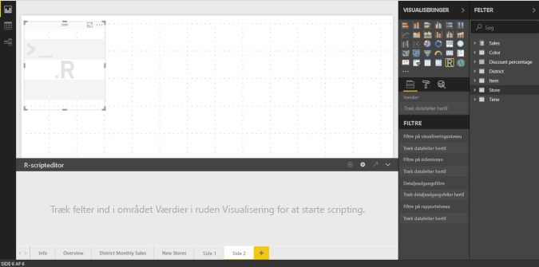
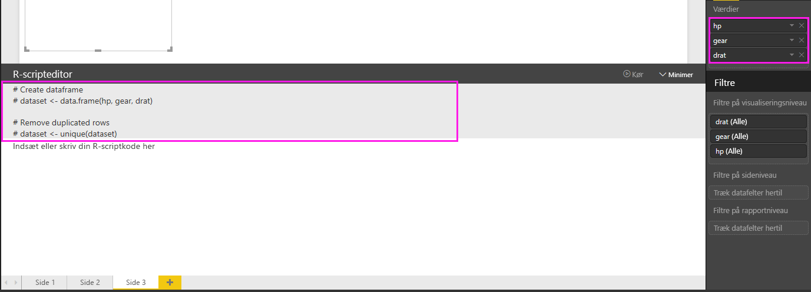
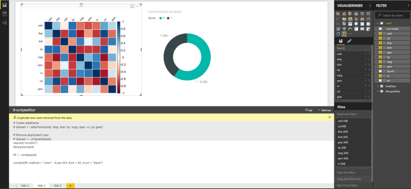

# <a name="create-power-bi-visuals-using-r"></a>Opret Power BI-visualiseringer ved hjælp af R
Med Power BI Desktop kan du bruge *R* til at visualisere dine data. [R](https://mran.revolutionanalytics.com/documents/what-is-r) er et sprog og et miljø til statistisk databehandling og grafik.

## <a name="install-r"></a>Installér R
Power BI Desktop indeholder som standard ikke R-programmet, og det udrulles og installeres ikke i forbindelse med Power BI Desktop. Hvis du vil køre R-scripts i Power BI Desktop, skal du installere R separat på din lokale computer. Du kan downloade og installere R gratis fra mange forskellige steder, herunder [downloadsiden for Revolution Open](https://mran.revolutionanalytics.com/download/) og [CRAN Repository](https://cran.r-project.org/bin/windows/base/). Den aktuelle version af R-script i Power BI Desktop understøtter Unicode-tegn og mellemrum (tomme tegn) i installationsstien.

## <a name="enable-r-visuals-in-power-bi-desktop"></a>Aktivér R-visualiseringer i Power BI Desktop
Når du har installeret R, aktiveres det automatisk i Power BI Desktop. Du kan kontrollere, at Power BI Desktop har aktiveret R på den korrekte placering, ved at følge disse trin: 

1. Vælg **Filer** > **Indstillinger** > **Indstillinger** i menuen i Power BI Desktop. 

2. Vælg **R-script** under **Global** til venstre på siden **Indstillinger**. 

3. Gå til **Indstillinger for R-script**, og kontrollér, at din lokale R-installation er angivet i **Registrerede R-startmapper**, og at det er den korrekte lokale R-installation, som skal bruges i Power BI Desktop, der er valgt. På følgende billede er stien til den lokale installation af R **C:\Programmer\R Open\R-3.5.3\\** .
   
   

Når du har kontrolleret R-installationen, er du klar til at oprette R-visualiseringer.

## <a name="create-r-visuals-in-power-bi-desktop"></a>Opret R-visualiseringer i Power BI Desktop
1. Vælg ikonet **R-visualisering** i ruden **Visualisering** for at tilføje en R-visualisering.
   
   

2. Vælg **Aktivér** i vinduet **Aktivér visuelle script-elementer**.

   

   Når du føjer en R-visualisering til en rapport, sker der følgende ændringer i Power BI Desktop:
   
   - Der vises en pladsholder for R-visualiseringen på rapportcanvasset.
   
   - **R-scripteditoren** vises nederst i den midterste rude.
   
   

3. Gå til sektionen **Værdier** i ruden **Visualisering**, og træk de felter fra ruden **Felter**, som du vil bruge i dit R-script. Det foregår på samme måde som med enhver anden visualisering i Power BI Desktop. Du kan også vælge felterne direkte i ruden **Felter**.
    
    Det er kun de felter, du har føjet til området **Felter**, som du kan bruge til R-scriptet. Du kan tilføje nye felter eller fjerne unødvendige felter i området **Værdier**, mens du arbejder med R-scriptet i **R-scripteditoren**. Det registreres automatisk i Power BI Desktop, hvilke felter du har tilføjet eller fjernet.
   
   > [!NOTE]
   > Standardsammenlægningstypen for visuelle R-elementer er *Opsummer ikke*.
   > 
   > 
   
4. Du kan nu bruge de valgte data til at oprette en afbildning: 

    - I takt med at du vælger felter, genererer **R-scripteditoren** understøttende bindingskode for R-scriptet for disse felter i det grå område øverst i editorruden.
    - Hvis du fjerner et felt, fjernes koden for feltet automatisk i **R-scripteditoren**.
   
   I det viste eksempel på følgende billede er tre felter valgt: hp, gear og drat. Som følge af disse valg genererer R-scripteditoren bindingskode, som opsummeres på følgende måde:
   
   * Opret en dataramme kaldet **datasæt**, som består af de forskellige felter, brugeren har valgt.
   * Standardsammenlægningen er: *Opsummer ikke*.
   * På samme måde som med tabelvisualiseringer grupperes felter, og duplikerede rækker vises kun én gang.
   
   
   
   > [!TIP]
   > I nogle tilfælde ønsker du måske ikke automatisk gruppering, eller du vil måske have alle rækker vist, inklusive dubletter. I disse tilfælde skal du føje et indeksfelt til datasættet. Derved opfattes alle rækker som entydige, hvilket forhindrer gruppering.
   > 
   > 
   
   Den genererede dataramme kaldes **dataset**, og du får adgang til udvalgte kolonner ved hjælp af deres respektive navne. Du kan for eksempel få adgang til feltet gear ved at føje *dataset$gear* til R-scriptet. Brug enkelt anførselstegn i forbindelse med felter, der indeholder mellemrum eller specialtegn.

5. Idet datarammen genereres automatisk ved hjælp af de felter, du har valgt, kan du skrive et R-script, som afbildes på R-standardenheden af Power BI Desktop. Når du har fuldført scriptet, skal du vælge **Kør script** i højre side af titellinje i **R-scripteditoren**.
   
    Når du vælger **Kør script**, identificeres afbildningen i Power BI Desktop, og den vises på lærredet. Fordi processen udføres på din lokale R-installation, skal du kontrollere, at alle påkrævede R-pakker er installeret.
   
   Visualiseringen afbildes igen i Power BI Desktop, når en eller flere af følgende hændelser opstår:
   
   * Når du vælger **Kør script** på titellinjen i **R-scripteditoren**.
   * Når data ændres pga. opdatering, filtrering eller fremhævning af data.

     På følgende billede vises et eksempel på den tilsvarende afbildningskode, som afbilder korrelationen mellem forskellige biltypers egenskaber.

     

6. Hvis du vil have en større visning af visualiseringerne, kan du minimere **R-scripteditoren**. Som med alle andre visualiseringer i Power BI Desktop kan du filtrere på tværs af afbildningen af korrelationen ved at vælge et bestemt område, f.eks. sportsvogne, i kransevisualiseringen (den runde visualisering til højre).

    

7. Rediger R-scriptet for at tilpasse visualiseringen og benytte dig af effektiviteten i R ved at føje parametre til kommandoen for afbildningen.

    Den oprindelige kommando for afbildning er følgende:

    ```
    corrplot(M, method = "color",  tl.cex=0.6, tl.srt = 45, tl.col = "black")
    ```

    Skift R-scriptet, så kommandoen for afbildning er som følger:

    ```
    corrplot(M, method = "circle", tl.cex=0.6, tl.srt = 45, tl.col = "black", type= "upper", order="hclust")
    ```

    Som følge heraf afbildes der nu cirkler i R-visualiseringen, det er kun den øverste halvdel, der er inkluderet, og matrixen til klyngeopdeling af korrelerede egenskaber omarrangeres.

    

    Når du udfører et R-script, der medfører en fejl, vises der en fejlmeddelelse på lærredet i stedet for afbildningen af R-visualiseringen. Du kan få flere oplysninger om fejlen ved at vælge **Se detaljer** i fejlmeddelelsen i R-visualiseringen.

    

## <a name="r-scripts-security"></a>Sikkerhed for R-scripts 
R-visualiseringer oprettes ud fra R-scripts, som kan indeholde kode med risici for sikkerhed eller personlige oplysninger. Første gang en bruger forsøger at få vist eller interagere med en R-visualisering, vises en sikkerhedsadvarsel. Du skal kun aktivere R-visualiseringer, hvis du har tillid til forfatteren og kilden, eller når du har gennemset og forstået R-scriptet.


## <a name="known-limitations"></a>Kendte begrænsninger
R-visualiseringer i Power BI Desktop har følgende begrænsninger:

* Datastørrelser: De data, der bruges af R-visualiseringen til afbildning, er begrænset til 150.000 rækker. Hvis der er valgt flere end 150.000 rækker, bruges kun de øverste 150.000 rækker, og der vises en meddelelse på billedet.

* Opløsning: Alle R-visualiseringer vises ved 72 DPI.

* Afbildningsenhed: Kun afbildning til standardenheden understøttes. 

* Beregningstider: Hvis en R-visualiseringsberegning overstiger fem minutter, medfører det en timeoutfejl.

* Relationer: På samme måde som med andre Power BI Desktop-visualiseringer opstår der en fejl, hvis der vælges datafelter fra forskellige tabeller, hvor der ikke er defineret en relation.

* Opdateringer: R-visualiseringer opdateres, når data opdateres, filtreres eller fremhæves. Selve billedet er dog ikke interaktivt og må ikke være kilden til tværgående filtrering.

* Fremhævninger: R-visualiseringer reagerer på fremhævning af andre visualiseringer, men du kan ikke vælge elementer i en R-visualisering for at filtrere på tværs af andre elementer.

* Visningsenheder: Det er kun afbildninger, der afbildes på den R-enhed, som bruges til standardvisning, der vises korrekt på canvasset. Undgå at bruge en anden R-enhed til visning.

* Omdøber kolonne: Visuelle R-elementer understøtter ikke omdøbning af inputkolonner. Der refereres til kolonner fra deres oprindelige navn under udførelsen af scriptet.

* RRO-installationer: I denne udgivelse identificeres RRO-installationer ikke automatisk i 32-bit versionen af Power BI Desktop. Du skal manuelt angive stien til R-installationsmappen under **Indstillinger** > **Indstillinger** > **R-script**.

## <a name="next-steps"></a>Næste trin
Du kan finde flere oplysninger om R i Power BI i følgende artikler:

* [Kørsel af R-scripts i Power BI Desktop](../connect-data/desktop-r-scripts.md)
* [Brug en ekstern R-IDE med Power BI](../connect-data/desktop-r-ide.md)
