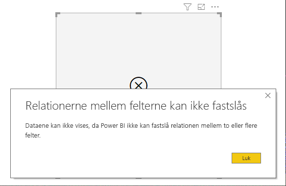
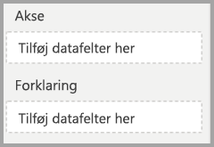

# Vis elementer uden data i Power BI

Med Power BI kan du visualisere mange forskellige data fra forskellige kilder. I forbindelse med visualiseringer viser Power BI kun relevante data, når du opretter en visualisering, for på behørig vis at kunne administrere den måde, som data præsenteres og vises på. Power BI fastlægger, hvilke data der er relevante på baggrund af konfigurationen af visualiseringen og den underliggende datamodel. I denne artikel beskrives det, hvordan Power BI fungerer, når de relevante data skal findes. Der er inkluderet eksempler, som illustrerer, hvordan valget foretages.

## Fastlæggelse af relevante data

Lad os kigge på en tabel som et simpelt eksempel for at komme i gang med at forstå, hvordan Power BI fastlægger, hvilke data er relevante. Overvej at skabe en tabel med følgende indstillinger ved hjælp af den model, der repræsenteres i sektionen [eksempel på datamodel](#example-data-model), som kan ses i slutningen af denne artikel:

**1. Grupper fra den samme tabel:** *Produkt[Farve] – Produkt[Størrelse]*

|*Produkt[Farve]*  |*Produkt[Størrelse]*  |
|---------|---------|
|Blå     |Stor         |
|Blå     |Mellem         |
|Blå     |Lille         |
|Red     |Stor         |

I dette eksempel viser Power BI kombinationer af *[Farve – Størrelse]* , som findes i tabellen *[Produkt]* . 

Las os nu se på en anden kombination:

**2. Grupper fra forskellige, men direkte relaterede tabeller og en måling:** *Produktstil[Finish] – Produkt[Farve] – Sum(Salg[Antal])*

|*Produktstil[Finish]*  |*Produkt[Farve]*  |*[Sumantal]*  |
|---------|---------|---------|
|Blank     |Blå         |10         |
|Mat     |Blå         |15         |

I dette eksempel viser Power BI kun kombinationer, der findes. Der vises f.eks. ikke ("Ingen" + "Blå") eller ("Mat" + "Rød"), da disse kombinationer ikke findes i modulet. Den betingelse, der bestemmer, hvilke kombinationer der findes, er værdien for *Sum(Salg[Antal])* , som ikke må være tom.

Las os se på en anden sag: 

**3. Grupper fra forskellige, men relaterede tabeller uden måling:** *Produktstil[Finish] – Produkt[Farve]*

|*Produktstil[Finish]*  |*Produkt[Farve]*  |
|---------|---------|
|Blank     |Blå         |
|Blank     |Red         |
|Mat     |Blå         |

Da der ikke er nogen eksplicit måling, og de to tabeller er direkte relateret, forsøger Power BI at indsætte en måling for at begrænse de kombinationer, der er resultatet. I dette tilfælde indsætter Power BI en måling af typen *BEREGN(ANTALRÆKKER("Produkt"))* , som ikke må være tom, da *Produkt* er den tabel, som er fælles for begge tabeller.

Derfor viser Power BI de kombinationer, der har poster i tabellen Produkt, hvilket udelukker kombinationerne *("Ingen" + "Blå")* og *("Mat" + "Rød")* .

**4. Grupper fra forskellige og ikke-relaterede tabeller**

Eksempelmodellen har ikke denne kombination, men hvis der var grupper fra forskellige og ikke-relaterede tabeller, ville Power BI ikke kunne relatere to kolonner. Resultatet er en crossjoin af alle værdierne i hver kolonne. I denne situation udsteder Power BI en fejl af typen *joinforbindelse uden begrænsninger*, fordi sådanne krydsjoinforbindelser er dyre at beregne i databasen og giver ikke brugeren mange oplysninger. 

## Visning af elementer uden data

I forrige afsnit blev det beskrevet, hvordan Power BI fastlægger, hvilke data der er relevante at vise. Men der kan være situationer, hvor du *vil* vise elementer uden data. 

Funktionen **Vis elementer uden data** gør det muligt at gøre netop det: at inkludere datarækker og -kolonner, der ikke indeholder måledata (tomme måleværdier).

Vælg en visualisering for at aktivere funktionen **Vis elementer uden data**, højreklik derefter på feltet i brønden **Felter**, og vælg **Vis elementer uden data** i den viste menu, som vist på følgende billede:

Funktionen **Vis elementer uden data** har *ingen* effekt i følgende situationer:

* Der er ikke føjet nogen måling til visualiseringen, og grupperingskolonnerne kommer fra den samme tabel
* Grupper er ikke relateret. Power BI kører ikke forespørgsler for visualiseringer, hvor grupperne ikke er relaterede
* Målingen er ikke relateret til nogen af grupperne. Dette skyldes, at målingen aldrig vil være tom for kun nogle gruppekombinationer
* Der er et brugerdefineret filter til målinger, som ekskluderer tomme målinger, f.eks.: *Salgsmængde > 0*

### Sådan fungerer Vis elementer uden data

De mest interessante anvendelsesområder for **Vis elementer uden data** er, når der er målinger. Lad os se på den situationen, hvor grupperne er fra den samme tabel eller kan være relaterede via en sti i modellen. *Produktstil* er f.eks. direkte relateret til *Produkt* og indirekte relateret til *Salg*. *Produktstil* og *Produktkategori* kan være relateret via tabellen *Produkt* osv.

Lad os se på et par interessante tilfælde og sammenligne, når **Vis elementer uden data** er slået fra og derefter til. 

**1. Grupperingskolonner fra den samme tabel:** *Produkt[Farve] – Produkt[Størrelse] – Sum(Salg[Antal])*

Sådan ser det ud, når funktionen **Vis elementer uden data** er slået fra:

|*Produkt[Farve]*  |*Produkt[Størrelse]*  |*[Sumantal]*  |
|---------|---------|---------|
|Blå     |Mellem         |15         |
|Blå     |Lille         |10         |

Sådan ser det ud, når funktionen **Vis elementer uden data** er slået til:

|*Produkt[Farve]*  |*Produkt[Størrelse]*  |*[Sumantal]*  |
|---------|---------|---------|
|Blå     |Stor         |         |
|Blå     |Mellem         |15         |
|Blå     |Lille         |10         |
|Red     |Stor         |         |

Bemærk, at der blev vist to nye kombinationer, når funktionen er slået til: *Blå – Stor* og *Rød – Stor*. Begge disse poster har ingen tilsvarende *Antal* i tabellen *Salg*. Men de vises i tabellen *Produkt*.

**2. Grupperingskolonner fra relaterede tabeller:** *Produktstil[Finish] – Produkt[Farve] – Sum(Salg[Antal])*

Sådan ser det ud, når funktionen **Vis elementer uden data** er slået fra:

|*Produktstil[Finish]*  |*Produkt[Farve]*  |*[Sumantal]*  |
|---------|---------|---------|
|Blank     |Blå         |10         |
|Mat     |Blå         |15         |

Sådan ser det ud, når funktionen **Vis elementer uden data** er slået til:

|*Produktstil[Finish]*  |*Produkt[Farve]*  |*[Sumantal]*  |
|---------|---------|---------|
|Blank     |Blå         |10         |
|Blank     |Red         |         |
|Mat     |Blå         |15         |
|Ingen     |         |         |

Bemærk, at *(Blank – Rød)* og *(Ingen – Tom)* blev vist som kombinationer. Her er årsagen til, at de blev vist:
* Power BI overvejede først Produktstil[Finish] og valgte alle værdier, der kunne vises. Dette resulterede i Blank, Mat og Ingen.
* Ved hjælp af hver af disse værdier valgte Power BI alle tilsvarende poster for *Produkt[Farve]* 
* Da *Ingen* ikke svarer til nogen *Produkt[Farve]* , vises der ikke noget for denne værdi

Det er vigtigt at bemærke, at mekanismen med at vælge værdier for kolonnerne afhænger af rækkefølgen og kan opfattes som en handling af typen *venstre ydre joinforbindelse* mellem tabeller. Hvis rækkefølgen af kolonnerne ændres, ændres resultaterne også.

Lad os se nærmere på et eksempel, hvor rækkefølgen ændres, og hvordan det påvirker resultaterne. Dette er det samme som element **2** i dette afsnit, bare hvor rækkefølge ændres.

**Produkt[Farve] – Produktstil[Finish] – Sum(Salg[Antal])**

Sådan ser det ud, når funktionen **Vis elementer uden data** er slået til:

|*Produkt[Farve]* |*Produktstil[Finish]*  |*[Sumantal]*  |
|---------|---------|---------|
|Blå     |Blank         |10         |
|Blå     |Mat         |15         |
|Red     |Blank         |         |

Bemærk i dette tilfælde, at *Produktstil[Finish]=Ingen* ikke vises i tabellen. I dette tilfælde skyldes det, at Power BI først valgte alle værdierne for *Farve* i tabellen *Produkt*. For hver farve valgte Power BI derefter de tilsvarende værdier for *Finish*, som indeholdt data. Da *Ingen* ikke vises i nogen kombination af *Farve*, vælges denne værdi ikke.

## Funktionsmåde af visualiseringer i Power BI

Når **Vis elementer uden data** er aktiveret for ét felt i en visualisering, aktiveres funktionen automatisk for alle andre felter, der findes i den samme *visuelle bucket* eller det samme hierarki. En visuel bucket eller et hierarki kan være henholdsvist **Akse** eller **Forklaring** eller **Kategori**, **Rækker** eller **Kolonner**.

Hvis **Vis elementer uden data** f.eks. er aktiveret for ét felt i en matrixvisualisering med fire felter i bucketen **Rækker**, er funktionen aktiveret for alle elementer i matrixen. På følgende billede er **Vis elementer uden data** aktiveret for det første felt i bucketen **Rækker**, nemlig feltet *Leverandør-id*. Men det er også automatisk aktiveret for de andre felter i bucketen **Rækker**.

I modsætning hertil er **Vis elementer uden data***ikke* aktiveret automatisk for feltet *Kontinent*, som vises i bucketen **Kolonner**. 

Funktionsmåden af visualiseringen ses ofte, når en visualisering konverteres til en anden type, f.eks. konvertering af en matrixvisualisering til en tabelvisualisering. Ved sådanne konverteringer er **Vis elementer uden data** automatisk aktiveret for alle felter, der flyttes til en bucket, hvor funktionen er aktiveret for et felt i det pågældende bucket. Hvis funktionen **Vis elementer uden data** er aktiveret for *Leverandør-id* i forrige eksempel, og visualiseringen konverteres til en tabel, flyttes feltet *Kontinent* fra bucketen **Kolonner** (sammen med felterne i bucketen **Rækker**) til den eneste bucket, der bruges i en tabelvisualisering, nemlig bucketen **Værdier**. Derfor vil **Vis elementer uden data** være aktiveret for alle felter i bucketen **Værdier**.

### Eksport af data

Når du bruger funktionen **Eksportér opsummerede data**, er funktionsmåden af funktionen **Vis elementer uden data** den samme, som hvis eksporten blev konverteret til en tabelvisualisering. Når du eksporterer en visualisering, f.eks. visualiseringen Diagrammatrix, vil de eksporterede data derfor muligvis se anderledes ud end den viste visualisering. Det skyldes, at **Vis elementer uden data** aktiveres for alle eksporterede felter under konverteringen til en tabelvisualisering. 

## Eksempel på datamodel

I dette afsnit kan du se eksemplet på datamodellen, som bruges i eksemplerne i denne artikel.

**Model**: 

**Data**:

|Produkt[Produkt-id]|    Produkt[Produktnavn]|   Produkt[Farve]| Produkt[Størrelse]|  Produkt[Kategori-id]|    Produkt[Stil-id]|
|---------|---------|---------|---------|---------|---------|
|1  |Prod1  |Blå   |Lille  |1  |1 |
|2  |Prod2  |Blå   |Mellem |2  |2 |
|3  |Prod3  |Red    |Stor  |1  |1 |
|4  |Prod4  |Blå   |Stor  |2  |2 |

|Produktkategori[Kategori-id]|   Produktkategori[Kategorinavn]|
|---------|---------|
|1  |Telefon   |
|2  |Kamera |
|3  |TV |

|Produktstil[Stil-id]| Produktstil[Finish]|   Produktstil[Poleret]|
|---------|---------|---------|
|1  |Blank  |Ja |
|2  |Mat  |Nej |
|3  |Ingen   |Nej |

|Salg[Salgs-id]| Salg[Produkt-id]|   Salg[Dato]|    Salg[Antal]|
|---------|---------|---------|---------|
|1  |1  |1/1/2012 0:00| 10 |
|2  |2  |1/1/2013 0:00| 15 |

## Næste trin

I denne artikel beskrives det, hvordan du kan aktivere funktionen **Vis elementer uden data** i Power BI. Du vil måske også være interesseret i følgende artikler: 

* [Standardmedlem i flerdimensionelle modeller i Power BI](../connect-data/desktop-default-member-multidimensional-models.md)
