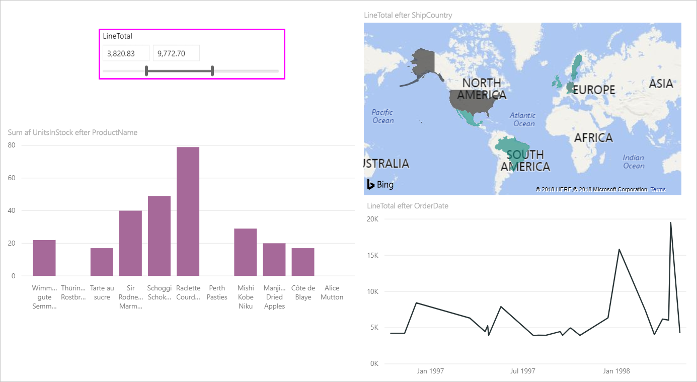
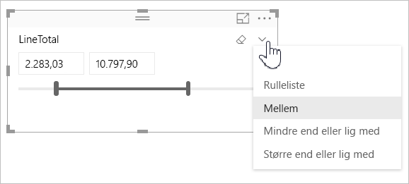
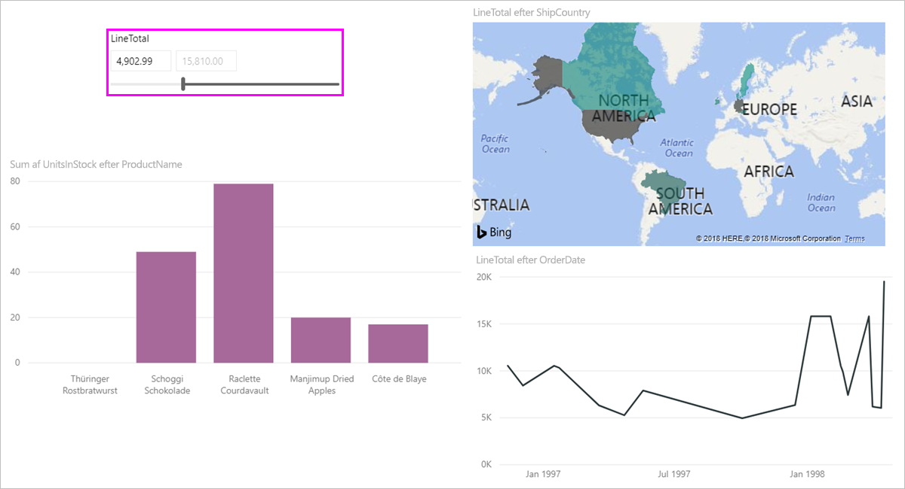

# Brug udsnitsværktøjet til numeriske områder i Power BI

[!INCLUDE [applies-to](../includes/applies-to.md)] [!INCLUDE [yes-desktop](../includes/yes-desktop.md)] [!INCLUDE [yes-service](../includes/yes-service.md)]

Med udsnitsværktøjet til numerisk område kan du anvende forskellige filtre på en numerisk kolonne i din datamodel. Der er tre muligheder for at filtrere dine numeriske data: mellem tal, mindre end eller lig med et tal samt større end eller lig med et tal. Denne enkle teknik er en effektiv måde at filtrere dine data på.

## Video

I denne video gennemgås det, hvordan du opretter et udsnitsværktøj til numeriske områder.

> [!NOTE]
> I denne video bruges en ældre version af Power BI Desktop.

<iframe width="560" height="315" src="https://www.youtube.com/embed/zIZPA0UrJyA" frameborder="0" allowfullscreen></iframe> 

## Tilføj udsnitsværktøj til numeriske områder

Du kan bruge udsnitsværktøjet til numerisk område ligesom ethvert andet udsnitsværktøj. Du skal blot oprette et **udsnitsværktøj**, der er synligt for din rapport, og derefter vælge en numerisk værdi for **Felt**-værdien. På følgende billede er feltet **LineTotal** markeret.

Hvis du vælger pil ned i øverste højre hjørne af udsnitsværktøjet til numerisk område, vises der en menu.

I forbindelse med det numeriske område kan du vælge mellem følgende tre muligheder:

* **Mellem**
* **Mindre end eller lig med**
* **Større end eller lig med**

Når du vælger **Mellem** i menuen, vises der en skyder. Du kan bruge skyderen til at vælge numeriske værdier, der ligger mellem tallene. Nogle gange gør kornetheden af skyderen det svært, at ramme det præcise tal. Du kan også bruge skyderen og skrive den ønskede værdi i et af felterne. Denne indstilling er praktisk, når du vil se et udsnit af bestemte tal.

På følgende billede er rapportsiden filtreret for **LineTotal**-værdier i området mellem 2.500,00 og 6.000,00.

Når du vælger **Mindre end eller lig med**, forsvinder skyderens venstre håndtag (lavere værdi), og du kan kun justere skyderens øvre grænse. På følgende billede angiver vi skyderen til maksimalt 5928.19.

Sidst men ikke mindst, hvis du vælger **Større end eller lig med**, forsvinder skyderens højre håndtag (højere værdi). Du kan derefter justere den lavere værdi som vist på følgende billede. Nu vises der kun elementer, der har en **LineTotal**, som er større end eller lig med 4.902,99, i visualiseringerne på rapportsiden.

## Fastgør til hele tal ved hjælp af udsnitsværktøj til numerisk område

Et udsnitsværktøj til et numerisk område fastgøres til heltal, hvis datatypen for det underliggende felt er *Heltal*. Med denne funktion kan udsnitsværktøjet nemt afstemmes til heltal. I feltet *Decimaltal* kan du angive eller vælge brøkdele af et tal. Den formatering, der anvendes i tekstfeltet, matcher den formatering, der er anvendt i feltet, selvom du kan angive eller vælge mere præcise tal.

## Vis formatering med udsnitsværktøjet til datoområder

Når du bruger et udsnit til at få vist eller angive et område for datoer, vises datoerne i det *korte datoformat*. Landestandarden for brugerens browser eller operativsystem bestemmer datoformatet. Dette er derfor det viste format, uanset hvilke indstillinger for datatype der er for den underliggende data eller model.

Du kan f. eks. have et langt datoformat for den underliggende datatype. I dette tilfælde formaterer et datoformat såsom *dddd, d MMMM åååå* en dato i andre visualiseringer eller under andre forhold som *onsdag, 14. marts 2001*. Men i udsnitsværktøjet til datoområde vises denne dato i udsnittet som *14-03-2001.*

Visning af det korte datoformat i udsnitsværktøjet sikrer, at længden af strengen forbliver konsistent og kompakt i udsnitsværktøjet.

## Begrænsninger og overvejelser

Følgende begrænsninger og overvejelser gælder for udsnitsværktøjet til numerisk område:

* Udsnitsværktøjet til numerisk område filtrerer alle underliggende rækker i dataene, men ingen samlede værdier. Lad os f.eks. sige, at du bruger feltet *Salgsbeløb*. Udsnitsværktøjet filtrerer derefter hver transaktion baseret på salgsbeløbet og ikke summen af salgsbeløbet for hvert enkelt datapunkt i en visualisering.
* Det fungerer i øjeblikket ikke sammen med målinger.
* Du kan skrive et vilkårligt tal i et numerisk udsnitsværktøj, selvom det er uden for området af værdier i den underliggende kolonne. Denne indstilling giver dig mulighed for at konfigurere filtre, hvis du ved, at dataene kan blive ændret i fremtiden.
