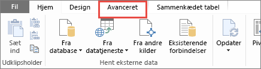
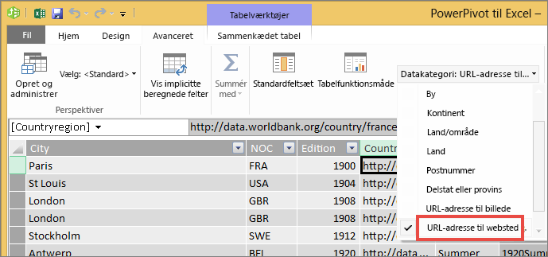

# Føj links (URL-adresser) til en tabel eller en matrix
I dette emne lærer du, hvordan du føjer links (URL-adresser) til en tabel. Du kan bruge Power BI Desktop til at føje links (URL-adresser) til et datasæt. Derefter kan du bruge enten Power BI Desktop eller Power BI-tjenesten til at føje disse links til tabeller og matrixer i din rapport. Du kan derefter få vist URL-adressen eller et linkikon eller formatere en anden kolonne som linktekst.

Du kan også oprette links i [tekstfelter i rapporter](service-add-hyperlink-to-text-box.md) i Power BI-tjenesten og Power BI Desktop. I Power BI-tjenesten kan du føje links til [felter på dashboards](service-dashboard-edit-tile.md) og [tekstfelter på dashboards](service-dashboard-add-widget.md). 

## Formatér en URL-adresse som et link i Power BI Desktop

Du kan formatere et felt med URL-adresser som links i Power BI Desktop, men ikke i Power BI-tjenesten. Du kan også [formatere links i Excel Power Pivot](#create-a-table-or-matrix-hyperlink-in-excel-power-pivot), før projektmappen importeres i Power BI.

1. Hvis et felt med et link ikke allerede findes i dit datasæt, kan du bruge Power BI Desktop til at tilføje det som en [brugerdefineret kolonne](../transform-model/desktop-common-query-tasks.md).

    > [!NOTE]
    > Du kan ikke oprette en kolonne i DirectQuery-tilstand.  Men hvis dine data allerede indeholder URL-adresser, kan du lave dem til links.

2. Vælg kolonnen i datavisning eller rapportvisning. 

3. På fanen **Modellering** skal du vælge **Datakategori** > **URL-adresse for websted**.
   
    

    > [!NOTE]
    > URL-adresser skal starte med bestemte præfikser. Du kan se den komplette liste under [Overvejelser og fejlfinding](#considerations-and-troubleshooting) i denne artikel.

## Opret en tabel eller matrix med et link

1. Når du har [formateret et link som en URL-adresse](#format-a-url-as-a-hyperlink-in-power-bi-desktop), skal du skifte til rapportvisning.
2. Opret en tabel eller matrix med det felt, du har kategoriseret som en URL-adresse til et websted. Linkene bliver blå og understreget.

    

## Vis et linkikon i stedet for en URL-adresse

Hvis du ikke vil vise en lang URL-adresse i en tabel, kan du vise et hyperlinkikon  i stedet. 

> [!NOTE]
> Du kan ikke vise ikoner i matricer.
   
1. Du skal først [oprette en tabel eller matrix med et link](#create-a-table-or-matrix-with-a-hyperlink).

2. Markér tabellen for at aktivere den.

    Vælg ikonet **Format**  for at åbne fanen Format.

    Udvid **Værdier**, find **URL-ikonet**, og slå indstillingen **til**.

    

1. (Valgfrit) Du kan [publicere rapporten](desktop-upload-desktop-files.md) fra Power BI Desktop til Power BI-tjenesten. Når du åbner rapporten i Power BI-tjenesten, fungerer linkene også der.

## Formatér linktekst som et link

Du kan også formatere et andet felt i en tabel som linket og slet ikke have en kolonne til URL-adressen. I dette tilfælde formaterer du ikke kolonnen som en URL-adresse til et websted.

> [!NOTE]
> Du kan ikke formatere et andet felt som linket i en matrix.

1. Hvis et felt med et link ikke allerede findes i dit datasæt, kan du bruge Power BI Desktop til at tilføje det som en [brugerdefineret kolonne](../transform-model/desktop-common-query-tasks.md). Du kan ikke oprette en kolonne i DirectQuery-tilstand.  Men hvis dine data allerede indeholder URL-adresser, kan du lave dem til links.

2. I datavisning eller rapportvisning skal du vælge den kolonne, der indeholder URL-adressen. 

3. På fanen **Modellering** skal du vælge **Datakategori**. Sørg for, at kolonnen er formateret som **Ikke-kategoriseret**.

2. I rapportvisning skal du oprette en tabel eller matrix med kolonnen med URL-adresser og den kolonne, du vil formatere som linktekst.

3. Når tabellen er markeret, skal du vælge ikonet **Format**  for at åbne fanen Format.

4. Udvid **Betinget formatering**, og sørg for, at navnet i feltet er den kolonne, du vil bruge som linktekst. Find **URL-adresse til websted**, og angiv indstillingen til **Til**.

    

    > [!NOTE]
    > Hvis du ikke kan se indstillingen **URL-adresse til websted**, skal du sørge for, at den kolonne, der indeholder linkene, *ikke* formateres som **URL-adresse til websted** på rullelisten **Datakategori**.

5. I dialogboksen **URL-adresse til websted** skal du vælge det felt, der indeholder URL-adressen, i feltet **Baseret på felt** > **OK**.

    

    Nu er teksten i den pågældende kolonne formateret som et link.

    

1. (Valgfrit) Du kan [publicere rapporten](desktop-upload-desktop-files.md) fra Power BI Desktop til Power BI-tjenesten. Når du åbner rapporten i Power BI-tjenesten, fungerer linkene også der.

## Opret et tabel- eller matrixlink i Excel Power Pivot

En anden metode til at tilføje links i dine Power BI-tabeller og -matricer er at oprette links i datasættet, før du importerer/opretter forbindelse til datasættet fra Power BI. I dette eksempel bruges der en Excel-projektmappe.

1. Åbn projektmappen i Excel.
2. Vælg fanen **PowerPivot**, og vælg derefter **Administrer**.
   
   
1. Når PowerPivot åbnes, skal du vælge fanen **Avanceret**.
   
   
4. Placer markøren i den kolonne, der indeholder de URL-adresser, du vil lave til links i Power BI-tabellerne.
   
   > [!NOTE]
   > URL-adresser skal starte med bestemte præfikser. Du kan se den komplette liste under [Overvejelser og fejlfinding](#considerations-and-troubleshooting).
   > 
   
5. I gruppen **Egenskaber for rapportering** skal du vælge rullemenuen **Datakategori** og vælge **Web URL / Webadresse**. 
   
   

6. Opret forbindelse til eller importér denne projektmappe fra Power BI-tjenesten eller Power BI Desktop.
7. Opret en tabelvisualisering, der indeholder URL-feltet.
   
   

## Overvejelser og fejlfinding

URL-adresser skal starte med en af følgende:
- http
- https
- -mailto
- fil
- ftp
- nyheder
- telnet

Spørgsmål: Kan jeg bruge en brugerdefineret URL-adresse som et hyperlink i en tabel eller en matrix?    
Svar: Nej. Du kan bruge et linkikon. Hvis du har brug for brugerdefineret tekst til dine hyperlinks, og din liste over URL-adresser er kort, bør du overveje at bruge et tekstfelt i stedet for.

## De næste trin
[Visualiseringer i Power BI-rapporter](../visuals/power-bi-report-visualizations.md)

[Grundlæggende begreber for designere i Power BI-tjenesten](../fundamentals/service-basic-concepts.md)

Har du flere spørgsmål? [Prøv at spørge Power BI-community'et](https://community.powerbi.com/)
