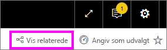
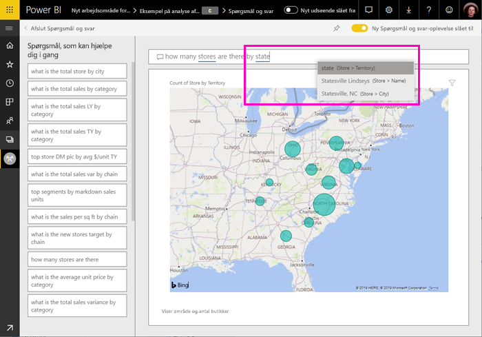
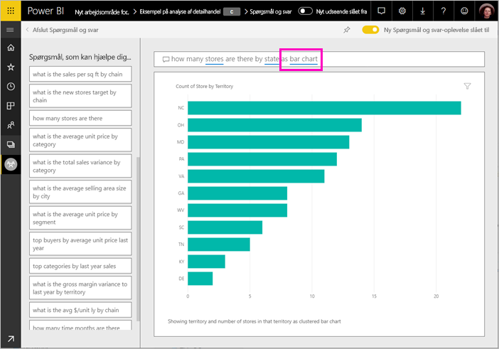
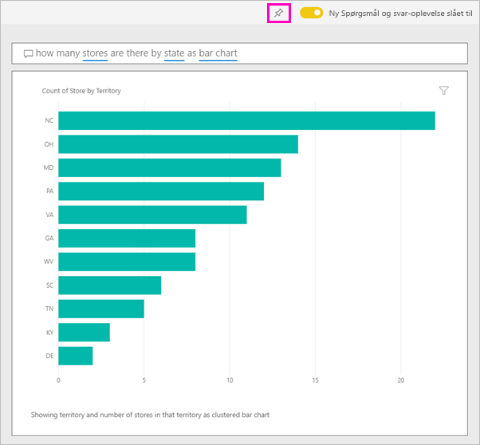
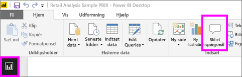
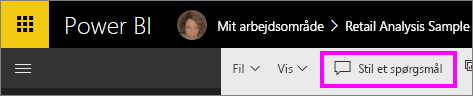
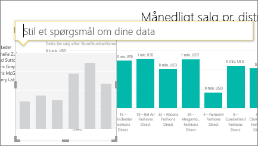
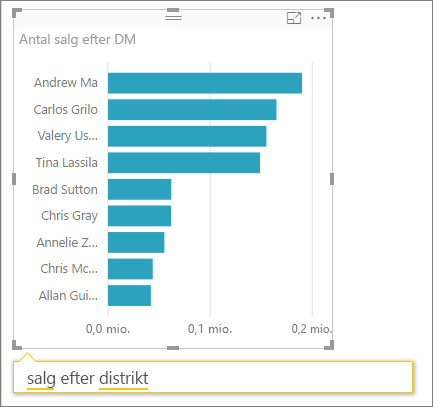
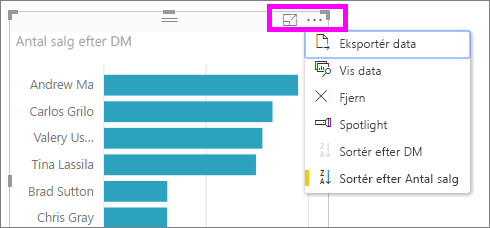

# Brug Spørgsmål og svar i Power BI til at udforske dine data og oprette visuelle elementer

Den hurtigste måde at få svar ud af dine data på er nogle gange at stille et spørgsmål på et naturligt sprog. Funktionen Spørgsmål og svar i Power BI giver dig mulighed for at udforske dine data med dine egne ord.  Første del af denne artikel viser, hvordan du bruger Spørgsmål og svar i Power BI-tjenesten. Den anden del viser, hvad du kan gøre med Spørgsmål og svar, når du opretter rapporter enten i Power BI-tjenesten eller Power BI Desktop. Se artiklen [Spørgsmål og svar til forbrugere](../consumer/end-user-q-and-a.md) for at få flere bagrundsoplysninger. 

[Spørgsmål og svar i Power BI-mobilapps](../consumer/mobile/mobile-apps-ios-qna.md) og [Spørgsmål og svar med Power BI Embedded](../developer/embedded/qanda.md) behandles i særskilte artikler. 

Funktionen Spørgsmål og svar er interaktiv, ja endda sjov. Ofte fører ét spørgsmål til andre, da visualiseringerne viser interessante stier, der skal udforskes. Se Amanda demonstrere brugen af Spørgsmål og svar til at oprette visualiseringer, grave ned i disse visuals og fastgøre dem til dashboards.

<iframe width="560" height="315" src="https://www.youtube.com/embed/qMf7OLJfCz8?list=PL1N57mwBHtN0JFoKSR0n-tBkUJHeMP2cP" frameborder="0" allowfullscreen></iframe>

## Del 1: Brug Spørgsmål og svar på et dashboard i Power BI-tjenesten

I Power BI-tjenesten (app.powerbi.com) indeholder et dashboard felter, der er fastgjort fra et eller flere datasæt, så du kan stille spørgsmål om alle dataene, der er indeholdt i alle disse datasæt. Hvis du vil se, hvilke rapporter og datasæt der blev brugt til at oprette dashboardet, skal du vælge **Få vist relaterede** på menulinjen.

Feltet Spørgsmål og svar er placeret i det øverste venstre hjørne af dashboardet, og her skal du indtaste dit spørgsmål i et naturligt sprog. Kan du ikke se feltet Spørgsmål og svar? Se [Overvejelser og fejlfinding](../consumer/end-user-q-and-a.md#considerations-and-troubleshooting) i artiklen **Spørgsmål og svar til forbrugere**.  Spørgsmål og svar kan genkende de ord, du skriver, og kan regne ud, hvor (i hvilket datasæt) svaret findes. Spørgsmål og svar hjælper dig også med udforme dit spørgsmål med automatisk fuldførelse, anden formulering og andre tekst- og visuelle hjælpemidler.

Svaret på dit spørgsmål vises som en interaktiv visualisering og opdateres, når du ændrer spørgsmålet.

1. Åbn et dashboard, og placer markøren i spørgsmålsfeltet. Vælg **Ny Spørgsmål og svar-oplevelse** i øverste højre hjørne.

    

1. Selv inden du begynder at skrive, viser Spørgsmål og svar en ny skærm med forslag som hjælp til at udforme dit spørgsmål. Du får vist udtryk og fuldførte spørgsmål, der indeholder navnene på tabellerne i de underliggende datasæt og kan muligvis se fuldførte spørgsmål på listen, hvis datasættets ejer har oprettet [udvalgte spørgsmål](service-q-and-a-create-featured-questions.md),

   

   Du kan vælge et af disse spørgsmål som udgangspunkt og fortsætte med at forbedre spørgsmålet for at finde et specifikt svar. Eller brug et tabelnavn til at hjælpe dig med at formulere et nyt spørgsmål.

2. Vælg på listen over spørgsmål, eller begynd at skrive dit eget spørgsmål, og vælg blandt forslagene på rullelisten.

   

3. Når du skriver et spørgsmål, vælger Spørgsmål og svar den bedste visualisering til at vise dit svar.

   

4. Visualiseringen ændres dynamisk, når du ændrer spørgsmålet.

   

1. Når du skriver et spørgsmål, leder Power BI efter det bedste svar ved hjælp af et vilkårligt datasæt, der har et felt i det pågældende dashboard.  Hvis alle felterne kommer fra *datasæt A*, så kommer dit svar fra *datasæt A*.  Hvis der er felter fra *datasæt A* og *datasæt B*, søger Spørgsmål og svar efter det bedste svar fra disse 2 datasæt.

   > [!TIP]
   > Så vær forsigtig, for hvis du kun har ét felt fra *datasæt A*, og du fjerner det fra dashboardet, vil Spørgsmål og svar ikke længere have adgang til *datasæt A*.
   >

5. Når du er tilfreds med resultatet, kan du fastgøre visualiseringen til et dashboard ved at vælge fastgørelsesikonet i øverste højre hjørne. Hvis dashboardet er blevet delt med dig, eller det er en del af en app, kan det ikke fastgøres.

   

## Del 2: Brug Spørgsmål og svar i en rapport i Power BI-tjenesten eller Power BI Desktop

Brug Spørgsmål og svar til at udforske dine datasæt og føje visualiseringer til rapporten og til dashboards. En rapport er baseret på et enkelt datasæt og kan være helt tom eller indeholde sider, der er fulde af visualiseringer. Men bare fordi en rapport er tom, så betyder det ikke, at der ikke er nogen data, du kan udforske – datasættet er knyttet til rapporten og afventer, at du udforsker og opretter visualiseringer.  Du kan få vist, hvilket datasæt der bruges til at oprette en rapport, ved at åbne rapporten i Power BI-tjenestens Læsevisning og vælge **Få vist relaterede** på menulinjen.

Hvis du vil bruge Spørgsmål og svar i rapporter, skal du have redigeringstilladelser til rapporten og det underliggende datasæt. I artiklen [Spørgsmål og svar til forbrugere](../consumer/end-user-q-and-a.md) refererer vi til dette som et *opretter*scenarie. Hvis du i stedet *forbruger* en rapport, der er blevet delt med dig, er Spørgsmål og svar ikke tilgængelig.

1. Åbn en rapport i Redigeringsvisning (Power BI-tjenesten) eller Rapportvisning (Power BI Desktop), og vælg **Stil et spørgsmål** på menulinjen.

    **Power BI Desktop**    
    

    **Tjeneste**    
    

2. Et Spørgsmål og svar-felt vises på rapportcanvasset. I eksemplet nedenfor vises spørgsmålsfeltet oven på en anden visualisering. Det er fint nok, men det kan være en fordel at føje en tom side til rapporten, før du stiller et spørgsmål.

    

3. Placer markøren i spørgsmålsfeltet. Mens du skriver, viser Spørgsmål og svar forslag, som kan hjælpe dig med at definere dit spørgsmål.

   

4. Imens du skriver et spørgsmål, vælger Spørgsmål og svar den bedste [visualisering ](../visuals/power-bi-visualization-types-for-reports-and-q-and-a.md)til at vise dit svar, og visualiseringen ændres automatisk, når du ændrer spørgsmålet.

   

5. Når du har den ønskede visualisering, skal du vælge ENTER. Hvis du vil gemme visualiseringen med rapporten, skal du vælge **Filer > Gem**.

6. Interager med den nye visualisering. Det er lige meget, hvordan du har oprettet visualiseringen – du har adgang til samme interaktivitet, formatering og funktioner.

   

   Hvis du har oprettet visualiseringen i Power BI-tjenesten, kan du endda [fastgøre den til et dashboard](service-dashboard-pin-tile-from-q-and-a.md).

## Fortæl Spørgsmål og svar, hvilken visualisering der skal bruges
Du kan bruge Spørgsmål og svar til ikke kun at bede dine data om at tale for sig selv, du kan også bestemme, hvordan Power BI skal vise svaret. Føj blot "som et <visualization type>" til slutningen af dit spørgsmål.  F.eks. "vis lagermængde efter fabrik som et kort" og "vis samlet lagerbeholdning som et kort".  Prøv selv.

## Overvejelser og fejlfinding
- Hvis du har forbindelse til et datasæt ved hjælp af en direkte forbindelse eller gateway, så skal Spørgsmål og svar være [aktiveret for det pågældende datasæt](service-q-and-a-direct-query.md).

- Du har åbnet en rapport, men kan ikke se indstillingen Spørgsmål og svar. Hvis du bruger Power BI-tjenesten, skal du sørge for, at rapporten er åben i Redigeringsvisning. Hvis du ikke kan åbne Redigeringsvisning, så har du ikke redigeringstilladelser for den pågældende rapport, og du kan bruge Spørgsmål og svar med den relevante rapport.

## Næste trin

- [Spørgsmål og svar til forbrugere](../consumer/end-user-q-and-a.md)   
- [Tip til at stille spørgsmål med Spørgsmål og svar](../consumer/end-user-q-and-a-tips.md)   
- [Klargør en projektmappe til Spørgsmål og svar](service-prepare-data-for-q-and-a.md)  
- [Udarbejd et datasæt i det lokale miljø til Spørgsmål og svar](service-q-and-a-direct-query.md)   
- [Fastgør et felt til dashboardet fra Spørgsmål og svar](service-dashboard-pin-tile-from-q-and-a.md)
