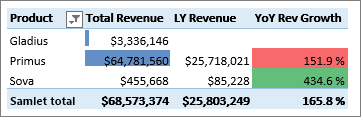
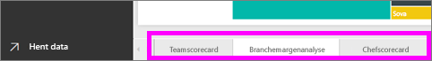
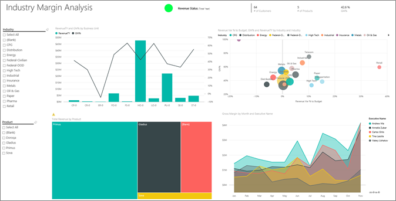

# Eksempel på kunderentabilitet til Power BI: Få en introduktion

Indholdspakken med eksemplet på kunderentabilitet indeholder et dashboard, en rapport og datasæt for en virksomhed, der producerer markedsføringsmateriale. Dette dashboard blev oprettet af en økonomidirektør med henblik på at se nøgletal for de fem afdelingsledere (direktører), produkter, kunder og bruttoavance (BA). Det er hurtigt at se, hvilke faktorer der påvirker rentabiliteten.

Dette eksempel er en del af en serie, der viser, hvordan du kan bruge Power BI med forretningsrelaterede data, rapporter og dashboards. Det blev oprettet af [obviEnce](http://www.obvience.com/) med rigtige data, som er blevet anonymiseret. Dataene er tilgængelige i flere formater: indholdspakke, .pbix-fil til Power BI Desktop eller Excel-projektmappe. Se [Eksempler til Power BI](sample-datasets.md). 

I dette selvstudium udforskes indholdspakken med eksemplet på kunderentabilitet i Power BI-tjenesten. Da rapportoplevelsen i Power BI Desktop og i tjenesten minder meget om hinanden, kan du også følge med ved at bruge .pbix-eksempelfilen i Power BI Desktop. 

Du behøver ikke en Power BI-licens for at udforske eksemplerne i Power BI Desktop. Hvis du ikke har en Power BI Pro-licens, kan du gemme eksemplet i Mit arbejdsområde i Power BI-tjenesten. 

## Hent eksemplet

Før du kan bruge eksemplet, skal du først downloade det som en [indholdspakke](#get-the-content-pack-for-this-sample), [.pbix-fil](#get-the-pbix-file-for-this-sample) eller [Excel-projektmappe](#get-the-excel-workbook-for-this-sample).

### Hent indholdspakken for dette eksempel

1. Åbn Power BI-tjenesten (app.powerbi.com), log på, og åbn det arbejdsområde, hvor du vil gemme eksemplet.

   Hvis du ikke har en Power BI Pro-licens, kan du gemme eksemplet i Mit arbejdsområde.

2. Vælg **Hent data** i nederste venstre hjørne.

   
3. På siden **Hent data**, der vises, skal du vælge **Eksempler**.

4. Vælg **Eksempel på kunderentabilitet**, og vælg derefter **Opret forbindelse**.  

    
5. Power BI importerer indholdspakken og føjer derefter et nyt dashboard, en ny rapport og et nyt datasæt til dit aktuelle arbejdsområde.

    

### Hent .pbix-filen knyttet til dette eksempel

Alternativt kan du downloade eksemplet på kunderentabilitet som en [.pbix-fil](https://download.microsoft.com/download/6/A/9/6A93FD6E-CBA5-40BD-B42E-4DCAE8CDD059/Customer%20Profitability%20Sample%20PBIX.pbix), der er designet til at blive brugt sammen med Power BI Desktop.

### Hent Excel-projektmappen for dette eksempel

Hvis du vil have vist datakilden for dette eksempel, er den også tilgængelig som en [Excel-projektmappe](https://go.microsoft.com/fwlink/?LinkId=529781). Projektmappen indeholder Power View-ark, som du kan få vist og redigere. Hvis du vil se rådataene, skal du aktivere tilføjelsesprogrammerne Dataanalyse og derefter vælge **Power Pivot > Administrer**. Hvis du vil aktivere tilføjelsesprogrammerne Power View og Power Pivot, kan du finde flere oplysninger under [Udforsk Excel-eksemplerne i Excel](sample-datasets.md#explore-excel-samples-inside-excel).

## Hvad fortæller vores dashboard os?

Find dashboardet Kunderentabilitet i det arbejdsområde, hvor du gemte eksemplet, og vælg den:

### Virksomhedsdækkende dashboardfelter
1. Åbn dashboardet i Power BI-tjenesten. Dashboardfelterne giver vores økonomidirektør et overblik over de vigtigste virksomhedsdata. Når vedkommende ser noget interessant, kan han eller hun vælge et felt for at se nærmere på dataene.

2. Gennemse felterne i venstre side af dashboardet.

    

   Bemærk følgende oplysninger:
   - Virksomhedens bruttoavance er på 42,5 %.
   - Den har 80 kunder.
   - Den sælger fem forskellige produkter.
   - Den havde den laveste omsætningsafvigelse i % ift. budgettet for februar efterfulgt af den højeste i marts.
   - Den største omsætning stammer fra de østlige og nordlige områder. Bruttoavancen har aldrig overskredet budgettet, men forretningsenhederne ER-0 og MA-0 skal undersøges nærmere.
   - Den samlede omsætning for året ligger tæt på budgettet.

### Chefspecifikke dashboardfelter
Ved hjælp af felterne i højre side af dashboardet får du et teamscorecard. Økonomidirektøren skal holde styr på sine ledere, og disse felter giver vedkommende et godt overblik over fortjenesten ved hjælp af BA i %. Hvis tendensen for BA i % er uventet for en given leder, kan vedkommende undersøge det nærmere.

Ved at analysere de ledelsesspecifikke dashboardfelter kan vi se følgende:

- Alle direktører, med undtagelse af Carlos, har allerede overskredet deres salgsmål. Carlos' faktiske salg er dog det højeste.
- Annelies BA% er den laveste, men vi kan se en konstant stigning siden marts.
- Valery har derimod oplevet et væsentligt fald i sin BA i %.
- Andrew har haft et svingende år.

## Udforsk dashboardets underliggende data
Dette dashboard indeholder felter, der linker til en rapport og til en Excel-projektmappe.

### Åbn Excel Online-datakilden
To felter på dette dashboard **Mål vs. Faktisk** og **Omsætningsstigning år for år** er fastgjort fra en Excel-projektmappe. Når du vælger et af disse felter, åbnes datakilden i Power BI – i dette tilfælde Excel Online.

1. Vælg et af de felter, der er fastgjort fra Excel. Excel Online åbnes i Power BI-tjenesten.
2. Bemærk, at der er tre faner med data i projektmappen. Åben **Omsætning**.
3. Lad os se, hvorfor Carlos endnu ikke har nået sit mål:  

    a. Via skyderen **Direktør** skal du vælge **Carlos Grilo**.   

    b. Den første pivottabel fortæller os, at Carlos' omsætningsstigning for det bedste produkt, Primus, er faldet med 152 % siden sidste år. Diagrammet over **omsætningsafvigelse år-til-år** viser, at Carlos i de fleste måneder lå under budgettet.  

    

    

4. Fortsæt med at udforske. Hvis du finder noget interessant, skal du vælge **Fastgør**  i øverste højre hjørne for at [fastgøre det til et dashboard](service-dashboard-pin-tile-from-excel.md).

5. Brug pil tilbage i browseren for at vende tilbage til dashboardet.

### Åbn den underliggende Power BI-rapport
Mange af felterne på dashboardet med Eksempel på kunderentabilitet er fastjort fra den underliggende rapport Eksempel på kunderentabilitet.

1. Vælg et af disse felter for at åbne rappporten i Læsevisning.

   Hvis feltet blev oprettet i Spørgsmål og svar, åbnes vinduet for Spørgsmål og svar, når det vælges. Vælg **Afslut Spørgsmål og svar** for at vende tilbage til dashboardet og prøve et andet felt.

2. Rapporten indeholder tre sider. Hver fane nederst i rapporten repræsenterer en ny side.

    

    * På **Teamscorecard** fokuseres der på de fem lederes præstation og deres forretningsbøger.
    * Med **Branchemargenanalyse** kan man analysere rentabiliteten sammenlignet med, hvad der sker i hele branchen.
    * Med **Direktørscorecard** får man en oversigt over hver leder på et brugerdefineret format af sidestørrelsen.

### Siden Teamscorecard

Lad os se nærmere på to af teammedlemmerne, og på hvad det giver os af indsigter: 

1. I udsnittet **Direktør** til venstre skal du vælge Andrews navn for at filtrere rapportsiden, så der kun vises data for Andrew:

   * Hvis du vil se et hurtigt KPI, skal du kigge på Andrews **Omsætningsstatus (Samlet for året)** . Det er grøn, hvilket betyder, at han præsterer godt.
   * Diagrammet **Indtægtsvarians i % i forhold til budget efter måned og overordnet** viser, at Andrew klarer sig godt med undtagelse af et fald i februar. Andrews stærkeste område er det østlige område, som omfatter 49 kunder og 5 ud af 7 produkter. Andrews BA i % er hverken den højeste eller den laveste.
   * Diagrammet **Samlet omsætning i år og omsætningsafvigelse i % ift. budget pr. måned** viser en konstant og tilmed rentabel historie. Men hvis du filtrerer ved at vælge firkanten ud for **Central** i områdetræstrukturen, opdager du, at Andrew kun har omsætning i marts og kun i Indiana. Er denne tendens bevidst, eller er det noget, der skal undersøges nærmere?

2. Nu videre til Valery. Vælg Valerys navn i udsnittet **Direktør** for at filtrere rapportsiden og kun få vist data om hende. 

   

   * Bemærk det røde KPI for **Omsætningsstatus (Samlet for året)** . Dette skal helt sikkert undersøges nærmere.
   * Valerys omsætningsafvigelse tegner også et bekymrende billede: Hun opfylder ikke de angivne omsætningsmargener.
   * Valery har kun ni kunder, håndterer kun to produkter og arbejder næsten udelukkende med kunder i det nordlige område. Denne specialisering kan være forklaringen på de stærkt svingende tal.
   * Hvis du vælger firkanten **Nord** i træstrukturen, kan du se, at Valerys bruttoavance i det nordlige område svarer til den overordnede margen.
   * Hvis du vælger en af de andre firkanter for **Samlet omsætning efter område**, kan du se et interessant billede: BA'en i % strækker sig fra 23 % til 79 %. Valerys omsætningstal i alle områder undtagen det nordlige område er ekstremt sæsonafhængige.

3. Fortsæt med udforskningen for at finde ud af, hvorfor Valerys område ikke præsterer så godt. Kig på områder, de andre forretningsenheder og den næste side i rapporten: **Branchemargenanalyse**.

### Branchemargenanalyse
Denne rapportside indeholder et andet udsnit af dataene. Den ser på bruttoavancen for hele branchen, opdelt efter segment. Økonomidirektøren bruger denne side til at sammenligne virksomheds- og afdelingsdata som en hjælp til at forklare tendenser og rentabilitet. Du undrer dig måske over, hvorfor områdediagrammet **Bruttoavance i % efter måned og direktør** er på denne side, da det er teamspecifikt. Den er placeret her, fordi vi så kan filtrere siden efter afdelingschef.  

1. Hvor meget varierer lønsomheden efter branche? Hvordan fordeler produkter og kunder sig efter branche? For at besvare disse spørgsmål skal du vælge en eller flere brancher øverst til venstre (start med CPG-branchen). Vælg viskelæderikonet for at fjerne filteret.

2. I boblediagrammet **Omsætningsafvigelse i % ift. budget, BA i % og samlet omsætning i år efter branche** kigger økonomidirektøren efter de største bobler, fordi de har den største indvirkning på omsætningen. Hvis du nemt vil se hver leders indvirkning efter branchesegment, skal du filtrere siden ved at klikke på hver leders navn i områdediagrammet.

3. Når du vælger de enkelte ledere i diagrammet, skal du bemærke følgende oplysninger:
   * Andrews indvirkning ses i mange forskellige branchesegmenter med meget varierende BA% (mest positiv) og Var%.
   * Annelies diagram er lignende, bortset fra at hun kun koncentrerer sig om en håndfuld branchesegmenter med fokus på det delstatsmæssige segment og Gladius-produktet.
   * Carlos har et klart fokus på segmentet for serviceydelser med et godt overskud. Carlos har markant forbedret afvigelsen i % for segmentet for højteknologi, og et nyt segment, industriel, præsterede rigtigt godt i forhold til budgettet.
   * Tina arbejder inden for en håndfuld segmenter og har den højeste BA i %, men hendes bobler er generelt små, hvilket viser, at Tinas indvirkning på virksomhedens bundlinje er minimal.
   * Valery, som kun har ansvaret for et enkelt produkt, arbejder i kun fem branchesegmenter. Valerys indvirkning er sæsonafhængig, men leverer altid en stor boble, hvilket viser, at hun har en stor indvirkning på virksomhedens bundlinje. Er branchesegmenterne forklaringen på den negative præstation?

### Chefscorecard
Denne side har et brugerdefineret format af sidestørrelsen.

## Grav dybere ned i dataene ved at stille spørgsmål med spørgsmål og svar
I forhold til vores analyse kan det være nyttigt at få fastlagt, hvilken branche der genererer den største omsætning for Valery. Lad os bruge spørgsmål og svar.

1. Vælg **Rediger rapport** for at åbne rapporten i Redigeringsvisning. Redigeringsvisning er kun tilgængelig, hvis du ejer rapporten. Denne visning kaldes nogle gange for *oprettertilstand*. Hvis rapporten i stedet kun er delt med dig, kan du ikke åbne den i Redigeringsvisning.

2.  På menulinjen øverst i dashboardet kan du vælge **Stil et spørgsmål** for at åbne dialogboksen Spørgsmål og svar.

    

3. Skriv *samlet omsætning efter branche for Valery* i spørgsmålsfeltet. Se, hvordan visualiseringen opdateres, mens du skriver spørgsmålet.

    

   Som du kan se, er branchen Distribution det største omsætningsområde for Valery.

### Grav dybere ned ved at tilføje filtre
Lad os se på branchen Distribution.  

1. Åbn rapportsiden **Branchemargenanalyse**.
2. Uden at vælge en visualisering på rapportsiden skal du udvide filterruden til højre (hvis den ikke allerede er udvidet). Ruden **Filtre** bør kun vise **filtre på Sideniveau**.  

   
3. Find filteret for **Branche**, og vælg pilen for at udvide listen. Lad os tilføje et sidefilter for Distributionsbranchen. Først skal du rydde alle markeringer ved at rydde afkrydsningfeltet **Vælg alle**. Vælg derefter kun **Distribution.**  

   
4. I områdediagrammet **Bruttoavance i % efter måned og direktør** kan du se, at det kun er Valery og Tina, der har kunder i denne branche, og at Valery kun arbejdede med denne branche fra juni til november.   
5. Vælg **Tina** og derefter **Valery** i områdediagramforklaringen **Bruttoavance efter måned og direktør**. Bemærk, at Tinas andel af **Samlet omsætning efter produkt** er meget lille i forhold til Valery.
6. Hvis du vil se den faktiske indtægt, skal du vælge feltet Spørgsmål og svar i dashboardet og indtaste den *samlede indtægt pr. direktør for distribution efter scenarie*.  

     

    Vi kan ligeledes granske andre brancher og endog føje kunder til vores visuals for at få indsigt i årsagerne til Valerys præstation.

## Næste trin: Opret forbindelse til dine data
Det er sikkert at eksperimentere i dette miljø, fordi du kan vælge ikke at gemme dine ændringer. Hvis du gemmer dem, kan du altid vælge **Hent data** for at få en ny kopi af dette eksempel.

Vi håber, at denne rundtur har vist, hvordan Power BI-dashboards, spørgsmål og svar samt rapporter kan give indsigt i eksempeldata. Nu er det din tur: Opret forbindelse til dine egne data. Med Power BI kan du oprette forbindelse til en lang række datakilder. Få mere at vide ved at se [Introduktion til Power BI-tjenesten](../fundamentals/service-get-started.md).
