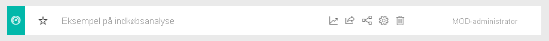
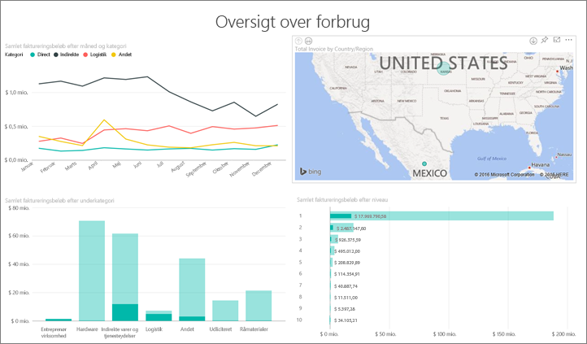
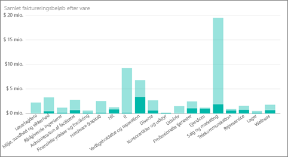

# Eksempel på indkøbsanalyse for Power BI: Få en introduktion

Indholdspakken til eksemplet på indkøbsanalyse indeholder et dashboard, en rapport og et datasæt, der analyserer en produktionsvirksomheds udgifter til leverandører efter kategori og placering. I eksemplet udforsker vi følgende områder:

* Hvem er topleverandørerne
* Hvilke kategorier vi har flest udgifter til
* Hvilke leverandører giver os de største rabatter og hvornår

Dette eksempel er en del af en serie, der viser, hvordan du kan bruge Power BI med forretningsrelaterede data, rapporter og dashboards. Det blev oprettet af [obviEnce](http://www.obvience.com/) med rigtige data, som er blevet anonymiseret. Dataene er tilgængelige i flere formater: indholdspakke, .pbix-fil til Power BI Desktop eller Excel-projektmappe. Se [Eksempler til Power BI](sample-datasets.md). 

I dette selvstudium udforskes indholdspakken med eksemplet på indkøbsanalyse i Power BI-tjenesten. Da rapportoplevelsen i Power BI Desktop og i tjenesten minder meget om hinanden, kan du også følge med ved at bruge .pbix-eksempelfilen i Power BI Desktop. 

Du behøver ikke en Power BI-licens for at udforske eksemplerne i Power BI Desktop. Hvis du ikke har en Power BI Pro-licens, kan du gemme eksemplet i Mit arbejdsområde i Power BI-tjenesten. 

## Hent eksemplet

Før du kan bruge eksemplet, skal du først downloade det som en [indholdspakke](#get-the-content-pack-for-this-sample), [.pbix-fil](#get-the-pbix-file-for-this-sample) eller [Excel-projektmappe](#get-the-excel-workbook-for-this-sample).

### Hent indholdspakken for dette eksempel

1. Åbn Power BI-tjenesten (app.powerbi.com), log på, og åbn det arbejdsområde, hvor du vil gemme eksemplet. 

    Hvis du ikke har en Power BI Pro-licens, kan du gemme eksemplet i Mit arbejdsområde.

2. Vælg **Hent data** i nederste venstre hjørne.

    
3. På siden **Hent data**, der vises, skal du vælge **Eksempler**.

4. Vælg **Eksempel på indkøbsanalyse**, og vælg derefter **Opret forbindelse**.  
  
   
   
5. Power BI importerer indholdspakken og føjer derefter et nyt dashboard, en ny rapport og et nyt datasæt til dit aktuelle arbejdsområde.
   
   
  
### Hent .pbix-filen knyttet til dette eksempel

Du kan også hente Eksempel på indkøbsanalyse som en [.pbix-fil](https://download.microsoft.com/download/D/5/3/D5390069-F723-413B-8D27-5888500516EB/Procurement%20Analysis%20Sample%20PBIX.pbix), der er beregnet til brug med Power BI Desktop. 

### Hent Excel-projektmappen for dette eksempel

Hvis du vil have vist datakilden for dette eksempel, er den også tilgængelig som en [Excel-projektmappe](https://go.microsoft.com/fwlink/?LinkId=529784). Projektmappen indeholder Power View-ark, som du kan få vist og redigere. Hvis du vil se rådataene, skal du aktivere tilføjelsesprogrammerne Dataanalyse og derefter vælge **Power Pivot > Administrer**. Hvis du vil aktivere tilføjelsesprogrammerne Power View og Power Pivot, kan du finde flere oplysninger under [Udforsk Excel-eksemplerne i Excel](sample-datasets.md#explore-excel-samples-inside-excel).

## Udgiftstendenser
Lad os først se på udgiftstendenser efter kategori og placering.  

1. I det arbejdsområde, hvor du har gemt eksemplet, skal du åbne fanen **Dashboards** og derefter finde og vælge dashboardet **Eksempel på indkøbsanalyse**. 
2. Vælg dashboardfeltet **Samlet faktureringsbeløb efter land/område**, som åbner siden **Oversigt over forbrug** i rapporten **Eksempel på indkøbsanalyse**.

    

Bemærk følgende oplysninger:

* I kurvediagrammet **Samlet faktureringsbeløb efter måned og kategori** har kategorien **Direkte** konstante udgifter, **Logistik** er højest i december, og **Andet** er højest i februar.
* På kortet **Samlet faktureringsbeløb efter land/område** kan du se, at de fleste udgifter ligger i USA.
* I søjlediagrammet **Samlet faktureringsbeløb efter underkategori** er **Hardware** og **Indirekte varer og tjenesteydelser** de største udgiftskategorier.
* I det liggende søjlediagram **Samlet faktureringsbeløb efter niveau** kan du se, at de fleste af forretningerne udføres med leverandørerne på niveau 1 (top 10). Det giver os mulighed at administrere bedre leverandørrelationer.

## Udgifter i Mexico
Lad os udforske udgiftsområder i Mexico.

1. På kortet **Samlet faktureringsbeløb efter land/område** skal du vælge boblen **Mexico**. Læg mærke til, at i søjlediagrammet **Samlet faktureringsbeløb efter underkategori** ligger de fleste udgifter i underkategorien **Indirekte varer og tjenesteydelser**.

   
2. Foretag detaljeudledning i kolonnen **Indirect Goods & Services**:

   * I søjlediagrammet **Samlet faktureringsbeløb efter underkategori** skal du vælge pilen til detailudledning  i øverste højre hjørne af diagrammet.
   * Markér kolonnen **Indirect Goods & Services**.

      Som du kan se, ligger de allerstørste udgifter i underkategorien **Salg og marketing**.
   * Vælg **Mexico** på kortet igen.

      For Mexico ligger de største udgifter i underkategorien **Vedligeholdelse og reparation**.

      
3. Vælg pil op i det øverste venstre hjørne af diagrammet for at gå tilbage i detailudledningen.
4. Vælg pilen til detailudledning igen for at deaktivere detailudledning.  
5. Vælg **Eksempel på indkøbsanalyse** i den øverste navigationsrude for at vende tilbage til dashboardet.

## Evaluer forskellige byer
Vi kan bruge markering til at evaluere forskellige byer.

1. Vælg dashboardfeltet **Samlet faktureringsbeløb, rabat i % efter måned**, som siden **Rabatanalyse** i rapporten **Eksempel på indkøbsanalyse**.
2. Vælg en by ad gangen i træstrukturen **Samlet faktureringsbeløb efter by** for at sammenligne dem. Bemærk, at næsten alle Miamis fakturaer er fra leverandører på niveau 1.

   

## Leverandørrabatter
Lad os også udforske de rabatter, der er tilgængelige fra leverandører, og de tidsperioder, hvor vi får flest rabatter:
* Er rabatterne forskellige hver måned, eller gælder de samme rabatter hele tiden?
* Får nogle byer flere rabatter end andre?

### Rabat pr. måned
På kombinationsdiagrammet **Samlet faktureringsbeløb og rabat i % efter måned** kan du se, at februar er den travleste måned, og september er den mindst travle måned. 

Se på rabatprocenten i løbet af disse måneder: Når mængden stiger, falder rabatten, og når mængden er lav, stiger rabatten. Jo mere vi har brug for rabatten, desto dårligere en aftale får vi.

### Rabat efter by
Et andet område at udforske er rabat efter by. Vælg en by ad gangen i træstrukturen, og se, hvordan de andre diagrammer ændrer sig:

* St. Louis havde en stor stigning i samlet faktureringsbeløb i februar og et stort fald i rabatbesparelser i april.
* Mexico City har den højeste rabatprocent (11,05 %), og Atlanta har den mindste (0,08 %).

### Rediger rapporten
Vælg **Rediger rapport** i det øverste venstre hjørne, og udforsk Redigeringsvisning:

* Se, hvordan siderne laves.
* Tilføj sider og diagrammer, der er baseret på de samme data.
* Skift visualiseringstypen for et diagram – du kan f.eks. ændre træstrukturen til et kransediagram.
* Fastgør diagrammer til dit dashboard.

## Næste trin: Opret forbindelse til dine data
Det er sikkert at eksperimentere i dette miljø, fordi du kan vælge ikke at gemme dine ændringer. Hvis du gemmer dem, kan du altid vælge **Hent data** for at få en ny kopi af dette eksempel.

Vi håber, at denne rundtur har vist, hvordan Power BI-dashboards, spørgsmål og svar samt rapporter kan give indsigt i eksempeldata. Nu er det din tur: Opret forbindelse til dine egne data. Med Power BI kan du oprette forbindelse til en lang række datakilder. Få mere at vide ved at se [Introduktion til Power BI-tjenesten](../fundamentals/service-get-started.md).
