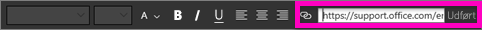
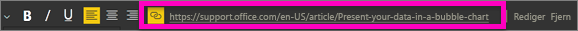

# Føj et link til et tekstfelt i en rapport
Du kan føje et tekstfelt til en rapport i Power BI Desktop eller Power BI-tjenesten. Du kan fastgøre et tekstfelt fra en rapport til et dashboard eller føje et direkte til et dashboard. Uanset hvor tekstfeltet er, kan du altid føje et link til det. I denne artikel kan du se, hvordan du føjer et link til et tekstfelt i en rapport. 

Se, hvordan Will Thompson opretter et tekstfelt og føjer et link til det. 

<iframe width="560" height="315" src="https://www.youtube.com/embed/_3q6VEBhGew#t=0m55s" frameborder="0" allowfullscreen></iframe>

Du kan finde oplysninger om links i Power BI-tabeller og -matrixer under [Føj links til en tabel](power-bi-hyperlinks-in-tables.md). Du kan finde flere oplysninger om tilføjelse af tekstfelter til dit dashboard under [Føj billeder, videoer og mere til dit dashboard](service-dashboard-add-widget.md). 

## Sådan føjer du et link til et tekstfelt
1. Åbn en rapport, [opret et tekstfelt](power-bi-reports-add-text-and-shapes.md), og tilføj noget tekst. 
2. Markér eksisterende tekst, eller tilføj ny tekst, der skal bruges som et link. 

   Tekstfeltets menu vises.
   
   
3. Vælg linkikonet  i tekstfeltets menu.

   Linkfeltet vises i tekstfeltets menu.

4. Skriv eller indsæt URL-adressen i linkfeltet, og vælg derefter **Udfør**.
   
   
5. Test linket:  

   a. Placer markøren et vilkårligt sted i det nye link i tekstfeltet for at få vist URL-adressen i linkfeltet.  
     
      
   
      

   b. Vælg URL-adressen i linkfeltet for at åbne siden i et nyt browservindue.

## Sådan fjerner du linket
1. Vælg linket i tekstfeltet for at fremhæve det.
   
     
2. Vælg **Fjern** i tekstfeltets menu. 

   Linket fjernes i Power BI Desktop, men teksten beholdes.

## De næste trin
[Tekstfelter og figurer i Power BI-rapporter](power-bi-reports-add-text-and-shapes.md)

Har du flere spørgsmål? [Prøv Power BI-community'et](https://community.powerbi.com/).

