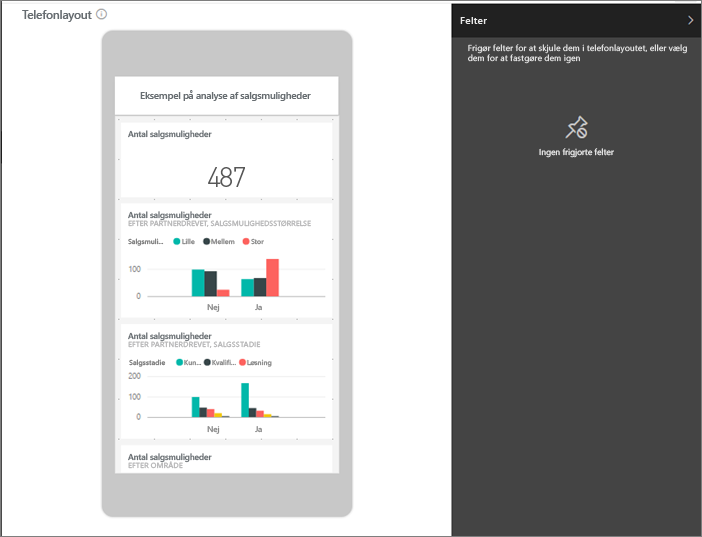
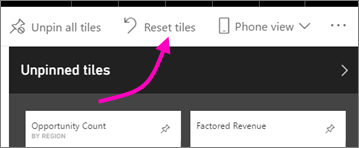

# Optimer et dashboard til mobiltelefoner – Power BI 
Når du får vist dashboards i stående retning på en telefon, vil du opdage, at dashboardfelterne har den samme størrelse og er placeret efter hinanden et ad gangen. I Power BI-tjenesten kan du oprette en tilpasset visning af et dashboard specifikt til stående retning på telefoner. Selvom du opretter en telefonvisning, vil du se dashboardet, som det ser ud i tjenesten, når du vender telefonen om på siden.

Leder du efter oplysninger om visning af dashboards på en mobilenhed? Prøv i stedet denne hurtig start [Udforsk dashboards og rapporter i Power BI-mobilapps](../consumer/mobile/mobile-apps-quickstart-view-dashboard-report.md).

> [!NOTE]
> Når du redigerer telefonvisningen, kan alle, der ser dashboardet på en telefon, i realtid se de ændringer, du foretager. Hvis du eksempelvis frigør alle felter i dashboardets telefonvisning, har dashboardet på telefonen pludseligt ingen felter. 
> 
> 

## Opret en telefonvisning af et dashboard
1. Åbn et dashboard i Power BI-tjenesten.
2. Vælg pilen ud for **Webvisning** i øverste højre hjørne > vælg **Telefonvisning**.

    

    Hvis du ikke er ejeren af dashboardet, kan du ikke se denne indstilling.

    

    Visningen til redigering af telefonens dashboard åbnes. Her kan du frigøre, tilpasse størrelsen på og omarrangere felter, så de passer til telefonvisningen. Webversionen af dashboardet ændres ikke.

1. Vælg et felt for at trække, tilpasse eller frigøre det. Du kan se, at de andre felter flyttes væk, når du trækker et felt.
   
    
   
    De frigjorte felter flyttes til ruden Frigjorte felter, hvor de bliver, medmindre du tilføjer dem igen.
   
    
2. Hvis du skifter mening, skal du vælge **Nulstil felter**, og de vender tilbage til den tidligere størrelse og rækkefølge.
   
    
   
    Størrelsen og formen på felterne på en telefon ændres kun en lille smule, hvis du kun åbner visningen til telefonredigering i Power BI-tjenesten. Så hvis dashboardet skal vende tilbage til den nøjagtige tilstand, før du åbnede det i visningen til telefonredigering, skal du vælge **Nulstil felter**.
3. Når du er tilfreds med telefonens dashboardlayout, skal du vælge pilen ud for **Telefonvisning** i øverste højre hjørne > vælge **Webvisning**.
   
    Power BI gemmer telefonlayoutet automatisk.

## Næste trin
* [Opret rapporter, der er optimeret til Power BI-telefonapps](desktop-create-phone-report.md)
* [Opret dynamiske visualiseringer, der er optimeret til alle størrelser](../visuals/power-bi-report-visualizations.md)
* Har du flere spørgsmål? [Prøv at spørge Power BI-community'et](https://community.powerbi.com/)
