# Opret et Power BI-dashboard fra en rapport
Du har læst [Introduktion til dashboards i Power BI](service-dashboards.md), og nu vil du oprette dit eget. Der er mange forskellige måder at oprette et dashboard på. Du kan f.eks. oprette et dashboard fra en rapport, fra bunden, fra et datasæt, ved at kopiere et eksisterende dashboard og meget mere.  

Vi begynder med at oprette et dashboard hurtigt og nemt, hvor visualiseringer fastgøres fra en rapport, der allerede er oprettet. 

Når du har gennemgået hele denne artikel, vil du have en god forståelse af:
- Forholdet mellem dashboards og rapporter
- Hvordan du åbner redigeringsvisningen i rapporteditoren
- Sådan fastgøres felter 
- Sådan navigerer du mellem et dashboard og en rapport 
 
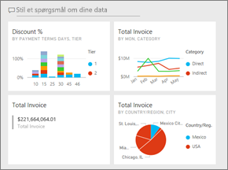

> [!NOTE] 
> Dashboards er en funktion i Power BI-tjenesten ikke Power BI Desktop. Selvom du ikke opretter dashboards i Power BI-mobilapps, kan du [få vist og dele](../consumer/mobile/mobile-apps-view-dashboard.md) dem der.
>
> 

## Video: Opret et dashboard ved at fastgøre visualiseringer og billeder fra en rapport
Se Amanda oprette et nyt dashboard ved at fastgøre visualiseringer fra en rapport. Følg derefter fremgangsmåden i det næste afsnit [Importér et datasæt med en rapport](#import-a-dataset-with-a-report) på egen hånd ved hjælp af eksemplet på indkøbsanalyse.
    

<iframe width="560" height="315" src="https://www.youtube.com/embed/lJKgWnvl6bQ" frameborder="0" allowfullscreen></iframe>

## Importér et datasæt med en rapport
I denne trinvise vejledning importerer vi et af eksempeldatasættene i Power BI og bruger det til at oprette vores nye dashboard. Det eksempel, vi bruger, er en Excel-projektmappe med to PowerView-ark. Når du importerer projektmappen til Power BI, føjes der et datasæt og en rapport til dit arbejdsområde. Rapporten oprettes automatisk ud fra PowerView-arkene.

1. Download Excel-filen med [eksemplet på indkøbsanalyse](https://go.microsoft.com/fwlink/?LinkId=529784). Det anbefales, at du gemme den i din OneDrive for Business.
2. Åbn Power BI-tjenesten i din browser (app.powerbi.com).
3. Vælg **Mit arbejdsområde** fra navigationsruden, og vælg derefter **Hent data**.

    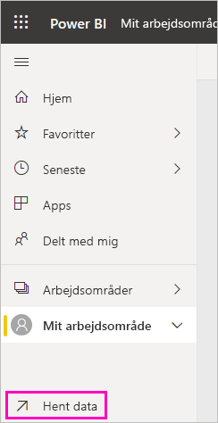
5. Under **Filer** skal du vælge **Hent**.

   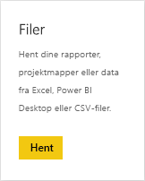
6. Naviger til den placering, hvor du har gemt Excel-filen med eksempel på indkøbsanalyse. Markér den, og vælg **Opret forbindelse**.

   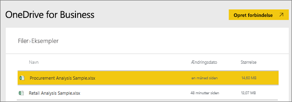
7. Til denne øvelse skal du vælge **Importér**.

    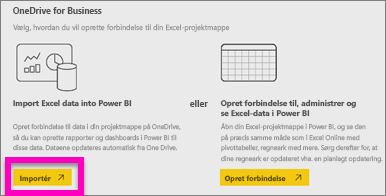
8. Når du får vist meddelelsen om, at processen lykkedes, skal du klikke på **x** for at afvise den.

   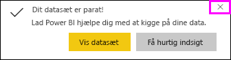

> [!TIP]
> Vidste du det? Du kan indsnævre navigationsruden ved at vælge ikonet med tre linjer øverst . Det giver dig mere plads til selve rapporten.

### Åbn rapporten, og fastgør felter på dit dashboard
1. I det samme arbejdsområde skal du vælge fanen **Rapporter** og derefter vælge **Indkøbsanalyseeksempel** for at åbne rapporten.

     Rapporten åbnes som standard i Læsevisning. Bemærk, at den har to faner til venstre: **Rabatanalyse** og **Oversigt over forbrug**. Hver fane repræsenterer en side i rapporten.

2. Vælg **Flere indstillinger (...)**  > **Rediger rapport** for at åbne rapporten i redigeringsvisning.

    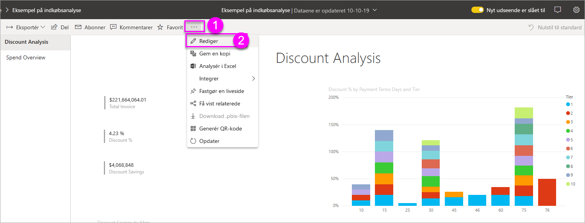
3. Peg på en visualisering for at få vist de tilgængelige indstillinger. Hvis du vil føje en visualisering til et dashboard, skal du vælge ikonet til fastgørelse .

    
4. Da vi opretter et nyt dashboard, skal du markere indstillingen for **nyt dashboard** og give den et navn.

    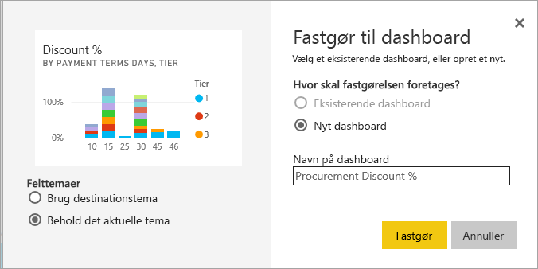
5. Når du vælger **Fastgør**, opretter Power BI det nye dashboard i det aktuelle arbejdsområde. Efter at meddelelsen **Fastgjort til dashboard** vises, skal du vælge **Gå til dashboard**. Hvis du bliver bedt om at gemme rapporten, skal du vælge **Gem**.

    

    Power BI åbner det nye dashboard. Det har ét felt: den visualisering, du lige har fastgjort.

   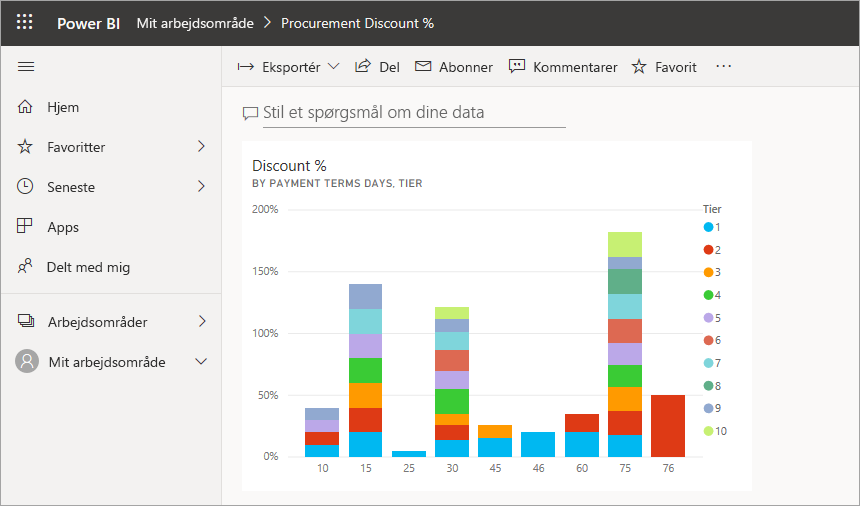
7. Markér feltet for at vende tilbage til rapporten. Fastgør nogle flere felter til det nye dashboard. Når vinduet **Fastgør til dashboard** vises, skal du vælge **Eksisterende dashboard**.  

   

## Fastgør en hel rapportside til dashboardet
I stedet for at fastgøre én visualisering ad gangen, kan du [fastgøre en hel rapportside som et *dynamisk felt*](service-dashboard-pin-live-tile-from-report.md). Lad os gøre det.

1. I rapporteditoren skal du vælge fanen **Udgiftsoversigt** for at åbne den anden side i rapporten.

   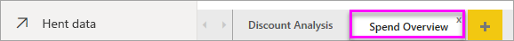

2. Vi vil gerne have alle de visuals i rapporten på dit dashboard. I øverste højre hjørne af menulinjen skal du vælge **Fastgør en dynamisk side**. På et dashboard opdateres felter for dynamiske sider hver gang, siden opdateres.

   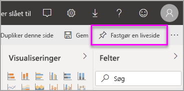

3. Når vinduet **Fastgør til dashboard** vises, skal du vælge **Eksisterende dashboard**.

   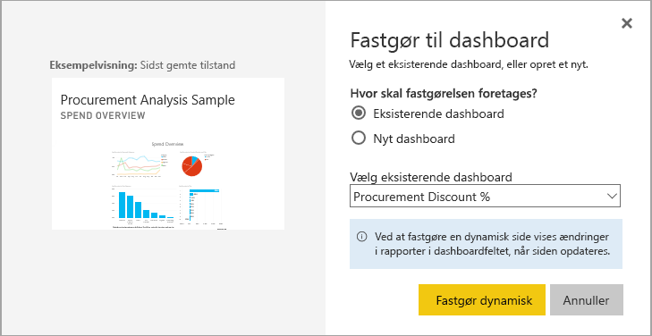

4. Efter du får vist en meddelelse om, at handlingen er udført, skal du vælge **Gå til dashboard**. Der kan du se de felter, du har fastgjort fra rapporten. I nedenstående eksempel har vi fastgjort to felter fra side 1 i rapporten, og ét dynamisk felt, som udgør side 2 i rapporten.

   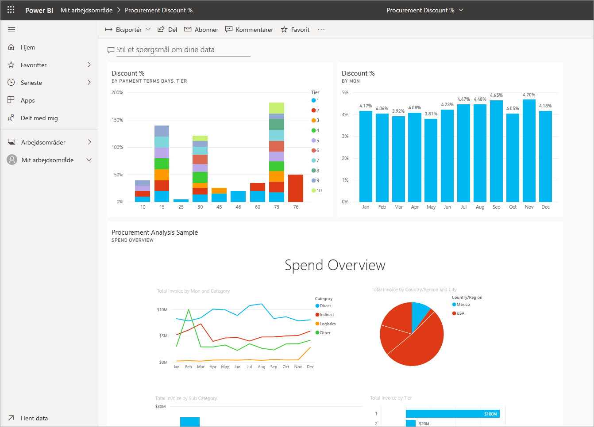

## Næste trin
Tillykke med oprettelsen af dit første dashboard! Nu, hvor du har et dashboard, er der utroligt meget, du kan bruge det til. Følg en af de foreslåede artikler nedenfor, eller kom i gang med at udforske det: 

* [Tilpas størrelsen af felter, og flyt dem](service-dashboard-edit-tile.md)
* [Alt om dashboardfelter](service-dashboard-tiles.md)
* [Del dit dashboard ved at oprette en app](../collaborate-share/service-create-workspaces.md)
* [Power BI – Grundlæggende begreber](../fundamentals/service-basic-concepts.md)
* [Tip til udformning af et fantastisk dashboard](service-dashboards-design-tips.md)

Har du flere spørgsmål? [Prøv at spørge Power BI-community'et](https://community.powerbi.com/).
