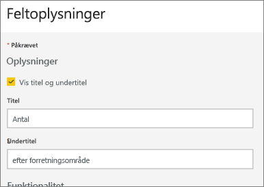
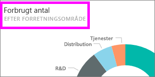

# Rediger eller fjern et dashboard-felt

## Dashboardets *ejere* versus dashboardets *forbrugere*
Når du opretter eller ejer et dashboard, har du mange muligheder for at ændre felternes udseende og standardfunktion på det pågældende dashboard. Brug indstillingerne og strategierne nedenfor til at designe dashboardets *forbruger*oplevelse til dine kollegaer.  Vil valget af et felt åbne den underliggende rapport, en tilpasset URL-adresse eller et andet dashboard? Måske vil du [indsætte et felt, der viser en video eller streamer data](service-dashboard-add-widget.md)? Og du kan endda vælge at [oprette et felt, der har interaktive udsnitsværktøjer](service-dashboard-pin-live-tile-from-report.md). Som *forfatter* har du mange muligheder. 

<iframe width="560" height="315" src="https://www.youtube.com/embed/lJKgWnvl6bQ" frameborder="0" allowfullscreen></iframe>

Denne artikel omhandler følgende.

* [Opret en visualisering, og fastgør den til et dashboard](#create)
* [Flyt et felt](#move)
* [Tilpas feltstørrelse](#resize)
* [Omdøb et felt](#rename)
* [Føj et hyperlink til et felt](#hyperlink)
* [Fastgør et felt til et andet dashboard](#different)
* [Slet et felt](#delete)
  
  > [!TIP]
  > Hvis du vil ændre visualiseringen, der vises på selve feltet, skal du slette feltet og tilføje et nyt [dashboard-felt](../consumer/end-user-tiles.md).

  
## Forudsætninger
For at følge med skal du åbne Power BI-tjenesten (ikke Power BI Desktop) og [downloade eksemplet på analyse af it-forbrug](sample-it-spend.md). Når "Udført" vises, skal du vælge **Gå til dashboard**

- - -

## Opret en ny visualisering, og fastgør den til dashboardet
1. Vælg feltet "Beløb" i dashboardet Eksempel på analyse af it-forbrug for at åbne rapporten.

    

2. Åbn rapporten i Redigeringsvisning ved at vælge **Rediger rapport** på den øverste menulinje.

3. Tilføj en ny rapportside ved at vælge plustegnet (+) nederst i rapporten.

    

4. Fra ruden FELTER skal du vælge **Fakta > Beløb** og **Forretningsområde > Forretningsområde**.
 
5. Vælg ikonet for Kransediagram i ruden VISUALISERINGER for at konvertere visualiseringen til et kransediagram.

    

5. Vælg tegnestiftikonet, og fastgør kransediagrammet til eksempeldashboardet Analyse af it-forbrug.

   

6. Når "Udført" vises, skal du vælge **Gå til dashboard**. Du bliver bedt om at gemme dine ændringer. Vælg **Gem**.

- - -

## Flyt feltet
Find det nye felt på dashboardet. Vælg, og hold feltet for at trække det til en ny placering på dashboardlærredet.

- - -

## Tilpas feltets størrelse
Et felt kan tilpasses til mange forskellige størrelser – fra 1x1 feltenheder og op til 5x5. Vælg og træk i håndtaget (i nederste højre hjørne) for at tilpasse feltets størrelse.

- - -
## Menuen **Flere indstillinger** (...)

1. Vælg **Flere indstillinger** (...) i øverste højre hjørne af feltet. 
   
   

2. Peg på feltet "Konto", og vælg ellipsen for at få vist indstillingerne. De tilgængelige indstillinger afhænger af felttypen.  For eksempel er de tilgængelige indstillinger for et dynamisk felt forskellige fra de tilgængelige indstillinger for et felt til standardvisualisering. Hvis et dashboard er blevet delt med dig (du ejer det ikke), har du desuden har færre indstillinger.

   

3. Vælg **Rediger oplysninger** for at åbne vinduet "Feltoplysninger". 

    Tilpas feltets titel og standardfunktion.  Måske vil du f.eks. gerne have, at når en *forbruger* vælger et felt i stedet for at åbne rapporten, der blev brugt til at oprette det pågældende felt, så vises et nyt dashboard i stedet.  
   

### Omdøb feltet
Øverst i vinduet "Feltoplysninger" kan du ændre **Titel** til **Brugt beløb**.

### Rediger standardlinket
Når du vælger et felt, føres du normalt hen til rapporten, hvor feltet blev oprettet, eller til Spørgsmål og svar (hvis feltet er oprettet i Spørgsmål og svar). Hvis du vil oprette et link til et andet dashboard eller rapport (i det samme arbejdsområde), en SSRS-rapport eller andet online-indhold, så skal du indsætte et brugerdefineret link.

1. Vælg **Angiv tilpasset link** under overskriften Funktionalitet.

2. Vælg **Link til et dashboard eller en rapport i det aktuelle arbejdsområde**, og vælg derefter på rullemenuen.  Jeg har valgt eksempeldashboardet HR i dette eksempel. Hvis du ikke allerede har dette eksempel i arbejdsområdet, så kan du tilføje det og gå tilbage til dette trin, eller du kan vælge et andet dashboard. 

    

3. Vælg **Anvend**.

4. Den nye titel vises på feltet.  Og når du vælger feltet, så åbner Power BI HR-dashboardet. 

    

### Fastgør feltet til et andet dashboard
1. Vælg **Fastgør felt**  i rullemenuen for ellipsen.
2. Vælg, om du vil fastgøre en dublet af dette felt til et eksisterende dashboard eller til et nyt dashboard. 
   
   
3. Vælg **Fastgør**.

### Slet feltet
1. Hvis du vil fjerne et felt permanent fra et dashboard, skal du vælge **Slet felt**  i rullemenuen for ellipsen. 

2. Når du sletter et felt, slettes den underliggende visualisering ikke. Åbn den underliggende rapport ved at vælge feltet "Beløb". Åbn den sidste side i rapporten for at se, at den oprindelige visualisering ikke er blevet slettet fra rapporten. 

- - -
## De næste trin
[Dashboardfelter i Power BI](../consumer/end-user-tiles.md)

[Dashboards i Power BI](../consumer/end-user-dashboards.md)

[Grundlæggende begreber for designere i Power BI-tjenesten](../fundamentals/service-basic-concepts.md)

Har du flere spørgsmål? [Prøv at spørge Power BI-community'et](https://community.powerbi.com/)
