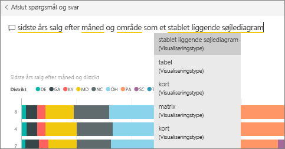
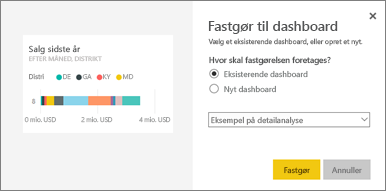
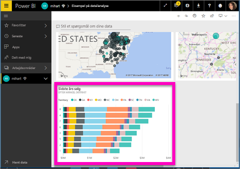

# Fastgør et felt til et dashboard fra Spørgsmål og svar
## Sådan fastgør du et felt fra Spørgsmål og svar
Spørgsmål og svar er Power BI's ad hoc-rapporteringsværktøj. Brug for at finde en bestemt indsigt? Stil et spørgsmål om dine data, og få svar i form af en visualisering.

I denne vejledning bruger vi Power BI-tjenesten (app.powerbi.com) til at åbne et dashboard, stille et spørgsmål i et naturligt sprog for at oprette en visualisering, og fastgøre denne visualisering til et dashboard. Dashboards er ikke tilgængelige i Power BI Desktop. Du kan finde oplysninger om brug af Spørgsmål og svar med andre Power BI-værktøjer og andet Power Bi-indhold under [Spørgsmål og svar i Power BI – Oversigt](../consumer/end-user-q-and-a.md). 

Åbn [dashboardet Retail Analysis Sample](sample-retail-analysis.md) (Eksempel på detailhandelsanalyse) for at følge med.

1. Åbn et [dashboard](../consumer/end-user-dashboards.md) med mindst ét felt fastgjort fra en rapport. Når du stiller et spørgsmål, leder Power BI efter svaret i de datasæt, hvor et felt er fastgjort til dette dashboard.  Du kan få flere oplysninger i [Hent data](../connect-data/service-get-data.md).
2. I spørgsmålsfeltet øverst i dit dashboard skal du begynde at indtaste, hvad du vil vide om dine data.  
   
3. Mens du f.eks. skriver "last year sales by month and territory"...  
   

   giver spørgsmålsfeltet dig forslag.
4. Hvis du vil fastgøre diagrammet til dit dashboard som et felt, skal du vælge tegnestiften  øverst til højre på lærredet. Hvis dashboardet er blevet delt med dig, kan det ikke fastgøres til nogen visualiseringer.

5. Fastgør feltet til et eksisterende dashboard eller et nyt dashboard.

   

   * Eksisterende dashboard: Vælg navnet på dashboardet på rullelisten. Du vil kun kunne vælge blandt de dashboards, der findes i det aktuelle arbejdsområde.
   * Nyt dashboard: Skriv navnet på det nye dashboard, og det vil blive føjet til dit aktuelle arbejdsområde.

6. Vælg **Fastgør**.

   En meddelelse om fuldførelse (næsten helt oppe i højre hjørne) giver dig besked om, at visualiseringen er blevet føjet til dit dashboard som et felt.  

   
7. Vælg **Gå til dashboard** for at se det nye felt. Der kan du [omdøbe, tilpasse størrelsen på, tilføje et link til, flytte feltet m.m.](service-dashboard-edit-tile.md) på dit dashboard.

   

## Overvejelser og fejlfinding
* Når du begynder at indtaste et spørgsmål, begynder Spørgsmål og svar straks at søge efter det bedste svar fra alle de datasæt, der er knyttet til det aktuelle dashboard.  Det "aktuelle dashboard" er det dashboard, der er angivet i den øverste navigationsrude. Dette spørgsmål stilles f.eks. på dashboardet **Eksempel på analyse af detailhandel**, som er en del af arbejdsområdet **mihart**.

  
* **Hvordan ved Spørgsmål og svar, hvilke datasæt der skal bruges**?  Spørgsmål og svar har adgang til alle datasæt, der har mindst en visualisering fastgjort til det pågældende dashboard.

* **Hvis feltet med spørgsmål ikke vises**. Rådfør dig med din Power BI-administrator. Administratoren kan deaktivere Spørgsmål og svar.

## Næste trin
[Omdøb, tilpas størrelse, tilføj et hyperlink, flyt feltet og meget mere](service-dashboard-edit-tile.md)    
[Få vist dit dashboardfelt i fokustilstand](../consumer/end-user-focus.md)     
[Tilbage til Spørgsmål og svar i Power BI](../consumer/end-user-q-and-a.md)  
Har du flere spørgsmål? [Prøv at spørge Power BI-community'et](https://community.powerbi.com/)
