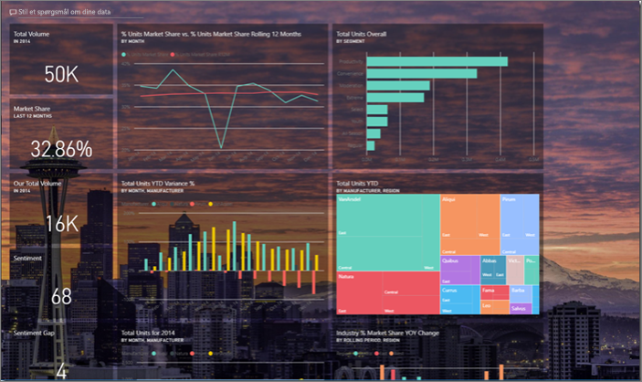
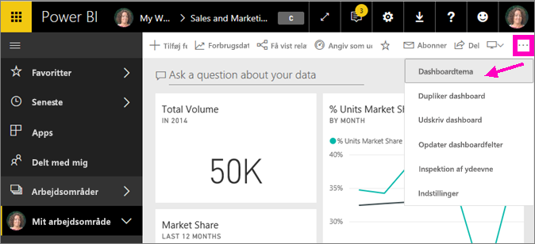
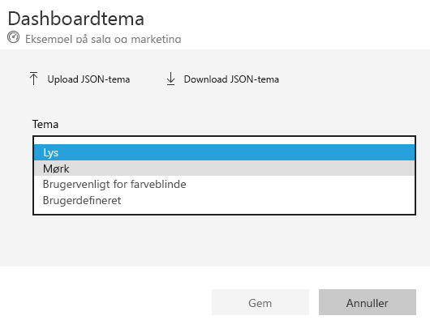
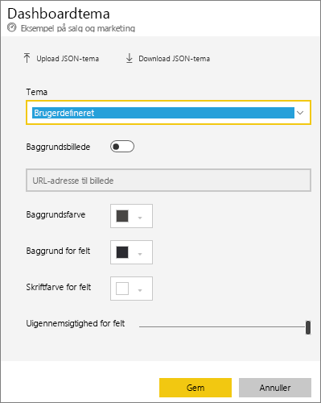
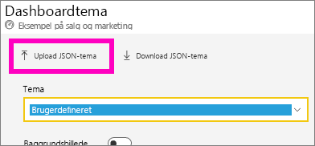
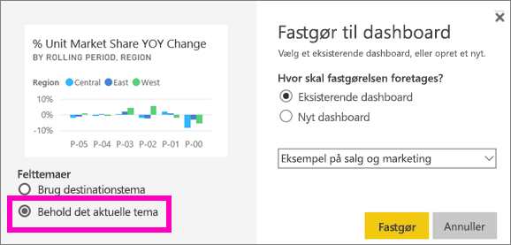

# Brug Dashboard-temaer i Power BI-tjenesten
Med **dashboardtemaer** kan du anvende et farvetema på hele dit dashboard, f.eks virksomhedens farver, sæsonmæssige farver eller andre farvetemaer, som du gerne vil anvende. Når du anvender et **dashboardtema**, bruges farver fra det valgte tema for alle visualiseringer på dashboardet (med nogle få undtagelser, der er beskrevet senere i denne artikel).

Hvis du ændrer farverne i rapportvisualiseringerne på dashboardet, påvirker det ikke visualiseringerne i rapporten. Når du fastgør felter fra en rapport, hvor der allerede er [anvendt et rapporttema](desktop-report-themes.md), kan du vælge at beholde det aktuelle tema eller at bruge dashboardtemaet.

## Forudsætninger
* [Åbn eksempeldashboardet Sales and Marketing](sample-datasets.md) for at følge med.

## Sådan bruges dashboardtemaer
Åbn et dashboard, du har oprettet (eller har tilladelse til at redigere), og som du vil tilpasse. Vælg **Flere indstillinger** (...), og vælg **Dashboardtema**. 

Vælg et af de medfølgende temaer i dashboardruden.  I eksemplet herunder har vi valgt **Dark**.

## Opret et brugerdefineret tema

Standardtemaet til Power BI-dashboards er **Light**. Hvis du vil tilpasse farverne eller oprette dit eget tema, skal du vælge **Brugerdefineret** på rullelisten. 

Brug de brugerdefinerede indstillinger for at oprette dit eget dashboardtema. Hvis du tilføjer et baggrundsbillede, anbefaler vi, at billedet har en opløsning på mindst 1920 x 1080. Hvis du vil bruge et billede som baggrund, skal du uploade billedet til et offentligt websted, kopiere URL-adressen og indsætte den i feltet **URL-adresse til billede**. 

### Brug af JSON-temaer
En anden metode til at oprette et brugerdefineret tema er at uploade en JSON-fil, som indeholder indstillinger for alle de farver, du vil bruge i dit dashboard. I Power BI Desktop kan rapportoprettere bruge JSON-filer til [oprette temaer til rapporter](desktop-report-themes.md). De samme JSON-filer kan uploades til dashboards, eller du kan finde og uploade JSON-filer fra siden [Theme gallery](https://community.powerbi.com/t5/Themes-Gallery/bd-p/ThemesGallery) i Power BI-communityet 

Du kan også gemme dit brugerdefinerede tema som en JSON-fil og derefter dele den med andre dashboardoprettere. 

### Brug et tema fra temagalleriet

Når temaet er uploadet, anvendes farverne automatisk på alle felterne i dashboardet. 

1. Peg på et tema, og vælg **Vis rapport**.

    

2. Rul ned, og find linket til JSON-filen.  Vælg downloadikonet, og gem filen.

    

3. Gå tilbage til vinduet Brugerdefineret dashboardtema i Power BI-tjenesten, og vælg **Upload JSON-tema**.

    

4. Gå til den placering, hvor du har gemt JSON-filen, og vælg **Åbn**.

5. Vælg **Gem** på dashboardtemasiden. Det nye tema anvendes på dit dashboard.

    

## Overvejelser og begrænsninger

* Hvis din rapport anvender et andet tema end dashboardtemaet, kan du styre, om det visuelle element skal bevare det aktuelle tema, eller om det skal anvende temaet for dashboardet for at give et ensartet udtryk på tværs af visuelle elementer fra forskellige kilder. Når du fastgør et felt på et dashboard, kan du vælge **Behold det aktuelle tema** for at bevare rapporttemaet. På dashboardet vil visualiseringen beholde rapporttemaet inklusive indstillingerne for gennemsigtighed. 

    Det eneste tidspunkt, hvor du får vist indstillingerne for **Felttemaer** er, når du opretter rapporten i Power BI Desktop, [tilføjer et rapporttema](desktop-report-themes.md) og derefter publicerer rapporten til Power BI-tjenesten. 

    

    Prøv at fastgøre feltet igen, og vælg **Brug dashboardtema**.

    

* Dashboardtemaer kan ikke anvendes på fastgjorte dynamiske rapportsider, iframe-felter, SSRS-felter, projektmappefelter eller billeder.
* Dashboardtemaer kan ses på mobilenheder, men du kan kun oprette et dashboardtema i Power BI-tjenesten. 
* Brugerdefinerede dashboardtemaer virker kun med felter, der er fastgjort fra rapporter. 

