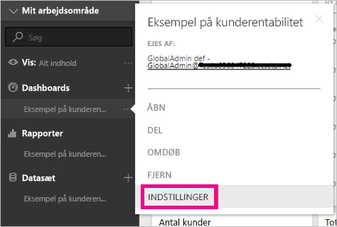

# Dashboard-dataklassificering
Hvert dashboard er forskelligt, og afhængigt af den datakilde, du opretter forbindelse til, opdager du sandsynligvis, at du og de kollegaer, du deler med, skal tage forskellige forholdsregler, afhængigt af dataenes følsomhed. Nogle dashboards skal aldrig deles med personer uden for dit firma, eller udskrives, mens andre frit kan deles. Ved at bruge dashboard-dataklassifikation kan du øge bevidstheden hos dem, der ser dine dashboards, om, hvilket sikkerhedsniveau, der skal bruges. Du kan mærke dine dashboards med klassificeringer, der er defineret af din virksomheds it-afdeling, så alle, der ser indholdet, har samme forståelse af dataenes følsomhed.

## Dataklassificeringsmærker
Dataklassificeringsmærker vises ud for navnet på dashboardet, så alle, der ser det, kender sikkerhedsniveauet, der skal anvendes til dashboardet, og de data, det indeholder.

De vises også ud for dashboardfeltet i listen Favoritter.

Når du holder markøren over mærket, får du vist klassificeringens fulde navn.

Administratorer kan også angive en URL-adresse for et mærke for at angive flere oplysninger.

> [!NOTE]
> Afhængigt af de klassificeringsindstillinger, der er angivet af administratoren, vises nogle klassificeringstyper muligvis ikke som et mærke på dashboardet. Hvis du er ejer af et dashboard, kan du altid kontrollere din dashboardklassificeringstype under indstillingerne for dashboardet.
> 
> 

## Angiv et dashboards klassificering
Hvis dataklassificering er slået til for din virksomhed, har alle dashboards i til at begynde med en standardklassificeringstype, men som dashboardejer kan du ændre klassificeringen, så den passer til dit dashboards sikkerhedsniveau.

Benyt følgende fremgangsmåde for at ændre klassificeringstypen:

1. Gå til indstillinger for dashboardet ved at vælge **ellipsen** ud for dashboardets navn og vælge **Indstillinger**.
   
    
2. Under Dashboard-indstillinger kan du se den aktuelle klassificering af dit dashboard og bruge rullemenuen for at ændre klassificeringstypen.
   
    
3. Vælg **Anvend**, når du er færdig.

Når du har anvendt ændringen, kan alle, som du har delt med, se opdateringen, næste gang de indlæser dashboardet.

## Arbejd med dataklassificeringsmærker som en administrator
Dataklassificering er konfigureret af den globale administrator i din organisation. Benyt følgende fremgangsmåde for at aktivere dataklassificering:

1. Vælg tandhjulsikonet for Indstillinger, og vælg **Administrationsportal**.
   
    
2. Slå **Dataklassificering for dashboards og rapporter** *Til* på fanen **Lejerindstillinger**.
   
    

Når det er slået til, bliver du præsenteret for en formular til at oprette forskellige klassificeringer i din organisation.

Hver klassificering har et **navn** og en **oversigt**, der vises på dashboardet. For hver klassificering kan du bestemme, om oversigtsmærket skal vises på dashboardet eller ej, ved at vælge **Vis mærke**. Hvis du vælger ikke at vise klassificeringstypen i dashboardet, vil ejeren stadig kunne se typen ved at kontrollere dashboardets indstillinger. Du kan eventuelt også tilføje en **URL-adresse**, der indeholder flere oplysninger om din organisations klassificeringsretningslinjer og krav til brug.  

Det sidste, du skal beslutte, er hvilken klassificeringstype, der skal bruges som standard.  

Når du udfylder formularen med klassificeringstyper, skal du vælge **Anvend** for at gemme ændringerne.

På dette tidspunkt vil alle dashboards få tildelt standardklassificeringen. Dashboardejere kan nu opdatere klassificeringstypen til den, der er relevant for deres indhold. Du kan komme tilbage hertil på et senere tidspunkt for at tilføje eller fjerne klassificeringstyper eller ændre standarden.  

> [!NOTE]
> Der er nogle få vigtige ting, du skal huske, når du vender tilbage for at foretage ændringer:
> 
> * Hvis du deaktiverer dataklassificering, vil ingen af mærkerne blive husket. Du skal starte forfra, hvis du vil aktivere det igen senere.  
> * Hvis du fjerner en klassificeringstype, vil alle dashboards, der er tildelt den fjernede klassificeringstype, blive tildelt standardtypen, indtil ejeren angiver den igen.  
> * Hvis du ændrer standard, ændres alle dashboards, der ikke allerede var tilknyttet en klassificeringstype af ejeren, til den nye standard.
> 
> 

