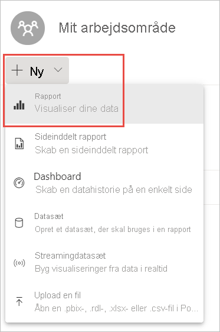
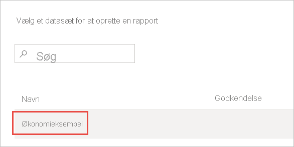
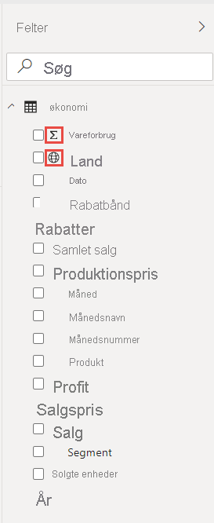
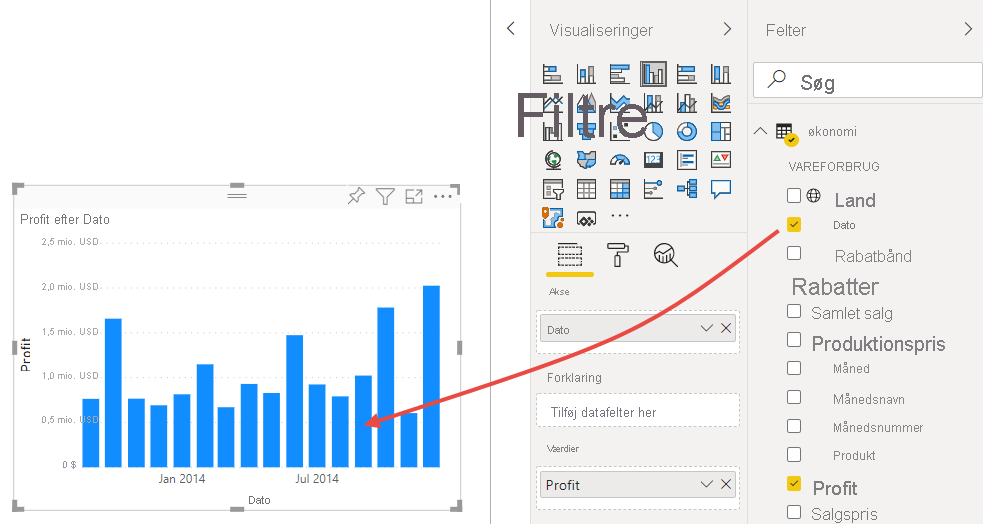
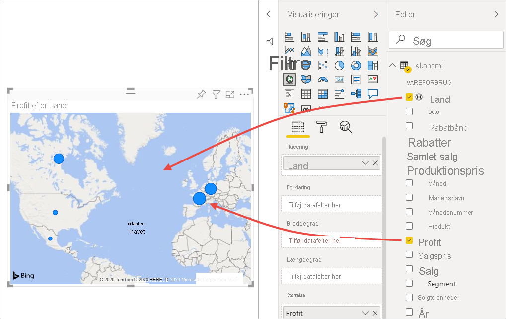
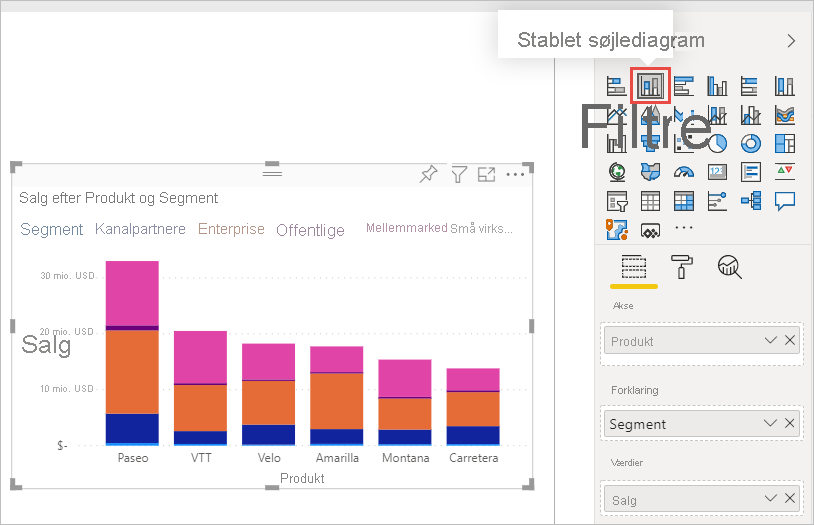
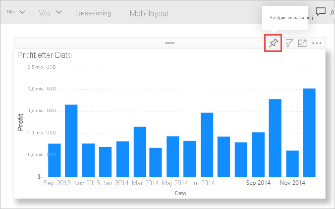
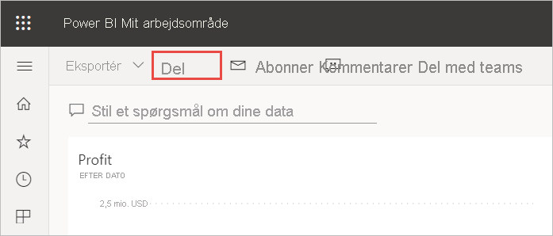
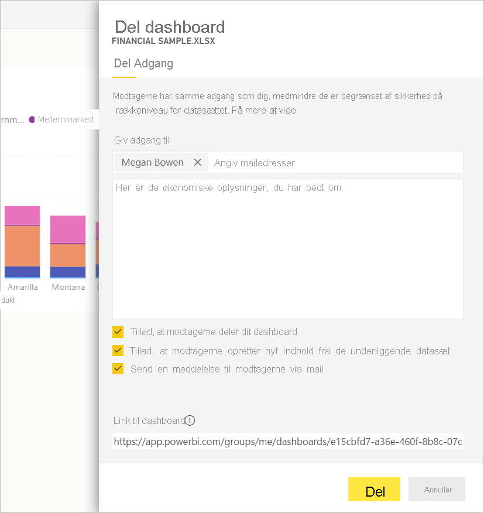
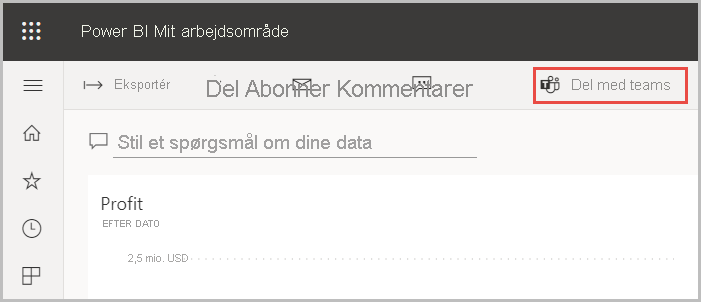

# Selvstudium: Fra Excel-projektmappe til en rapport i Power BI-tjenesten til Microsoft Teams
Din chef vil gerne se en rapport over dine seneste salgs- og avancetal sidst på dagen. Men de seneste data ligger i forskellige tredjepartssystemer og filer på din bærbare computer. Tidligere har det taget timer at oprette visuelle elementer og formatere en rapport, og du er ved at være lidt nervøs.

Bare rolig. Med Power BI kan du oprette en imponerende rapport og dele den i Microsoft teams på ingen tid!

:::image type="content" source="media/service-from-excel-to-stunning-report/power-bi-financial-report-service.png" alt-text="Skærmbillede af færdig rapport med Økonomieksempel":::

I dette selvstudium uploader vi en Excel-fil, opretter en ny rapport og deler den med kolleger i Microsoft Teams – alt sammen fra Power BI. Du lærer, hvordan du:

> [!div class="checklist"]
> * Forbereder dine data i Excel.
> * Downloader eksempeldata.
> * Opbygger en rapport i Power BI-tjenesten.
> * Fastgør visualiseringerne i rapporten til et dashboard.
> * Deler et link til dashboardet.
> * Deler dashboardet i Microsoft Teams

## Forbereder data i Excel
Lad os tage en simpel Excel-fil som eksempel. 

1. Før du kan indlæse din Excel-fil i Power BI, skal du organisere dine data i en flad tabel. I en flad tabel indeholder hver kolonne den samme datatype – f.eks. tekst, dato, tal eller valuta. Tabellen skal have en kolonneoverskrift, men ikke nogen kolonner eller rækker, der viser totaler.

   

2. Formatér derefter dataene som en tabel. I Excel skal du vælge **Formatér som tabel** på fanen **Hjem** i gruppen **Typografier**. 

3. Vælg en tabeltypografi, der skal anvendes på regnearket. 

   Dit Excel-regneark er nu klar til at blive indlæst i Power BI.

   

## Upload din Excel-fil til Power BI-tjenesten
Power BI-tjenesten opretter forbindelse til mange datakilder, herunder Excel-filer, der findes på din computer. 

 > [!NOTE] 
 > Download [projektmappen Økonomieksempel](https://go.microsoft.com/fwlink/?LinkID=521962) for at følge med i resten af dette selvstudium.

1. Log på Power BI-tjenesten for at komme i gang. Hvis du ikke har tilmeldt dig, [kan du gøre det gratis](https://powerbi.com).
1. I **Mit arbejdsområde** skal du vælge **Nyt** > **Upload en fil**.

    :::image type="content" source="media/service-from-excel-to-stunning-report/power-bi-new-upload.png" alt-text="Skærmbillede af indstillingen Upload en fil.":::

1. Vælg **Lokal fil**, gå til det sted, hvor du gemte Excel-filen Økonomieksempel, og vælg **Åbn**.
7. På siden **Lokal fil** skal du vælge **Importér**.

    Nu har du et Økonomieksempel-datasæt. Power BI oprettede også automatisk et tomt dashboard. Hvis du ikke kan se dashboardet, skal du opdatere din browser.

    :::image type="content" source="media/service-from-excel-to-stunning-report/power-bi-financial-dataset.png" alt-text="Skærmbillede af Mit arbejdsområde med datasættet Økonomieksempel.":::

2. Du vil gerne oprette en rapport. Fortsat i **Mit arbejdsområde** skal du vælge **Ny** > **Rapport**.

   

3. I dialogboksen **Vælg et datasæt for at oprette en rapport** skal du vælge dit **Økonomieksempel**-datasæt > **Opret**.

   

## Opbyg din rapport
 
Rapporten åbnes i redigeringsvisning og viser det tomme rapportlærred. Til højre finder du ruderne **Visualiseringer**, **Filtre** og **Felter**. Dataene fra tabellen i din Excel-projektmappe vises i ruden **Felter**. Øverst er navnet på tabellen **Økonomi**. Derunder viser Power BI kolonneoverskrifterne som individuelle felter.

Kan du se Sigma-symbolerne på listen Felter? Power BI har registreret, at disse felter er numeriske. Power BI angiver også et geografisk felt med et globussymbol.

1. Hvis du vil have mere plads til rapportlærredet, skal du vælge **Skjul navigationsruden** og minimere ruden **Filtre**.

    :::image type="content" source="media/service-from-excel-to-stunning-report/power-bi-hide-nav-pane.png" alt-text="Skærmbillede af minimering af navigationsruden."::: 

1. Nu kan du begynde at oprette visualiseringer. Lad os sige, at din chef gerne vil have vist profit over tid. I ruden **Felter** skal du trække **Profit** til rapportlærredet. 

   Power BI viser som standard et søjlediagram med én kolonne. 

    :::image type="content" source="media/service-from-excel-to-stunning-report/power-bi-profit-column.png" alt-text="Skærmbillede af søjlediagram med én kolonne.":::

3. Derefter skal du trække **Dato** til rapportlærredet. 

   Power BI opdaterer søjlediagrammet for at vise avance efter dato.

   

    December 2014 var den måned, hvor avancen var størst.
   
    > [!TIP]
    > Hvis værdierne i diagrammet ikke ser ud som forventet, skal du kontrollere dine sammenlægninger. For eksempel kan du under **Værdier** vælge feltet **Avance**, som du lige har tilføjet, og kontrollere, at dataene lægges sammen på den måde, du ønsker. I dette eksempel bruger vi **Sum**.
    > 

### Opret et kort

Din chef vil gerne vide, hvilke lande/områder der er mest rentable. Imponer din chef med en kortvisualisering. 

1. Vælg et tomt område på dit rapportlærred. 

2. I ruden **Felter** skal du trække feltet **Land** til dit rapportlærred og derefter trække feltet **Avance** til kortet.

   Power BI opretter en kortvisual med bobler, der repræsenterer avancen for hver af de enkelte placeringer.

   

    De europæiske lade klarer sig tilsyneladende bedre end de nordamerikanske lande.

### Opret en visualisering, der viser salg

Hvad med at vise en visual for salg efter produkt og markedssegment? Nemt nok. 

1. Vælg det tomme lærred.

1. I ruden **Felter** skal du markere felterne **Salg**, **Produkt** og **Segment**. 
   
   Power BI opretter et grupperet søjlediagram. 

2. Du kan ændre diagramtypen ved at vælge et af ikonerne i menuen **Visualiseringer**. Du kan f.eks. ændre det til et **stablet liggende søjlediagram**. 

   

3. Hvis du vil sortere diagrammet, skal du vælge **Flere indstillinger** (...) > **Sortér efter**.

### Gør visualiseringen klar

Foretag følgende ændringer under fanen **Format** i ruden Visualiseringer.

:::image type="content" source="media/desktop-excel-stunning-report/power-bi-format-tab-visualizations.png" alt-text="Skærmbillede af fanen Format i ruden Visualiseringer.":::

1. Vælg søjlediagrammet **Avance pr. dato**. I afsnittet **Titel** skal du ændre **Tekststørrelse** til **16 pkt.** . Sæt **Skygge** på **Til**. 

1. Vælg det stablede søjlediagram **Salg efter produkt og segment**. I afsnittet **Titel** skal du ændre titlen **Tekststørrelse** til **16 pkt.** . Sæt **Skygge** på **Til**.

1. Vælg kortet **Avance pr. land**. I afsnittet **Kortformater** skal du ændre **Tema** til **Gråtoneskala**. I afsnittet **Titel** skal du ændre titlen **Tekststørrelse** til **16 pkt.** . Sæt **Skygge** på **Til**.

## Fastgør til et dashboard

Du kan nu fastgøre alle dine visualiseringer til det tomme dashboard, som Power BI oprettede som standard. 

1. Peg på et visuelt element, og vælg **Fastgør visuelt element**.

   

1. Du skal gemme din rapport, før du kan fastgøre et visuelt element til dashboardet. Giv din rapport et navn, og vælg **Gem**.
1. Fastgør de enkelte visualiseringer til det Dashboard, som Power BI oprettede, **Økonomieksempel.xlsx**.
1. Når du fastgør den sidste visualisering, skal du vælge **Gå til Dashboard**.
1. Power BI tilføjede automatisk feltet Økonomiekesempel.xlsx som pladsholder på dashboardet. Vælg **Flere indstillinger (...)**  > **Slet felt**.

    :::image type="content" source="media/service-from-excel-to-stunning-report/power-bi-tile-more-options.png" alt-text="Skærmbillede af Flere indstillinger for et felt.":::

1. Omarranger og tilpas størrelsen på felterne, som du vil.

Dashboardet og rapporten er klar.

## Del et link på dit dashboard

Nu er det tid til at dele dit dashboard med din chef. Du kan dele dit dashboard og den underliggende rapport med enhver kollega, der har en Power BI-konto. De kan interagere med rapporten, men ikke gemme ændringerne. Hvis du tillader det, kan de dele med andre eller oprette en ny rapport, der er baseret på det underliggende datasæt.

1. Hvis du vil dele din rapport, skal du vælge **Del** øverst på dashboardet.

   

2. På siden **Del dashboard** skal du angive mailadresser på modtagerne i feltet **Angiv mailadresser** og tilføje en meddelelse i feltet nedenfor. 

3. Beslut, hvilke af disse indstillinger du eventuelt vil bruge:

    - **Tillad, at modtagerne deler dit dashboard**. 
    - **Tillad, at modtagerne opretter nyt indhold fra de underliggende datasæt**.
    - **Send en meddelelse til modtagerne via mail.**

   

1. Vælg **Del**.

## Del til Microsoft Teams

Du kan også dele rapporter og dashboards direkte med dine kolleger i Microsoft Teams.

1. Hvis du vil dele i Teams, skal du vælge **Del til Teams** øverst på dashboardet.

   

2. Power BI viser dialogboksen **Del til Teams**. Angiv navnet på en person, gruppe eller kanal, og vælg **Del**. 
   
    :::image type="content" source="media/service-from-excel-to-stunning-report/power-bi-share-teams-dialog.png" alt-text="Skærmbillede af dialogboksen Del i Teams":::

3. Linket vises i **Indlæg** for den pågældende person, gruppe eller kanal.

   

## Næste trin

* [Kom i gang med Power BI-tjenesten](../fundamentals/service-get-started.md)
* [Kom i gang med Power BI Desktop](../fundamentals/desktop-getting-started.md)
* [Grundlæggende begreber for designere i Power BI-tjenesten](../fundamentals/service-basic-concepts.md)

Har du flere spørgsmål? [Prøv at spørge Power BI-community'et](https://community.powerbi.com/).
