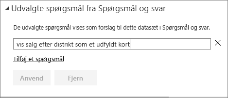
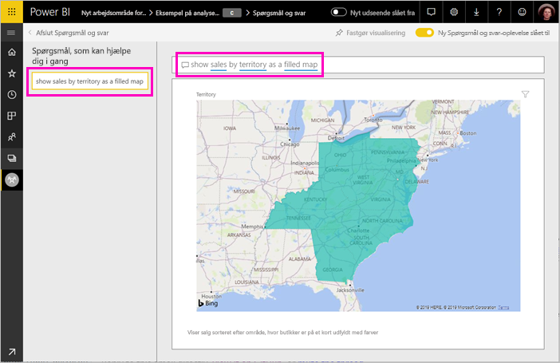

# Opret udvalgte spørgsmål til Spørgsmål og svar i Power BI
Hvis du ejer et datasæt, kan du tilføje dine egne udvalgte spørgsmål i det pågældende datasæt. Spørgsmål og svar i Power BI viser disse spørgsmål til kolleger, der bruger rapporter baseret på dette datasæt.  De udvalgte spørgsmål giver dine kollegaer en ide om, hvilke typer af spørgsmål, de kan stille om datasættet. Det er op til dig, hvilke udvalgte spørgsmål, du tilføjer – tilføj populære spørgsmål, spørgsmål, der viser interessante resultater, eller spørgsmål, der kan være svære at sætte ord på.

> [!NOTE]
> Udvalgte spørgsmål i Spørgsmål og svar er tilgængelige til brug i [Microsoft Power BI-appen til iOS på iPads, iPhones og iPod Touch-enheder](../consumer/mobile/mobile-apps-ios-qna.md) samt Spørgsmål og svar til Power BI Desktop. Oprettelse af spørgsmålene er kun tilgængelig i Power BI-tjenesten (app.powerbi.com).
> 

## Opret et udvalgt spørgsmål

I denne artikel anvendes [Retail Analysis Sales-eksemplet](sample-datasets.md). Følg disse trinvise instruktioner for selv at prøve at udforske et datasæt.

1. Markér feltet Spørgsmål og svar øverst i dashboardet.   Bemærk, at Spørgsmål og svar allerede hjælper ved at vise en liste over udtryk, der findes i datasættet.
2. Hvis du vil føje noget til listen, skal du vælge tandhjulsikonet i øverste højre hjørne af Power BI.  
   
3. Vælg **Indstillinger** &gt; **Datasæt** &gt; **Eksempel på detailanalyse** &gt; **Udvalgte spørgsmål i Spørgsmål og svar**.  
4. Vælg **Tilføj et spørgsmål**.
   
   
5. Skriv dit spørgsmål i tekstfeltet, og vælg **Anvend**.   Du kan også tilføje et andet spørgsmål ved at vælge **Tilføj et spørgsmål**.  
   
6. Gå tilbage til Power BI-dashboardet for Retail Analysis Sample, og anbring markøren i spørgsmålsfeltet.   
   
7. Det nye udvalgte spørgsmål, **Sales by territory as a map**, er det første på listen. Vælg det.  
8. Power BI opretter svaret og viser det som en udfyldt kortvisualisering.  
   

## Næste trin

- [Spørgsmål og svar til forbrugere](../consumer/end-user-q-and-a.md)  
- [Brug Spørgsmål og svar på dashboards og i rapporter](power-bi-tutorial-q-and-a.md)  
- [Grundlæggende begreber for designere i Power BI-tjenesten](../fundamentals/service-basic-concepts.md)  

Har du flere spørgsmål? [Prøv at spørge Power BI-community'et](https://community.powerbi.com/)
