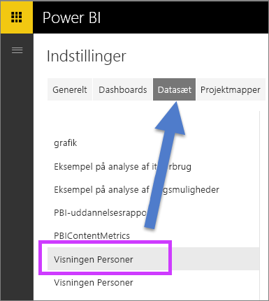
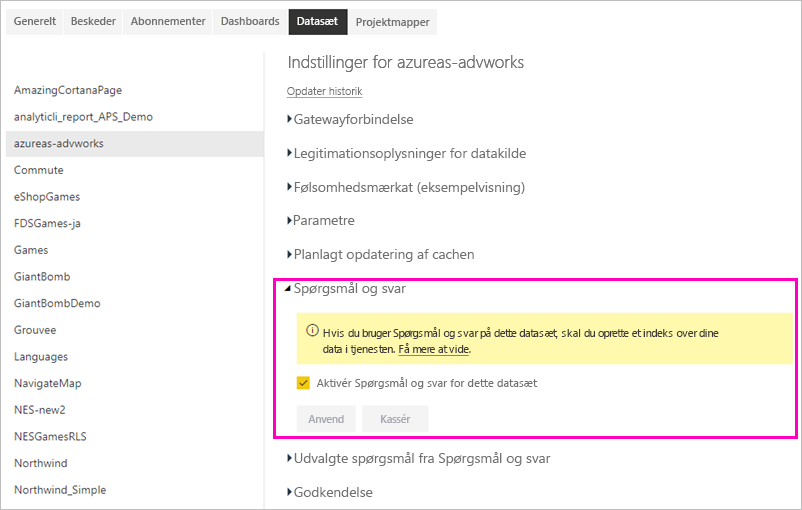

# Aktivér Spørgsmål og svar via direkte forbindelser i Power BI

Du kan importere datasæt i Power BI, eller du kan oprette en *direkte forbindelse* til dem. Datasæt til direkte forbindelser er ofte i det lokale miljø. Hvis det er tilfældet, kan du administrere direkte forbindelser ved hjælp af en [gateway](../connect-data/service-gateway-onprem.md). Data og forespørgsler sendes frem og tilbage ved hjælp af direkte forespørgsler.

> [!NOTE]
> Direkte forbindelser understøtter også Azure Analysis Services-datasæt, der ikke kræver en gateway.

## Spørgsmål og svar til datasæt i datagateway i lokalt miljø
Hvis du vil bruge Spørgsmål og svar med datasæt, får du adgang via en gateway, men du skal aktivere dem først.

Når Power BI er aktiveret, opretter den et indeks for datakilden og uploader et undersæt af disse data til Power BI for at aktivere funktionen for at stille spørgsmål. Det kan tage flere minutter at oprette det første indeks, og Power BI vedligeholder og opdaterer indekset automatisk, når data ændres. Når du bruger Spørgsmål og svar med disse datasæt, fungerer det på samme måde som med data, der er publiceret til Power BI. Det fulde sæt af funktioner, der er tilgængelige i Spørgsmål og svar-oplevelsen, understøttes i begge tilfælde.

Når du stiller spørgsmål i Power BI, afgør Spørgsmål og svar, hvad der er den bedste visuelle gengivelse for konstruktions- eller rapporteringsark, der skal bruges til at svare på dit spørgsmål ved hjælp af et indeks på datasættet. Når Spørgsmål og svar har fastlagt det bedst mulige svar, bruger Spørgsmål og svar DirectQuery til at hente data direkte fra datakilden via gateway'en for at udfylde diagrammer og grafer. Derfor vises de nyeste data fra den underliggende altid direkte i Spørgsmål og svar i Power BI.

Da Power BI-spørgsmål og svar bruger værdierne for tekst og skema fra din datakilde til at bestemme, hvordan der skal forespørges om den underliggende model for at få svar, afhænger søgninger efter specifikke nye eller slettede tekstværdier (f.eks anmode om en kundenavn, der er knyttet til en post med nytilføjet tekst), af, at indekset er opdateret med de nyeste værdier. Power BI opdaterer automatisk tekst- og skemaindekset i et 60-minutters intervaller, hvor der kan ske ændringer.

Her finder du flere oplysninger:

* Hvad er [datagateway i lokalt miljø](../connect-data/service-gateway-onprem.md)?
* [Spørgsmål og svar om Power BI til forbrugere](../consumer/end-user-q-and-a.md)

## Aktivering af Spørgsmål og svar
Når du har konfigureret datagateway'en, kan du oprette forbindelse til dine data fra Power BI.  Opret et dashboard ved hjælp af dataene i det lokale miljø, eller overfør en .pbix-fil, der bruger lokale data.  Du har måske også allerede data i lokalt miljø i dashboards, rapporter og datasæt, der er blevet delt med dig.

1. I øverste højre hjørne af Power BI skal du vælge tandhjulsikonet  og vælge **Indstillinger**.
   
   
2. Vælg **Datasæt**, og vælg det datasæt, der aktiverer Spørgsmål og svar.
   
   
3. Udvid **Spørgsmål og svar**, vælg afkrydsningsfeltet for **Aktivér Spørgsmål og svar for dette datasæt**, og vælg **Anvend**.
   
    

## Hvilke data cachelagres, og hvordan beskyttes privatliv?
Når du aktiverer Spørgsmål og svar for dataene i det lokale miljø, cachelagres et undersæt af dine data i tjenesten. Denne cachelagring sikrer, at Spørgsmål og svar fungerer med en rimelig ydeevne. Power BI udelukker værdier med flere end 24 tegn fra cachelagring. Cachen slettes inden for et par timer, når du deaktiverer Spørgsmål og svar ved at fjerne markeringen **Aktivér Spørgsmål og svar for dette datasæt**, eller når du sletter dit datasæt.

## Overvejelser og fejlfinding
Der er nogle begrænsninger for funktionen:

* Til at begynde med er funktionen kun tilgængelig for SQL Server 2016 Analysis Services Tabular-datakilder. Funktionen er optimeret til at arbejde med data i tabelformat. Spørgsmål og svar-oplevelsen understøttes endnu ikke for flerdimensionelle data. Der udrulles løbende flere datakilder, som understøttes af den lokale datagateway.
* Fuld understøttelse af sikkerhed på rækkeniveau, der er defineret i SQL Server Analysis Services, er ikke tilgængelig til at starte med. Når der stilles spørgsmål i Spørgsmål og svar, kan den automatiske udfyldning af spørgsmål under skrivningen vise strengværdier, som brugerne ikke har adgang til. Dog overholdes den RLS, der er defineret i modellen, for visning af rapporter og diagrammer, så ingen underliggende numeriske data kan fremvises. Indstillinger til at styre denne funktionsmåde vil blive udgivet i kommende opdateringer.
* Sikkerhed på objektniveau understøttes ikke. Spørgsmål og svar overholder ikke sikkerhed på objektniveau og kan afsløre tabel- eller kolonnenavne til brugere, som ikke har adgang til dem. Du skal aktivere RLS for at sikre, at også værdier er sikret korrekt. 
* Direkte forbindelser understøttes kun med datagateway i lokalt miljø. Denne funktion kan derfor ikke bruges med den personlige gateway.

## Næste trin

- [On-premises data gateway (Datagateway i det lokale miljø)](../connect-data/service-gateway-onprem.md)  
- [Administrer din datakilde – Analysis Services](../connect-data/service-gateway-enterprise-manage-ssas.md)  
- [Grundlæggende begreber for designere i Power BI-tjenesten](../fundamentals/service-basic-concepts.md)  
- [Spørgsmål og svar i Power BI – Oversigt](../consumer/end-user-q-and-a.md)  

Har du flere spørgsmål? [Prøv at spørge Power BI-community'et](https://community.powerbi.com/)
