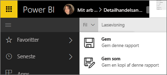
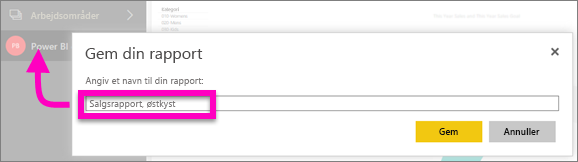

# Gem en rapport i Power BI-tjenesten og Power BI Desktop
Når du har foretaget ændringer af en rapport i Power BI, kan du gemme den, gemme den med et nyt navn eller bare lukke den uden at gemme dine ændringer. Lad os sige, at du åbner rapporten, opretter en visualisering og fastgør den til dashboardet. Hvis du lukker den nu uden at gemme dine ændringer, forbliver feltet på dashboardet, men visualiseringen gemmes ikke i rapporten. Når du klikker på dette felt på dashboardet, åbnes rapporten, men visualiseringen i rapporten er gået tabt.

> [!TIP]
> Vær opmærksom på, hvilket arbejdsområde der er aktivt, så du kan finde den gemte rapport. Rapporten gemmes i det aktive arbejdsområde.
> 
> 

### Sådan gemmer du en rapport:
1. Hvis du forsøger at navigere væk fra en rapport, og rapporten indeholder ændringer, vises en meddelelse i Power BI.
   
   
2. En anden måde at gemme rapporten på er ved at vælge **FILER** \> **Gem** eller **Gem som**. Hvis du er i [Læsevisning](../consumer/end-user-reading-view.md), kan du kun se muligheden Gem som. 
   
   
3. Hvis dette er en ny rapport (Gem) eller en ny version af en eksisterende rapport (Gem som), skal du give den et beskrivende navn.  **Rapporten føjes til det aktive arbejdsområde**.
   
    

### Næste trin
Få mere at vide om [rapporter i Power BI](../consumer/end-user-reports.md)

[Grundlæggende begreber for designere i Power BI-tjenesten](../fundamentals/service-basic-concepts.md)

Har du flere spørgsmål? [Prøv at spørge Power BI-community'et](https://community.powerbi.com/)
